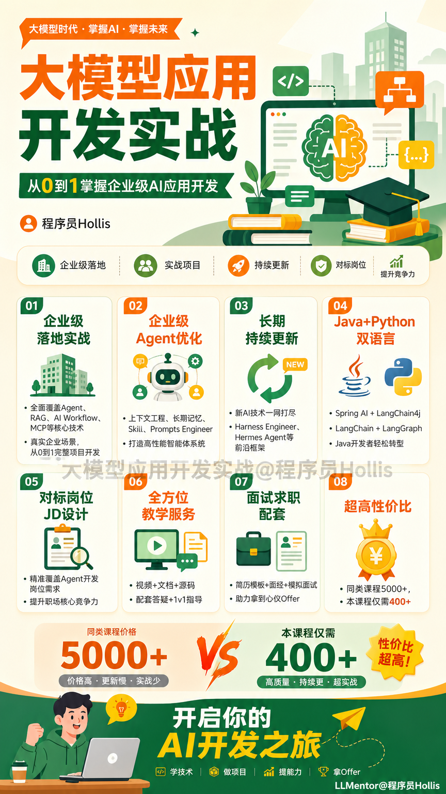
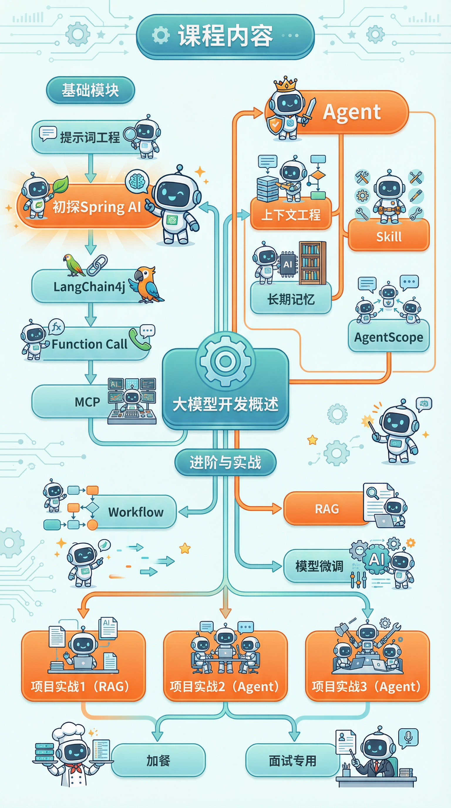
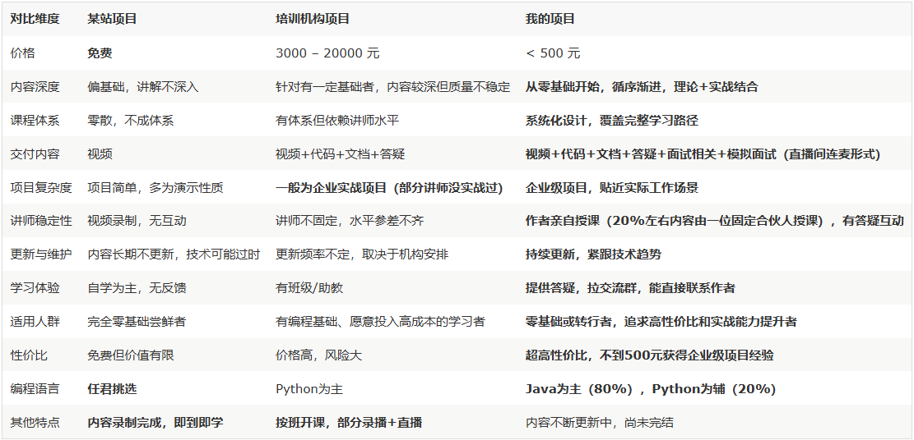
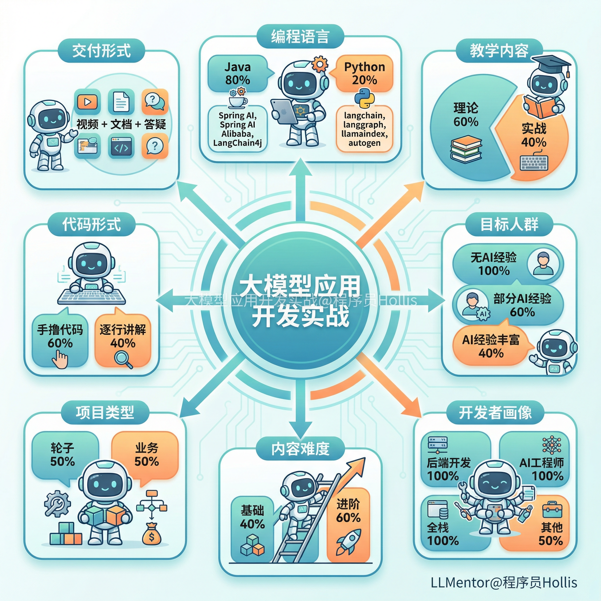

# ✅课程介绍

这是一个围绕着大模型应用开发的后端课程，我给这个项目起了个名字叫——LLMentor，希望我（国内一线互联网大厂P8）和我的合伙人（某垂直领域头部大厂Agent开发），能像一个mentor（良师益友）一样，带着大家一起入门大模型应用开发。

这个课程的愿景是，让大家可以从0到1，从无到有的入门大模型，可以转型成为大模型应用开发工程师、Agent开发工程师等方向。

课程内容

LLMentor 项目，是一个大模型应用开发实战课。主要包含以下内容：

大模型开发概述

提示词工程

初探Spring AI

LangChain4j

Function Call

MCP

RAG

Agent

Workflow

长期记忆

上下文工程

Skills

AgentScope

Harness Engineering

模型微调&部署

RAG评测

模型微调

项目实战1：企业级知识库问答机器人（RAG）

项目实战2：端到端通用智能体（Agent）

项目实战3：智能商旅多智能体（多Agent）

项目实战4：DataAgent（Agent）

简历模板&模拟面试&面试题

课程优势

课程特色

编程语言

Java 80%，Python 20%

以 Java 为主（Spring AI、Spring AI Alibaba、LangChain4j）、Python 为辅（langchain、langgraph、llamaindex、autogen）的双语言教学体系。

教学内容

理论 60% ，实战 40%

注重理论夯实，兼顾实战应用

适合人群

无AI经验 100%，部分AI经验 60% ，AI经验丰富 40%

广泛适用，满足不同阶段的学习需求

面向开发者

后端开发 100%，AI工程师 100%，全栈 100%，其他 50%

全面覆盖各类开发岗位

内容难度

基础 40%，进阶 60%

从零基础入门，逐步掌握高阶技能

项目类型

轮子 50%，业务 50%

造轮子与做项目，缺一不可

代码方式

手撸代码 60%，逐行讲解 40%

强调动手编码能力，并提供详细讲解

交付内容

视频 + 文档 + 代码 + 答疑

提供多维学习资源，确保学得会、用得上

---

来源: https://thoughts.aliyun.com/workspaces/6963289eb0fc2e001bb052eb/docs/697f381951b14400012c3f7e
