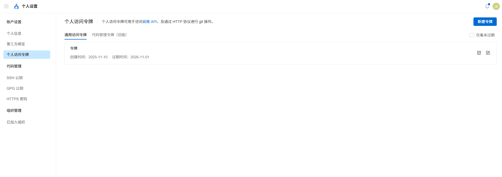
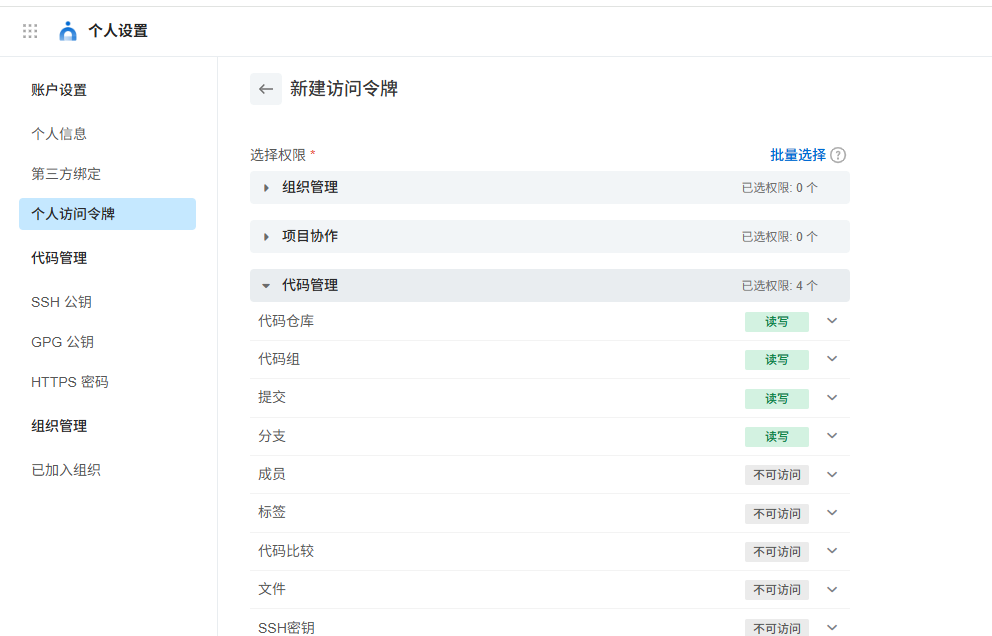
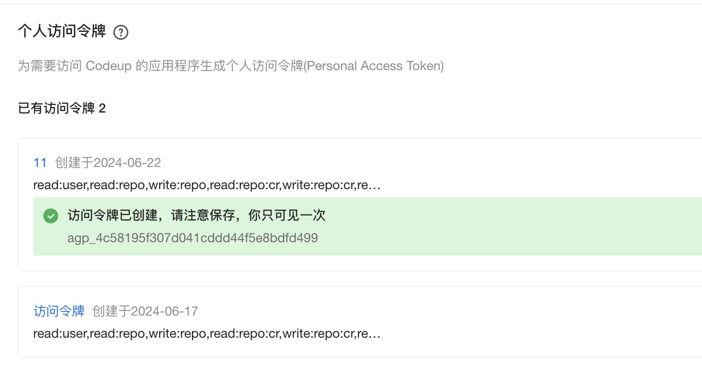

# ✅【重要】代码如何下载？

代码库地址： [https://codeup.aliyun.com/?_userId=6613bc9414e2ff8b4d921dd8&timestamp=1770883499027&org_id=67c56af4e77e9167fa2fa6df&mode=redirect&sign=dfb08d7c8231c94406f4b80bceafdc25](https://codeup.aliyun.com/?_userId=6613bc9414e2ff8b4d921dd8&timestamp=1770883499027&org_id=67c56af4e77e9167fa2fa6df&mode=redirect&sign=dfb08d7c8231c94406f4b80bceafdc25)

如果你已经获得了代码权限，压缩包你能下载，但是通过git命令拉不到代码。那么说明你的配置是不正确的，

那么就需要通过以下2种方式之一进行配置。

通过访问令牌

在你的个人设置中，创建访问令牌



输入名称，选一个足够长的时间，把代码管理的只读权限勾选上。



创建成功后，他会提示你令牌内容，这个一定要记好。



这样你就可以通过以下方式拉取代码：

```text
git clone  https://codeup.aliyun.com/67c56af4e77e9167fa2fa6df/LLMentor

正克隆到 'LLMentor'...
Username for 'https://codeup.aliyun.com':
这里输入你的用户名
Password for 'https://xxx@codeup.com':
这里输入你的访问令牌
```

就可以把代码拉下来了。

**如果访问令牌忘了咋办？**

没关系，重新再申请一个就行了。

通过SSH公钥

如果你不想记这个访问令牌，或者你觉得麻烦，也可以通过SSH的方式来拉代码、


这里创建SSH公钥。

创建方式根据你不同的操作系统参考这个文档操作就行了。[https://help.aliyun.com/document_detail/153709.html](https://help.aliyun.com/document_detail/153709.html)

操作完之后，你就可以免密进行代码拉取了，但是需要注意这种方式，需要通过SSH协议进行代码拉取，不要用http

---

来源: https://thoughts.aliyun.com/workspaces/6963289eb0fc2e001bb052eb/docs/697f3830a7c8ff00014e1b68
