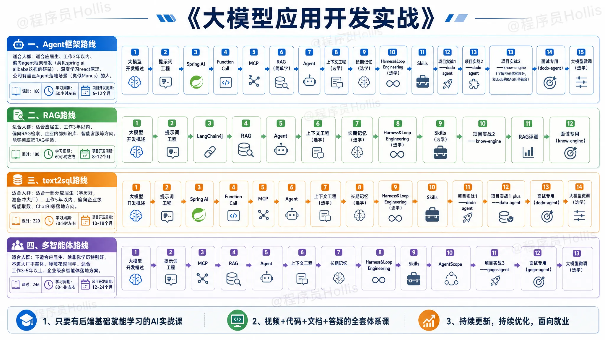

# ✅【重要】课程学习顺序（项目怎么选）

项目复杂度

`dodo-agent`  &lt; `know-engine`  &lt; `data-agent`  &lt; `know-engine + RAG评测`  &lt;  `data-agent + Agent评测`  &lt;  `gogo-agent`

项目组合

**dodo-agent + know-engine**：dodo agent中有文件问答的功能，这部分功能是依靠RAG实现的，可以把know-engine中的RAG优化方案，以及测评相关的结合进来。

**know-engine +  data-agent**：know-engine项目中，有text-to-sql的场景，但是这个项目中做的比较简答，那么就可以把data-agent中的text-to-sql的方案做结合

**gogo-agent + data-agent**：gogo我们主要是做了行程管理、规划、报销、预定等功能，有一个功能我们其实还没做，那就是行程洞察，也就是从管理者、财务的角度查看公司的差旅相关数据报表，这部分可以和data-agent做结合。

学习路线

以下路线中的适合人群仅供参考，还是要根据你的实际情况来哦~

| 学习路线 | 课时（节） | 学习周期（小时） | 开发周期（月） |
| --- | --- | --- | --- |
| Agent框架 | 160 | 50+ | 6-12 |
| RAG | 180 | 60+ | 8-15 |
| text2sql | 220 | 70+ | 10-18 |
| 多智能体 | 250 | 80+ | 12-24 |

Agent框架路线

适合人群：适合应届生、工作3年以内、偏向agent框架研发（类似spring ai alibaba这样的框架）、深度学习react原理、公司有垂直Agent落地场景（类似Manus）的人。

课时：160

学习周期：50小时左右

项目开发周期：6-12个月

学习路线：

大模型开发概述

提示词工程

Spring AI

Function Call

MCP

RAG（简单学）

Agent

上下文工程（选学）

长期记忆（选学）

Harness&Loop Engineering（选学）

Skills

项目实战1——dodo agent

项目实战2——know-engine（了解RAG优化部分，和dodo的RAG问答结合）

面试专用（dodo-agent）

大模型微调（选学）

RAG路线

适合应届生、工作3年以内、偏向RAG检索、企业内部知识库、智能客服等方向。能够彻底把RAG学透。

课时：180

学习周期：60小时左右

项目开发周期：8-12个月

学习路线：

大模型开发概述

提示词工程

LangChain4j

RAG

Agent

上下文工程（选学）

长期记忆（选学）

Harness&Loop Engineering（选学）

Skills（选学）

项目实战2——know-engine

RAG评测（重点加分项）

项目实战4——data-agent（可做结合）

面试专用（know-engine）

text2sql路线

适合一部分应届生（学历好，准备冲大厂）、工作5年以内、偏向企业级智能取数、ChatBI等落地方向。

学习周期：220

学习周期：70小时左右

项目开发周期：10-18个月

学习路线：

大模型开发概述

提示词工程

Spring AI

Function Call

MCP

Agent

上下文工程（选学）

长期记忆（选学）

Harness&Loop Engineering（选学）

Skills

项目实战1——dodo agent

项目实战1 plus——data agent

面试专用（dodo-agent）

大模型微调（选学）

多智能体路线

不适合应届生，除非你学历特别好，不进大厂不罢休，嘎嘎花时间学。

适合工作3/5年以上、企业级多智能体落地方案。

课时：250

学习周期：80小时左右

项目开发周期：12-24个月

学习路线：

大模型开发概述

提示词工程

MCP

RAG

Agent

上下文工程

长期记忆

Harness&Loop Engineering

Skills

AgentScope

项目实战3——gogo-agent

面试专用（gogo-agent）

大模型微调（选学）

---

来源: https://thoughts.aliyun.com/workspaces/6963289eb0fc2e001bb052eb/docs/6a5d907a74e4030001e58ad2
