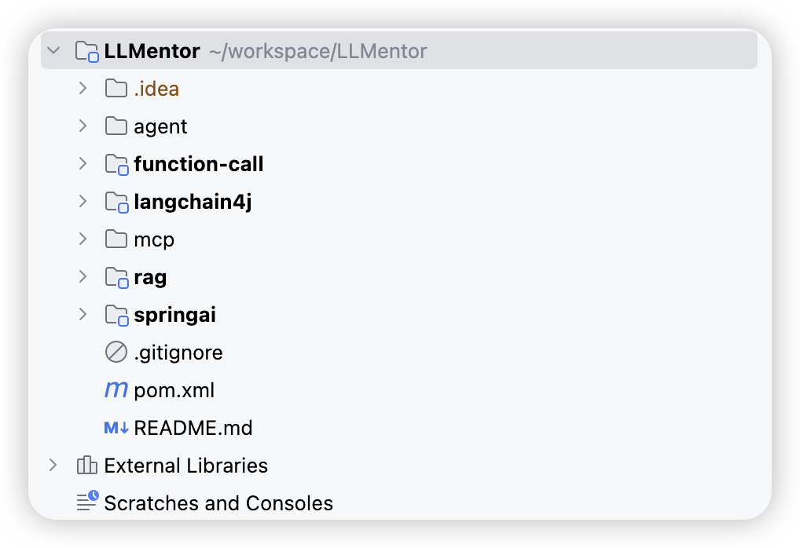
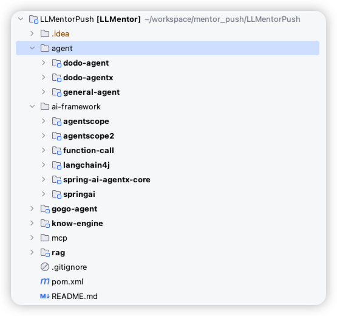
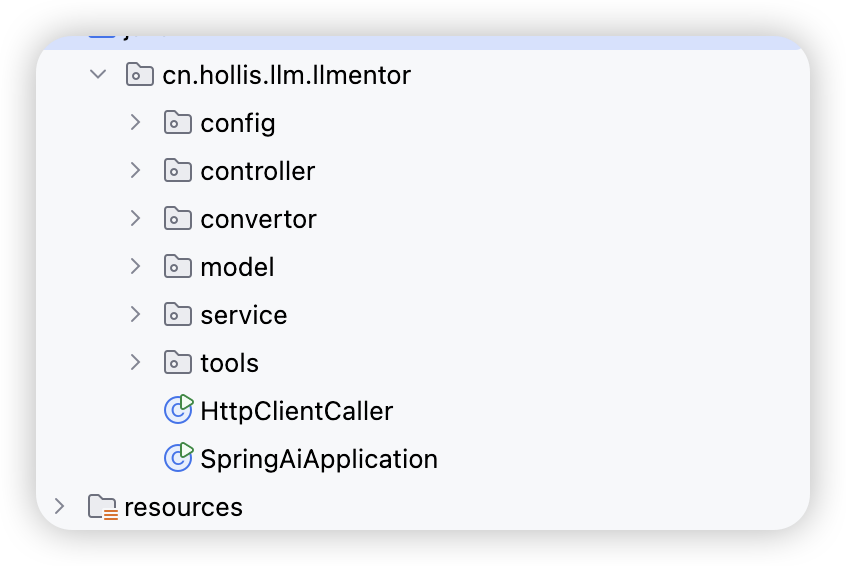

# ✅代码目录结构

以下是我们的课程代码的整体目录，基本上是每一个章节我们会给大家创建一个独立的module，这样每一个章节相关的代码都在一起。

另外因为不同的东西之间会存在冲突，比如spring ai和langchain4j，以及ollama等等，他们之间都会存在同一个bean定义了多个实现的情况，所以会冲突，隔离开可以避免类似的问题。

然后除了前面的基础章节，后面的项目实战，我们也会搞一个单独的module。

一开始是上面这个，但是后来我做了重构，因为后面又增加了agentscope、agentscope2等等框架，干脆就把这个ai相关的框架统一到ai-framework中了。

在每一个module中，我们也会分成不同的package，比如下面这个，其实就和大家自己的项目差不多，分成了controller、service等等的。没啥特别的，这样大家找起来也比较方便些。

然后不同的module中都有一个单独的Application类，用来单独启动这个module的，设置了不同的端口号，方便大家分别启动。所以，一定要注意不同的端口号的设置，就在对应你的module的applcation.yml中。

---

来源: https://thoughts.aliyun.com/workspaces/6963289eb0fc2e001bb052eb/docs/698c5a69a7c8ff00015a2c88
