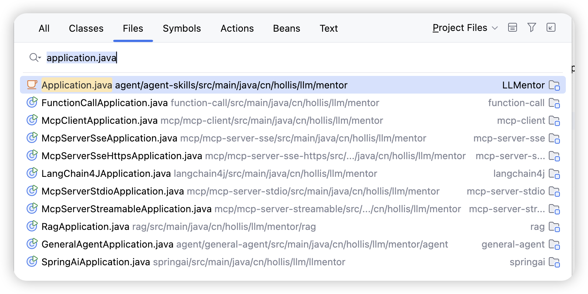
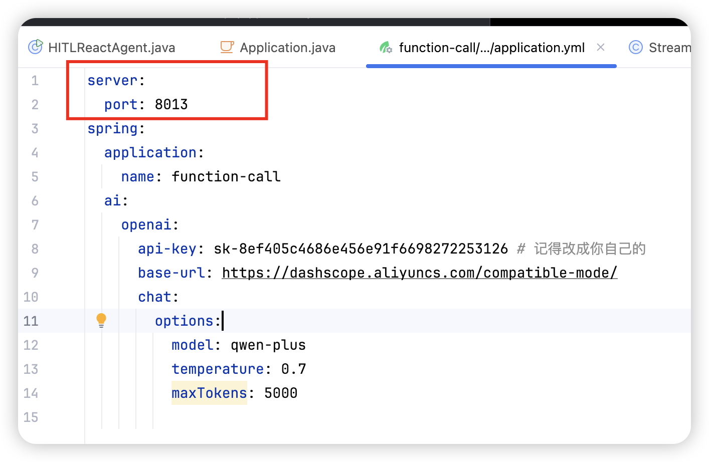
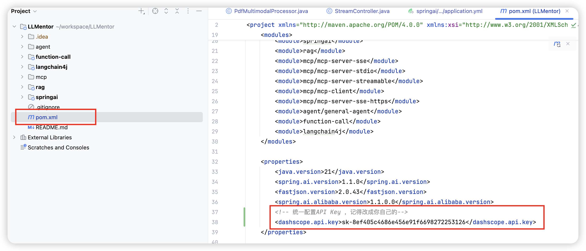

# ✅应用如何启动

然后不同的module中都有一个单独的Application类，用来单独启动这个module的

设置了不同的端口号，方便大家分别启动。所以，一定要注意不同的端口号的设置，就在对应你的module的applcation.yml中。

当你拿到代码后，需要按照以下步骤进行启动：

1、修改api-key

因为我们是个AI项目，所以一定会用到大模型，所以需要用到api key来和大模型交互，我们建议大家用百炼，有一定的免费额度，自己用用基本够了。后面课程有单独介绍如何申请和使用。

**为了方便大家使用，我们把api-key都统一到一起做配置了，你只需要修改一个地方就行了。即项目的根pom中的dashscope.api.key的内容即可。**

另外，如果你运行的是StreamController和HttpClientCaller这两个类，那么需要单独去类中改一下key，因为这两个代码讲解的时候我们还用到spring ai，所以就硬编码了。

2、启动应用

大部分模块都可以直接启动，找到对应的Application运行即可。

有些模块，虽然启动会有错误日志报错，但是不影响启动，比如spring-ai模块会依赖mysql数据库，虽然你可能没配置的，但是我们给你加了不影响应用启动的配置，所以能正常启动，但是**运行时如果涉及到mysql的，还是会报错**。这一点需要注意。

再比如rag模块，依赖pgvector、minio、es等等，也可以先不改配置， 把应用启动起来，但是如果想运行不报错，该改的还是要改。

但是有些模块，比如general-agent则需要先配置好数据库配置，才能正常启动，因为依赖的一个JdbcChatMemoryRepositoryAutoConfiguration他会要求一定要连接数据库成功。。。。

3、哪些配置需要修改

可在代码中全局搜索`记得改成你自己的` ，就能找到那些你要改的配置信息了。

4、常见问题

项目本身不复杂，主要是一些依赖服务的部署，以及LLM的通信问题，遇到问题先看日志，如果看日志解决不了，可以找答疑：

---

来源: https://thoughts.aliyun.com/workspaces/6963289eb0fc2e001bb052eb/docs/698c5a6d51b144000137f943
