# ✅行业趋势与岗位需求分析

现在大模型很火大家都知道，但是这个方向，也就是我们课程主讲的，大家学完能干的——大模型应用开发 ，到底咋样，有没有岗位？薪资咋样？

招聘需求

现在的招聘，有很多是AI相关的岗位，其中除了一些算法岗位以外，还有很多工程岗位，比如AI Agent开发工程师、大模型应用开发工程师等等。这些岗位都是后端岗位，主要工作职责是使用AI相关技术做应用开发。如：

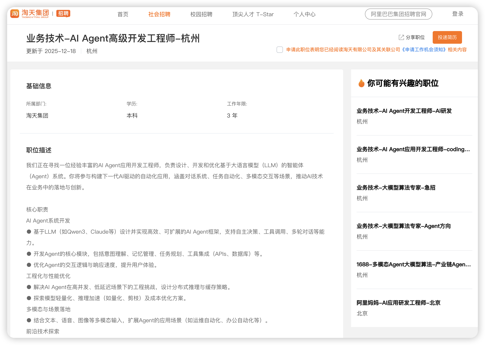

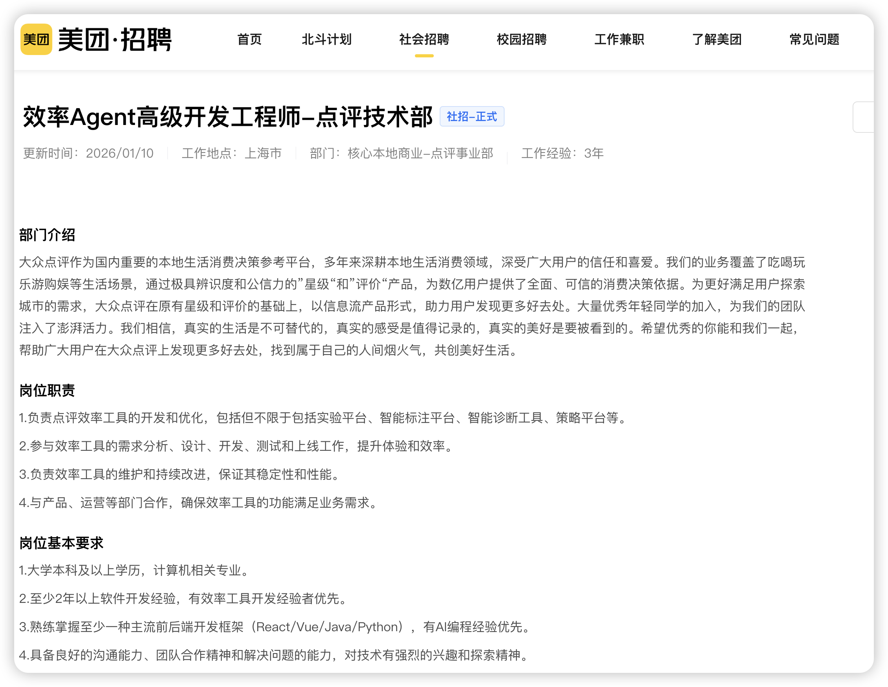

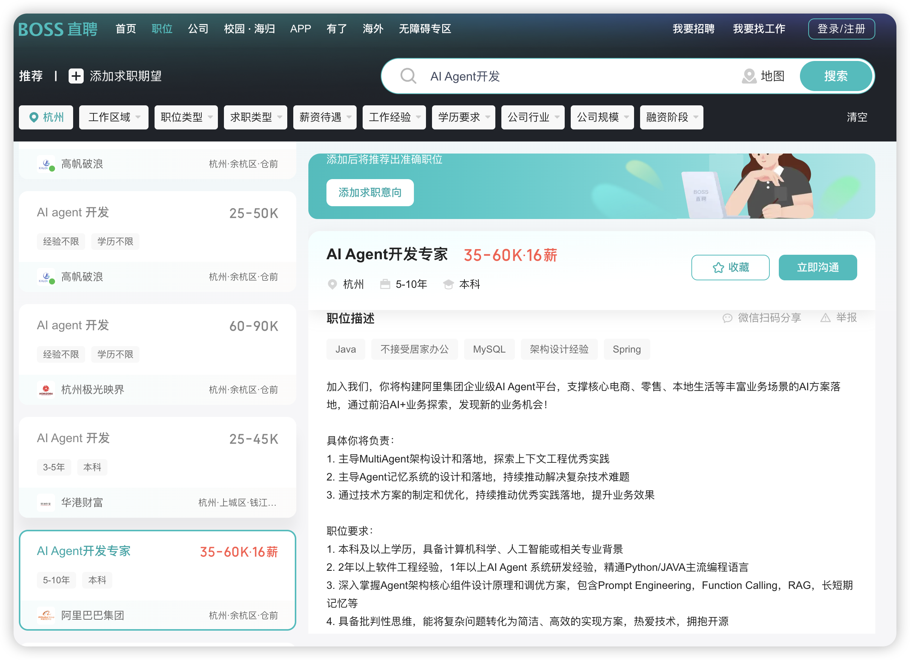

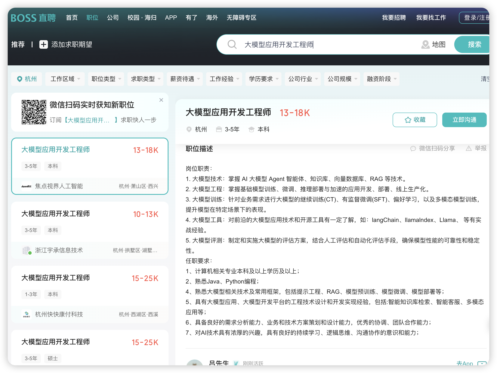

而很多人以为，如果我不想找AI相关的岗位，就可以不了解AI了？那就打错特错了！

现在的招聘，不管是大厂也好，中小厂也罢，是校招也好，还是说社招，就算是普通的研发岗位，对于AI的能力要求已经像一些基础技能（如分布式、Mysql）等一样，是个必备项了。

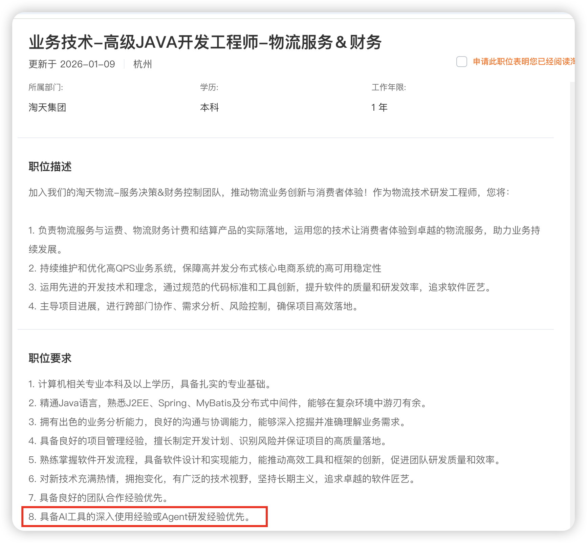

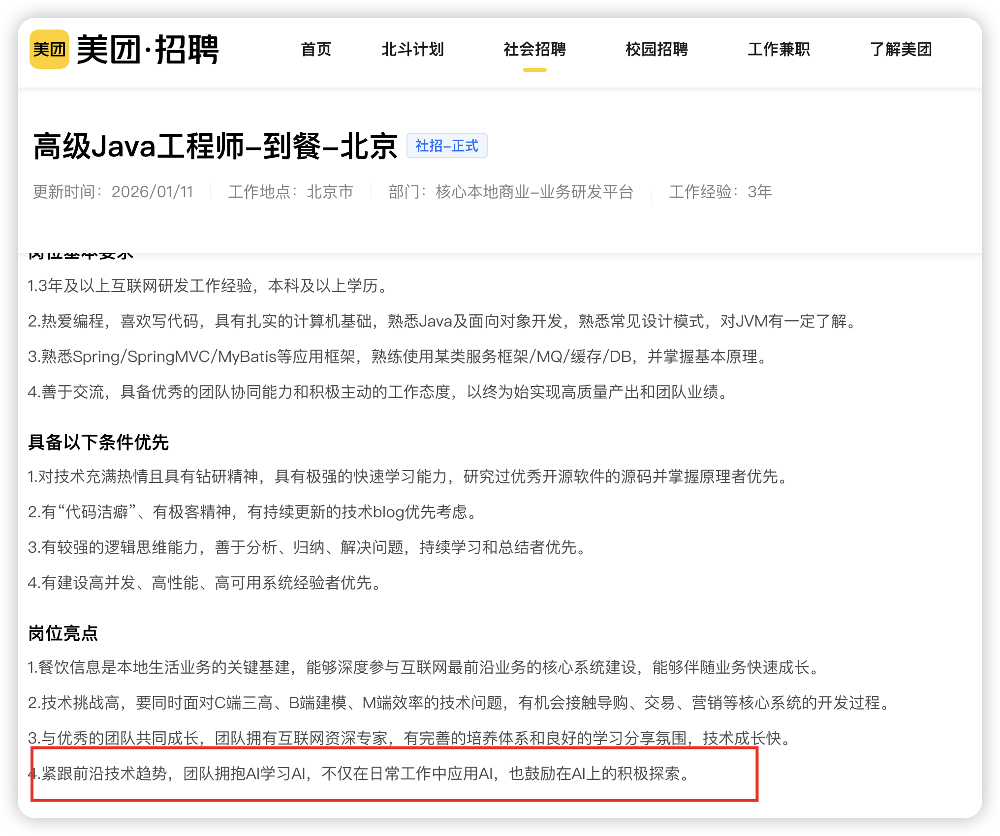

而且如果你看过一些面经的话，就会发现，很多公司都会问一些AI相关的问题，比如你是否做过相关工作，是否用过AI Coding工具等等。

编程语言

关于编程语言，在AI开发这个领域，肯定是Python的岗位是最多的，这个毋庸置疑，毕竟Python他这么多年了在机器学习、算法等方向上一直就是很重要的。

但是Java岗位怎么样呢？我们可以搜索一下相关岗位。

首先，有很多岗位在编程语言这块，是Python和Java熟悉一个就行的，这种是占比最多的。

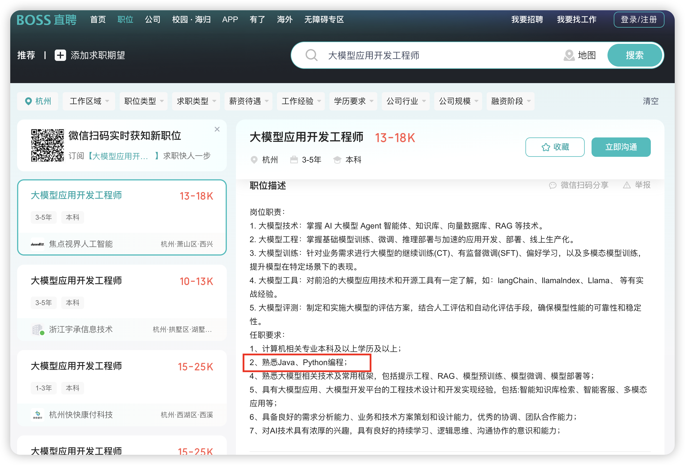

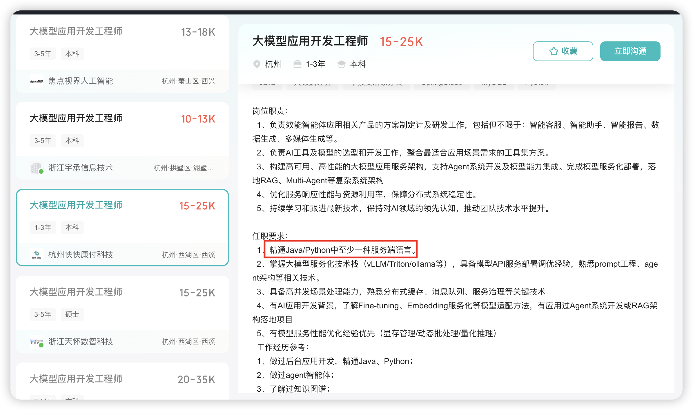

也有一些个岗位是专门招Java做AI相关的开发的：

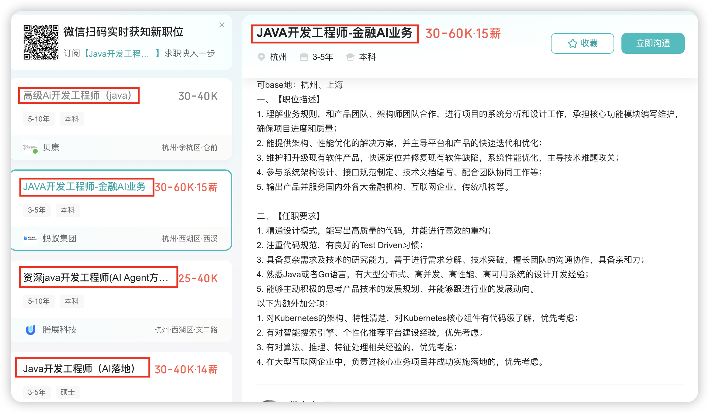

毕竟编程语言他只是个工具而已！关于JAVA是否有优势，和python有什么区别，我们后面会讲，这里是想告诉大家，JAVA开发在AI这个方向上还是有很多机会的，可以这么说，除了python，可能JAVA就是排第二的了。

行业报告

下面是一份 中关村智用人工智能研究院发布的《大模型人才发展报告》，我们可以解读下这份报告。

[📎大模型人才发展报告（印刷版）.pdf](https://www.yuque.com/attachments/yuque/0/2025/pdf/5378072/1760775154618-ce6c93a6-c74f-4276-ae64-1b27f9450f9b.pdf)

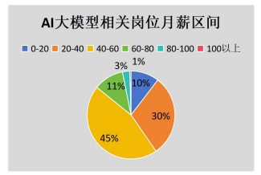

薪资比较高，普遍在40-60，20-40的占比也比较高。

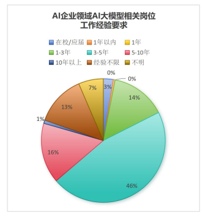

对工作年限要求不高，大部分在1-5年之间。应届生占比也不算少。并且大部分要求本科学历即可，

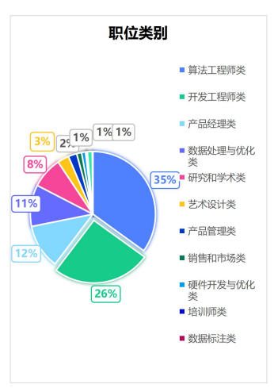

这里面开发工程师类占比26%，还是比较多的。

在脉脉出的《大模型人才报告》中，有关于薪资和技术栈的一些统计，虽然报告是2024年的，2025版还没出，但是其实差别不大。

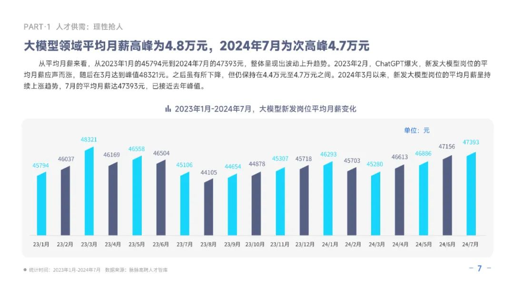

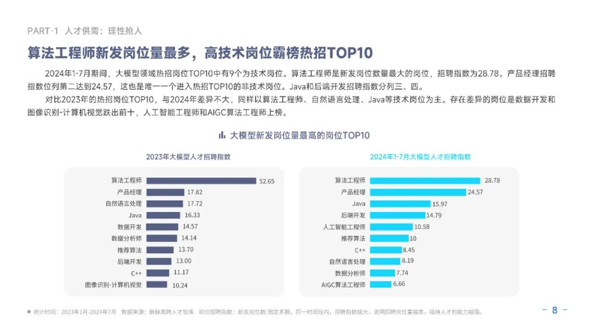

**可以看到，对于招聘岗位来说，大模型相关岗位的招聘排名第三的是JAVA，仅次于算法工程师和产品经理之后，这说明，Java在大模型开发领域，还是比较占优势的。**

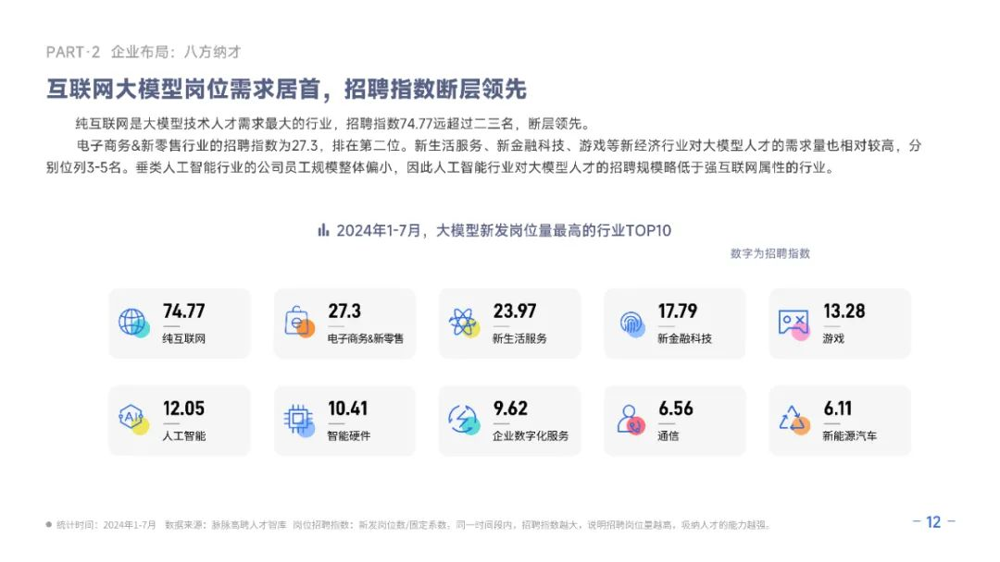

**总结，大模型应用开发，薪资高，岗位多，除了算法岗位外对学历要求并不特别高，并且Java开发的大模型应用开发占比非常高！绝对有搞头！！！**

---

来源: https://thoughts.aliyun.com/workspaces/6963289eb0fc2e001bb052eb/docs/696328bf51b1440001124dfa
