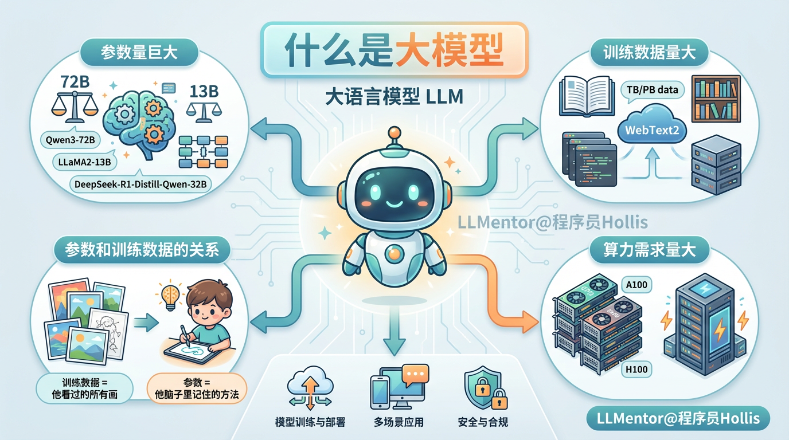
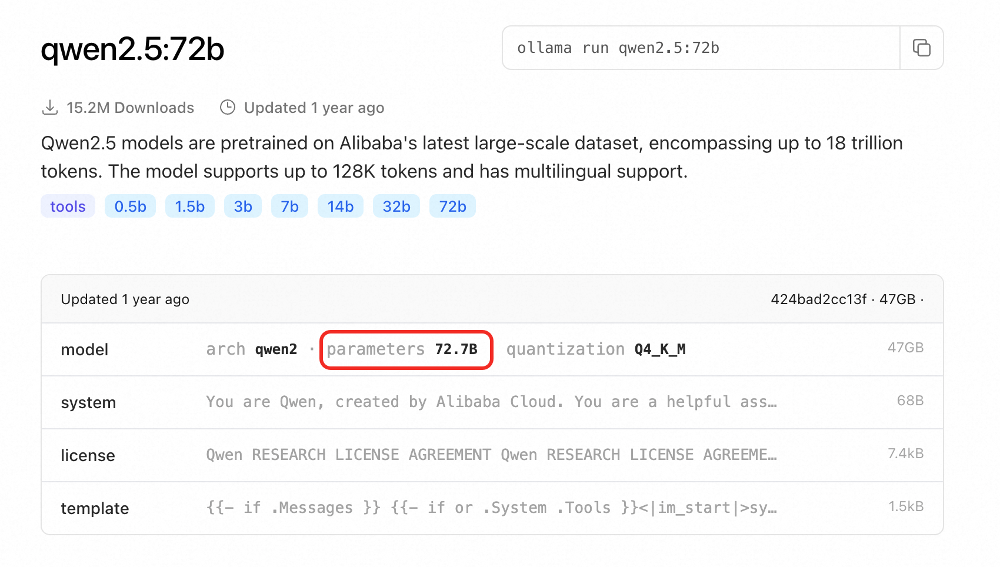
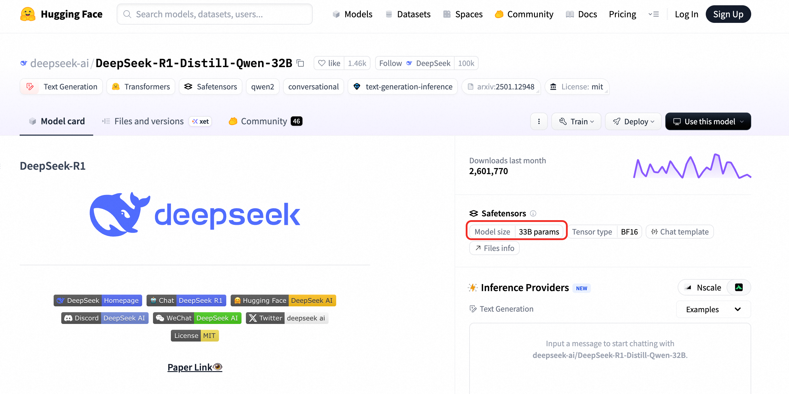
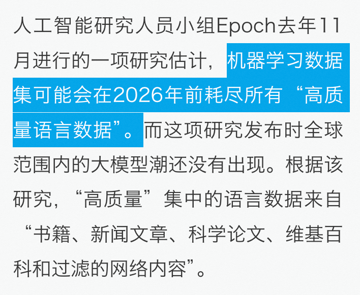

# ✅什么是大模型？

现在我们说的大模型，一般指定都是LLM，全称是Large Language Model，也就是大语言模型。比如我们常用的ChatGPT、DeepSeek、通义千问等等，都是大语言模型。

所谓大语言模型，其实就是**用于做和自然语言相关任务的深度学习模型**，它是基于海量文本数据训练出来的，能够理解和生成人类的自然语言。

大模型，和以前的模型相比，主要的差异就在于”大”，所以在大模型出来之后，以前的一些专业模型也被叫做小模型，比如原来的搜索、广告、营销等模型，最容易理解的就是OCR模型，可以说他们是专业模型，也可以说他们是小模型。

大模型的大，体现在几个方面：

**参数量巨大**

这是“大”最直接、最核心的含义。模型的“参数”可以理解为模型在训练过程中学到的“知识”或“规则”的内部表示。参数越多，模型理论上能存储和表达的信息就越复杂、越精细。我们常见的一些模型会有xxB的描述，比如Qwen3-72B、LLaMA2-13B，这里的72B指的就是参数量有72Billion，即720亿。

比如我们在ollama上看到关于qwen2.5:72b的介绍：

huggingface上也有类似的说明，比如deepseek DeepSeek-R1-Distill-Qwen-32B

这里就说明了，这个指的就是参数量。

**训练数据量大**

另外，大模型的大还体现在**训练数据量大**上面。 大模型需要**海量、多样化的文本和代码数据**进行训练。这些数据通常来自互联网上的公开网页、书籍、文章、代码仓库、对话记录等。训练数据集通常达到**TB甚至PB级别**，涵盖了人类知识的广泛领域和多种语言。例如，训练GPT-3的数据集WebText2就包含了数百GB的文本。

如此庞大的数据量是为了让模型学习到语言的统计规律、世界知识、常识、推理模式以及不同任务的通用表示。

随着现在模型越来越大，需要的训练数据也越来越多，已经有研究表明，2026年后可能就没有高质量的数据可以用来训练了。

那在这种情况下怎么办？一个越来越重要的方向，是让模型自己来“造数据”。所谓合成数据，本质上就是由模型生成的文本、代码、问答或推理过程，再拿这些结果反过来作为训练数据使用。通过这种方式，模型可以不断扩充训练样本规模，强化推理能力和任务泛化能力，而不再完全依赖互联网上有限的高质量人工数据。这也意味着，大模型后续的进化重点，正在从“有没有更多数据”，转向“如何更高效地利用和生成数据”。

参数和训练数据的关系？

想象一个小朋友（他就是“大模型”）刚开始学画画。

训练数据 = 他看过的所有画

- 比如他看了 **1万张猫的图片**：有胖猫、瘦猫、睡觉的猫、爬树的猫……
- 这些图片就是**训练数据**——是**外部的东西**，是他学习的“材料”。

参数 = 他脑子里记住的“怎么画猫”的方法

- 看了很多猫之后，他慢慢总结出：
- 猫有两只耳朵（尖尖的）
- 有胡须
- 尾巴长长的
- 眼睛在脸中间……
- 这些“规则”或“技巧”就存在他脑子里，变成了他的“绘画能力”。

就像你背了100首唐诗（训练数据），但你脑子里存的不是这100首诗的复印件，而是你**学会了押韵、对仗、意境表达**（参数）。

算力需求量大

大模型兴起之后，不炒股的人最明显的感受就是显卡贵了，炒股的人最明显的感受就是英伟达股价涨了。

这背后其实是因为训练一个大模型需要**极其强大的计算资源**，通常需要成千上万个高性能GPU（如NVIDIA A100/H100）或TPU组成的集群，运行数周甚至数月时间。

所以，做模型训练成本是非常高的。

---

来源: https://thoughts.aliyun.com/workspaces/6963289eb0fc2e001bb052eb/docs/69633346a7c8ff000134613a
