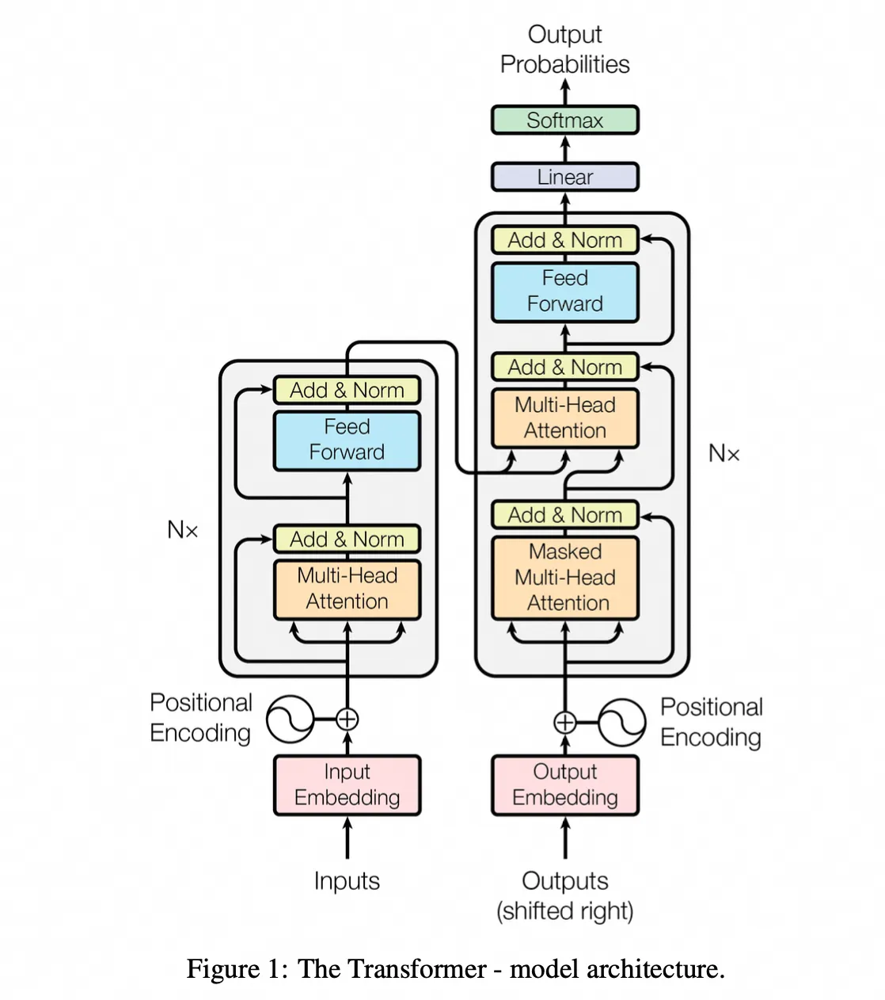

# ✅大模型的工作原理？

大模型的工作原理

LLM 最核心、最基础的任务其实很简单：**给你一串文字（上下文），它要猜出下一个最可能出现的词是什么？**

**例子：** 输入 “Hollis是个好"，LLM 的任务就是猜下一个词，比如 “人”、“东西”、“家伙”、“男人” 等等，并给出每个词出现的可能性（概率）。

**它是怎么学会“猜词”的？—— 海量阅读 + 疯狂练习**

1. **海量阅读（数据）：**
2. 想象 LLM 在训练时，**吞下了整个互联网的文本**：书籍、文章、网页、代码、对话记录... 天文数字级别的文字量（TB 甚至 PB 级别）。
3. 它不是在“理解”这些内容，而是在**疯狂地寻找词语之间的搭配模式和统计规律**。
4. **疯狂练习（训练）：**
5. **训练方法的核心：遮住一部分，让它猜！** 就像我们小时候做“完形填空”。
6. **具体操作：**
7. 从海量文本中**随机截取一段句子**，比如 “人工智能正在改变世界”。
8. **遮住其中一个词**，比如遮住 “改变”，变成 “人工智能正在 [MASK] 世界”。
9. **让模型猜被遮住的词**是什么。它一开始肯定是瞎猜。
10. **揭晓答案**（“改变”），然后**调整模型内部的**参数和权重。猜错了就调一点，猜对了也微调让它下次更可能猜对。
11. **重复亿万次：** 这个过程在超级计算机上，用海量的句子，对模型内部数万亿个“旋钮”进行微调，重复进行无数次（数天甚至数月）。模型逐渐学会了在**特定上下文**下，**哪些词更常一起出现**。

当训练好的 LLM 被要求写文章、聊天或翻译时，它其实是在**反复玩“猜下一个词”的游戏**：

1. **你给提示：** 你输入一句话或问题（提示词/Prompt），比如 “写一首关于春天的诗”。
2. **模型启动：** 模型把这个提示词作为初始的“上下文”。
3. **猜第一个词：** 模型根据这个上下文，计算所有可能的下一个词（“春天”、“微风”、“万物”...）及其概率。
4. **选择并添加：** 模型**不是永远选概率最高的词**（那样会太死板），而是**按概率随机选一个**（可以用**temperature**参数控制随机性）。比如它选了“春天”。
5. **更新上下文：** 现在上下文变成了 “写一首关于春天的诗 春天”。
6. **猜下一个词：** 模型基于新的上下文 “写一首关于春天的诗 春天”，再猜下一个词（“的”、“里”、“天”...）。假设它选了“的”。
7. **循环往复：** 上下文变成 “写一首关于春天的诗 春天的”，再猜下一个词... 如此循环，直到生成完整的句子或达到长度限制。
8. **结果：** 最终可能生成：“写一首关于春天的诗 春天的脚步轻轻走来，唤醒了沉睡的大地...”

但是，猜下一个词不是只看前一个词！需要理解**整个句子的上下文和词之间的关系**。

比如：“苹果很好吃” vs “苹果发布了新手机”。同样是“苹果”，下一个词完全不同。而Transformer 的自注意力机制能分辨出第一个“苹果”和“好吃”关系紧密（水果），第二个“苹果”和“发布”、“手机”关系紧密（公司）。

Transformer

2017年，Google的一篇论文《[Attention Is All You Need](https://arxiv.org/abs/1706.03762)》横空出世，被称为是大语言模型的开山之作，其中介绍了Transformer架构，奠定了大语言模型的基础。

GPT(Generative Pre-trained Transformer，生成式预训练的Transformer 模型)中的T就是Transformer

Transformer通过他的名字大概可以看出来，他最开始是为了提升翻译的质量的。在Transformer推出之前，这个领域在用的是循环神经网络（Recurrent Neural Network, RNN）。

RNN的设计思想就是一个词一个词的阅读并处理文字。这种方式，在读后面的字时，脑子里会努力记住前面读过的内容。读长文章时，很容易忘记开头说了啥（“长期依赖”问题），而且只能按顺序读，不能跳着看（难以并行计算）。

就像大家背八股文一样，让你只能从头一道题一道题的背，那么就会不仅效率低，并且容易忘。

而Transformer的方案是，让你一眼扫过整段话，然后瞬间分析这段话里每个词和其他所有词之间的关系有多重要。它不按顺序读，而是同时关注所有词，找出谁和谁联系紧密。

相当于不是按顺序背题了，而是提前给你画好重点，找出来各个题目之间的关系。

自注意力机制

Transformer中有一个非常重要的思想，那就是**自注意力机制（****Self-Attention）**。这里的Attention，就是论文中《Attention Is All You Need》的Attention，足以见得他的重要性及突破性。

通过Attention，我们把原来要关注全部信息，优化成只关注重点信息。就像人类看一张图片的时候，并不会立即关注全部细节，而是会把注意力放在某个焦点上。

比如这张图片，大部分人会先关注人脸，然后才会关注到后面的船、海鸥、等等。

这就是一种Attention机制，将有限的注意力集中在重点信息上面，这样就可以节省资源，快速获得有效的信息。

你可以把它理解成：

- **“找关系”的游戏：** 对于句子里的**每一个词**，Transformer 都会问：“在这个句子的上下文中，**其他所有词**对我理解这个词有多重要？”
- **“重要性”打分：** 它会给句子里的其他词都打一个“重要性分数”。分数高的词，对理解当前词就更关键。

比如说有这个样一个句子“亮哥不仅出了个**八股文**，他还出了新的**项目课**，**它**一定能大卖。”

- 当模型处理“**它**”这个词时，自注意力机制会计算“它”和句子中其他词的关系。
- 它发现“**八股文**”和“**项目课**”的分数非常高，而“大卖”的分数也比较高，但其他词的分数可能就低一些。
- 这样，模型就**知道“它”指的是“项目课”**，而不是其他东西。

而这个自注意力的过程并不是搞一次，而是很多次他都会做一次这样的处理，这就是所谓的**多头注意力（Multi-Head Attention）。**

Transformer流程

下面是一张完整的Transformer的流程图：

想象 Transformer 是一个多层的大楼，每一层都做类似的事情：

- **输入嵌入（Input Embedding）：** 把每个词（或字）转换成计算机能理解的数字向量（一串数字），就像给每个词发一个独特的“身份证号”。
- **位置编码（Positional Encoding）：** 因为 Transformer 是同时看所有词的，它**不知道词的顺序**（比如“猫追老鼠”和“老鼠追猫”意思不同）。所以需要额外添加一个表示词在句子中位置（是第1个、第2个...）的信息，就像给每个词加上“座位号”。

- **编码器（Encoder）：**

**核心：多头自注意力层（Multi-Head Attention）：** 这就是上面说的“找关系”游戏。它不止玩一次，而是**同时玩好几次**（多头），每次关注不同方面的关系（比如一次关注“谁在做什么”，一次关注“描述了什么属性”），然后把结果合并起来。这样能更全面地理解词之间的关系。

**前馈神经网络层（Feed Forward）：** 对每个词单独进行更复杂的处理（基于自注意力层得到的关系信息）。

**残差连接 & 层归一化（Add & Norm）：** 技术细节，主要是让训练更稳定、更容易。想象成在计算过程中加了一些“稳定器”和“平衡器”。

这个编码器层会**堆叠很多层**（比如12层、24层），每一层都让模型对输入的理解更深入一点。

- **解码器（Decoder）：**

也包含**多头自注意力层**（但这里关注的是**已经生成出来的部分**）。

还有一个**编码器-解码器注意力层**：这是关键！解码器在生成下一个词时，会**回过头去看编码器对输入的理解结果**（比如源语言句子），并决定输入中的哪些部分对生成当前这个词最重要。这就像写作文时，根据题目要求（编码器结果）来构思下一句。

同样有**前馈神经网络层、残差连接、层归一化**。

解码器也**堆叠很多层**。

- **输出：** 最后，解码器会预测下一个最可能的词是什么，然后把这个词作为输入的一部分，继续预测下一个词，直到生成完整的输出（比如翻译后的句子）。

**Transformer的优势**

**Transformer = 同时看所有词 + 疯狂计算词与词之间的关系（自注意力） + 多层深入理解。**

1. **并行计算能力强：** 因为它同时处理所有词，不像 RNN 那样必须按顺序，所以计算速度**快很多**，特别适合用强大的 GPU 来训练。
2. **处理长距离依赖无敌：** 自注意力机制让模型能**直接**关注到句子中任意距离的两个词之间的关系，不管它们隔得多远。解决了 RNN 记不住开头的问题。
3. **效果好：** 在各种自然语言处理任务（翻译、问答、摘要、文本生成等）上，效果都大幅超越了之前的模型。
4. **成为大模型基石：** GPT 系列、BERT、T5 等几乎所有现代顶尖的 AI 语言模型，都是基于 Transformer 架构或其变体构建的。ChatGPT 的核心就是 Transformer 的解码器部分。

---

来源: https://thoughts.aliyun.com/workspaces/6963289eb0fc2e001bb052eb/docs/696336c4c71a890001a223f5
