# ✅基于Ollama部署本地模型

大模型的使用，一般分为两种，一种是用别人部署好的，比如直接通过api调deepseek，chatgpt等平台的服务。另外一种就是自己部署。

自己部署的话，一般来说是用显卡，比如英伟达的A100，可以提供很好地算力支持。但是搞卡的话成本就太高了，其实对于一些参数量不太大的模型，本地部署，用自己的机器跑一跑也是可以的。

**在这种场景下，**[**Ollama**](https://ollama.com/)** 提供了一种更轻量的选择：它并不强依赖 GPU，而是可以基于 CPU 直接运行经过优化和量化的大模型**，让个人开发者在普通硬件条件下，也能较低成本地完成本地推理和使用。

Ollama 是一个轻量级、开源的本地大语言模型（LLM）服务框架，旨在帮助开发者和用户快速部署和运行自己的大语言模型。它支持多种主流模型（如 Llama、Qwen、ChatGLM 等），并提供简单易用的命令行工具和 API 接口，实现模型的快速启动、推理和交互。

安装Ollama

方式 1：通过官网直接安装

下载地址：

[https://ollama.com/download](https://ollama.com/download)

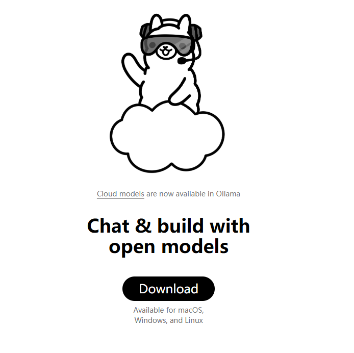

同时，ollama也是开源的，可以到github上找到他：[https://github.com/ollama/ollama](https://github.com/ollama/ollama) 。项目的readme中也给出了部署的方式。支持docker一键部署。

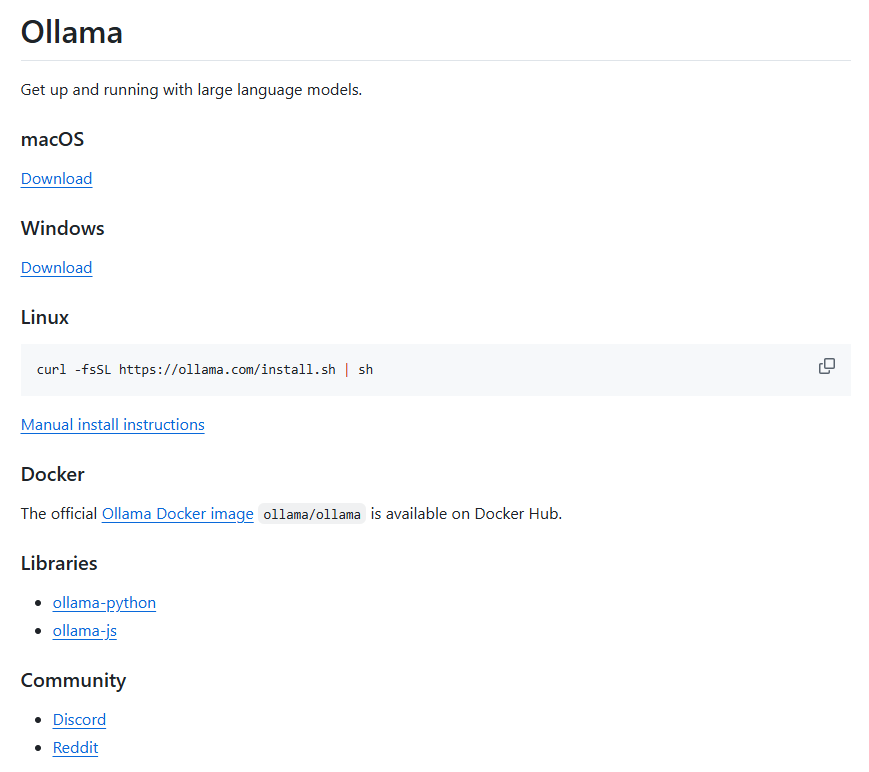

方式 2：命令行安装（Linux/macOS）

```text
curl -L https://ollama.ai/install.sh | bash
```

方式3：docker安装（我选择的方式）

```text
docker pull ollama/ollama

docker run -p 11434:11434 ollama/ollama
```

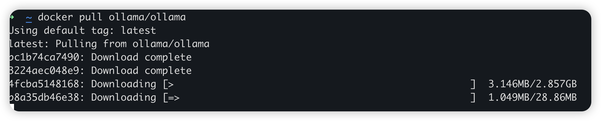

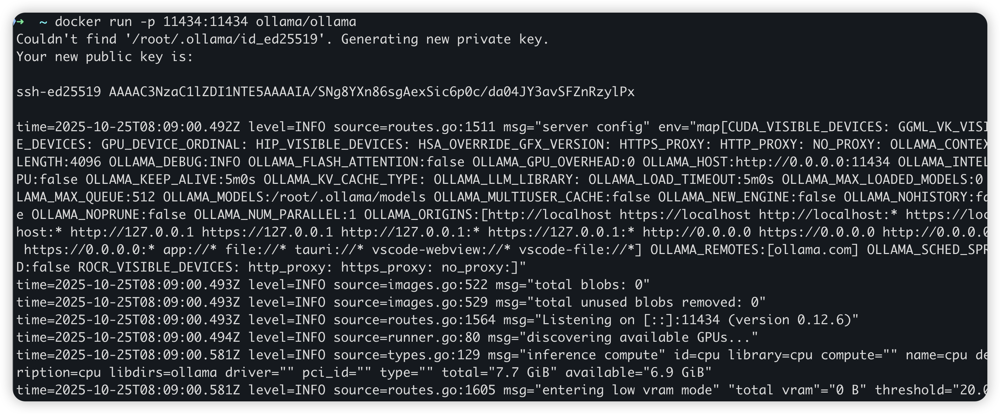

等安装完成之后，就可以运行了。运行成功后，本地端口11434就打开了，访问即可得到：

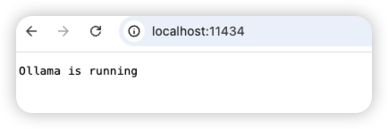

安装后以下命令验证是否安装成功。

```text
ollama --version
# 输出版本信息及配置状态
```

如果是docker环境部署的，使用以下命令：

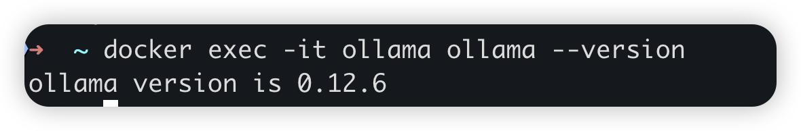

Ollama常用命令

```text
Usage:
  ollama [flags]
  ollama [command]

Available Commands:
  serve       Start ollama
  create      Create a model from a Modelfile
  show        Show information for a model
  run         Run a model
  stop        Stop a running model
  pull        Pull a model from a registry
  push        Push a model to a registry
  list        List models
  ps          List running models
  cp          Copy a model
  rm          Remove a model
  help        Help about any command

Flags:
  -h, --help      help for ollama
  -v, --version   Show version information
```

Ollama本地安装deepseek

我们拿deepseek-r1:7b 来演示下如何在本地使用ollama 部署模型。

首先到ollama官方（https://ollama.com/library/deepseek-r1 ）搜索deepseek-r1模型，进去后可以看到所有能用的各个参数量的模型。

选择一个合适的模型，不同参数规模的模型对硬件要求参考：

- **1.5B模型**：最低配置，几乎所有现代电脑都能运行
- **7B模型**：建议8GB以上内存
- **14B模型**：建议16GB以上内存
- **32B模型**：建议32GB以上内存

比如我们选择使用`deepseek-r1:7b` ，那么就可以在本地运行：

`ollama pull deepseek-r1:7b`

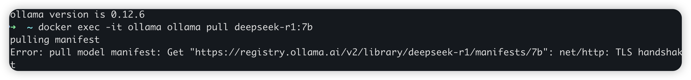

然后就会拉取并不部署这个模型了，非常简单，只需要等就行了。

模型部署好之后，就可以运行了，使用命令：

`ollama run deepseek-r1:7b`

第一次run的时候会做一次初始化。

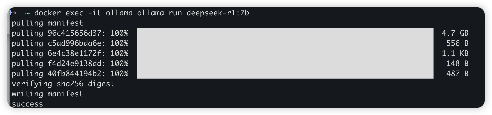

即可运行这个模型，然后就可以在控制台中和模型对话。


同时，在启动ollama之后，会在本地开启11434端口，对外提供ollama的服务，后续如果想通过api接口访问本地模型，那么就可以用 http://localhost:11434

```text
curl http://localhost:11434/api/generate -d '{
  "model": "deepseek-r1:7b",
  "prompt":"你是谁?"
}'
```

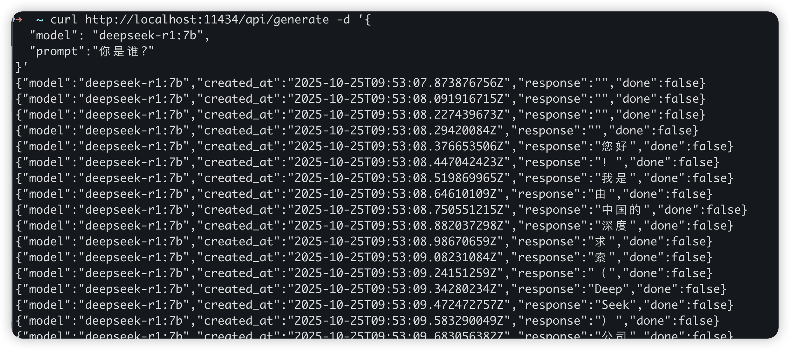

web访问

如果想在web端访问自己搭建的模型，可以通过其他工具进行，比如常见的：

OpenWebUI：https://github.com/open-webui/open-webui

PageAssist（Chrome插件）：https://chromewebstore.google.com/detail/page-assist-a-web-ui-for/jfgfiigpkhlkbnfnbobbkinehhfdhndo?pli=1

关闭think

我们在使用ollama的时候，有些模型，比如deepseek R1，他是默认会进行think的，就是回答之前他会先思考，输出一堆他的思考内容：

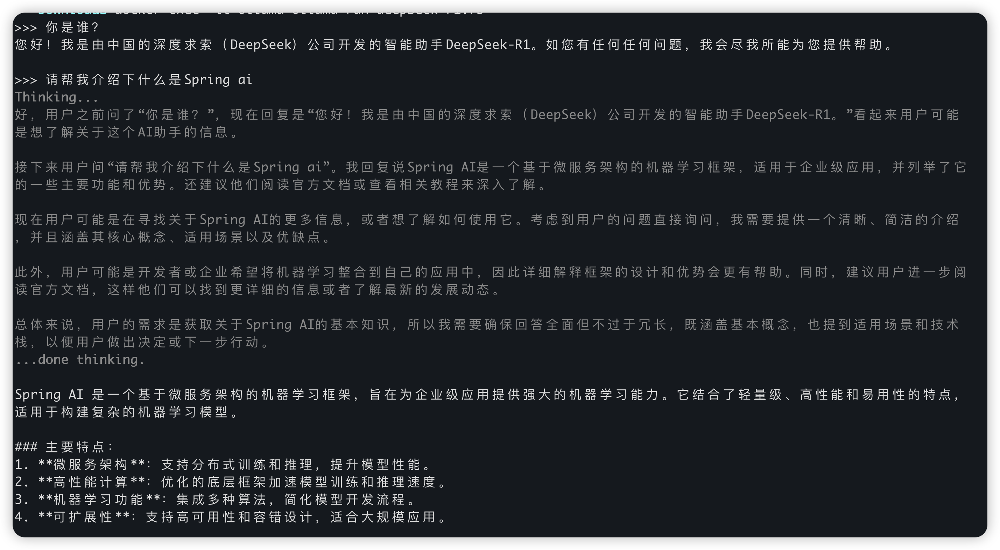

很多时候，think的内容会影响模型输出的效率，如果我们不想让他think怎么办呢？

可以通过使用`/set nothink`命令来关闭思考模式：

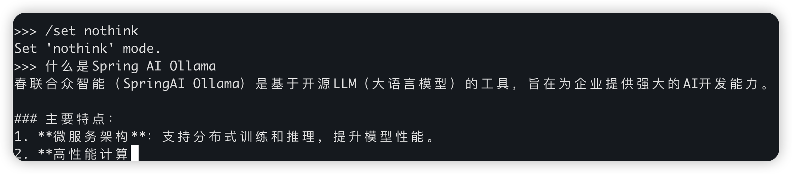

但是啊，我其实觉得，R1这种他本来就是个think模型，如果不想开启think模式，干脆直接用deekseek-v3就好了。。。

---

来源: https://thoughts.aliyun.com/workspaces/6963289eb0fc2e001bb052eb/docs/6963467974e40300010b78fd
