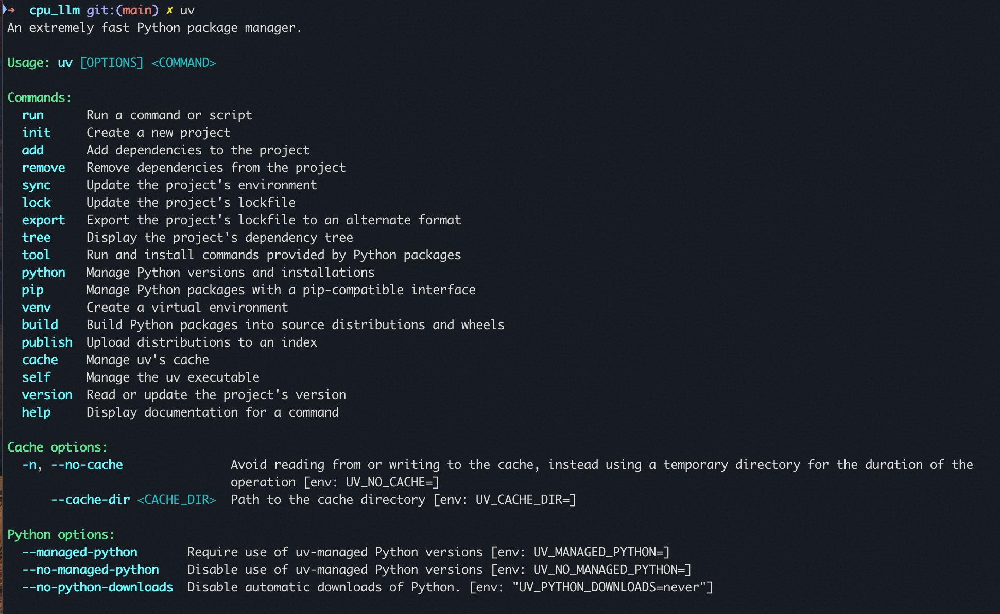
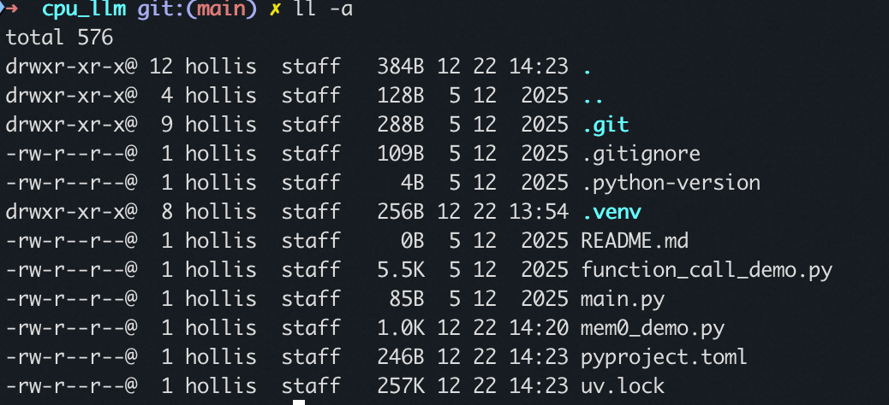
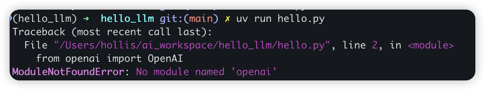
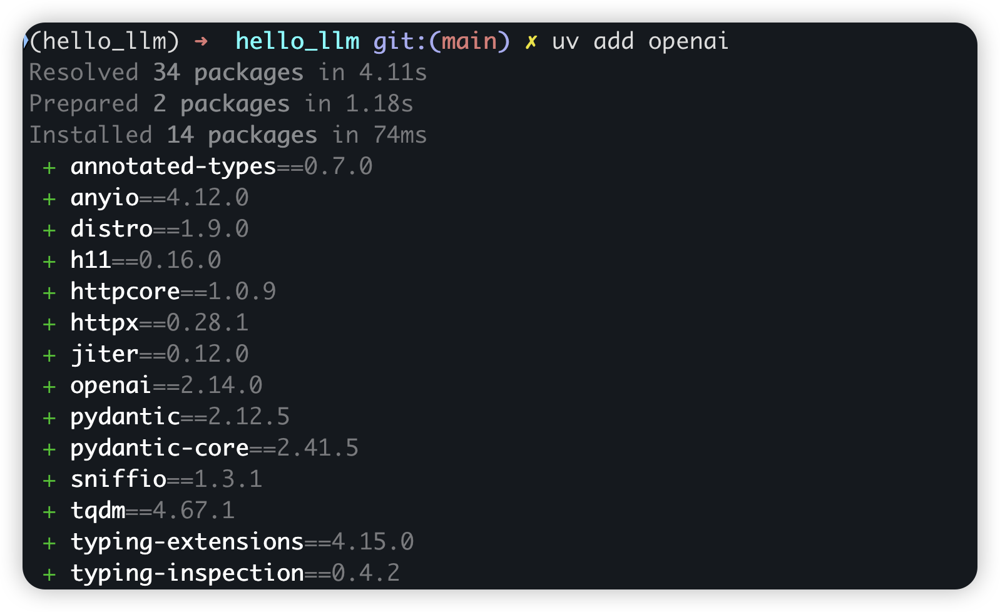

# ✅LLM HelloWorld

Python环境搭建

**UV**是一个极速的Python包和项目管理工具，使用Rust编写，速度比pip快10-100倍！它不仅能替代pip，还能替代pip-tools、pipx、poetry、pyenv和virtualenv等多个工具。

- 极速安装：比pip快10-100倍
- 统一工具链：一个工具替代pip、pip-tools、pipx、poetry、pyenv、virtualenv等
- 全面的项目管理：支持依赖管理、环境隔离、锁文件
- Python版本管理：安装和管理不同版本的Python
- 工具运行和安装：可以直接运行和安装Python应用
- 脚本支持：运行单文件脚本，支持内联依赖元数据
- 兼容pip：提供pip兼容接口，无需改变现有工作流
- 跨平台支持：支持macOS、Linux和Windows

**安装方式一、独立安装脚本**

macOS/Linux：

```text
curl -LsSf https://astral.sh/uv/install.sh | sh
```

Windows：

```text
powershell -ExecutionPolicy ByPass -c "irm https://astral.sh/uv/0.10.5/install.ps1 | iex"
```

**安装方式二、使用pip安装**

```text
pip install uv
```

如果提示bash: pip: command not found，请先自行安装python环境。

**安装方式三、Homebrew安装（macOS）**

```text
brew install uv
```

安装完成后，你可以通过在命令行输入`uv`来验证安装是否成功。



UV基本用法

创建项目

使用UV创建一个新项目：

```text
uv init hello_llm
```



这个命令会初始化一个新项目，并创建必要的文件结构，包括:

- `.gitignore`：Git忽略文件
- `.python-version`：Python版本信息
- `main.py`：主程序文件
- `pyproject.toml`：项目配置文件
- `README.md`：项目说明文件

创建虚拟环境

创建虚拟环境的速度非常快：

```text
cd hello_llm 
uv venv
```

这个命令会在项目目录下创建一个`.venv`目录，包含虚拟环境。要激活虚拟环境，使用：

```text
# Linux/macOS source 
.venv/bin/activate
# Windows 
.venv\Scripts\activate
```

运行

写一段大模型调用的代码：

```text
import os
from openai import OpenAI

try:
    client = OpenAI(
        # 替换成你自己的ak
        api_key="YOUR Access Key",
        base_url="https://dashscope.aliyuncs.com/compatible-mode/v1",
    )

    completion = client.chat.completions.create(
        model="qwen-plus",
        messages=[
            {"role": "system", "content": "You are a helpful assistant."},
            {"role": "user", "content": "你是谁？"},
        ],
    )
    print(completion.choices[0].message.content)
except Exception as e:
    print(f"错误信息：{e}")
```

然后运行命令：

```text
uv run hello.py
```



提示缺少openai这个模块，那么运行命令添加模块：

```text
uv add openai
```

**如果你的安装过程很慢或者卡住，**可以修改一下镜像地址，改用国内的镜像源。比如我的阿里云服务器上（根据你的系统情况，可以去ai搜一下 pip加速就告诉你怎么配置了）：# 1. 设置阿里云镜像为全局默认echo 'export UV_INDEX_URL="https://mirrors.aliyun.com/pypi/simple/"' >> ~/.bashrc# 2. 立即生效source ~/.bashrc



然后重新执行`uv run hello.py`


---

来源: https://thoughts.aliyun.com/workspaces/6963289eb0fc2e001bb052eb/docs/69634c3fc71a890001a229d4
