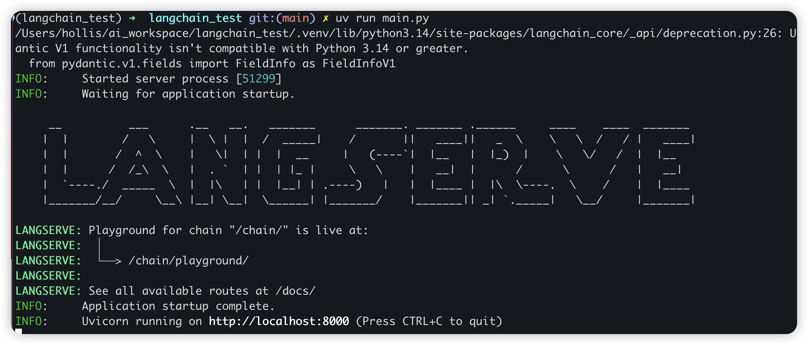
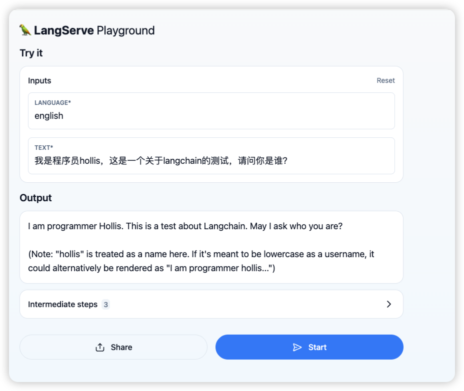

# ✅LLM应用开发框架：LangChain

**LangChain 是一个非常知名的开源框架，他的主要作用是简化基于大型语言模型构建应用程序的过程。**它提供了一套模块化、可组合的工具和抽象，帮助开发者将 LLM 与外部数据源、记忆机制、工具调用等能力结合起来，从而构建更强大、更智能的应用，如问答系统、Agent、文档分析工具、聊天机器人等。

- **降低开发复杂度**：避免重复造轮子，快速搭建 LLM 应用原型。
- **模块化设计**：各组件解耦，易于替换和扩展。
- **支持 RAG 架构**：轻松接入私有知识库，提升回答准确性。
- **生态丰富**：支持数十种 LLM、向量数据库、文档格式等。
- **社区活跃**：持续更新，文档完善，案例丰富。

LangChain 的核心功能

1. **模型 I/O**

- 封装了对主流 LLM（如 OpenAI、Anthropic、Hugging Face 等）的统一接口。
- 支持提示模板（PromptTemplate）和输出解析（OutputParser）。

1. **链（Chains）**

- 允许将多个组件（如提示 + 模型 + 解析器）串联成工作流。

1. **数据连接**

- 提供文档加载器（Document Loaders）、文本分割器（Text Splitters）。
- 支持向量存储（Vector Stores）和检索器（Retrievers），用于实现 RAG（Retrieval-Augmented Generation）。

1. **记忆**

- 支持在对话中保留上下文（如 ConversationBufferMemory）。
- 实现多轮对话状态管理。

1. **智能体（Agents）**

- 让 LLM 能够动态调用工具（如搜索、计算器、数据库查询等）来完成任务。
- 支持 ReAct、Plan-and-Execute 等推理策略。

1. **回调与监控**

- 可追踪执行过程，便于调试、日志记录或集成监控系统。

使用 LangChain 构建一个翻译系统

初始化环境：

```text
uv init langchain_test
cd langchain_test
uv venv
source .venv/bin/activate
```

编写main.py中的代码：

```text
from fastapi import FastAPI
from langchain_core.prompts import ChatPromptTemplate
from langchain_core.output_parsers import StrOutputParser
from langchain_openai import ChatOpenAI
from langserve import add_routes

OPENAI_API_KEY = "<你的API KEY>"
OPENAI_API_BASE = "https://dashscope.aliyuncs.com/compatible-mode/v1"

# 1. Create prompt template
system_template = "Translate the following into {language}:"
prompt_template = ChatPromptTemplate.from_messages([
    ('system', system_template),
    ('user', '{text}')
])

# 2. Create model
model = ChatOpenAI(
    model="deepseek-v3",
    api_key=OPENAI_API_KEY,
    base_url=OPENAI_API_BASE,
    temperature=0.7,
)

# 3. Create parser
parser = StrOutputParser()

# 4. Create chain
chain = prompt_template | model | parser


# 4. App definition
app = FastAPI(
  title="LangChain Server",
  version="1.0",
  description="A simple API server using LangChain's Runnable interfaces",
)

# 5. Adding chain route
add_routes(
    app,
    chain,
    path="/chain",
)

if __name__ == "__main__":
    import uvicorn

    uvicorn.run(app, host="localhost", port=8000)
```

添加依赖：`uv add langserve fastapi langchain_openai sse_starlette uvicorn`

运行代码：`uv run main.py`



运行后会启动一个web server，通过[http://localhost:8000/chain/playground/](http://localhost:8000/chain/playground/) 可以访问：



上面这段脚本使用了 **LangChain**以及 **LangServe** 的多个核心特性。我们具体介绍下。

Prompt Template（提示模板）

```text
from langchain_core.prompts import ChatPromptTemplate
```

- 使用了 `ChatPromptTemplate.from_messages()` 构建结构化的聊天提示。
- 支持系统消息（system）和用户消息（user）的组合，是 LangChain 中用于构造 LLM 输入的标准方式。
- 利用了 **模板变量**（如 `{language}` 和 `{text}`），实现动态内容注入。

LLM 集成（通过 OpenAI 兼容接口）

```text
from langchain_openai import ChatOpenAI
```

- 我们通过**OpenAI 兼容模式**调用的是阿里云 DashScope 的 DeepSeek 模型
- 设置了 `model="deepseek-v3"`、`api_key`、`base_url`、`temperature` 等参数。

Output Parser（输出解析器）

```text
from langchain_core.output_parsers import StrOutputParser
```

- `StrOutputParser()` 将 LLM 的原始响应（通常是 `AIMessage` 对象）转换为纯字符串。
- 这是 LangChain 中处理模型输出的标准方式，便于后续使用或返回给客户端。

Chain（链式调用）

```text
chain = prompt_template | model | parser
```

- 使用 **LCEL（LangChain Expression Language）** 语法（`|` 操作符）将组件串联成一个可执行的流水线。
- 这是一个典型的 **Runnable Chain**：输入 → 提示模板 → 模型调用 → 输出解析。

LangServe 集成（部署为 API）

```text
from langserve import add_routes
```

- `add_routes(app, chain, path="/chain")` 自动为你的 chain 生成 RESTful API（包括 `/chain/invoke`, `/chain/stream` 等端点）。
- 基于 FastAPI，支持异步、OpenAPI 文档、自动请求/响应验证。

---

来源: https://thoughts.aliyun.com/workspaces/6963289eb0fc2e001bb052eb/docs/696643a2c71a890001a5ac66
