# ✅开发必备的Spring AI核心概念

我们要用Spring AI，最重要的功能就是我们要用大模型，所以模型（Model）肯定是Spring AI中最最最核心的一个概念了。

在Spring AI中支持很多模型，根据模型的功能分成了"Chat Model"、"Embedding Model"、"Image Model"、"Audio Model"等。

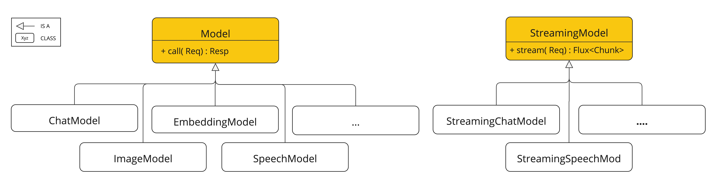

ChatModel

其中，ChatModel就是专门和对话模型对接的一套接口。定义了与支持对话功能的语言模型交互的统一方式。它抽象了不同厂商（如 OpenAI、Anthropic、Cohere、Azure OpenAI、Hugging Face 等）的具体实现，统一使用方法，让开发者不需要关注底层调用细节。

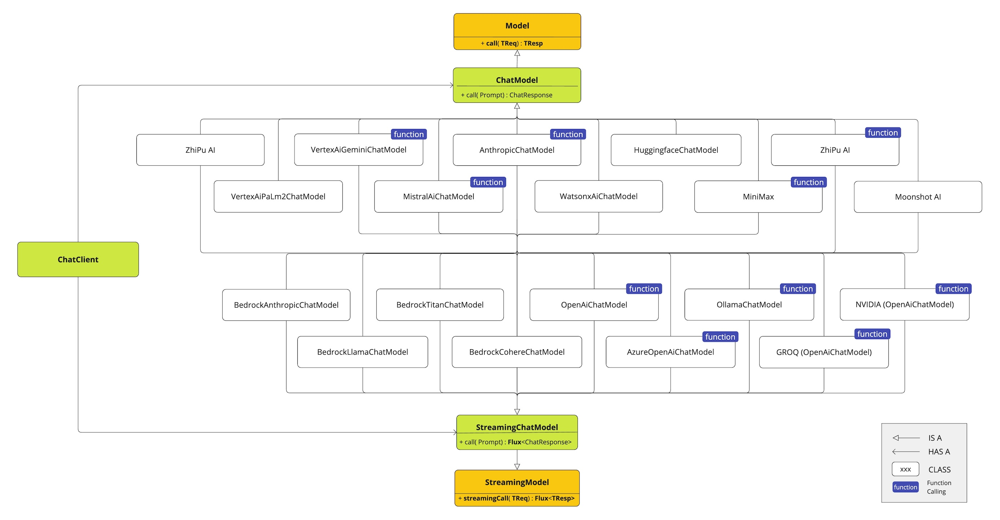

无论底层使用的是 OpenAI 的 GPT-4，还是用百炼这种平台对接开源模型，或者是本地部署的 Ollama，你都可以通过相同的 `ChatModel` 接口来调用它们。

```text
public interface ChatModel extends Model<Prompt, ChatResponse>, StreamingChatModel {

	default String call(String message) {
		Prompt prompt = new Prompt(new UserMessage(message));
		Generation generation = call(prompt).getResult();
		return (generation != null) ? generation.getOutput().getText() : "";
	}

	default String call(Message... messages) {
		Prompt prompt = new Prompt(Arrays.asList(messages));
		Generation generation = call(prompt).getResult();
		return (generation != null) ? generation.getOutput().getText() : "";
	}

	@Override
	ChatResponse call(Prompt prompt);

	default ChatOptions getDefaultOptions() {
		return ChatOptions.builder().build();
	}

	default Flux<ChatResponse> stream(Prompt prompt) {
		throw new UnsupportedOperationException("streaming is not supported");
	}

}
```

以上就是ChatModel接口，他继承了两个接口，一个是Model、一个是StreamingChatModel。StreamingChatModel中提供了stream方法，看他的返回值你肯定不陌生，这不就是我们前面讲流式输出时候提到的Flux么，所以，这个接口中的方法主要调用大模型做流式输出的。

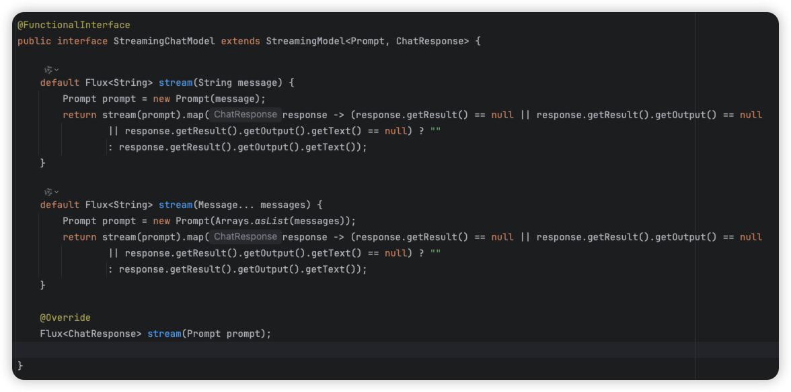

Model接口定义就比较简单了，就是call方法，以非流式的方式调用大模型

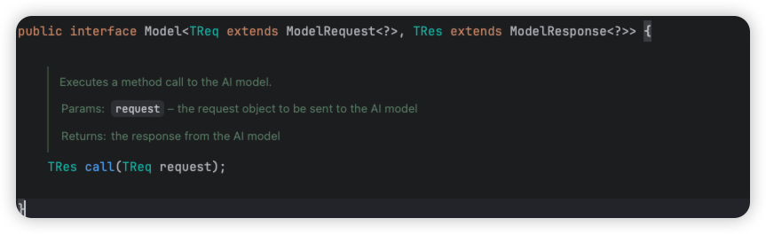

另外，ChatModel中还定义了Prompt、ChatResponse。Prompt就是大模型的输入，ChatResponse就是大模型的输出。ChatModel 的工作原理就是接收 Prompt 或部分对话作为输入，将输入发送给后端大模型，模型根据其训练数据和对自然语言的理解生成对话ChatResponse，应用程序可以将ChatResponse返回给用户。

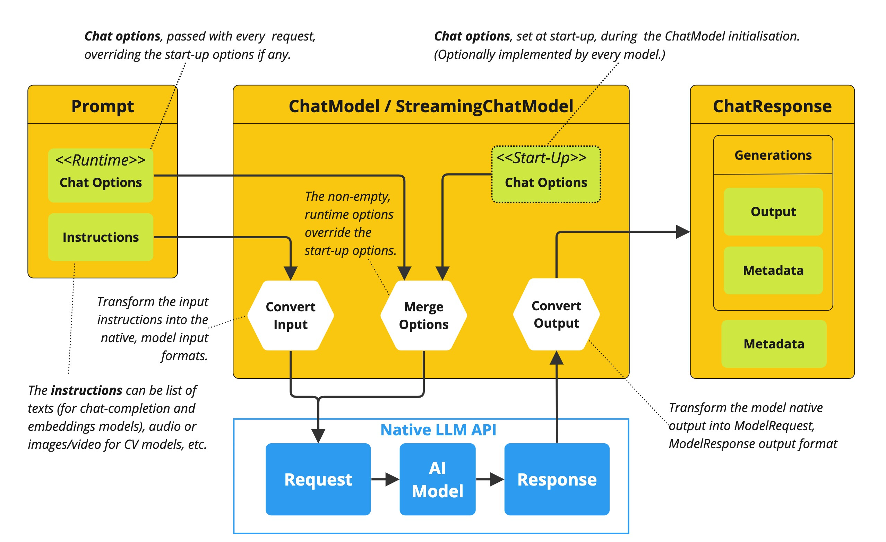

因为我们通过Spring AI Alibaba接入，Spring AI Alibaba中也提供了一个ChatModel——DashScopeChatModel，这是一个具体的ChatModel的实现，其中基于Spring AI Alibaba实现了ChatModel的方法。

在Spring AI Alibaba的DashScopeChatConfiguration#dashscopeChatModel方法中，完成了DashScopeChatModel的bean的定义，然后再org.springframework.boot.autoconfigure.AutoConfiguration.imports把DashScopeChatConfiguration定义进去，这样应用启动后，Spring的上下文中就有DashScopeChatModel了，我们就可以直接用了。

先来个HelloWorld，我们搞了两个方法，分别调用chatModel的call方法和stream

```text
@RestController
@RequestMapping("/model")
public class ChatModelController {

    @Autowired
    private DashScopeChatModel dashScopeChatModel;

    @RequestMapping("/call/string")
    public String callString(String message) {
        return dashScopeChatModel.call(message);
    }


    @RequestMapping("/stream/string")
    public Flux<String> callStreamString(String message, HttpServletResponse response) {
        response.setCharacterEncoding("UTF-8");
        return dashScopeChatModel.stream(message);
    }
}
```

callString方法返回值是个Stream，callStreamString返回值是个Flux&lt;String&gt;，这个前面讲过了，一个是流式的，一个是普通的阻塞式的。

**注意**，在callStreamString的方法中，入参需要多增加一个需要增加一个，HttpServletResponse，并且在方法体中增加以下2行，要不然在页面上显示的时候，中文会变成乱码：

```text
response.setContentType("text/event-stream");
response.setCharacterEncoding("UTF-8");
```

相当于在响应头中告诉浏览器这是一个流式响应，并且指定字符编码为UFT-8。

Prompt

不管是call方法，还是stream，入参都是Prompt，这个玩意之前我们讲过的，就是提示词。

```text
public class Prompt implements ModelRequest<List<Message>> {
    //对话历史+本地对话内容
    private final List<Message> messages;

    //调用 Chat Model 时的额外参数
    @Nullable
    private ChatOptions chatOptions;
}
```

Prompt有两个重要的参数，一个是List&lt;Message&gt; messages，一个是ChatOptions chatOptions;

**Message**

Message表示对话的内容，他有多个不同的实现类，分表表示：

- 系统设定（`SYSTEM`）
- 用户输入（`USER`）
- 模型回复（`ASSISTANT`）
- 工具返回结果（`ToolResponse`）

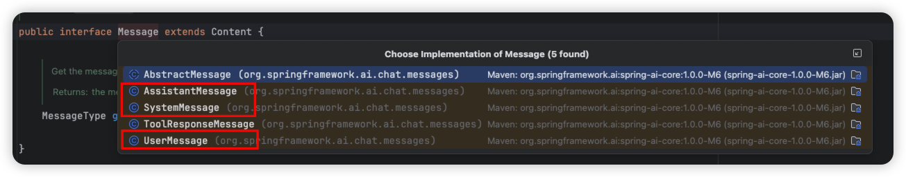

**ChatOptions**

这是个可选字段，用于指定调用 Chat Model 时的**额外参数**，如我们在提示工程部分讲过的：

- 模型名称
- 温度（temperature）
- 最大生成 token 数量
- Top-k、Top-p 采样策略
- 其他厂商特有的参数（比如 OpenAI 的 `stop`、`frequency_penalty` 等）

可以用DashScopeChatOptions快速创建一个ChatOptions，这个builder里面还定义了一堆方法，都可以用来设置你要设置的参数。

```text
DashScopeChatOptions.builder().withModel("qwen-plus").build()
```

ChatResponse

不管是call方法，还是stream，出参都是ChatResponse，只不过一个是Flux&lt;ChatResponse&gt;，这玩意就是大模型的响应。

这里面定义的内容特别多，但是日常能用的上的不多，这里先不展开他了，先记住他的最常用方法：

```text
resp.getResult().getOutput().getText()
```

上面这个方法也改过，我记得之前还叫getContent()，后面都统一成getText()了。

ChatClient

除了可以直接用ChatModel来和模型做对话之外，Spring AI中还提供了一个更加好用的ChatClient，它是一个为了方便使用而创建的更高级、更简洁的门面（Facade）。

ChatClient包括一些基础功能，如：

- 定制和组装模型的输入（Prompt）
- 格式化解析模型的输出（Structured Output）
- 调整模型交互参数（ChatOptions）

还支持更多高级功能：

- 聊天记忆（Chat Memory）
- 工具/函数调用（Function Calling）
- RAG

用ChatClient来个HelloWorld：

```text
package cn.hollis.llm.llmentor.controller;

import com.alibaba.cloud.ai.dashscope.chat.DashScopeChatOptions;
import org.springframework.ai.chat.client.ChatClient;
import org.springframework.ai.chat.client.advisor.SimpleLoggerAdvisor;
import org.springframework.ai.chat.messages.SystemMessage;
import org.springframework.ai.chat.messages.UserMessage;
import org.springframework.ai.chat.model.ChatModel;
import org.springframework.ai.chat.prompt.Prompt;
import org.springframework.beans.factory.InitializingBean;
import org.springframework.beans.factory.annotation.Autowired;
import org.springframework.web.bind.annotation.GetMapping;
import org.springframework.web.bind.annotation.RequestMapping;
import org.springframework.web.bind.annotation.RestController;
import reactor.core.publisher.Flux;

@RestController
@RequestMapping("/client")
public class ChatClientController implements InitializingBean {

    @Autowired
    private ChatModel dashScopeChatModel;

    private ChatClient chatClient;

    @GetMapping("/simpleCall")
    public String simpleCall(String message) {
        return chatClient.prompt(message).call().content();
    }

    @GetMapping("/stream")
    public Flux<String> stream(String message) {
        return chatClient.prompt(message).stream().content();
    }

    @Override
    public void afterPropertiesSet() throws Exception {
        chatClient = ChatClient.builder(dashScopeChatModel)
                // 实现 Logger 的 Advisor
                .defaultAdvisors(
                        new SimpleLoggerAdvisor()
                ).defaultSystem("请用英文回答问题")
                // 设置 ChatClient 中 ChatModel 的 Options 参数
                .defaultOptions(
                        DashScopeChatOptions.builder()
                                .temperature(0.7)
                                .build()
                )
                .build();
    }
}
```

ChatClient的大部分内容其实都和ChatModel差不多，毕竟是基于ChatModel包装而来的嘛。

default

ChatClient在初始化的时候，可以指定很多defalut的配置，比如：

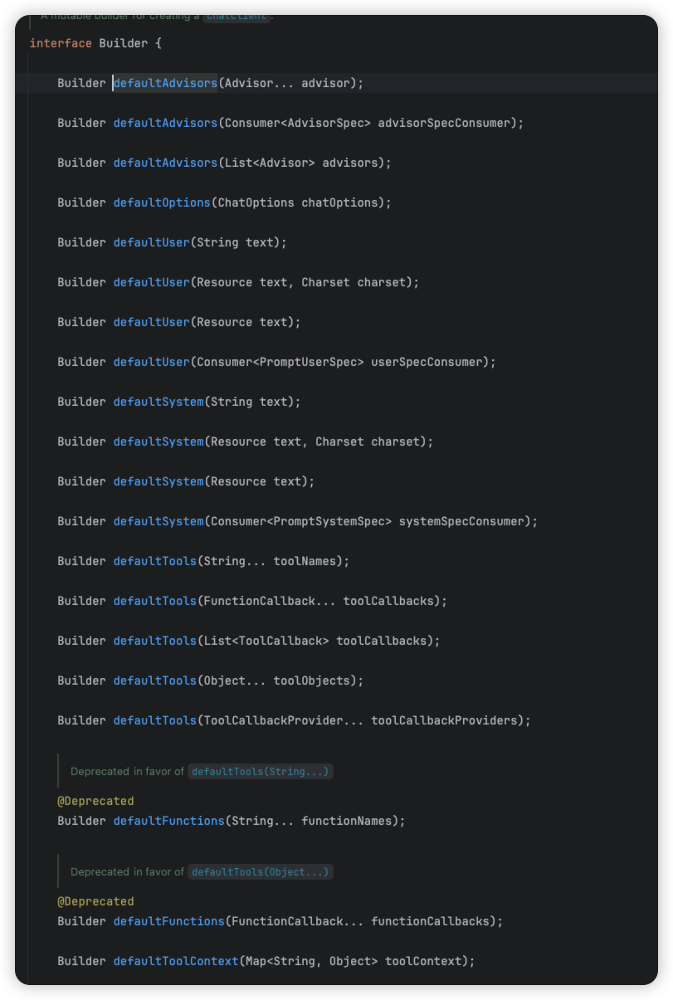

这些default的配置，在后面使用chatClient的时候就可以不用再指定了，就会直接当做已知内容被应用了，比如上面的例子中，我们在defaultSystem中，告知要用英语回答问题，后面我的问题他都会用英文回答。

但是如果后面在使用chatClient的时候，如果我重新指定了system，那么defaultSystem就会被覆盖。

比如我改成让他用韩语：

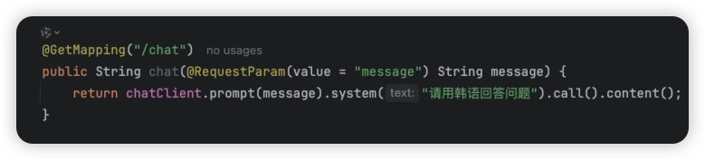

输出结果就是：

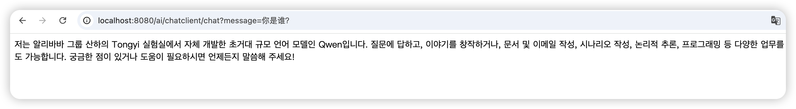

这边值得注意的是，如果是在 Prompt 中设置的 SystemMessage，则会追加，而不是覆盖。

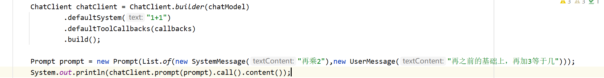

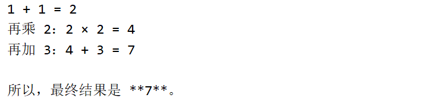

Options

这就是上面提到的chatModel一样的指定的参数。

Functions

functions这个已经被Deprecated了，之前用它来做function call的工具的配置的，现在已经改用Tools了。

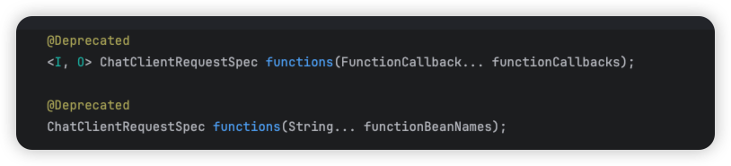

Tools

tools指的就是工具，大模型需要会用工具才能帮我实现很多功能，不能用工具的大模型只能是个对话机器人，而一旦会用了工具，他就是个智能助手了。

所以我们可以提供tools来告诉大模型我们都有哪些工具可供使用，具体的用法， 我们在后面的tool call部分章节会展开。

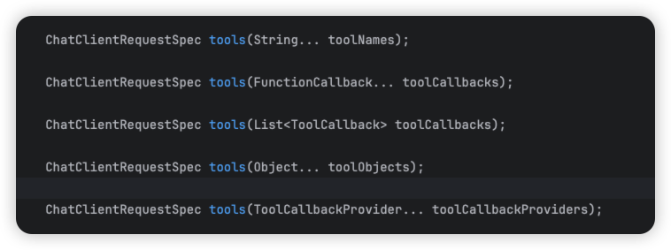

System&User

这个其实就是提示词部分了，就是系统提示词和用户提示词的设置，一般来说系统提示词可以通过default设置进去，用户提示词如果有一些需要初始化的，也可以通过default方式配置，但是一般都是在运行时根据用户输出来设置的。

Advisors

Advisors 是一组拦截器或“切面”，用于在调用前后对 Prompt 或 Response 进行拦截、修改、增强或记录。（类似于 Spring AOP 的 Advisor，但用于 AI 请求/响应的处理链路。）

他有很多具体的实现，我们也可以自己定义：

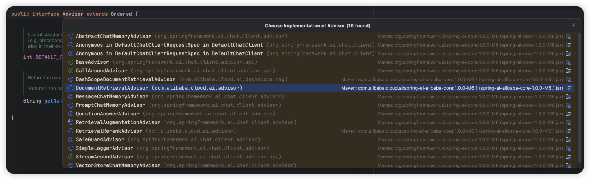

他的功能可老强大了，我们后面需要将的比如RAG、记忆等等功能，都需要借助Advisor来实现，比如我们前面例子中用的那个SimpleLoggerAdvisor，其实就一个简单的日志的扩展。

**SimpleLoggerAdvisor**

看一下这个类中的adviseCall方法，这个方法是从CallAroundAdvisor中继承过来的：

```text
@Override
public ChatClientResponse adviseCall(ChatClientRequest chatClientRequest, CallAdvisorChain callAdvisorChain) {
    logRequest(chatClientRequest);

    ChatClientResponse chatClientResponse = callAdvisorChain.nextCall(chatClientRequest);

    logResponse(chatClientResponse);

    return chatClientResponse;
}
```

看着很像是AOP吧，他实现的功能就是执行业务逻辑之前，先调用before方法，执行之后，再调用observeAfter方法。

这两个方法其实就是打印日志：

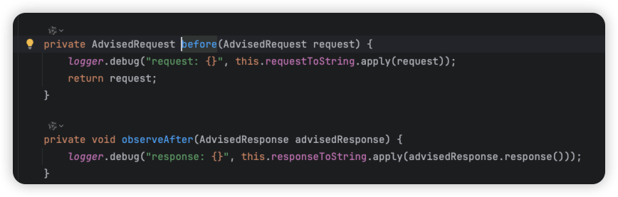

---

来源: https://thoughts.aliyun.com/workspaces/6963289eb0fc2e001bb052eb/docs/6967975751b144000117d4d2
