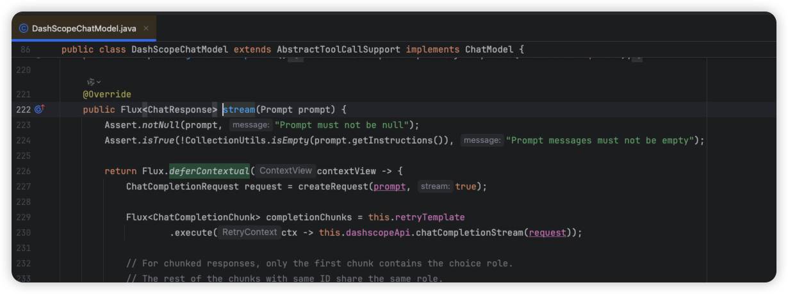
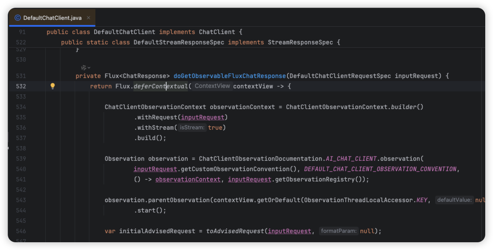
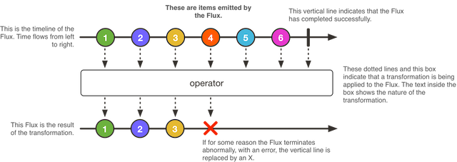

# ✅Spring AI 核心特性：流式输出

前面讲过不用Sping AI，在Java中做流式输出的方案，主要是基于SSE，之前讲Spring AI的例子的时候，其实也提到过。

比如ChatModel中通过stream方法可以做流式输出，是因为他实现了StreamingChatModel接口中。

```text
@RestController
@RequestMapping("/ai/output")
public class StreamOutputController implements InitializingBean {

    @Autowired
    private DashScopeChatModel chatModel;

    private ChatClient chatClient;

    @RequestMapping("/stream/chat")
    public Flux<String> streamChat(@RequestParam(value = "message") String message, HttpServletResponse response) {
        response.setContentType("text/event-stream");
        response.setCharacterEncoding("UTF-8");
        Prompt prompt = new Prompt(message, DashScopeChatOptions.builder().withModel("qwen-plus").build());

        Flux<ChatResponse> chatResponseFlux = chatModel.stream(prompt);

        return chatResponseFlux.map(resp -> resp.getResult().getOutput().getText());
    }
}
```

这是一个controller中的方法，返回值是Flux&lt;String&gt;类型的，返回给前端的就是个流式的内容输出。

在ChatClient中也一样的，也有一个stream方法，返回值也是一个Flux&lt;String&gt;类型。

```text
@RequestMapping("/stream/chat")
public Flux<String> streamChat(@RequestParam(value = "message") String message, HttpServletResponse response) {
    response.setContentType("text/event-stream");
    response.setCharacterEncoding("UTF-8");
    return chatClient.prompt(message).stream().content();
}
```

通过源码可以看到，不管是ChatModel还是ChatClient，最终都是依赖reactor.core.publisher.Flux#deferContextual来实现的。





这里面用到了一个Flux，他是啥呢？

实现原理

大模型的原理的本质就是预测下一个词做输出的，所以，我们就可以不用等他全部都预测完再输出，可以他预测一个我们返回一个。所以，这就是流式输出。

在Java中，有一个响应式编程的库——Reactor，他出现很多年了，一直都不温不火，主要是因为代码写起来太抽象了，但是确实有高性能、异步、非阻塞等优势。尤其在JDK 21之后虚拟线程出来之后，更一度要退出历史舞台了。但是突然大模型火了，而Reactor提供的支持流式输出天然契合大模型的输出。

响应式编程是一种典型的观察者模式，当有新的可用的数据到来时，`Publisher` 会对`Subscriber`进行通知，这种推动是响应式的关键。

Reactor项目的主要组件为 `reactor-core`，一个专注于响应式流规范并基于Java8的响应式库。Reactor引入了可组合的响应式类型，这些类型既实现了 `Publisher` 又提供了丰富的操作符：`Flux` 和 `Mono`。

- `Flux` 对象表示含有0..N个元素的响应式序列。
- `Mono` 对象表示单个值或为空（0..1）的结果。



**Flux 是 Reactor 库中的一个发布者（Publisher）**，遵循 **Reactive Streams 规范**。

- 它代表一个**异步的、非阻塞的序列**，可以发射：
- 0 到多个数据项（`onNext`）
- 一个可选的错误（`onError`）
- 或一个完成信号（`onComplete`）

想要定义一个Flux比较简单：

```text
Flux<String> seq1 = Flux.just("foo", "bar", "foobar");


List<String> iterable = Arrays.asList("foo", "bar", "foobar");
Flux<String> seq2 = Flux.fromIterable(iterable);
```

Flux的订阅也比较简单，主要用他提供的subscribe()方法。

```text
//处理onNext事件
seq1.subscribe(i -> System.out.println(i));

//处理onNext事件和onError事件
seq1.subscribe(i -> System.out.println(i), 
      error -> System.err.println("Error: " + error));

//处理onNext事件、onError事件和onComplete事件
seq1.subscribe(i -> System.out.println(i),
    error -> System.err.println("Error " + error),
    () -> System.out.println("Done"));
```

更多关于Reactor的介绍：https://easywheelsoft.github.io/reactor-core-zh/index.html#about-doc

---

来源: https://thoughts.aliyun.com/workspaces/6963289eb0fc2e001bb052eb/docs/6968e148c71a890001a8e499
