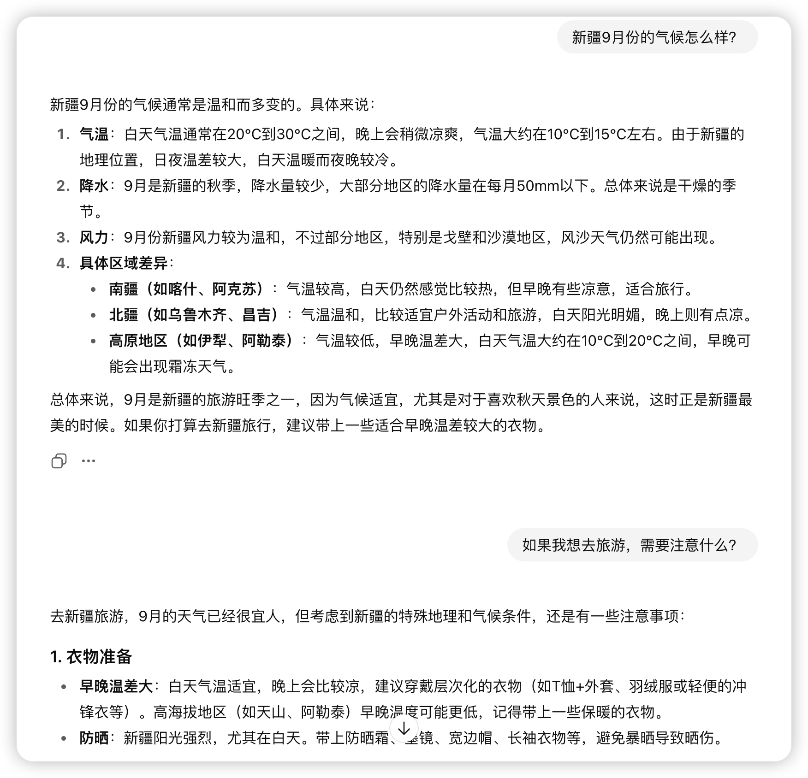
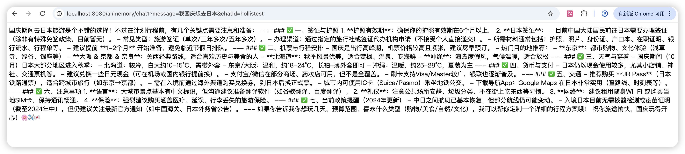
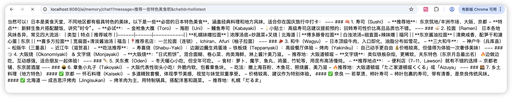
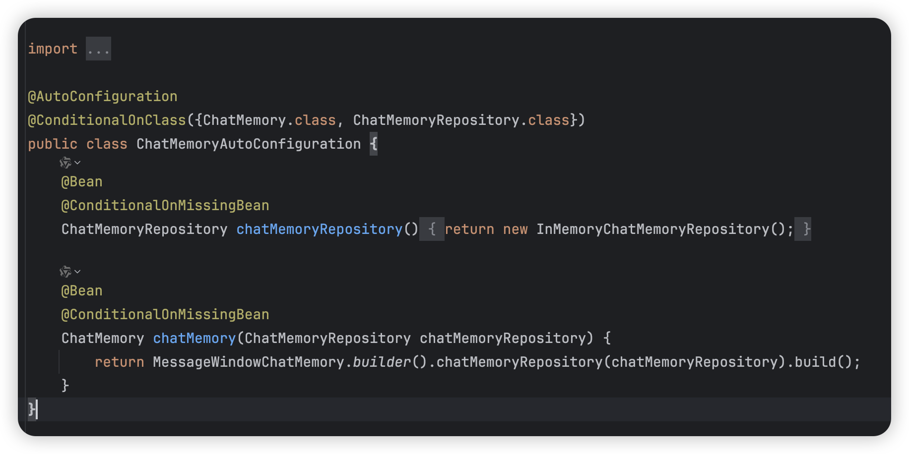

# ✅Spring AI 核心特性：对话记忆

AI的对话记忆指的是AI在单次对话或跨对话中，记住并利用之前交互信息的能力。这就像你和一个人聊天，如果他只能记住你刚才说的最后一句话，那对话将无法进行。因此，记忆是实现连贯、智能对话的基石。

AI发展到今天，记忆能力已经很丰富了，现在主要分为两大种，一种是短期记忆，一种是长期记忆。

短期记忆

短期记忆也称为“上下文记忆”或“对话记忆”。指在**单次对话会话**中，AI能记住的之前对话内容。这通常受限于一个固定的“上下文窗口”（可以理解为一篇文章的最大字数）。

当你发送一条消息时，系统会将你当前的问题和之前一定轮次的对话历史（都在上下文窗口内）一起送给AI模型处理，这样AI就能根据整个对话上下文来生成回答。



但是短期记忆也有些局限性：

- **有限性**：上下文窗口大小是硬性限制。如果和AI对话轮次太多了的话，就会达到上下文上限，那么最早的对话内容可能就会丢失。
- **易失性**：一旦关闭对话页面或开始新对话，这些记忆就会消失。

长期记忆

长期记忆也称为“持久性记忆”或“外部记忆”。指AI能够将重要信息存储在对话之外（如数据库、向量数据库），并在未来的对话中根据需要检索和使用的记忆。

比如说，你告诉一个具备长期记忆的AI助手：“我对花生过敏。” 一周后，你问：“推荐一些健康的零食。” (两次问答并不是在同一个对话中）AI在回答前，会检索你的长期记忆，发现你对花生过敏，从而避免推荐任何含花生的食品。

**相比短期记忆，长期记忆有以下特点**：

- **持久性**：信息被保存在外部，不依赖于单次对话的上下文窗口。
- **可扩展性**：理论上可以存储海量信息，只受外部存储介质的限制。
- **需要主动管理**：用户可能需要手动添加、修改或删除记忆。
- **丢失完整性：** 长期记忆通常以摘要形式存储，势必会丢失对话细节。
- **适用场景**：更适用于保存用户偏好、历史行为，不适合依赖精确上下文的复杂推理或即时决策。

关于长期记忆，我们后面再讲，这里先介绍下短期记忆的话，如果用Spring AI实现。

Spring AI实现对话记忆

方式一、通过Message List

前面介绍Prompt的时候，我们提到过，Prompt支持传入Message的List，那么我们可以把每一轮的对话内容都封装成一个Message，然后一次次的加入到list中，然后在和大模型对话的时候，把List&lt;Message&gt;传给Prompt来构造提示词。

```text
@GetMapping("/call1")
public String call1(String message) {

    List<Message> messages = new ArrayList<>();

    //第一轮对话
    messages.add(new SystemMessage("你是一个旅行推荐师"));

    messages.add(new UserMessage("我想去新疆玩"));
    messages.add(new AssistantMessage("好的，我知道了，你要去新疆，请问你准备什么时候去"));
    messages.add(new UserMessage("我准备元旦的时候去玩"));
    messages.add(new AssistantMessage("好的，请问你想玩那些内容？"));

    messages.add(new UserMessage("我喜欢自然风光"));

    Prompt prompt = new Prompt(messages);
    return chatModel.call(prompt).getResult().getOutput().getText();
}
```

最后一轮对话的结果：


说明模型记住了我们前两次的对话内容。是通过一个Message的list维护的对话记忆。

那么，如果是一次一次的和模型交互的话，代码应该是这样的：

```text

@RestController
@RequestMapping("/ai/memory")
public class ChatMemoryController implements InitializingBean {

    @Autowired
    private DashScopeChatModel chatModel;

    private ChatClient chatClient;

    @GetMapping("/chat")
    public String chat() {

        List<Message> messages = new ArrayList<>();

        //第一轮对话
        messages.add(new SystemMessage("你是一个游戏设计师"));
        messages.add(new UserMessage("我想设计一个回合制游戏"));
        ChatResponse chatResponse = chatModel.call(new Prompt(messages));
        String content = chatResponse.getResult().getOutput().getText();
        System.out.println(content);
        System.out.println("======");

        messages.add(new AssistantMessage(content));

        //第二轮对话
        messages.add(new UserMessage("能帮我结合一些二次元的元素吗?"));
        chatResponse = chatModel.call(new Prompt(messages));
        content = chatResponse.getResult().getOutput().getText();
        System.out.println(content);
        System.out.println("======");

        messages.add(new AssistantMessage(content));

        //第三轮对话
        messages.add(new UserMessage("那如果主要是针对女性玩家的游戏呢?有什么需要改进的？"));
        chatResponse = chatModel.call(new Prompt(messages));
        content = chatResponse.getResult().getOutput().getText();
        System.out.println(content);
        System.out.println("======");

        return content;
    }

    @Override
    public void afterPropertiesSet() throws Exception {
        ChatMemory chatMemory = new InMemoryChatMemory();

        this.chatClient = ChatClient.builder(chatModel)
                // 实现 Logger 的 Advisor
                .defaultAdvisors(new MessageChatMemoryAdvisor(chatMemory))
                // 设置 ChatClient 中 ChatModel 的 Options 参数
                .defaultOptions(
                        DashScopeChatOptions.builder()
                                .withTopP(0.7)
                                .build()
                )
                .build();
    }
}
```

每一次对话时，把用户提示词放到Messages里面，在LLM返回结果后，把他们的结果封装成一个AssistantMessage也塞到Messages。这样维护一个对话。

方式二、通过chat_memory_conversation_id

上面的message list是要每一次都重新add进去，传给大模型，但是其实这些对话的历史message，我们是在代码中有调用记录的。

所以，我们可以给我们要记忆的消息设置同一个chat_memory_conversation_id，同一个这样的id下的消息就可以识别出来，这样就能组装成上面的message list给到LLM。

这个chat_memory_conversation_id其实就是个参数，通过Advisor的方式进行注入。

chat_memory_conversation_id：标识对话组的唯一id

```text
@RestController
@RequestMapping("/ai/memory")
public class ChatMemoryController implements InitializingBean {

    @Autowired
    private DashScopeChatModel chatModel;

    private ChatClient chatClient;

    @GetMapping("/chat1")
    public Flux<String> chat1(String message, String chatId, HttpServletResponse response) {
        response.setCharacterEncoding("UTF-8");

        return chatClient
                .prompt()
                .user(message)
                .advisors(spec -> spec.param(ChatMemory.CONVERSATION_ID, chatId))
                .stream().content();

    }


    @Override
    public void afterPropertiesSet() throws Exception {
        ChatMemory chatMemory = MessageWindowChatMemory.builder().maxMessages(10).build();

        this.chatClient = ChatClient.builder(chatModel)
                // 实现 Logger 的 Advisor
                .defaultAdvisors(MessageChatMemoryAdvisor.builder(chatMemory).build())
                // 设置 ChatClient 中 ChatModel 的 Options 参数
                .defaultOptions(
                        DashScopeChatOptions.builder()
                                .withTopP(0.7)
                                .build()
                )
                .build();
    }
}
```





这里用到了一个MessageWindowChatMemory，他是 Spring AI 框架中提供的一种基于窗口的对话记忆实现。它的核心思想是：**只保留最近发生的、一定数量的交互消息**，当消息数量超过窗口大小时，会自动将最早的消息移除。

注意一下ChatMemory的maxMessages，这个指的是里面的message的最大记忆条数，包括了UserMessage、AssistantMessage等，并不是说只有用户的对话内容。

想要构造一个MessageWindowChatMemory，可以用ChatMemoryAdvisor，有两个具体的实现：

- MessageChatMemoryAdvisor：这个Advisor的主要功能是将用户提出的问题和模型的回答添加到历史记录(messages)中，从而实现上下文记忆的能力。
- PromptChatMemoryAdvisor：是MessageChatMemoryAdvisor的一个增强，在有些不支持messages参数的模型使用的时候，可以用这种，他是改写了systemPrompt，把每一轮的输入和输出都补充到这里面去了。

方案对比

以上展示了两种对话记忆的方案，从使用的方便程度来说，第二种要简单很多，代码也好，借助大模型自己的记忆能力就可以实现了，每一次对话的上下文也不至于特别长。

但是第一个方案也不是没有好处，这个方案的好处就是我们可以自己控制记忆，怎么理解呢？

因为这个方案里面的每次对话的message的list都是我代码中自己构造的，我完全可以干预，比如某句话我不想记忆，或者过程中我想针对对话内容做些总结压缩等等的，都很方便，很自由，但是后面这种的话其实大模型记忆是黑盒的，我们干预不了。

Chat Memory

在Spring AI中，针对对话记忆也提供了一些比较方便的支持，比如我们前面定义的MessageWindowChatMemory，其实也可以不用自己定义（new），Spring AI也可以帮我们自动定义好，就像ChatModel一样，需要引入包：

```text
<dependency>
      <groupId>org.springframework.ai</groupId>
      <artifactId>spring-ai-autoconfigure-model-chat-memory</artifactId>
      <version>1.1.0</version>
</dependency>
```

这个starter里面定义好了一个ChatMemory的bean给我们用：



所以代码中new 一个ChatMemory的地方，就可以直接`@Autowire` 一个就行了，默认注入的是一个基于内存的对话记忆，如果需要持久化的记忆，Spring AI还支持了数据库。如：

```text
<dependency>
    <groupId>org.springframework.ai</groupId>
    <artifactId>spring-ai-starter-model-chat-memory-repository-jdbc</artifactId>
</dependency>
```

Spring AI中针对关系型数据库的支持，支持基于以下数据库实现对话记忆（这部分我们后续会讲）：

- PostgreSQL
- MySQL / MariaDB
- SQL Server
- HSQLDB

另外还有对cassandra和neo4j的支持可供选择：

```text
<dependency>
    <groupId>org.springframework.ai</groupId>
    <artifactId>spring-ai-starter-model-chat-memory-repository-cassandra</artifactId>
</dependency>
```

```text
<dependency>
    <groupId>org.springframework.ai</groupId>
    <artifactId>spring-ai-starter-model-chat-memory-repository-neo4j</artifactId>
</dependency>
```

---

来源: https://thoughts.aliyun.com/workspaces/6963289eb0fc2e001bb052eb/docs/696f68c2d31fed0001f975f8
