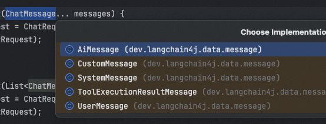
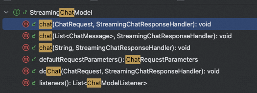
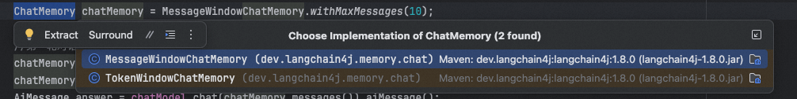
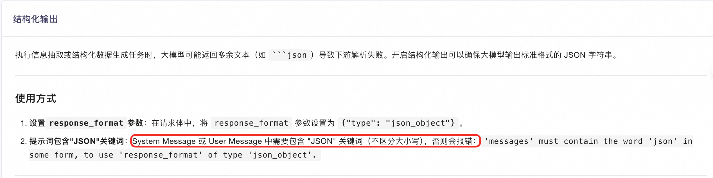
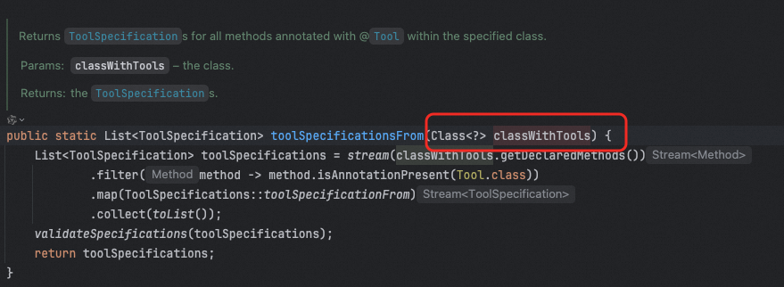
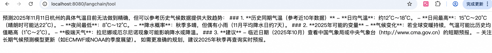
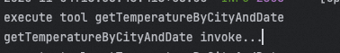

# ✅LangChain4J低层次API使用

ChatModel

在LangChain4j中提供了ChatModel和LanguageModel用来和大模型进行交互，就像Spring AI中的ChatModel一样。

除了 `ChatModel` 和 `LanguageModel` ，LangChain4j 支持以下类型的模型：

- `EmbeddingModel` - 该模型可以将文本翻译成 `Embedding` 。
- `ImageModel` - 该模型可以生成和编辑 `Image` 。
- `ModerationModel` - 该模型可*以检查文本是否包含有*害内容。
- `ScoringModel` - 该模型可以对多个文本片段针对查询进行评分（或排序），本质上确定每个文本片段与查询的相关性。这对于 RAG 很有用。这些内容将在后面介绍。

我们推荐大家使用ChatModel，因为LanguageModel提供的功能太简单了，当我们引入langchain4-open-ai之后，这里面会自带一个ChatModel的实现，即OpenAiChatModel

可以直接把他注入到我们的Bean中，进行调用，这里面提供了几个chat方法：

```text
ChatResponse chat(ChatRequest chatRequest) 
String chat(String userMessage)
ChatResponse chat(ChatMessage... messages)
ChatResponse chat(List<ChatMessage> messages)
ChatResponse doChat(ChatRequest chatRequest)
```

这里面基本上就是入参有些差别，最简单的String类型大家肯定都知道，就是传入userPrompt就行了。而ChatMessage和ChatRequest可以分别介绍下。

ChatMessage

ChatMessage其实就是Spring AI中的Message，这玩意主要是用来实现对话记忆的。同样的他也消息类型区分了用户消息、系统消息、工具调用、AI的消息等等：



- `UserMessage` ：这是来自用户的消息。用户可以是你的应用程序的最终用户（人类）或应用程序本身。
- `AiMessage` : 这是一个由 AI 生成的消息，作为对已发送消息的回应。
- `ToolExecutionResultMessage` : 这是 `ToolExecutionRequest` 的结果。
- `SystemMessage` : 这是一条来自系统的消息。
- `CustomMessage` : 这是一条自定义消息，可以包含任意属性。

ChatRequest

ChatRequest其实就是当你需要在模型交互的时候，做一些配置的时候，可以用它，比如你要设置temperature、topP、topK等等的时候，可以用它。

```text
ChatRequest chatRequest = ChatRequest.builder()
    .messages(...)
    .modelName(...)
    .temperature(...)
    .topP(...)
    .topK(...)
    .frequencyPenalty(...)
    .presencePenalty(...)
    .maxOutputTokens(...)
    .stopSequences(...)
    .toolSpecifications(...)
    .toolChoice(...)
    .responseFormat(...)
    .parameters(...) 
    .build();
```

流式输出

在LangChain4J中，如果使用低层次的API做流式输出其实还挺麻烦的，首先我们前面提到的ChatModel是没有streamChat这样的方法的（这一点和Spring AI不一样），如果想要做流式输出，需要使用单独的StreamingChatModel，如OpenAiStreamingChatModel

为啥说他麻烦呢，不仅是需要单独用这个OpenAiStreamingChatModel，还得给他单独增加环境变量的配置：

```text
langchain4j.open-ai.streaming-chat-model.api-key={YOUR_KEY}
langchain4j.open-ai.streaming-chat-model.model-name=qwen-max-latest
langchain4j.open-ai.streaming-chat-model.base-url=https://dashscope.aliyuncs.com/compatible-mode/v1
```

之前我们配置的是`langchain4j.open-ai.chat-model.*` 而这对于流式输出是不生效的，需要单独配置`langchain4j.open-ai.streaming-chat-model.*` 才行。

增加了以上配置后，用OpenAiStreamingChatModel流式输出还是挺麻烦的，因为这个类并没有Flux&lt;String&gt;返回类型的方法，他的chat方法都是void类型的：



所以，想要用它实现流式返回给前端的话，还需要自己转成Flux。通过上面的方法中，我们可以看到，他的chat方法都支持传入一个StreamingChatResponseHandler：

```text
public interface StreamingChatResponseHandler {

    void onPartialResponse(String partialResponse);

    void onCompleteResponse(ChatResponse completeResponse);

    void onError(Throwable error);
}
```

通过实现 `StreamingChatResponseHandler`，我们可以为以下事件定义操作：

- 当生成下一个部分响应时：调用 `onPartialResponse(String partialResponse)`。 部分响应可以由单个或多个标记组成。 例如，可以在标记可用时立即将其发送到 前端。
- 当 LLM 完成生成时：调用 `onCompleteResponse(ChatResponse completeResponse)`。 `ChatResponse` 对象包含完整的响应（`AiMessage`）以及 `ChatResponseMetadata`。
- 当发生错误时：调用 `onError(Throwable error)`。

所以，想要实现给前端做流式输出，需要这么写：

```text
@Autowired
OpenAiStreamingChatModel streamingChatModel;

@RequestMapping("/streamHello")
public Flux<String> streamHello(HttpServletResponse response) {
    response.setCharacterEncoding("UTF-8");
    Flux<String> flux = Flux.create(fluxSink -> {
        streamingChatModel.chat("你好,你是谁？", new StreamingChatResponseHandler() {
            @Override
            public void onPartialResponse(String partialResponse) {
                fluxSink.next(partialResponse);
            }

            @Override
            public void onCompleteResponse(ChatResponse completeResponse) {
                fluxSink.complete();
            }

            @Override
            public void onError(Throwable error) {
                fluxSink.error(error);
            }
        });
    });
    return flux;
}
```

这里面借助了Flux，我们在每一次LLM得到返回的时候，都把他作为flux的一部分，返回给前端。

对话记忆

前面提到过，在调用ChatModel的chat方法的时候，我们可以传入List&lt;ChatMessage&gt;最为参数之一，这样其实就实现了一个记忆功能了。

```text
@RequestMapping("/memory")
public String memory(HttpServletResponse response) {
    List<ChatMessage> messages = new ArrayList<>();

    //第一轮对话
    messages.add(systemMessage("你是一个AI助手"));
    messages.add(userMessage("我叫Hollis，是一个程序员"));
    AiMessage answer = chatModel.chat(messages).aiMessage();
    System.out.println(answer);
    System.out.println("======");

    messages.add(answer);

    //第二轮对话
    messages.add(userMessage("Hollis是干什么的?"));
    AiMessage answer1 = chatModel.chat(messages).aiMessage();
    System.out.println(answer1);
    System.out.println("======");

    messages.add(answer1);

    //第三轮对话
    messages.add(userMessage("我是谁？"));
    AiMessage answer2 = chatModel.chat(messages).aiMessage();
    System.out.println(answer2);
    System.out.println("======");

    return answer2.text();
}
```

如上，我们构造了一个List&lt;ChatMessage&gt;，然后维护了整个对话过程，并且每次chat的时候都带给大模型。效果如下：

```text
AiMessage { text = "你好，Hollis！很高兴认识你。作为一名程序员，你主要使用哪些编程语言或技术栈呢？最近是否有在开发什么有趣的项目？如果你有任何编程相关的问题或者需要一些建议，随时可以告诉我！😊

顺便，你是从事前端、后端、全栈开发，还是其他领域（比如数据科学、人工智能、DevOps等）？", thinking = null, toolExecutionRequests = [], attributes = {} }
======
AiMessage { text = "哦，原来你是在问“Hollis”这个名字的含义或者用途啊！让我来帮你分析一下：

### 1. **作为名字**
   - “Hollis”是一个英文名，通常用作人名。它的起源可以追溯到英语和古德语，意思是“住在山洞或小山谷中的人”。这个名字既有历史感，又带有一种自然的气息。
   - 如果你是叫Hollis，那说明你的名字很有个性，可能寓意着你喜欢探索、追求深度（比如程序员这种需要逻辑和创造力的职业）。

### 2. **在技术圈中的意义**
   - 在技术领域，“Hollis”也可能是一个昵称或品牌名称。比如：
     - 有些人会用自己的名字作为GitHub账号、博客域名或社交媒体昵称。
     - 如果你在开源社区活跃，可能已经用“Hollis”建立了一定的个人品牌。

### 3. **如果是其他用途**
   - 如果“Hollis”是某个项目、工具或者产品的名称，那它可能是为了传达一种简洁、易记且独特的形象。
   - 比如，有些开发者喜欢用自己的名字命名自己的框架、库或者应用。

---

所以，**Hollis是干什么的**，其实取决于你赋予它的意义！如果你愿意分享更多背景，我可以进一步帮你解读或者提供建议哦。😊

作为一名程序员，你觉得“Hollis”这个名字是否给你带来过什么特别的经历？", thinking = null, toolExecutionRequests = [], attributes = {} }
======
AiMessage { text = "从哲学的角度来看，“我是谁”是一个非常深刻的问题，涉及到自我认知、身份认同以及存在的意义。而对于程序员来说，这个问题也可以用一种技术化的视角来解答。

### 1. **从现实角度看**
你叫Hollis，是一名程序员。这表明你可能：
   - 精通某种编程语言（比如Java、Python、C++等）。
   - 每天与代码、算法、数据结构打交道。
   - 可能在某个领域有专长，比如后端开发、前端设计、人工智能、区块链等。
   - 你的工作可能是解决问题、优化系统、创造新工具或产品。

### 2. **从技术角度看**
如果把“我是谁”翻译成计算机语言，可能会是这样的：
   - **变量定义**：`let Hollis = { role: "Programmer", skills: ["coding", "problem-solving", "debugging"] };`
   - **身份验证**：你是一个独特的“对象”，拥有特定的属性和方法。比如，你的方法可能是`writeCode()`、`solveProblem()`，而你的属性可能是`language: "JavaScript"` 或 `experience: "5 years"`。

### 3. **从哲学角度看**
作为程序员，你每天都在用代码构建虚拟世界，但同时你也生活在这个真实的世界中。“我是谁”可以理解为：
   - 我是谁？——一个创造者，用逻辑和创造力将想法转化为现实。
   - 我是谁？——一个学习者，不断吸收新技术、新知识，适应快速变化的行业。
   - 我是谁？——一个问题解决者，面对bug和挑战时永不放弃。

### 4. **从幽默角度看**
如果你问计算机“我是谁”，它可能会返回：
   - `User: Hollis, Role: Programmer, Status: Debugging life...`
   - 或者简单地抛出一个异常：`WhoAmIException: Identity not found.` 😄

---

所以，回到你的问题：“我是谁？”  
答案可能是：  
**“我叫Hollis，是一个热爱编程、喜欢解决问题的程序员，正在探索技术与生活的无限可能性。”**

你觉得这个回答怎么样？或者你有更具体的疑问吗？😊", thinking = null, toolExecutionRequests = [], attributes = {} }
======
```

可以看到，他已经具备记忆的功能了。

上面的记忆方式肯定是可行的，但是如果想要实现更丰富的功能，比如记忆固定轮次，避免token太大的话，可以考虑用ChatMemory来维护这样的List&lt;ChatMessage&gt; ，LangChain4J中提供了两种ChatMemory，一个是根据对话轮次限制的，一个是根据token限制的。



以下是一个用ChatMemory维护记忆的方案：

```text
@RequestMapping("/memory1")
public String memory1(HttpServletResponse response) {
    ChatMemory chatMemory = MessageWindowChatMemory.withMaxMessages(10);

    //第一轮对话
    chatMemory.add(systemMessage("你是一个AI助手"));
    chatMemory.add(userMessage("我叫Hollis，是一个程序员"));
    AiMessage answer = chatModel.chat(chatMemory.messages()).aiMessage();
    System.out.println(answer);
    System.out.println("======");

    chatMemory.add(answer);

    //第二轮对话
    chatMemory.add(userMessage("Hollis是干什么的?"));
    AiMessage answer1 = chatModel.chat(chatMemory.messages()).aiMessage();
    System.out.println(answer1);
    System.out.println("======");

    chatMemory.add(answer1);

    //第三轮对话
    chatMemory.add(userMessage("我是谁？"));
    AiMessage answer2 = chatModel.chat(chatMemory.messages()).aiMessage();
    System.out.println(answer2);
    System.out.println("======");

    return answer2.text();
}
```

结构化输出

在LangChain4J中，也可以用他的低层次API来实现结构化输出，但是，效果并不好！！！

先看官方给的例子：

```text
@RequestMapping("/structure")
public String structure() {

    ResponseFormat responseFormat = ResponseFormat.builder()
            .type(JSON) // 类型可以是 TEXT（默认）或 JSON
            .jsonSchema(JsonSchema.builder()
                    .name("Person") // OpenAI 要求为 schema 指定名称
                    .rootElement(JsonObjectSchema.builder() // 见下面的 [1]
                            .addStringProperty("name")
                            .addIntegerProperty("age")
                            .addNumberProperty("height")
                            .addBooleanProperty("married")
                            .required("name", "age", "height", "married") // 见下面的 [2]
                            .build())
                    .build())
            .build();

    ChatRequest chatRequest = ChatRequest.builder()
            .responseFormat(responseFormat)
            .messages(UserMessage.from("""
                John is 42 years old and lives an independent life.
                He stands 1.75 meters tall and carries himself with confidence.
                Currently unmarried, he enjoys the freedom to focus on his personal goals and interests.
                """))
            .build();

    return chatModel.chat(chatRequest).aiMessage().text();
}
```

运行结果：

```text
dev.langchain4j.exception.HttpException: 400 Bad Request: "{"error":{"code":"invalid_parameter_error","param":null,"message":"<400> InternalError.Algo.InvalidParameter: 'messages' must contain the word 'json' in some form, to use 'response_format' of type 'json_object'.","type":"invalid_request_error"},"id":"chatcmpl-b41c1495-d9a4-4878-8ec5-48bb55fc921b","request_id":"b41c1495-d9a4-4878-8ec5-48bb55fc921b"}"
	at dev.langchain4j.http.client.spring.restclient.SpringRestClient.execute(SpringRestClient.java:80) ~[langchain4j-http-client-spring-restclient-1.8.0-beta15.jar:na]
	at dev.langchain4j.model.openai.internal.SyncRequestExecutor.execute(SyncRequestExecutor.java:20) ~[langchain4j-open-ai-1.8.0.jar:na]
	at dev.langchain4j.model.openai.internal.RequestExecutor.executeRaw(RequestExecutor.java:44) ~[langchain4j-open-ai-1.8.0.jar:na]
	at dev.langchain4j.model.openai.OpenAiChatModel.lambda$doChat$0(OpenAiChatModel.java:150) ~[langchain4j-open-ai-1.8.0.jar:na]
	at dev.langchain4j.internal.ExceptionMapper.withExceptionMapper(ExceptionMapper.java:29) ~[langchain4j-core-1.8.0.jar:na]
	at dev.langchain4j.internal.RetryUtils.lambda$withRetryMappingExceptions$1(RetryUtils.java:322) ~[langchain4j-core-1.8.0.jar:na]
	at dev.langchain4j.internal.RetryUtils$RetryPolicy.withRetry(RetryUtils.java:204) ~[langchain4j-core-1.8.0.jar:na]
	at dev.langchain4j.internal.RetryUtils.withRetry(RetryUtils.java:259) ~[langchain4j-core-1.8.0.jar:na]
	at dev.langchain4j.internal.RetryUtils.withRetryMappingExceptions(RetryUtils.java:322) ~[langchain4j-core-1.8.0.jar:na]
	at dev.langchain4j.internal.RetryUtils.withRetryMappingExceptions(RetryUtils.java:305) ~[langchain4j-core-1.8.0.jar:na]
	at dev.langchain4j.model.openai.OpenAiChatModel.doChat(OpenAiChatModel.java:149) ~[langchain4j-open-ai-1.8.0.jar:na]
	at dev.langchain4j.model.chat.ChatModel.chat(ChatModel.java:46) ~[langchain4j-core-1.8.0.jar:na]
	at org.example.cpuai.controller.LangChainController.structure(LangChainController.java:156) ~[classes/:na]
	at java.base/jdk.internal.reflect.DirectMethodHandleAccessor.invoke(DirectMethodHandleAccessor.java:103) ~[na:na]
	at java.base/java.lang.reflect.Method.invoke(Method.java:580) ~[na:na]
	at org.springframework.web.method.support.InvocableHandlerMethod.doInvoke(InvocableHandlerMethod.java:258) ~[spring-web-6.2.6.jar:6.2.6]
	at org.springframework.web.method.support.InvocableHandlerMethod.invokeForRequest(InvocableHandlerMethod.java:191) ~[spring-web-6.2.6.jar:6.2.6]
	at org.springframework.web.servlet.mvc.method.annotation.ServletInvocableHandlerMethod.invokeAndHandle(ServletInvocableHandlerMethod.java:118) ~[spring-webmvc-6.2.6.jar:6.2.6]
	at org.springframework.web.servlet.mvc.method.annotation.RequestMappingHandlerAdapter.invokeHandlerMethod(RequestMappingHandlerAdapter.java:986) ~[spring-webmvc-6.2.6.jar:6.2.6]
	at org.springframework.web.servlet.mvc.method.annotation.RequestMappingHandlerAdapter.handleInternal(RequestMappingHandlerAdapter.java:891) ~[spring-webmvc-6.2.6.jar:6.2.6]
	at org.springframework.web.servlet.mvc.method.AbstractHandlerMethodAdapter.handle(AbstractHandlerMethodAdapter.java:87) ~[spring-webmvc-6.2.6.jar:6.2.6]
	at org.springframework.web.servlet.DispatcherServlet.doDispatch(DispatcherServlet.java:1089) ~[spring-webmvc-6.2.6.jar:6.2.6]
	at org.springframework.web.servlet.DispatcherServlet.doService(DispatcherServlet.java:979) ~[spring-webmvc-6.2.6.jar:6.2.6]
	at org.springframework.web.servlet.FrameworkServlet.processRequest(FrameworkServlet.java:1014) ~[spring-webmvc-6.2.6.jar:6.2.6]
	at org.springframework.web.servlet.FrameworkServlet.doGet(FrameworkServlet.java:903) ~[spring-webmvc-6.2.6.jar:6.2.6]
	at jakarta.servlet.http.HttpServlet.service(HttpServlet.java:564) ~[tomcat-embed-core-10.1.40.jar:6.0]
	at org.springframework.web.servlet.FrameworkServlet.service(FrameworkServlet.java:885) ~[spring-webmvc-6.2.6.jar:6.2.6]
	at jakarta.servlet.http.HttpServlet.service(HttpServlet.java:658) ~[tomcat-embed-core-10.1.40.jar:6.0]
	at org.apache.catalina.core.ApplicationFilterChain.internalDoFilter(ApplicationFilterChain.java:195) ~[tomcat-embed-core-10.1.40.jar:10.1.40]
	at org.apache.catalina.core.ApplicationFilterChain.doFilter(ApplicationFilterChain.java:140) ~[tomcat-embed-core-10.1.40.jar:10.1.40]
	at org.apache.tomcat.websocket.server.WsFilter.doFilter(WsFilter.java:51) ~[tomcat-embed-websocket-10.1.40.jar:10.1.40]
	at org.apache.catalina.core.ApplicationFilterChain.internalDoFilter(ApplicationFilterChain.java:164) ~[tomcat-embed-core-10.1.40.jar:10.1.40]
	at org.apache.catalina.core.ApplicationFilterChain.doFilter(ApplicationFilterChain.java:140) ~[tomcat-embed-core-10.1.40.jar:10.1.40]
	at org.springframework.web.filter.RequestContextFilter.doFilterInternal(RequestContextFilter.java:100) ~[spring-web-6.2.6.jar:6.2.6]
	at org.springframework.web.filter.OncePerRequestFilter.doFilter(OncePerRequestFilter.java:116) ~[spring-web-6.2.6.jar:6.2.6]
	at org.apache.catalina.core.ApplicationFilterChain.internalDoFilter(ApplicationFilterChain.java:164) ~[tomcat-embed-core-10.1.40.jar:10.1.40]
	at org.apache.catalina.core.ApplicationFilterChain.doFilter(ApplicationFilterChain.java:140) ~[tomcat-embed-core-10.1.40.jar:10.1.40]
	at org.springframework.web.filter.FormContentFilter.doFilterInternal(FormContentFilter.java:93) ~[spring-web-6.2.6.jar:6.2.6]
	at org.springframework.web.filter.OncePerRequestFilter.doFilter(OncePerRequestFilter.java:116) ~[spring-web-6.2.6.jar:6.2.6]
	at org.apache.catalina.core.ApplicationFilterChain.internalDoFilter(ApplicationFilterChain.java:164) ~[tomcat-embed-core-10.1.40.jar:10.1.40]
	at org.apache.catalina.core.ApplicationFilterChain.doFilter(ApplicationFilterChain.java:140) ~[tomcat-embed-core-10.1.40.jar:10.1.40]
	at org.springframework.web.filter.CharacterEncodingFilter.doFilterInternal(CharacterEncodingFilter.java:201) ~[spring-web-6.2.6.jar:6.2.6]
	at org.springframework.web.filter.OncePerRequestFilter.doFilter(OncePerRequestFilter.java:116) ~[spring-web-6.2.6.jar:6.2.6]
	at org.apache.catalina.core.ApplicationFilterChain.internalDoFilter(ApplicationFilterChain.java:164) ~[tomcat-embed-core-10.1.40.jar:10.1.40]
	at org.apache.catalina.core.ApplicationFilterChain.doFilter(ApplicationFilterChain.java:140) ~[tomcat-embed-core-10.1.40.jar:10.1.40]
	at org.apache.catalina.core.StandardWrapperValve.invoke(StandardWrapperValve.java:167) ~[tomcat-embed-core-10.1.40.jar:10.1.40]
	at org.apache.catalina.core.StandardContextValve.invoke(StandardContextValve.java:90) ~[tomcat-embed-core-10.1.40.jar:10.1.40]
	at org.apache.catalina.authenticator.AuthenticatorBase.invoke(AuthenticatorBase.java:483) ~[tomcat-embed-core-10.1.40.jar:10.1.40]
	at org.apache.catalina.core.StandardHostValve.invoke(StandardHostValve.java:116) ~[tomcat-embed-core-10.1.40.jar:10.1.40]
	at org.apache.catalina.valves.ErrorReportValve.invoke(ErrorReportValve.java:93) ~[tomcat-embed-core-10.1.40.jar:10.1.40]
	at org.apache.catalina.core.StandardEngineValve.invoke(StandardEngineValve.java:74) ~[tomcat-embed-core-10.1.40.jar:10.1.40]
	at org.apache.catalina.connector.CoyoteAdapter.service(CoyoteAdapter.java:344) ~[tomcat-embed-core-10.1.40.jar:10.1.40]
	at org.apache.coyote.http11.Http11Processor.service(Http11Processor.java:398) ~[tomcat-embed-core-10.1.40.jar:10.1.40]
	at org.apache.coyote.AbstractProcessorLight.process(AbstractProcessorLight.java:63) ~[tomcat-embed-core-10.1.40.jar:10.1.40]
	at org.apache.coyote.AbstractProtocol$ConnectionHandler.process(AbstractProtocol.java:903) ~[tomcat-embed-core-10.1.40.jar:10.1.40]
	at org.apache.tomcat.util.net.NioEndpoint$SocketProcessor.doRun(NioEndpoint.java:1740) ~[tomcat-embed-core-10.1.40.jar:10.1.40]
	at org.apache.tomcat.util.net.SocketProcessorBase.run(SocketProcessorBase.java:52) ~[tomcat-embed-core-10.1.40.jar:10.1.40]
	at org.apache.tomcat.util.threads.ThreadPoolExecutor.runWorker(ThreadPoolExecutor.java:1189) ~[tomcat-embed-core-10.1.40.jar:10.1.40]
	at org.apache.tomcat.util.threads.ThreadPoolExecutor$Worker.run(ThreadPoolExecutor.java:658) ~[tomcat-embed-core-10.1.40.jar:10.1.40]
	at org.apache.tomcat.util.threads.TaskThread$WrappingRunnable.run(TaskThread.java:63) ~[tomcat-embed-core-10.1.40.jar:10.1.40]
	at java.base/java.lang.Thread.run(Thread.java:1583) ~[na:na]
```

直接报错了！！！（尴尬。。。

当然，这不能怪LangChain4J，要怪只能怪百炼了，因为经过我排查，我发现是百炼的限制：



百炼的调用模型，必须要在提示词中明确提示`JSON` ，否则就会报错，改一下用户提示词，在后面加上`output in json format` 就行了。

但是话又说回来了，Spring AI的调用 ，就没遇到这个限制。。。说明Spring AI是把JSON相关的提示词提前埋到prompt中了。

```text
ChatRequest chatRequest = ChatRequest.builder()
      .responseFormat(responseFormat)
      .messages(UserMessage.from("""
          John is 42 years old and lives an independent life.
          He stands 1.75 meters tall and carries himself with confidence.
          Currently unmarried, he enjoys the freedom to focus on his personal goals and interests.output in json format
          """))
      .build();
```

输出结果：

Here is the JSON format for the provided information about John: ```json { "name": "John", "age": 42, "lifestyle": "independent", "height": 1.75, "height_unit": "meters", "demeanor": "confident", "marital_status": "unmarried", "interests": "personal goals and interests", "current_focus": "enjoys freedom to pursue personal goals" } ``` Let me know if you'd like any modifications!

但是，其实他和我们要求的输出格式并不一样，我们要求有married字段，但是他并没有。

工具调用

工具调用，同样是借助ChatRequest，这里面提供了`List<ToolSpecification> toolSpecifications;` 用来告知大模型都定义了哪些工具。

我们可以`ToolSpecifications.toolSpecificationsFrom` 的方式创建`ToolSpecifications`

他接受的参数是一个类，其中定义了工具的类



那么，我们就定义一个工具：

```text

public class TemperatureTools {

    @Tool(value = "Get temperature by city and date", name = "getTemperatureByCityAndDate")
    public String getTemperatureByCityAndDate(@P("city for get Temperature") String city, @P("date for get Temperature") String date) {
        System.out.println("getTemperatureByCityAndDate invoke...");
        return "23摄氏度";
    }
}
```

这里面用到了两个注解，一个是@Tool一个是@P，这和Spring AI中我们定义工具的时候差不多，都需要通过这些注解来写清楚这个工具的作用，以及入参的说明，这样LLM才知道工具是干嘛的以及如何调用。

以下是一个工具调用的代码，主要流程：

1、构造toolSpecifications，并将他添加到chatRequest中，和userMessage一起发起chat请求

2、将模型返回的response的aiMessage添加到chatMessages中

3、遍历toolExecutionRequests，循环使用toolExecutor去执行获取toolExecutionResultMessages，添加到chatMessages

4、最后根据汇总的chatMessages再发起chat请求得到最终的结果

```text
@RequestMapping("tool")
public String tool() {
    //1、定义工具列表
    List<ToolSpecification> toolSpecifications = ToolSpecifications.toolSpecificationsFrom(TemperatureTools.class);
    //2.构造用户提示词
    UserMessage userMessage = UserMessage.from("2025年11月11日，杭州的气温怎样？");
    List<ChatMessage> chatMessages = new ArrayList<>();
    chatMessages.add(userMessage);
    //3. 创建ChatRequest，并指定工具列表
    ChatRequest request = ChatRequest.builder()
            .messages(userMessage)
            .toolSpecifications(toolSpecifications)
            .toolChoice(ToolChoice.AUTO)
            .build();
    //4. 调用模型
    ChatResponse response = chatModel.chat(request);
    AiMessage aiMessage = response.aiMessage();
    //5.把模型结果添加到chatMessages中
    chatMessages.add(aiMessage);

    //6.执行工具
    List<ToolExecutionRequest> toolExecutionRequests = response.aiMessage().toolExecutionRequests();
    toolExecutionRequests.forEach(toolExecutionRequest -> {
        ToolExecutor toolExecutor = new DefaultToolExecutor(new TemperatureTools(), toolExecutionRequest);
        System.out.println("execute tool " + toolExecutionRequest.name());
        String result = toolExecutor.execute(toolExecutionRequest, UUID.randomUUID().toString());
        ToolExecutionResultMessage toolExecutionResultMessages = ToolExecutionResultMessage.from(toolExecutionRequest, result);
        //7.把工具执行结果添加到chatMessages中
        chatMessages.add(toolExecutionResultMessages);
    });

    //8. 再次调用模型，返回结果
    ChatResponse finalChatResponse = chatModel.chat(chatMessages);
    return finalChatResponse.aiMessage().text();
}
```

但是，这个代码是有问题的，以上代码执行结果：



控制台输出如下：



也就是说，实际上确实工具调用了，但是调用结果好像没用上，模型返回的内容还是没有用到工具的结果。

主要问题是，最后一次我们在和模型对话的时候，是用chatModel直接根据chatMessages发起的对话，这时候，模型是没有工具相关信息的，因为我们这一次并没有告知他工具的情况，所以需要改成：

```text
//8.重新构造ChatRequest，并使用之前的对话chatMessages，以及指定toolSpecifications
ChatRequest finalRequest = ChatRequest.builder()
        .messages(chatMessages)
        .toolSpecifications(toolSpecifications)
        .build();

//9. 再次调用模型，返回结果
ChatResponse finalChatResponse = chatModel.chat(finalRequest);
return finalChatResponse.aiMessage().text();
```

这次得到的结果：


完整代码：

```text
@RequestMapping("tool")
public String tool() {
    //1、定义工具列表
    List<ToolSpecification> toolSpecifications = ToolSpecifications.toolSpecificationsFrom(TemperatureTools.class);
    //2.构造用户提示词
    UserMessage userMessage = UserMessage.from("2025年11月11日，杭州的气温怎样？");
    List<ChatMessage> chatMessages = new ArrayList<>();
    chatMessages.add(userMessage);
    //3. 创建ChatRequest，并指定工具列表
    ChatRequest request = ChatRequest.builder()
            .messages(userMessage)
            .toolSpecifications(toolSpecifications)
            .toolChoice(ToolChoice.AUTO)
            .build();
    //4. 调用模型
    ChatResponse response = chatModel.chat(request);
    AiMessage aiMessage = response.aiMessage();
    //5.把模型结果添加到chatMessages中
    chatMessages.add(aiMessage);

    //6.执行工具
    List<ToolExecutionRequest> toolExecutionRequests = response.aiMessage().toolExecutionRequests();
    toolExecutionRequests.forEach(toolExecutionRequest -> {
        ToolExecutor toolExecutor = new DefaultToolExecutor(new TemperatureTools(), toolExecutionRequest);
        System.out.println("execute tool " + toolExecutionRequest.name());
        String result = toolExecutor.execute(toolExecutionRequest, UUID.randomUUID().toString());
        ToolExecutionResultMessage toolExecutionResultMessages = ToolExecutionResultMessage.from(toolExecutionRequest, result);
        //7.把工具执行结果添加到chatMessages中
        chatMessages.add(toolExecutionResultMessages);
    });

    //8.重新构造ChatRequest，并使用之前的对话chatMessages，以及指定toolSpecifications
    ChatRequest finalRequest = ChatRequest.builder()
            .messages(chatMessages)
            .toolSpecifications(toolSpecifications)
            .build();

    //9. 调用模型
    ChatResponse finalChatResponse = chatModel.chat(finalRequest);
    return finalChatResponse.aiMessage().text();
}
```

关于工具调用，虽然LangChain4J的这个流程蛮复杂的，但是其实，这能更好的帮助我们理解LLM的function call的原理，其实LLM只会告知我们该调哪个工具，并且入参是什么，至于调用，还是要靠我们自己调用，并且调用后如果需要模型再次做文本输出，还是需要再把这些信息都告知他，让他重新做一次对话的。（只不过之前我们用的Spring AI，封装程度比较高，帮我们做了这个事儿）

学到这里，相信大家一定会觉得，LangChain4J实在是太麻烦了，相比我们之前讲的Spring AI来说，用起来特别不方便。这是因为我们这一章讲的都是LangChain4J中的低层次API的用法。

LangChain4J也知道这些API用起来复杂，所以他们还提供了高层次API供开发者用。不过，低层次API也不是没用，他提供了基本能力，你可以更直接的使用它们，可以做很多定制。当有些高层次API搞不定的时候，你可以在这个低层次api中做实现。

---

来源: https://thoughts.aliyun.com/workspaces/6963289eb0fc2e001bb052eb/docs/697ef452c71a890001bbdc72
