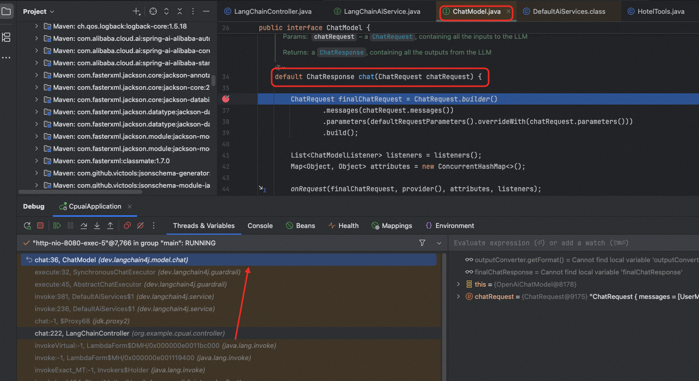
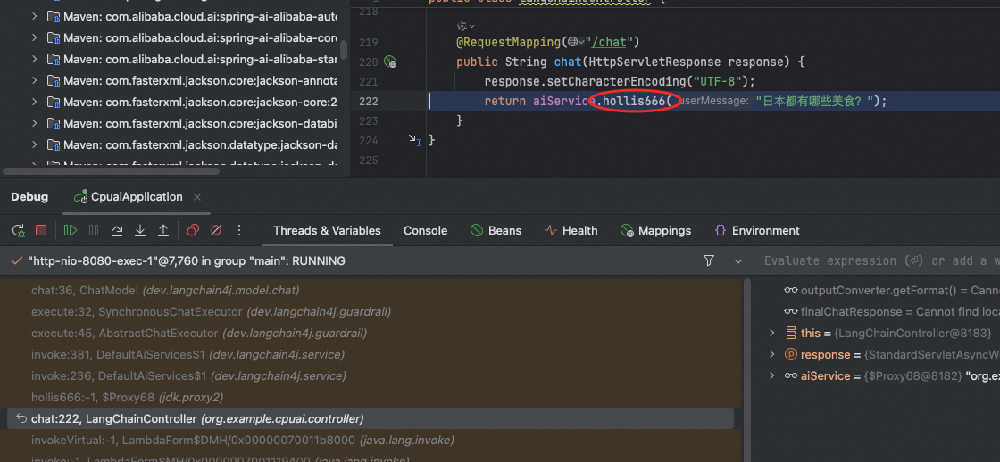
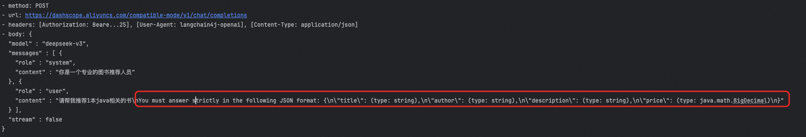
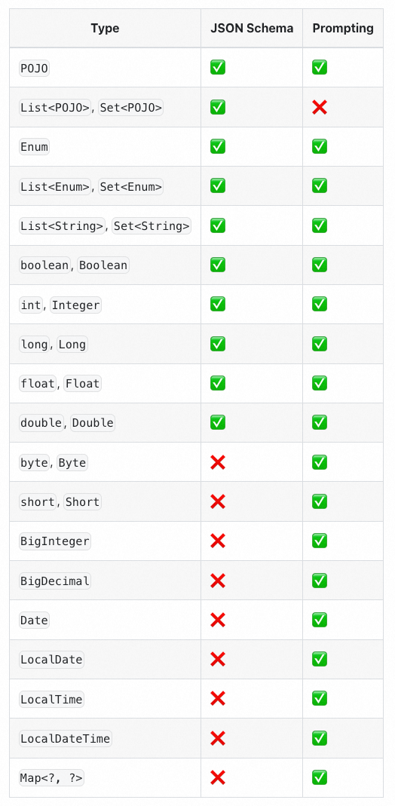
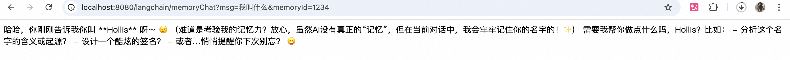

# ✅LangChain4J高层次API使用

LangChain4J为了方便开发者使用，提供了高层次API，但是想要使用的话，需要增加依赖：

```text
<dependency>
    <groupId>dev.langchain4j</groupId>
    <artifactId>langchain4j-spring-boot-starter</artifactId>
    <version>1.8.0-beta15</version>
</dependency>
```

只有加了这个以来，我们才能用到他提供的@AIService这个注解。

LangChain4J的高层次API主要以dev.langchain4j.service.AiServices和dev.langchain4j.service.spring.AiService作为核心的。前面是个接口，后面是个注解。

对话

有了高层次API之后，如果想要实现模型对话的功能就非常简单了。

我们先定义一个接口，并且使用@AIService注解声明他，然后定义一个简单的chat方法，入参出参都是String类型：

```text
@AiService
public interface LangChainAiService {

    String chat(String userMessage);

}
```

这个@AiService会把我们定义的LangChainAiService暴露成一个Spring的Bean。我们在需要和LLM对话的地方调用这个chat方法即可：

```text
@Autowired
private LangChainAiService aiService;

@RequestMapping("/chat")
public String chat(HttpServletResponse response) {
    response.setCharacterEncoding("UTF-8");
    return aiService.chat("日本都有哪些美食？");
}
```

就这么简单！！！！

其实，通过@AiService定义一个bean之后，这里面的chat方法会自动调用dev.langchain4j.model.chat.ChatModel#chat(dev.langchain4j.model.chat.request.ChatRequest)来实现对话。



并且，这里并不要求LangChainAiService中的方法一定也要叫chat，我改成hollis666，他一样可以调用到：



流式输出

如果是流失输出的话，实现起来也简单，只需要把方法的返回值声明称Flux&lt;String&gt;就行了。

```text
@AiService
public interface LangChainAiService {

    String hollis666(String userMessage);

    Flux<String> chatStream(String userMessage);
}
```

但是，这么执行会报错：

```text
dev.langchain4j.service.IllegalConfigurationException: Please import langchain4j-reactor module if you wish to use Flux<String> as a method return type
	at dev.langchain4j.service.IllegalConfigurationException.illegalConfiguration(IllegalConfigurationException.java:14) ~[langchain4j-1.8.0.jar:na]
	at dev.langchain4j.service.output.PojoOutputParser.validateJsonStructure(PojoOutputParser.java:139) ~[langchain4j-1.8.0.jar:na]
	at dev.langchain4j.service.output.PojoOutputParser.formatInstructions(PojoOutputParser.java:57) ~[langchain4j-1.8.0.jar:na]
	at dev.langchain4j.service.output.ServiceOutputParser.outputFormatInstructions(ServiceOutputParser.java:108) ~[langchain4j-1.8.0.jar:na]
	at dev.langchain4j.service.DefaultAiServices$1.appendOutputFormatInstructions(DefaultAiServices.java:502) ~[langchain4j-1.8.0.jar:na]
	at dev.langchain4j.service.DefaultAiServices$1.invoke(DefaultAiServices.java:301) ~[langchain4j-1.8.0.jar:na]
	at dev.langchain4j.service.DefaultAiServices$1.invoke(DefaultAiServices.java:236) ~[langchain4j-1.8.0.jar:na]
	at jdk.proxy2/jdk.proxy2.$Proxy70.chatStream(Unknown Source) ~[na:na]
```

还需要增加对langchain4j-reactor的依赖才能实现流失输出。所以增加依赖：

```text
<dependency>
    <groupId>dev.langchain4j</groupId>
    <artifactId>langchain4j-reactor</artifactId>
    <version>1.8.0-beta15</version>
</dependency>
```

这样，当我们调用chatStream这个方法的时候，就能进行流式输出。

默认参数

可以通过langchain4j提供的一些内置注解，在方法上增加一些默认的信息，比如系统提示词，用户提示词、

用户提示词也可以用模板形式，但是要记得，langchain4j中的模板需要用`{{}}` 来表示变量。

```text
@AiService
public interface LangChainAiService {

    @SystemMessage("你是一个毒舌博主，擅长怼人")
    @UserMessage("针对用户的内容：{{topic}}，先复述一遍他的问题，然后再回答")
    Flux<String> chatStream(String topic);
}
```

当然，提示词模板我们之前还介绍用配置文件的方式，langchain4j也支持：

```text
@UserMessage(fromResource = "your-prompt-template.txt")
String chat(String topic);
```

结构化输出

```text
@UserMessage("请帮我推荐1本java相关的书")
@SystemMessage("你是一个专业的图书推荐人员")
Book getBooks();
```

```text
@RequestMapping("/structure1")
public String structure1(HttpServletResponse response) {
    response.setCharacterEncoding("UTF-8");
    Book books = aiService.getBooks();
    return books.toString();
}
```

Book[title=Effective Java, author=Joshua Bloch, description=A must-read for Java developers, offering best practices and expert advice on how to design robust, efficient, and maintainable code., price=54.99]

提示词方式实现：



但是，提示词方式，不支持List&lt;POJO&gt;



List不支持：https://github.com/langchain4j/langchain4j/issues/3264

对话记忆

我们再来用高层次API来实现一下对话记忆，直接讲那种带对话id，可以做记忆隔离的实现。

首先，我们需要定义一个方法，支持对话记忆：

```text
package org.example.cpuai.service;

import dev.langchain4j.service.MemoryId;
import dev.langchain4j.service.UserMessage;
import dev.langchain4j.service.spring.AiService;

@AiService
public interface LangChainMemoryAiService {

    String chatMemory(@MemoryId String memoryId, @UserMessage String userMessage);
}
```

这里面用到了一个`@MemoryId` 注解，用来标注一个memoryId，我们就是根据这个memoryId的不同来隔离不同的对话记忆的。接着，在我们的controller里面，需要初始化一下LangChainMemoryAiService，注意，这里不能直接autowire，如果想把LangChainMemoryAiService像之前我们定义的AIService一样直接注入的话会报错：`In order to use @MemoryId, please configure the ChatMemoryProvider on the 'org.example.cpuai.service.LangChainAiService'.` 。报错提醒的很清楚，就是如果使用了` @MemoryId`，就需要提供一个`ChatMemoryProvider`，那么如何提供这个`ChatMemoryProvider`呢？

可以用LangChain4J中提供的AiServices这个类：

```text
langChainMemoryAiService = AiServices.builder(LangChainMemoryAiService.class)
                .chatModel(chatModel)
                .streamingChatModel(streamingChatModel)
                .chatMemoryProvider(memoryId -> MessageWindowChatMemory.withMaxMessages(10))
                .build();
```

这里我们就用AiServices来构造了一个LangChainMemoryAiService，并且给他配置了一个MessageWindowChatMemory。

或者直接声明一个ChatMemoryProvider的bean，别的都不用干，正常autowire这个LangChainMemoryAiService我发现也是可以的。

但是需要注意的是，如果想要让记忆持续保存的话，这个langChainMemoryAiService需要用同一个，比如以下这种方式，是我最开始使用的方式，发现怎么搞都无法记忆：

```text
@RequestMapping("/memoryChat")
public String memoryChat(HttpServletResponse response, String msg) {
    response.setCharacterEncoding("UTF-8");
    LangChainMemoryAiService   langChainMemoryAiService = AiServices.builder(LangChainMemoryAiService.class)
            .chatModel(chatModel)
            .streamingChatModel(streamingChatModel)
            .chatMemoryProvider(memoryId -> MessageWindowChatMemory.withMaxMessages(10))
            .build();
    return langChainMemoryAiService.chatMemory("memoryId", msg);
}
```

原因是因为，以上代码，每次memoryChat被访问的时候，都是新建了一个LangChainMemoryAiService，而这里面的chatMemoryProvider也是新的，他们之前就不可能保存之前的记忆了。

所以，想要带有记忆，就需要针对langChainMemoryAiService只初始化一次，比如：

```text
@RestController
@RequestMapping("/langchain")
public class LangChainController implements InitializingBean {

  private LangChainMemoryAiService langChainMemoryAiService;

  @RequestMapping("/memoryChat")
  public String memoryChat(HttpServletResponse response, String msg, String memoryId) {
      response.setCharacterEncoding("UTF-8");
      return langChainMemoryAiService.chatMemory(memoryId, msg);
  }

  @Override
  public void afterPropertiesSet() throws Exception {
      langChainMemoryAiService = AiServices.builder(LangChainMemoryAiService.class)
              .chatModel(chatModel)
              .streamingChatModel(streamingChatModel)
              .chatMemoryProvider(memoryId -> MessageWindowChatMemory.withMaxMessages(10))
              .build();
  }
}
```

这样就可以了，第一次我和他对话"我叫Hollis"，并且指定memoryId为1234


以下是控制台打印出来的日志：

```text
HTTP request:
- method: POST
- url: https://dashscope.aliyuncs.com/compatible-mode/v1/chat/completions
- headers: [Authorization: Beare...25], [User-Agent: langchain4j-openai], [Content-Type: application/json]
- body: {
  "model" : "deepseek-v3",
  "messages" : [ {
    "role" : "user",
    "content" : "我叫Hollis"
  } ],
  "stream" : false
}
```

```text
HTTP response:
- status code: 200
- headers: [vary: Origin,Access-Control-Request-Method,Access-Control-Request-Headers, Accept-Encoding], [x-request-id: f9bd2e05-7de1-40b2-8143-9681bfed3bc6], [x-dashscope-call-gateway: true], [content-type: application/json], [content-length: 639], [req-cost-time: 2399], [req-arrive-time: 1762409853391], [resp-start-time: 1762409855791], [x-envoy-upstream-service-time: 2399], [set-cookie: acw_tc=f9bd2e05-7de1-40b2-8143-9681bfed3bc6cc5102414763b6920e134353257978b0;path=/;HttpOnly;Max-Age=1800], [date: Thu, 06 Nov 2025 06:17:35 GMT], [server: istio-envoy]
- body: {"choices":[{"message":{"content":"你好，Hollis！很高兴认识你～ 😊 你的名字很有英伦风格呢！有什么我可以帮你解答的吗？无论是生活琐事、兴趣爱好，还是学习工作上的问题，都可以随时告诉我哦～ （比如：名字的由来？需要起英文名建议？或者想聊聊其他话题？）","role":"assistant"},"finish_reason":"stop","index":0,"logprobs":null}],"object":"chat.completion","usage":{"prompt_tokens":6,"completion_tokens":64,"total_tokens":70},"created":1762409856,"system_fingerprint":null,"model":"deepseek-v3","id":"chatcmpl-f9bd2e05-7de1-40b2-8143-9681bfed3bc6"}
```

第2次我问他"我叫什么"，并且同样指定memoryId为1234



发送的请求内容为：

```text
HTTP request:
- method: POST
- url: https://dashscope.aliyuncs.com/compatible-mode/v1/chat/completions
- headers: [Authorization: Beare...25], [User-Agent: langchain4j-openai], [Content-Type: application/json]
- body: {
  "model" : "deepseek-v3",
  "messages" : [ {
    "role" : "user",
    "content" : "我叫Hollis"
  }, {
    "role" : "assistant",
    "content" : "你好，Hollis！很高兴认识你～ 😊 你的名字很有英伦风格呢！有什么我可以帮你解答的吗？无论是生活琐事、兴趣爱好，还是学习工作上的问题，都可以随时告诉我哦～ （比如：名字的由来？需要起英文名建议？或者想聊聊其他话题？）"
  }, {
    "role" : "user",
    "content" : "我叫什么"
  } ],
  "stream" : false
}
```

得到的响应为：

```text
HTTP response:
- status code: 200
- headers: [vary: Origin,Access-Control-Request-Method,Access-Control-Request-Headers, Accept-Encoding], [x-request-id: ccb4ece5-a821-49d5-aed4-2b11d748e66c], [x-dashscope-call-gateway: true], [content-type: application/json], [content-length: 725], [req-cost-time: 3844], [req-arrive-time: 1762409868494], [resp-start-time: 1762409872339], [x-envoy-upstream-service-time: 3843], [set-cookie: acw_tc=ccb4ece5-a821-49d5-aed4-2b11d748e66c38aa04a2af51da65fda0f37c8434ec2f;path=/;HttpOnly;Max-Age=1800], [date: Thu, 06 Nov 2025 06:17:52 GMT], [server: istio-envoy]
- body: {"choices":[{"message":{"content":"哈哈，你刚刚告诉我你叫 **Hollis** 呀～ 😉  \n（难道是考验我的记忆力？放心，虽然AI没有真正的“记忆”，但在当前对话中，我会牢牢记住你的名字的！✨）  \n\n需要我帮你做点什么吗，Hollis？比如：  \n- 分析这个名字的含义或起源？  \n- 设计一个酷炫的签名？  \n- 或者…悄悄提醒你下次别忘？ 😄","role":"assistant"},"finish_reason":"stop","index":0,"logprobs":null}],"object":"chat.completion","usage":{"prompt_tokens":75,"completion_tokens":92,"total_tokens":167},"created":1762409872,"system_fingerprint":null,"model":"deepseek-v3","id":"chatcmpl-ccb4ece5-a821-49d5-aed4-2b11d748e66c"}
```

如果我换一个memoryId：


发送的请求：

```text
HTTP request:
- method: POST
- url: https://dashscope.aliyuncs.com/compatible-mode/v1/chat/completions
- headers: [Authorization: Beare...25], [User-Agent: langchain4j-openai], [Content-Type: application/json]
- body: {
  "model" : "deepseek-v3",
  "messages" : [ {
    "role" : "user",
    "content" : "我叫什么"
  } ],
  "stream" : false
}
```

得到的响应：

```text
HTTP response:
- status code: 200
- headers: [vary: Origin,Access-Control-Request-Method,Access-Control-Request-Headers, Accept-Encoding], [x-request-id: e8e7cfcd-d72b-49e6-9bba-9d16ba48dfc1], [x-dashscope-call-gateway: true], [content-type: application/json], [content-length: 657], [req-cost-time: 2746], [req-arrive-time: 1762409890637], [resp-start-time: 1762409893383], [x-envoy-upstream-service-time: 2744], [set-cookie: acw_tc=e8e7cfcd-d72b-49e6-9bba-9d16ba48dfc145930277f0a09705bb02deda343411f8;path=/;HttpOnly;Max-Age=1800], [date: Thu, 06 Nov 2025 06:18:13 GMT], [server: istio-envoy]
- body: {"choices":[{"message":{"content":"你还没有告诉我你的名字呢！😊 你可以告诉我你的名字，我会记住并和你打招呼哦！或者，你可以给自己取个有趣的昵称，比如“小星星”或“冒险家”——由你决定！  \n\n等你告诉我后，我会说：“你好，[你的名字]！今天有什么想聊聊的吗？”✨","role":"assistant"},"finish_reason":"stop","index":0,"logprobs":null}],"object":"chat.completion","usage":{"prompt_tokens":5,"completion_tokens":68,"total_tokens":73},"created":1762409893,"system_fingerprint":null,"model":"deepseek-v3","id":"chatcmpl-e8e7cfcd-d72b-49e6-9bba-9d16ba48dfc1"}
```

通过以上的对话日志我们可以发现，记忆其实是内存维护的，只不过在memoryId相同的情况下，后续的对话中，langchain4j会把之前的对话内容（提问+响应）也加到上下文中一起提交给LLM。

工具调用

之前我们介绍用等层次API做工具调用，大家都发现了，代码很复杂，写起来太麻烦了，而高层次api用起来就很简单了。

只需要用以下方式即可，

```text
@RequestMapping("/toolCalling")
public String toolCalling(HttpServletResponse response, String msg) {
    response.setCharacterEncoding("UTF-8");

    LangChainAiService langChainAiService1 = AiServices.builder(LangChainAiService.class)
            .tools(new TemperatureTools())
            .chatModel(chatModel)
            .build();

    return langChainAiService1.chat("2025年11月11日，杭州的气温怎样？");
}
```

我们还是用了AiServices构造了一个LangChainAiService，并且指定工具列表。然后调用chat进行对话。


可以看到，他自动的调用了我给的工具，就像spring ai一样，不需要再自己写一堆调用的方法了。

看一下控制台里面的输出内容：

```text
HTTP request:
- method: POST
- url: https://dashscope.aliyuncs.com/compatible-mode/v1/chat/completions
- headers: [Authorization: Beare...25], [User-Agent: langchain4j-openai], [Content-Type: application/json]
- body: {
  "model" : "deepseek-v3",
  "messages" : [ {
    "role" : "user",
    "content" : "2025年11月11日，杭州的气温怎样？"
  } ],
  "stream" : false,
  "tools" : [ {
    "type" : "function",
    "function" : {
      "name" : "getTemperatureByCityAndDate",
      "description" : "Get temperature by city and date",
      "parameters" : {
        "type" : "object",
        "properties" : {
          "city" : {
            "type" : "string",
            "description" : "city for get Temperature"
          },
          "date" : {
            "type" : "string",
            "description" : "date for get Temperature"
          }
        },
        "required" : [ "city", "date" ]
      }
    }
  } ]
}

HTTP response:
- status code: 200
- headers: [vary: Origin,Access-Control-Request-Method,Access-Control-Request-Headers, Accept-Encoding], [x-request-id: 840f0f81-88f1-4a26-b5fb-9d12978df8a5], [x-dashscope-call-gateway: true], [content-type: application/json], [content-length: 525], [req-cost-time: 1399], [req-arrive-time: 1762411366526], [resp-start-time: 1762411367925], [x-envoy-upstream-service-time: 1399], [set-cookie: acw_tc=840f0f81-88f1-4a26-b5fb-9d12978df8a598384ade302bd7a45e1a4cd9ea185d63;path=/;HttpOnly;Max-Age=1800], [date: Thu, 06 Nov 2025 06:42:47 GMT], [server: istio-envoy]
- body: {"choices":[{"message":{"content":"","role":"assistant","tool_calls":[{"function":{"arguments":"{\"city\":\"杭州\",\"date\":\"2025-11-11\"}","name":"getTemperatureByCityAndDate"},"id":"call_445b5671278f4be3a6f2d4","index":0,"type":"function"}]},"finish_reason":"tool_calls","index":0,"logprobs":null}],"object":"chat.completion","usage":{"prompt_tokens":184,"completion_tokens":31,"total_tokens":215},"created":1762411368,"system_fingerprint":null,"model":"deepseek-v3","id":"chatcmpl-840f0f81-88f1-4a26-b5fb-9d12978df8a5"}

getTemperatureByCityAndDate invoke...

HTTP request:
- method: POST
- url: https://dashscope.aliyuncs.com/compatible-mode/v1/chat/completions
- headers: [Authorization: Beare...25], [User-Agent: langchain4j-openai], [Content-Type: application/json]
- body: {
  "model" : "deepseek-v3",
  "messages" : [ {
    "role" : "user",
    "content" : "2025年11月11日，杭州的气温怎样？"
  }, {
    "role" : "assistant",
    "tool_calls" : [ {
      "id" : "call_445b5671278f4be3a6f2d4",
      "type" : "function",
      "function" : {
        "name" : "getTemperatureByCityAndDate",
        "arguments" : "{\"city\":\"杭州\",\"date\":\"2025-11-11\"}"
      }
    } ]
  }, {
    "role" : "tool",
    "tool_call_id" : "call_445b5671278f4be3a6f2d4",
    "content" : "23摄氏度"
  } ],
  "stream" : false,
  "tools" : [ {
    "type" : "function",
    "function" : {
      "name" : "getTemperatureByCityAndDate",
      "description" : "Get temperature by city and date",
      "parameters" : {
        "type" : "object",
        "properties" : {
          "city" : {
            "type" : "string",
            "description" : "city for get Temperature"
          },
          "date" : {
            "type" : "string",
            "description" : "date for get Temperature"
          }
        },
        "required" : [ "city", "date" ]
      }
    }
  } ]
}

HTTP response:
- status code: 200
- headers: [vary: Origin,Access-Control-Request-Method,Access-Control-Request-Headers, Accept-Encoding], [x-request-id: a5d6b35f-c4f9-4db7-9253-166d12561f5a], [x-dashscope-call-gateway: true], [content-type: application/json], [content-length: 387], [req-cost-time: 917], [req-arrive-time: 1762411368001], [resp-start-time: 1762411368918], [x-envoy-upstream-service-time: 915], [set-cookie: acw_tc=a5d6b35f-c4f9-4db7-9253-166d12561f5a197bacf997947f8ac99ffd658c735f7c;path=/;HttpOnly;Max-Age=1800], [date: Thu, 06 Nov 2025 06:42:48 GMT], [server: istio-envoy]
- body: {"choices":[{"message":{"content":"2025年11月11日，杭州的气温预计为23摄氏度。","role":"assistant"},"finish_reason":"stop","index":0,"logprobs":null}],"object":"chat.completion","usage":{"prompt_tokens":228,"completion_tokens":16,"total_tokens":244},"created":1762411369,"system_fingerprint":null,"model":"deepseek-v3","id":"chatcmpl-a5d6b35f-c4f9-4db7-9253-166d12561f5a"}
```

可以发现这里面共有2次对话：

- 向LLM发起对话，指定工具
- LLM返回，告知调用哪个工具，参数是什么
- 工具调用
- 向LL发起对话，告知工具返回结果
- LL返回，告知最终结果

以上流程，和我们自己实现的流程是一样的。也就是其实是langchain4j帮我们把这个流程都给封装好了。

**按需加载工具**

有的时候，如果工具太多，一次性给到LLM可能会占用上下文，所以也可以按需加载，以下是langchain4j给出的一个官方示例：

```text
ToolProvider toolProvider = (toolProviderRequest) -> {
    if (toolProviderRequest.userMessage().singleText().contains("booking")) {
        ToolSpecification toolSpecification = ToolSpecification.builder()
            .name("get_booking_details")
            .description("返回预订详情")
            .parameters(JsonObjectSchema.builder()
                .addStringProperty("bookingNumber")
                .build())
            .build();
        return ToolProviderResult.builder()
            .add(toolSpecification, toolExecutor)
            .build();
    } else {
        return null;
    }
};

Assistant assistant = AiServices.builder(Assistant.class)
    .chatLanguageModel(model)
    .toolProvider(toolProvider)
    .build();
```

AiServices支持配置一个toolProvider，这个toolProvider可以定义条件，按照指定条件组装不同的工具。以上就是仅在用户消息包含"booking"一词时添加 `get_booking_details` 工具。

---

来源: https://thoughts.aliyun.com/workspaces/6963289eb0fc2e001bb052eb/docs/6980491474e4030001258dde
