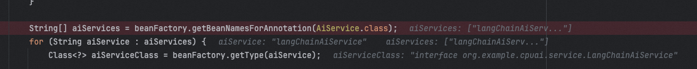
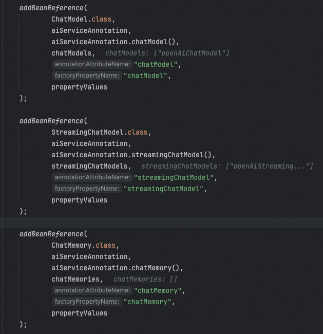
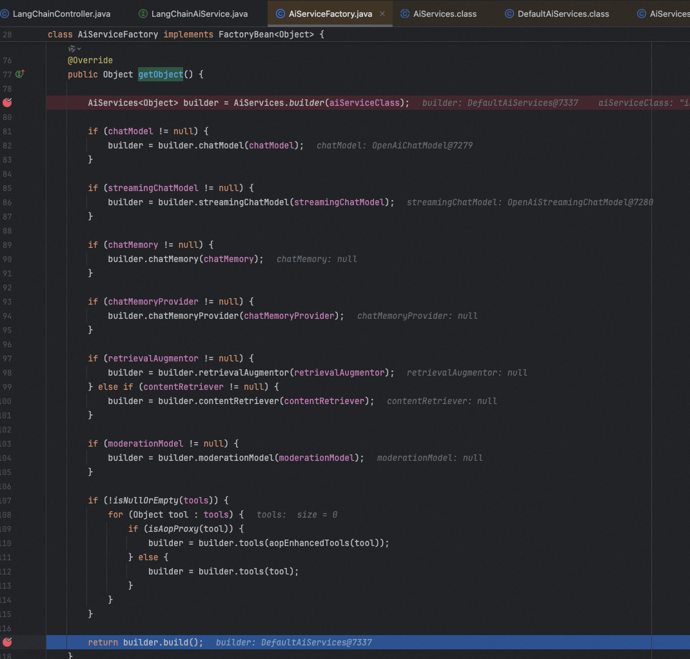
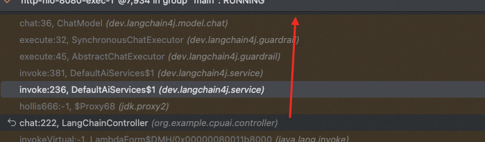
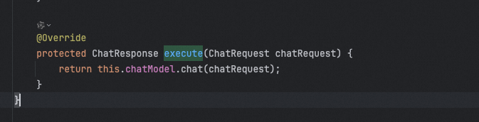
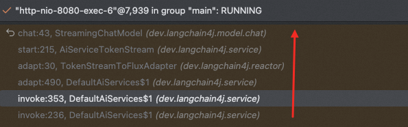
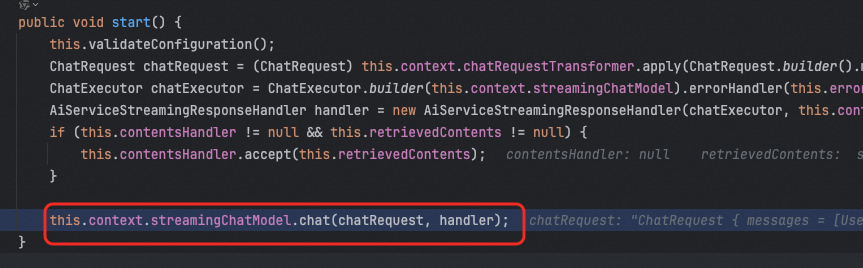

# ✅@AIService实现原理

@AIService处理

当一个接口被@AIService注解标注之后，在应用启动的时候，会在dev.langchain4j.service.spring.AiServicesAutoConfig#aiServicesRegisteringBeanFactoryPostProcessor这个bean的生命过程中被扫到。



对每个标注了 `@AiService` 的接口，**动态替换其 Bean 定义**，使其由 `AiServiceFactory` 创建实例

先是创建BeanDefinition，将Bean的类设置为AiServiceFactory

```text
GenericBeanDefinition aiServiceBeanDefinition = new GenericBeanDefinition();
aiServiceBeanDefinition.setBeanClass(AiServiceFactory.class);
aiServiceBeanDefinition.getConstructorArgumentValues().addGenericArgumentValue(aiServiceClass);
```

再通过一系列`addBeanReference` 方法，为每个 AI 服务配置依赖的组件（如 `ChatModel`, `ChatMemory`）：



再将原始的 `@AiService` 接口的 Bean 定义替换为新的 `AiServiceFactory` 定义：

```text
BeanDefinitionRegistry registry = (BeanDefinitionRegistry) beanFactory;
registry.removeBeanDefinition(aiService);
registry.registerBeanDefinition(lowercaseFirstLetter(aiService), aiServiceBeanDefinition);
```

这样可以确保 Spring 容器在初始化时，使用 `AiServiceFactory` 动态生成所有增加了@AIService注解接口的具体实现。

创建代理对象

接着，在应用中需要用到具体的增加了@AIService注解的服务的bean的时候，如 我们定义的LangChainAiService，他会调用dev.langchain4j.service.spring.AiServiceFactory#getObject方法。

这个方法，会调用dev.langchain4j.service.DefaultAiServices#build来构造一个代理对象。



而这个dev.langchain4j.service.DefaultAiServices#build就很重要了，他主要干了两件事：

1、创建一个代理对象

2、返回这个代理对象

只不过在创建的代理对象时候， 用到了java.lang.reflect.Proxy#newProxyInstance(java.lang.ClassLoader, java.lang.Class&lt;?>[], java.lang.reflect.InvocationHandler)这个方法，这个方法会传入一个InvocationHandler，这玩意会让代理拦截所有方法调用，进入自定义的`invoke`方法。

代理方法调用

接着就到了具体调用的时候了，当我们调用org.example.cpuai.service.LangChainAiService#hollis666这个方法的时候。

代理对象的invoke方法就会被调用，下面是一个调用栈：



简单点说，就是会通过一个ChatExecutor来调用具体的方法。比如我们定义的这个方法，就会调用到dev.langchain4j.guardrail.SynchronousChatExecutor#execute



以上代码熟悉不，这不就是我们的chatModel么。。。所以，他就是通过这种方式，最终还是调用chatModel实现的。

流失输出的实现原理和上面一样的，只不过在java.lang.reflect.InvocationHandler#invoke(java.lang.reflect.Method, java.lang.Object[], dev.langchain4j.invocation.InvocationContext) 方法中，判断了一下返回值类型，如果是流式输出，则走下面的调用链：



最终还是调用的streamingChatModel的chat方法实现的。



---

来源: https://thoughts.aliyun.com/workspaces/6963289eb0fc2e001bb052eb/docs/6980a414d31fed000107cd89
