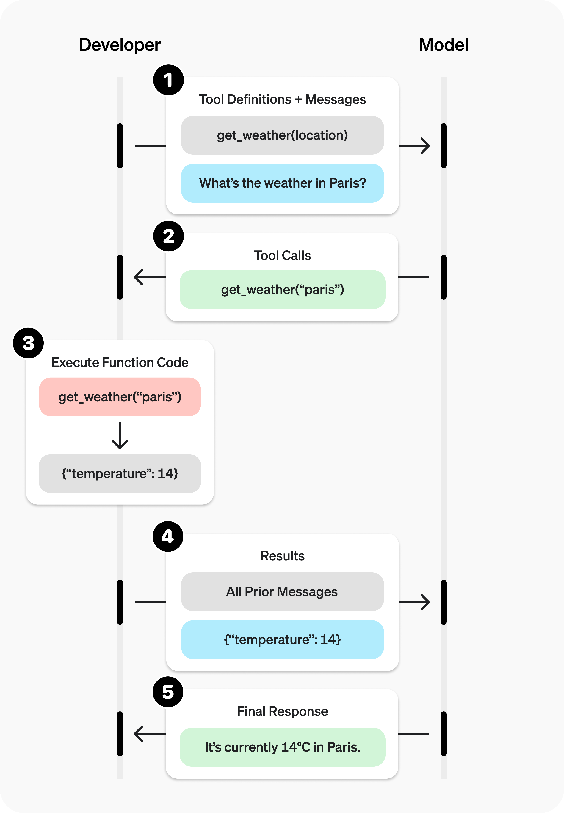
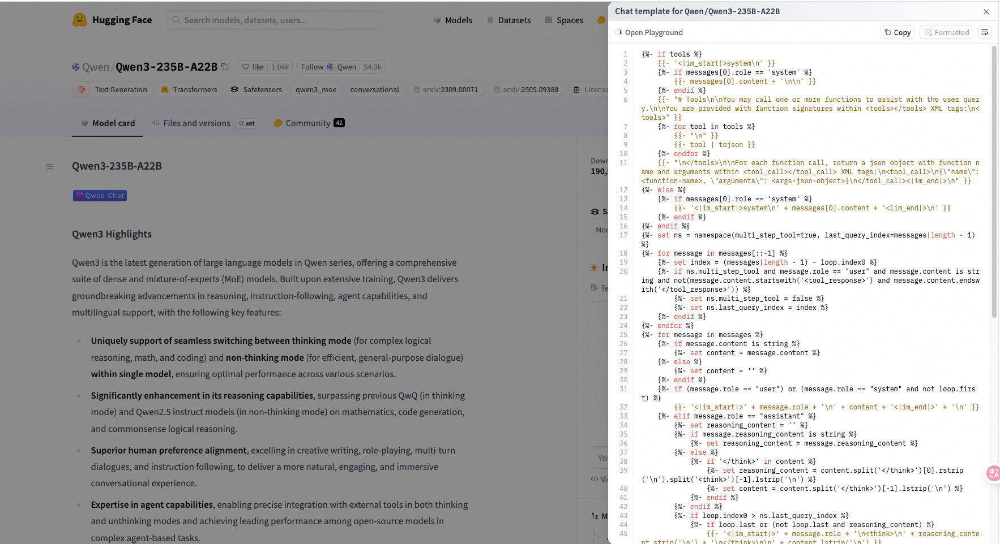
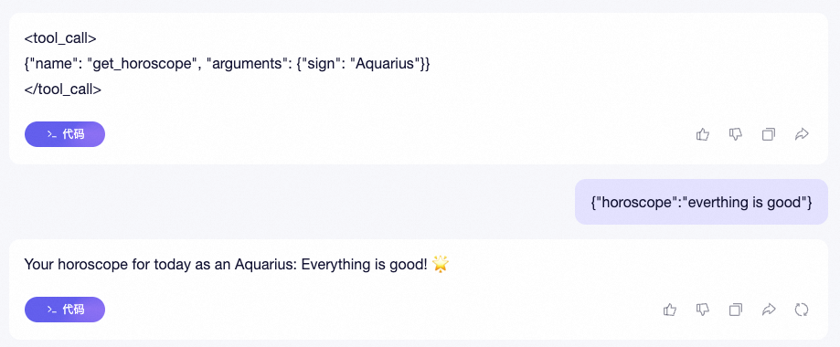

# ✅什么是Function Call?

因为大模型自身存在着局限性，无法获取一些最新的信息，无法获取私域知识等，那么，我们就可以通过function calling（也称为tool calling)的方式使大模型可以和外部交互，从而访问训练数据之外的数据。

比如我问大模型今天的天气如何，模型肯定是没有这部分数据训练过的，根据前面讲过的大模型的原理，他的输出结果一定是错的。而如果我们提供一个函数（工具）给他，那么就可以通过函数（工具）调用的方式获取今天的天气信息。

后面我们的介绍，为了方便，不管是Function，还是Tool，还是说函数，还是工具，都是一回事儿。

但是一定要注意，函数调用听上去好像是模型自己会调用工具，但其实并不是。在Function Calling中，**大模型并不负责函数的调用和执行**，大模型的作用是根据用户的问题，理解用户的需求，然后根据用户需求确定具体需要调用哪个函数以及函数所需要的参数是什么。

function call过程

如下面这张图，其实是OpenAI给出的函数调用的过程，可以看到，最关键的函数的执行调用，其实是靠开发者来进行的，也是需要借助我们的应用，即你的python代码或者java代码。



所以，根据上面的交互图，我们总结下，通过大模型做Function call的过程是：

1. 向模型发送包含其可调用工具的请求
2. 从模型接收一个工具调用结果（包括具体的工具和参数）
3. 在应用端执行代码，使用工具调用的输入
4. 使用工具输出向模型发起第二次请求，带有工具调用结果
5. 接收模型返回的最终响应（或更多工具调用）

函数定义

想要通过模型做Function Call，就需要定义函数（工具），在Open AI的规范中，定义一个函数需要包含以下内容：

|  |  |
| --- | --- |
| 字段 | 描述 |
| `type` | 固定值：<br>`function` |
| `name` | 函数的名称（例如：<br>`get_weather`<br>） |
| `description` | 关于何时以及如何使用该函数的详细信息 |
| `parameters` | 定义函数输入参数的 JSON 模式 |
| `strict` | 是否对函数调用执行严格模式 |

比如官方的例子：

```text
{
    "type": "function",
    "name": "get_weather",
    "description": "Retrieves current weather for the given location.",
    "parameters": {
        "type": "object",
        "properties": {
            "location": {
                "type": "string",
                "description": "City and country e.g. Bogotá, Colombia"
            },
            "units": {
                "type": "string",
                "enum": ["celsius", "fahrenheit"],
                "description": "Units the temperature will be returned in."
            }
        },
        "required": ["location", "units"],
        "additionalProperties": false
    },
    "strict": true
}
```

当在函数定义中设置`strict: true`时，将开启结构化输出功能，可以确保模型为Function Calling生成的参数与在函数定义中提供的JSON Schema完全匹配。（https://openai.com/index/introducing-structured-outputs-in-the-api/ ）

向模型发送请求

有了函数定义之后，就可以向模型发送请求了，我们可以看下开源的qwen是如何做的，如何把工具告知模型的。

在huggingface上的开源模型都能看到chat_template，这里面定义了用户和模型之间的输入输出的模板，如Qwen/Qwen3-235B-A22B （https://huggingface.co/Qwen/Qwen3-235B-A22B?chat_template=default ）



大致能看懂一些，在最开始就会判断是否有工具，如果有工具的话，会组装出一些和工具调用有关的prompt

```text

    {{- '<|im_start|>system\n' }}
    
        {{- messages[0].content + '\n\n' }}
    
    {{- "# Tools\n\nYou may call one or more functions to assist with the user query.\n\nYou are provided with function signatures within <tools></tools> XML tags:\n<tools>" }}
    
        {{- "\n" }}
        {{- tool | tojson }}
    
    {{- "\n</tools>\n\nFor each function call, return a json object with function name and arguments within <tool_call></tool_call> XML tags:\n<tool_call>\n{\"name\": <function-name>, \"arguments\": <args-json-object>}\n</tool_call><|im_end|>\n" }}

    
        {{- '<|im_start|>system\n' + messages[0].content + '<|im_end|>\n' }}
    



    
    
        
        
    


    
        
    
        
    
    
        {{- '<|im_start|>' + message.role + '\n' + content + '<|im_end|>' + '\n' }}
    
        
        
            
        
            
                
                
            
        
        
            
                {{- '<|im_start|>' + message.role + '\n<think>\n' + reasoning_content.strip('\n') + '\n</think>\n\n' + content.lstrip('\n') }}
            
                {{- '<|im_start|>' + message.role + '\n' + content }}
            
        
            {{- '<|im_start|>' + message.role + '\n' + content }}
        
        
            
                
                    {{- '\n' }}
                
                
                    
                
                {{- '<tool_call>\n{"name": "' }}
                {{- tool_call.name }}
                {{- '", "arguments": ' }}
                
                    {{- tool_call.arguments }}
                
                    {{- tool_call.arguments | tojson }}
                
                {{- '}\n</tool_call>' }}
            
        
        {{- '<|im_end|>\n' }}
    
        
            {{- '<|im_start|>user' }}
        
        {{- '\n<tool_response>\n' }}
        {{- content }}
        {{- '\n</tool_response>' }}
        
            {{- '<|im_end|>\n' }}
        
    


    {{- '<|im_start|>assistant\n' }}
    
        {{- '<think>\n\n</think>\n\n' }}
    

```

大致能看懂一些，在最开始就会判断是否有工具，如果有工具的话，会组装出一些和工具调用有关的prompt，

```text
{
  "messages": [
    {
      "role": "system",
      "content": "You are a helpful assistant. "
    },
    {
      "role": "user",
      "content": "What is my horoscope? I am an Aquarius."
    }
  ],
  "tools": [
    {
        "type": "function",
        "name": "get_horoscope",
        "description": "Get today's horoscope for an astrological sign.",
        "parameters": {
            "type": "object",
            "properties": {
                "sign": {
                    "type": "string",
                    "description": "An astrological sign like Taurus or Aquarius",
                },
            },
            "required": ["sign"],
        },
    },
]

}
```

最终大模型得到的提示词就是：

```text
<|im_start|>system
You are a helpful assistant. 

# Tools

You may call one or more functions to assist with the user query.

You are provided with function signatures within <tools></tools> XML tags:
<tools>
{"type": "function", "name": "get_horoscope", "description": "Get today's horoscope for an astrological sign.", "parameters": {"type": "object", "properties": {"sign": {"type": "string", "description": "An astrological sign like Taurus or Aquarius"}}, "required": ["sign"]}}
</tools>

For each function call, return a json object with function name and arguments within <tool_call></tool_call> XML tags:
<tool_call>
{"name": <function-name>, "arguments": <args-json-object>}
</tool_call><|im_end|>
<|im_start|>user
What is my horoscope? I am an Aquarius.<|im_end|>
<|im_start|>assistant
```

这里面的&lt;|im_start|>、&lt;|im_end|> 叫做special tokens，可以理解为一线特殊标记，方便模型区分段落。

把这段话直接贴给大模型，得到内容：



第一次返回就是一个function call的结果，他告诉我们要调用哪个函数，以及参数信息。然后我给出工具调用结果后，他在组装到之前的任务中，告诉我星座运势是Everything is good!

---

来源: https://thoughts.aliyun.com/workspaces/6963289eb0fc2e001bb052eb/docs/6976d3dea7c8ff0001465e52
