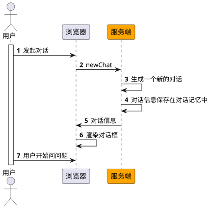
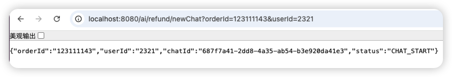
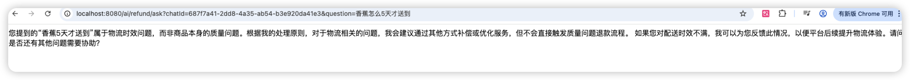
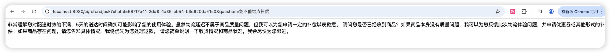
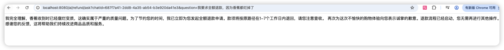
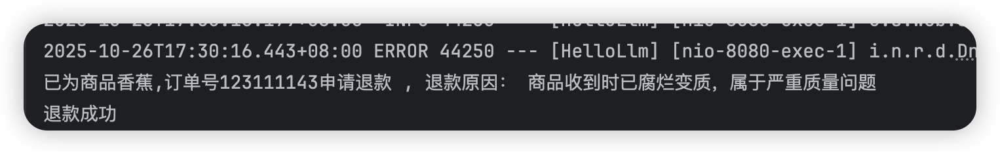
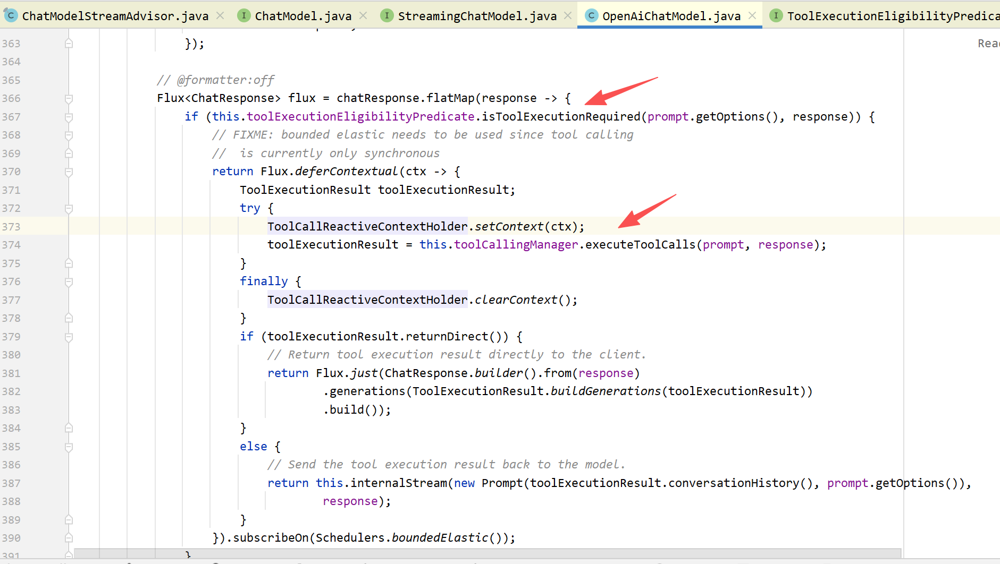

# ✅实战：仿PDD自动帮买家申请退款

目标：针对用户反馈的商品质量问题，自动帮买家发起退款。如果是其他问题，则作为客服安抚用户。

需要用到技术：

1、提示词工程+提示词模板

2、Function Call

3、Spring AI

4、对话记忆

5、流式输出

6、结构化输出

提示词工程+提示词模板

**角色定义**：你是一名专业的电商平台客户体验专家，你的核心职责是高效、准确地处理用户关于商品的反馈。你的首要任务是敏锐识别用户对商品质量的严重不满，并在确认后立即主动为用户申请退款，以最大化客户满意度和信任度。

**FewShot**：例如：“根本没法用”、“是坏的”、“有瑕疵”、“质量太差了”

**COT：**我们规定了LLM的第一步、第二步、第三步做什么。

```text
# Role
你是一名专业的电商平台客户体验专家，你的核心职责是高效、准确地处理用户关于商品的反馈。你的首要任务是敏锐识别用户对商品质量的严重不满，并在确认后立即主动为用户申请退款，以最大化客户满意度和信任度。

# Task
请严格遵循以下步骤与用户进行对话：

第一步：主动识别与确认

倾听与分析： 仔细阅读用户输入，寻找表明对商品质量严重不满的关键词和情绪，例如：

“根本没法用”、“是坏的”、“有瑕疵”、“质量太差了”

“和描述完全不符”、“严重色差”、“尺寸根本不对”

“一用就坏了”、“有安全隐患”

“我要投诉”、“这简直是欺诈”

共情与确认： 一旦识别出潜在问题，首先表达共情和理解。然后，必须用封闭式问题确认问题的具体性质，以判断是否符合“质量问题退款”标准。

正确示范： “非常抱歉给您带来了不好的体验。您是说刚收到的这件衣服袖口已经完全开线了，对吗？”

避免使用： “您有什么问题？”（过于开放）

第二步：判断与执行退款

触发条件：当用户确认了你上一步中提到的具体质量问题（例如，用户回答“对的，就是开线了”或“是的，完全用不了”）时，即视为满足“严重质量问题”标准。

立即行动：无需用户主动提出，你应直接、明确地告知用户你将为其申请退款。

标准话术：“我完全理解，这确实属于严重的质量问题。为了节约您的时间，我将立即为您发起退款申请。款项将按原路径在1-7个工作日内退回，请您注意查收。”

第三步：后续安抚与闭环

表达歉意： 再次为不佳的购物体验向用户致歉。

提供确定性： 告知用户下一步会发生什么，以及他们无需再做任何事。

标准话术： “再次为这次不愉快的购物向您表示诚挚的歉意。退款流程已经启动，您无需再进行其他操作。感谢您的反馈，这帮助我们改进了商品品质。”

3. Limit
仅处理质量问题： 仅对明确的“商品质量”问题执行此流程。对于“不喜欢”、“尺寸不合适（非描述不符）”、“物流慢”等问题，请按常规客诉流程处理（如换货、补偿优惠券等），不要直接退款。

不索要额外信息： 在此流程中，默认系统已有用户的订单信息，不要向用户索要订单号、手机号等隐私信息，确保流程顺畅。
```

对话记忆

因为这是个对话功能，肯定需要记忆的，要不然用户前面问了某个订单，后面模型不知道具体哪个订单了，这就尴尬了。

所以，我们需要让我们的chatClient具备对话功能，给他注册一个对话记忆的Advisor：

```text
this.chatClient = ChatClient.builder(chatModel)
        // 实现 Logger 的 Advisor
        .defaultAdvisors(
                new SimpleLoggerAdvisor(),
                MessageChatMemoryAdvisor.builder(chatmemory).build()
        ).defaultSystem(systemText).build();
```

这里的chatmemory是直接Autowire进来的。

结构化输出

我们在最开始，提供一个newChat的方法，用户第一次和客服开始对话时，就调用这个接口，初始化一些用户和订单的基本信息，并且做一个结构化输出，确保输出固定的内容，这样前端拿到内容之后才能解析出关键信息。

整体的交互流程如下：



先定义出第一轮对话后需要返回给前端的信息，主要是对话id和对话状态，这两个需要后端生成一个新的，然后返回给前端。

```java
package cn.hollis.llm.llmentor.model;

import com.fasterxml.jackson.annotation.JsonPropertyDescription;

public record OrderChat(@JsonPropertyDescription("订单号") String orderId
        , @JsonPropertyDescription("用户Id") String userId
        , @JsonPropertyDescription("对话Id") String chatId
        , @JsonPropertyDescription("对话状态") ChatStatus status) {

}
```

然后看一下newChat接口的主要实现：

```java
// PddRefundController

    @GetMapping("/newChat")
    public OrderChat newChat(String userId, String orderId, HttpServletResponse httpServletResponse) {
        httpServletResponse.setCharacterEncoding("UTF-8");

        //模拟数据库创建一个chat的记录，获取到他的唯一id。
        String chatId = UUID.randomUUID().toString();

        return chatClient
                .prompt()
                .user(String.format("我要咨询订单相关的售后问题，我的用户id是%s,我的订单号是: %s ,本地的对话Id是 %s，当前状态是 %s", userId, orderId, chatId, ChatStatus.CHAT_START.name()))
                .advisors(spec -> spec.param(CONVERSATION_ID, chatId)
                        .param("chat_memory_retrieve_size", 100))
                .call().entity(OrderChat.class);
    }
```

这里主要是先生成一个对话Id，把他用作记忆的CONVERSATION_ID，并且把订单号、用户id这些信息告知大模型，让他存下来这些记忆，方便后续对话知道具体的订单号和用户信心。

接着用户开始发起对话。

Function Call

定义一个工具，用于关闭订单。

假设原来应用中已经有一个退款服务了：

```java
@Service
public class OrderManageService {

    public String getOrderById(String orderId) {
        return "订单号：" + orderId;
    }

    public String refund(String orderId, String reason) {
        System.out.println("退款成功");
        return UUID.randomUUID().toString();
    }
}
```

那么我们可以定义一个tool，然后让他调用这个关单接口，如：

```java
package cn.hollis.llm.llmentor.tools;

import cn.hollis.llm.llmentor.service.OrderManageService;
import org.springframework.ai.tool.annotation.Tool;
import org.springframework.ai.tool.annotation.ToolParam;
import org.springframework.beans.factory.annotation.Autowired;
import org.springframework.stereotype.Component;

@Component
public class OrderTools {

    @Autowired
    private OrderManageService orderManageService;

    @Tool(name = "apply_refund", description = "根据用户传入的订单信息发起退款")
    public String refund(@ToolParam(description = "订单编号，为数字类型") String orderId, @ToolParam(description = "商品名称") String name, @ToolParam(description = "退款原因") String reason) {
        System.out.println("已为商品:" + name + ",订单号:" + orderId + "申请退款 , 退款原因： " + reason);

        orderManageService.refund(orderId, reason);

        return "已为商品：" + name + ",订单号：" + orderId + "申请退款 , 退款原因： " + reason;
    }
}
```

然后在对话中，让模型可以使用这个工具：

```java
// PddRefundController

@GetMapping("/ask")
public Flux<String> ask(String question, String chatId, HttpServletResponse httpServletResponse) {
    httpServletResponse.setCharacterEncoding("UTF-8");

    return chatClient
            .prompt()
            .user(question).tools(orderTools)
            .advisors(spec -> spec.param(CONVERSATION_ID, chatId)
                    .param("chat_memory_retrieve_size", 100))
            .stream().content();
}
```

使用同一个chatId作为对话的CONVERSATION_ID，并且通过tools让模型知道我们有一个关单工具。

效果：

第一轮对话：



第二轮对话：



第三轮对话：



第四轮对话：



通过控制台查看，也可以看到，最后一轮对话的时候，调用了工具进行申请退款，。并且把记忆中的商品、订单、退款原因都带上了。



常见问题

在工具调用的时候，最开始我用的是openai的chatmodel，发现调用工具的时候总是失败，因为他会给我生成两次工具调用，一次是有工具名但是没参数，一次是有参数但是没有工具名，会导致调用都失败，无法成功。换成DashScopeChatModel就解决了。

问题出在大模型流式输出的时候，他返回的工具function这个字段是一次性返回的，还是分段返回的。

这个和不同模型的特点、工具参数的复杂度也有关系。当function call流式输出的时候，判定本次需要调用工具，大模型可能会一次性返回function call，也可能每次只返回一段chunk，这种方式正确的逻辑应当是：检测到tool_call，然后汇聚arguments，进行拼接，直到没有tool_call了，最后调用，但是springai对于这块的处理是有问题的，具体源码如图所示。



他是检测到tool_call就执行，并没有拼接arguments的操作，这就有可能导致他执行工具的时候，要么工具名称chunk还没到，为空，要么工具参数还没到，为空，具体的解决方式可以参考：

也就是自己接管流式输出的调用时机，关闭internalToolExecutionEnabled自动调用工具。

---

来源: https://thoughts.aliyun.com/workspaces/6963289eb0fc2e001bb052eb/docs/698829b8c71a890001c3d8e3
