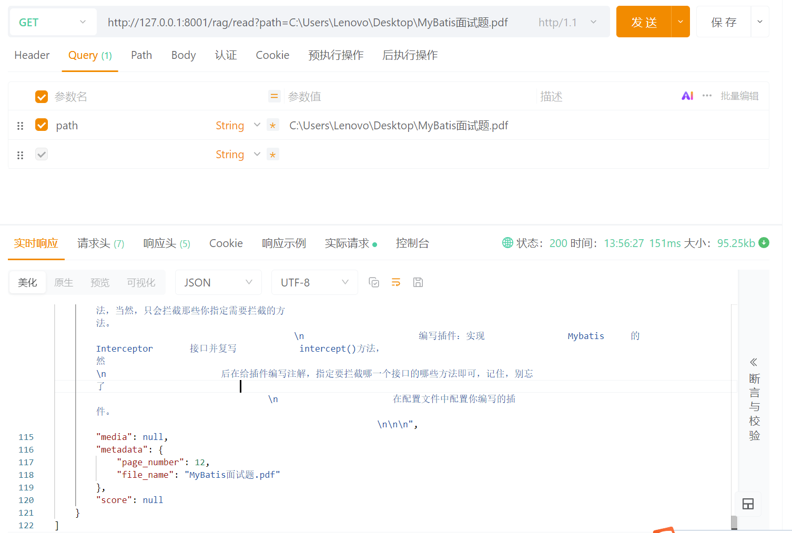
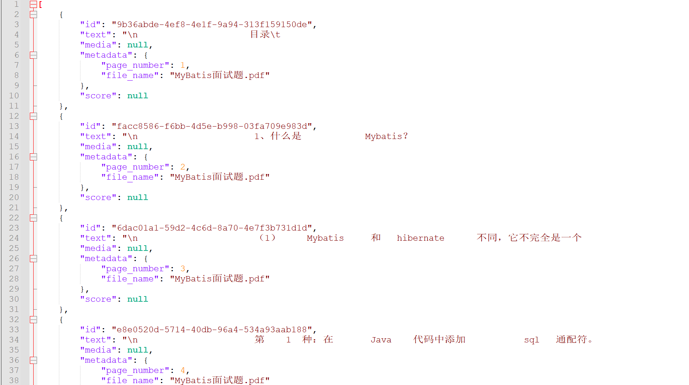
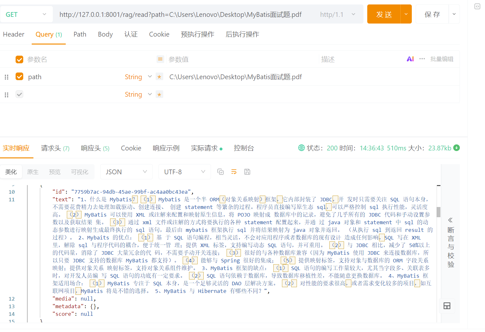
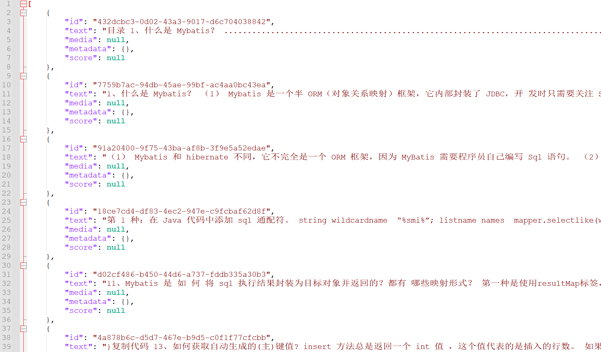

# ✅文档预处理

文档预处理指的是将原始文档进行加载、解析，并转换为能够统一处理的标准化格式。

在这一步中，我们首先要将文档按照不同的类型**加载**，并转换成统一格式**document**，然后还需要去除文档中存在的大量无效内容，比如**多余的空格、换行符、无意义的特殊符号、重复的内容**等；最后还可能需要规范化文本格式，例如统一编码格式、统一大小写等。

**文档预处理的目标，是让后续的“分片”和“向量化”能够在干净的数据上进行，从源头上保证知识库索引的质量。**

文档预处理是构建高质量知识库的基础，它主要包含两个关键步骤：**文档读取**和**数据清洗**。

**下面的代码基于SpringAI 1.1.0 版本。**

文档读取

本文测试用到的文档：

[https://nfturbo-file.oss-cn-hangzhou.aliyuncs.com/llm/RAG%E6%9D%90%E6%96%99.zip](https://nfturbo-file.oss-cn-hangzhou.aliyuncs.com/llm/RAG%E6%9D%90%E6%96%99.zip)

文档读取是将原始文档加载、解析，并转换为统一的结构化格式。在这一阶段，我们需要根据文档类型选择合适的解析工具，将不同格式的文~~档~~类型（如 TXT、PDF、Word、HTML、Markdown 等等）统一处理为可供后续处理的标准化格式。**SpringAI 已经为我们提供了大量的读取器，拿来即用。这些读取器都来自——****DocumentReader**

在 Spring AI中，**DocumentReader** 是一个用于从各种格式的文档中提取文本内容并将其转换为 `Document` 对象的核心组件。这些 `Document` 对象随后可以被用于向量嵌入（embedding）、语义搜索、RAG（Retrieval-Augmented Generation）等 AI 应用场景。他的主要作用：

- **统一读取接口**：提供标准化方式从不同来源（如 PDF、Word、TXT、HTML、Markdown 等）加载原始文本。
- **结构化输出**：将原始内容封装为 `org.springframework.ai.document.Document` 对象，包含：
- `content`：文档的文本内容
- `metadata`：元数据（如文件名、页码、来源 URL、创建时间等）
- **支持扩展**：开发者可自定义实现特定格式的解析器。

目前主要的实现可以通过这个接口有哪些实现来看（[https://docs.spring.io/spring-ai/docs/current/api/org/springframework/ai/document/class-use/DocumentReader.html](https://docs.spring.io/spring-ai/docs/current/api/org/springframework/ai/document/class-use/DocumentReader.html) ）：

不管是哪种服务器，只需要创建出来之后，调用read/get方法，就能得到一个Document的List。其实就是针对文档被加载后的对象。接着就可以基于这些Document做处理了。

策略接口

由于我们的文档格式是多变的，直接针对每种格式写单独的读取逻辑会有大量if-else的代码，导致代码重复、维护困难，同时也不利于扩展。为了解决这种问题，我们可以定义一个**策略接口**，用于动态路由到具体的文档读取器来解析各自的文档类型。

```text
public interface DocumentReaderStrategy {
    /**
     * 判断是否支持该文件
     */
    boolean supports(File file);

    /**
     * 读取文件并返回 Document 列表
     */
    List<Document> read(File file) throws IOException;
}
```

文本读取器

直接读取文件内容，无需额外解析，适合简单文本，如txt文件。springai-commons包自带解析器。

```text
@Component
public class TextReaderStrategy implements DocumentReaderStrategy {

    @Override
    public boolean supports(File file) {
        String name = file.getName().toLowerCase();
        return name.endsWith(".txt") || name.endsWith(".tex") || name.endsWith(".text");
    }

    @Override
    public List<Document> read(File file) throws IOException {
        Resource resource = new FileSystemResource(file);
        return new TextReader(resource).get();
    }
}
```

PDF读取器

专业的PDF文件解析器，支持按页提取文本，可删除页眉、页脚，支持分页生成多个 Document。

```text
<dependency>
  <groupId>org.springframework.ai</groupId>
  <artifactId>spring-ai-pdf-document-reader</artifactId>
  <version>1.1.0</version>

</dependency>
```

这个包里面提供了两个reader：ParagraphPdfDocumentReader、PagePdfDocumentReader

他俩的区别是，`PagePdfDocumentReader` 是“按页切分”，而 `ParagraphPdfDocumentReader` 是“按语义段落切分”。

在 rag 中，如果你需要实现 PDF 读取策略，通常建议：

建议优先考虑使用ParagraphPdfDocumentReader，因为它能够更好地保留信息的完整性。段落通常是一个完整的意思表达，这对于 LLM 理解上下文非常有帮助。但是他非常依赖PDF 本身的质量。如果 PDF 是扫描件或者没有良好的内部结构标记，它的效果可能不理想甚至回退到按行读取。

```text
@Component
public class PdfReaderStrategy implements DocumentReaderStrategy {

    @Override
    public boolean supports(File file) {
        return file.getName().toLowerCase().endsWith(".pdf");
    }

    @Override
    public List<Document> read(File file) throws IOException {
        // 读取配置
        PdfDocumentReaderConfig config = PdfDocumentReaderConfig.builder()
                .withPageTopMargin(50)         // 忽略顶部50个单位的页眉
                .withPageBottomMargin(50)      // 忽略底部50个单位的页脚
                .withPagesPerDocument(1)       // 每一页作为一个 Document
                .withPageExtractedTextFormatter(new ExtractedTextFormatter.Builder()
                        .withNumberOfTopTextLinesToDelete(0) // 每页再额外删掉前0行
                        .build())
                .build();

        Resource resource = new FileSystemResource(file);
        return new PagePdfDocumentReader(resource, config).get();
    }
}
```

HTML读取器

基于Jsoup HTML解析器，可以使用selector选择器指定提取网页标签内容。

```text
<dependency>
  <groupId>org.springframework.ai</groupId>
  <artifactId>spring-ai-jsoup-document-reader</artifactId>
 <version>1.1.0</version>

</dependency>
```

```text
@Component
public class HtmlReaderStrategy implements DocumentReaderStrategy {

    @Override
    public boolean supports(File file) {
        String name = file.getName().toLowerCase();
        return name.endsWith(".html") || name.endsWith(".htm");
    }

    @Override
    public List<Document> read(File file) throws IOException {
        // 读取配置
        JsoupDocumentReaderConfig config = JsoupDocumentReaderConfig.builder()
                // 只提取p标签段落
                .selector("p")
                // 文件编码
                .charset("UTF-8")
                // 包含超链接
                .includeLinkUrls(true)
                // 提取meta标签的元数据
                .metadataTags(List.of("author", "date"))
                // 添加自定义元数据
                .additionalMetadata("filename", file.getName())
                .build();
        Resource resource = new FileSystemResource(file);
        return new JsoupDocumentReader(resource, config).get();
    }
}
```

Markdown读取器

支持按标题或水平分割线分片，可以选择性的包含代码块或引用内容。

```text
<dependency>
  <groupId>org.springframework.ai</groupId>
  <artifactId>spring-ai-markdown-document-reader</artifactId>
  <version>1.1.0</version>

</dependency>
```

```text
@Component
public class MarkdownReaderStrategy implements DocumentReaderStrategy {

    @Override
    public boolean supports(File file) {
        String name = file.getName().toLowerCase();
        return name.endsWith(".md");
    }

    @Override
    public List<Document> read(File file) throws IOException {
        // 读取配置
        MarkdownDocumentReaderConfig config = MarkdownDocumentReaderConfig.builder()
                // 水平线分割生成新文档
                .withHorizontalRuleCreateDocument(true)
                // 不包含代码块
                .withIncludeCodeBlock(false)
                // 不包含引用
                .withIncludeBlockquote(false)
                // 添加文件名元数据
                .withAdditionalMetadata("filename", file.getName())
                .build();
        Resource resource = new FileSystemResource(file);
        return new MarkdownDocumentReader(resource, config).get();
    }
}
```

JSON读取器

可处理JSON数组或对象，但不支持JSON嵌套字段，比较适合简单的JSON文件，如果文件本身比较复杂还是建议使用jackson、fastjson等专业的json工具来手动处理。

```text
@Component
public class JsonReaderStrategy implements DocumentReaderStrategy {

    public boolean supports(File file) {
        String name = file.getName().toLowerCase();
        return name.endsWith(".json");
    }

    @Override
    public List<Document> read(File file) throws IOException {
        Resource resource = new FileSystemResource(file);
        // 假设目标提取json的两个字段description和content
        JsonReader jsonReader = new JsonReader(resource, "description", "content");
        return jsonReader.get();
    }
}
```

通用Tika读取器

一种通用文件处理器，可以处理大部分常见文档格式，如word、pdf、ppt等等，可以自动识别文档类型并提取文本和元数据。

```text
<dependency>
  <groupId>org.springframework.ai</groupId>
  <artifactId>spring-ai-tika-document-reader</artifactId>
  <version>1.1.0</version>

</dependency>
```

```text
@Component
public class TikaReaderStrategy implements DocumentReaderStrategy {

    @Override
    public boolean supports(File file) {
        String name = file.getName().toLowerCase();
        return name.endsWith(".doc") || name.endsWith(".docx");
    }

    @Override
    public List<Document> read(File file) throws IOException {
        Resource resource = new FileSystemResource(file);
        return new TikaDocumentReader(resource).get();
    }
}
```

策略选择器

```text
@Service
public class DocumentReaderStrategySelector {

    private final List<DocumentReaderStrategy> strategies;

    public DocumentReaderStrategySelector(List<DocumentReaderStrategy> strategies) {
        this.strategies = strategies;
    }

    public List<Document> read(File file) throws IOException {
        for (DocumentReaderStrategy strategy : strategies) {
            if (strategy.supports(file)) {
                return strategy.read(file);
            }
        }
        throw new IllegalArgumentException("不支持的文件类型: " + file.getName());
    }
}
```

测试接口

```text
@RestController
@RequestMapping("/rag")
public class RagController {

    private final DocumentReaderStrategySelector selector;

    @Autowired
    public RagController(DocumentReaderStrategySelector selector) {
        this.selector = selector;
    }

    /**
     * 读取文件
     */
    @GetMapping("/read")
    public List<Document> readDocument(@RequestParam("path") String path) {
        File file = new File(path);
        if (!file.exists() || !file.isFile()) {
            throw new IllegalArgumentException("文件不存在或不是有效文件: " + path);
        }
        try {
            return selector.read(file);
        } catch (IOException e) {
            throw new RuntimeException("读取文件失败: " + e.getMessage(), e);
        }
    }
}
```

**调用示例**

以一篇PDF文档为例，可以看到已经成功将文档解析了出来，包含了文档的内容和元数据。

根据**选择器的路由**，此PDF文档被交给了PDF读取器进行处理，我们之前在PDF读取器中设置了**withPagesPerDocument**参数，所以生成的结果是每页一个document。



数据清洗

在前面的步骤中，我们已成功实现文档读取功能。然而，读取结果往往包含大量无效干扰字符**（下图就是调用示例的响应结果）**，因此需要进行数据清洗。数据清洗是对文本内容进行整理和优化的过程，包括去除多余空格、换行符、无意义的特殊符号和重复内容等。通过清洗，后续的文档分片和向量化操作可以在干净、一致的数据上进行，从源头提升知识库的质量与检索效果。



document清洗

这边列举了几种常见的清洗手段，实际上你可以根据自己的文档数据、业务需求，定制化的开发清洗策略。

```text
@GetMapping("/read")
public List<Document> readDocument(@RequestParam("path") String path) {
    File file = new File(path);
    if (!file.exists() || !file.isFile()) {
        throw new IllegalArgumentException("文件不存在或不是有效文件: " + path);
    }
    try {

        List<Document> documents = selector.read(file);
        
        return cleanDocuments(documents);
    
    } catch (IOException e) {
        throw new RuntimeException("读取文件失败: " + e.getMessage(), e);
    }
}

/**
 * 文本清洗
 */
public List<Document> cleanDocuments(List<Document> documents) {
    if (CollectionUtils.isEmpty(documents)) {
        return documents;
    }

    return documents.stream()
    .map(doc -> {
        if (doc == null || doc.getText() == null) {
            return doc;
        }

        String text = doc.getText();

        // 1. 去掉多余空白字符（空格、制表符、换行等）
        text = text.replaceAll("\\s+", " ").trim();

        // 2. 去掉无意义的乱码或特殊符号
        text = text.replaceAll("[^\\p{L}\\p{N}\\p{P}\\p{Z}\\n]", "");

        // 3. 可选：统一大小写
        // text = text.toLowerCase();

        // 4. 按换行拆分段落，去除重复段落
        String[] paragraphs = text.split("\\n+");
        Set<String> seen = new LinkedHashSet<>();
        for (String para : paragraphs) {
            String trimmed = para.trim();
            if (!trimmed.isEmpty()) {
                seen.add(trimmed);
            }
        }

        text = String.join("\n", seen);

        return new Document(text);
    })
    .collect(Collectors.toList());
}
```

调用示例





通过文本清洗，原始数据中的噪声、冗余和格式不一致问题得到了有效处理，文本内容变得更加规范、整洁。为后续的文档分片、向量化以及检索生成等环节提供了更高质量的基础支撑。

---

来源: https://thoughts.aliyun.com/workspaces/6963289eb0fc2e001bb052eb/docs/697217d551b1440001221c39
