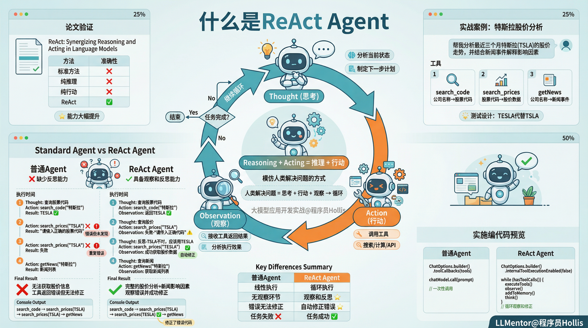
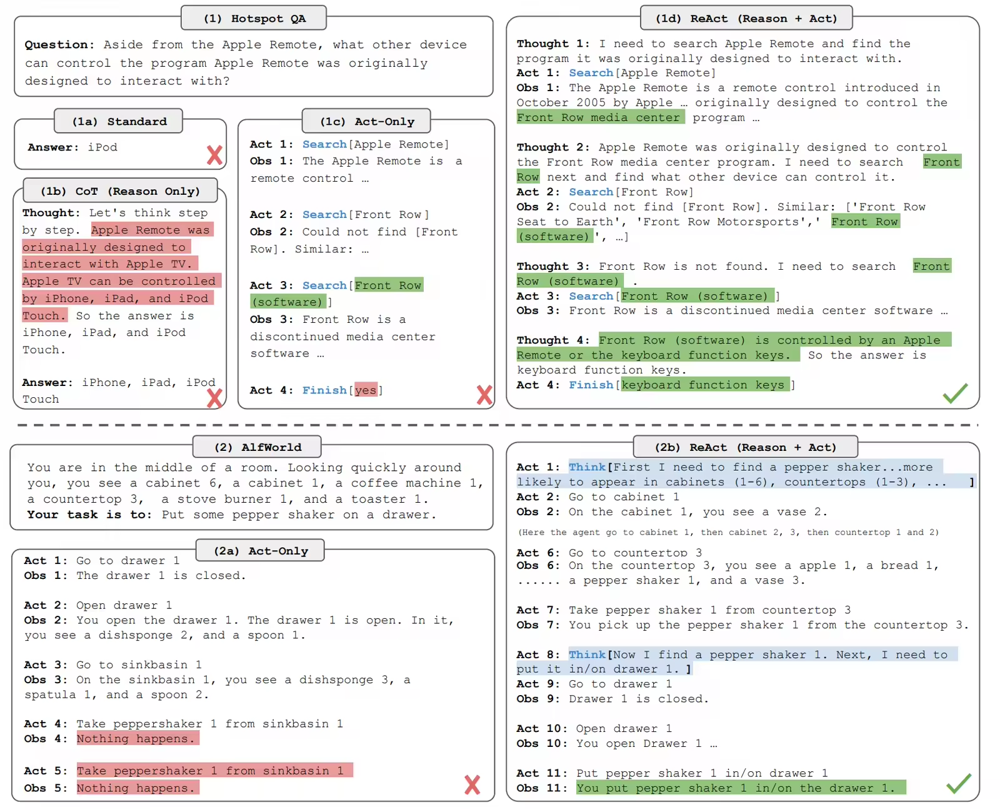
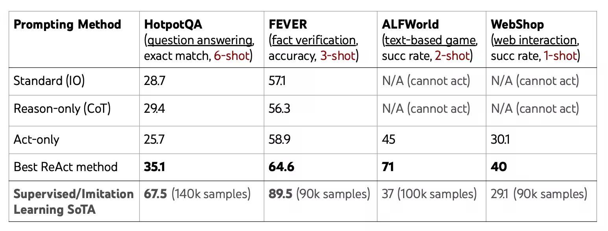
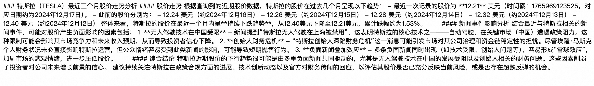

# ✅Agent常用架构：ReAct Agent



在前面介绍提示词工程的时候，我们提到过ReAct这种模式，目的是让 LLM 同时具备推理（Reasoning）与行动（Acting）能力，从而更可靠地解决复杂任务。

而我们在开发Agent的时候，通常也会用到这种模式，使用这种模式开发出来的Agent叫做ReAct Agent

**人类解决问题 = 思考 + 行动 + 观察 → 再思考 → 再行动……**

ReAct Agent也模仿这一过程，让 LLM 在每一步交替输出：

- **Thought（思考）**：分析当前状态、制定下一步计划
- **Action（行动）**：调用工具（如搜索、计算、API）
- **Observation（观察）**：接收工具返回的结果

针对用户的提问，LLM会先进行思考（**Thought）**，指定行动计划，行动计划中包括使用哪些工具，接着进行工具执行（**Action）**，在工具执行之后，观察（**Observation）**工具执行的结果，基于结果继续思考后续的行动计划。如果需要执行工具就继续执行，直到LLM认为所有行动都做完了为止。

我们假设想要通过AI实现这样的功能：帮我分析最近三个月特斯拉（TSLA）的股价走势，并结合新闻事件解释可能的影响因素。

效果

在 React（Reasoning + Acting）Agent 的原始论文《ReAct: Synergizing Reasoning and Acting in Language Models》 https://arxiv.org/abs/2210.03629

作者通过两个主要任务**示例来展示 ReAct 框架的有**效性。这两个例子分别是：



分别用不同的Agent 框架回答，得到的答案差别很大，标准方法、纯推理、纯行动都给出了错误答案，只有ReAct给出了正确答案。

并且也有实验证明，使用ReAct之后，在解决问题上能力大大提升



我们试着实现一个普通的Agent：

```text
@Autowired
private ChatMemory chatMemory;

@Autowired
private ChatModel chatModel;

@Autowired
ToolCallingManager toolCallingManager;


@GetMapping("/chat0")
public String chat0
(String conversationId) {
    //定义ChatOptions
    ChatOptions chatOptions = ToolCallingChatOptions.builder()
                //指定工具
                .toolCallbacks(ToolCallbacks.from(new StockTools()))
                .model("deepseek-v3")
                .build();


    //定义提示词，要求按照React架构运行
    Prompt prompt = new Prompt(
            List.of(new SystemMessage("你是一个智能助手，你擅长使用工具帮我解决问题。" +
                    "约束：时间通过工具获取，不要捏造"), new UserMessage("帮我分析最近三个月特斯拉（TSLA）的股价走势，并结合新闻事件解释可能的影响因素。")),
            chatOptions);

    //添加提示词到记忆
    chatMemory.add(conversationId, prompt.getInstructions());

    Prompt promptWithMemory = new Prompt(chatMemory.get(conversationId), chatOptions);

    //调用模型
    ChatResponse chatResponse = chatModel.call(promptWithMemory);

    return chatResponse.getResult().getOutput().getText();
}
```

为了让能够具备agent的能力，我们给他提供了工具以及记忆的能力：

```text
//定义ChatOptions
ChatOptions chatOptions = ToolCallingChatOptions.builder()
        //指定工具
        .toolCallbacks(ToolCallbacks.from(new StockTools()))
        .build();
```

```text
//添加提示词到记忆
chatMemory.add(conversationId, prompt.getInstructions());

Prompt promptWithMemory = new Prompt(chatMemory.get(conversationId), chatOptions);
```

我们实现以下这个股票工具：

一共提供三个方法，分别是通过公司名称获取股票代码，通过股票代码查询股价，通过公司名称查询新闻。

```text
public class StockTools {

    @Tool(description = "查询近期股票价格")
    public StockPriceResponse search_prices(@ToolParam(description = "股票代码") String code) {

        System.out.println("search_prices : " + code);
        StockPriceResponse response = new StockPriceResponse();

        if (code.equals("TESLA")) {
            response.setSuccess(true);
            Date today = new Date();
            response.setStockList(List.of(new Stock(today, new BigDecimal("12.21")),
                    new Stock(DateUtils.addDays(today, -1), new BigDecimal("12.24")),
                    new Stock(DateUtils.addDays(today, -2), new BigDecimal("12.26")),
                    new Stock(DateUtils.addDays(today, -3), new BigDecimal("12.28")),
                    new Stock(DateUtils.addDays(today, -4), new BigDecimal("12.32")),
                    new Stock(DateUtils.addDays(today, -5), new BigDecimal("12.40"))));
            return response;
        }

        response.setSuccess(false);
        response.setErrorMessage("请传入正确的股票代码");
        return response;
    }

    @Tool(description = "根据公司名称查询股票代码")
    public String search_code(@ToolParam(description = "公司名称") String companyName) {
        System.out.println("search_code : " + companyName);
        if (companyName.equals("百度")) {
            return "BIDU";
        } else if (companyName.equals("阿里")) {
            return "BABA";
        } else if (companyName.equals("特斯拉")) {
            return "TESLA";
        } else {
            return "股票代码查询失败，请输出正确公司名，要求是中文";
        }
    }

    @Tool(description = "根据公司名查询最近的新闻")
    public List<String> getNews(@ToolParam(description = "公司名称") String companyName) {
        System.out.println("getNews : " + companyName);
        return List.of("特斯拉无人驾驶在上海被禁用", "特斯拉创始人深陷财务危机", "特斯拉股价大跌");
    }
}
```

这里，我为了避免模型已有知识的影响，也为了对比效果，我们特意让特斯拉的股票代码和实际模型学到的不一样（就像我们的私有化知识一样，模型是学不到的），我们用的是TESLA（特斯拉股票代码实际是TSLA）。这样模型就一定需要通过公司名来调我的工具才能查到"正确"的股票代码。

通过请求这个agent，我们可以看到以下控制台输出：

```text
search_code : 特斯拉
search_prices : TSLA
search_prices : TSLA
getNews : 特斯拉
```

页面输出：


可以看到，他并没有实际的获取到特斯拉的股价信息。虽然他第一步也去查询了股票代码，但是他并没用，而在第二部查询价格的时候，我们接口返回错误了，但是他并没有修改代码，还是用错误的代码在查询，最后就是失败了。

那么，我们换一种react的方式来实现这个agent（具体实现细节可先不细看，后面的文章会单独讲。）：

```text
@GetMapping("/chat")
public String chat(String conversationId) {
    //定义ChatOptions
    ChatOptions chatOptions = ToolCallingChatOptions.builder()
            //指定工具
            .toolCallbacks(ToolCallbacks.from(new StockTools()))
            //指定不自动执行工具
            .internalToolExecutionEnabled(false)
            .build();

    //定义提示词，要求按照React架构运行
    Prompt prompt = new Prompt(
            List.of(new SystemMessage("你是一个基于React架构（Reasoning-Act-Observation）的智能助手，你擅长使用工具帮我解决问题。" +
                    "你的工作流程是：" +
                    "1、思考：先根据用户的提问进行思考，推理出下一步需要进行的具体系统" +
                    "2、行动：做具体的行动，这一步可以使用工具" +
                    "3、观察：记录前一步行动的结果。你可以进行多轮思考和行动。如果要使用工具，请务必调用工具，不要自己随便捏造结果。"
                    + "约束：时间通过工具获取，不要捏造"), new UserMessage("帮我分析最近三个月特斯拉（TSLA）的股价走势，并结合新闻事件解释可能的影响因素。")),
            chatOptions);

    //添加提示词到记忆
    chatMemory.add(conversationId, prompt.getInstructions());

    Prompt promptWithMemory = new Prompt(chatMemory.get(conversationId), chatOptions);

    //调用模型
    ChatResponse chatResponse = chatModel.call(promptWithMemory);

    //添加模型返回结果到记忆
    chatMemory.add(conversationId, chatResponse.getResult().getOutput());

    //循环处理工具调用
    while (chatResponse.hasToolCalls()) {
        //执行工具调用
        ToolExecutionResult toolExecutionResult = toolCallingManager.executeToolCalls(promptWithMemory,
                chatResponse);

        //添加工具调用结果到记忆
        chatMemory.add(conversationId, toolExecutionResult.conversationHistory()
                .get(toolExecutionResult.conversationHistory().size() - 1));

        //创建新的提示词
        promptWithMemory = new Prompt(chatMemory.get(conversationId), chatOptions);

        //调用模型
        chatResponse = chatModel.call(promptWithMemory);

        //添加模型返回结果到记忆
        chatMemory.add(conversationId, chatResponse.getResult().getOutput());
    }

    for (Message message11 : chatMemory.get(conversationId)) {
        System.out.println(message11);
    }

    return chatResponse.getResult().getOutput().getText();
}
```

控制台输出如下：

```text
search_code : 特斯拉
search_prices : TSLA
search_prices : TESLA
getNews : 特斯拉
```

页面输出如下：



可以看到，react agent有了一个反思的过程，他先是观察到我们的工具返回结果，发现TSLA这个股票代码并不对，于是他开始用我们代码中返回的代码进行了查询。

这就是React Agent的好处，它能够做观察和反思，并且在后续行动中进行修正。

---

来源: https://thoughts.aliyun.com/workspaces/6963289eb0fc2e001bb052eb/docs/697f10c9d31fed00010640b5
