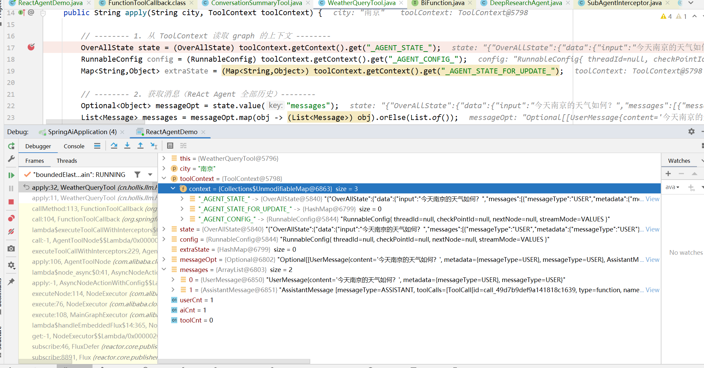
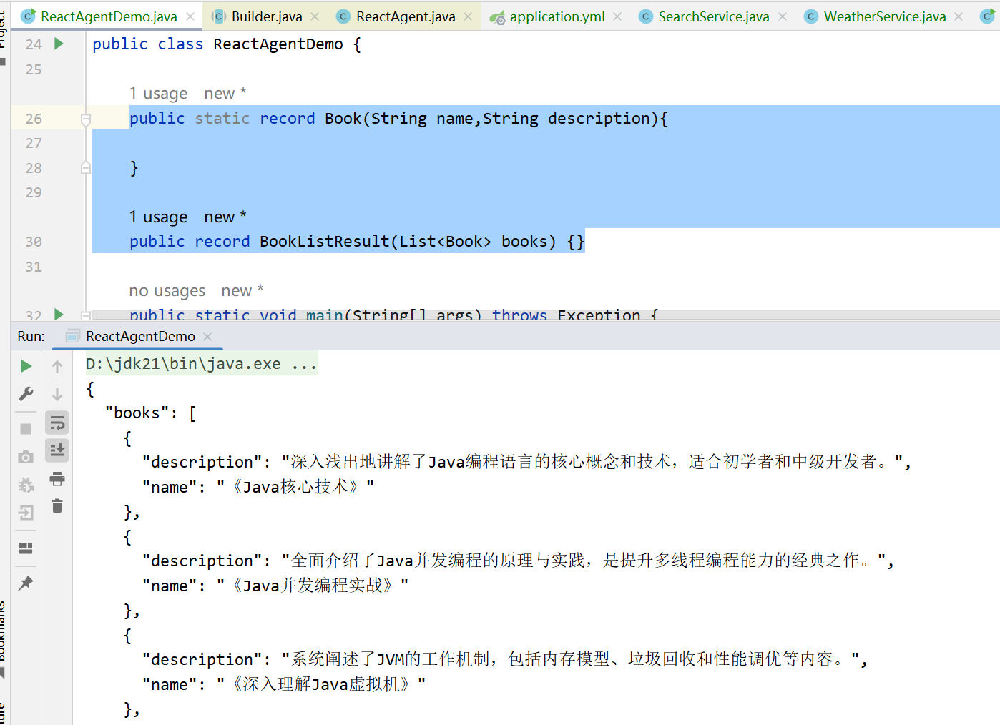
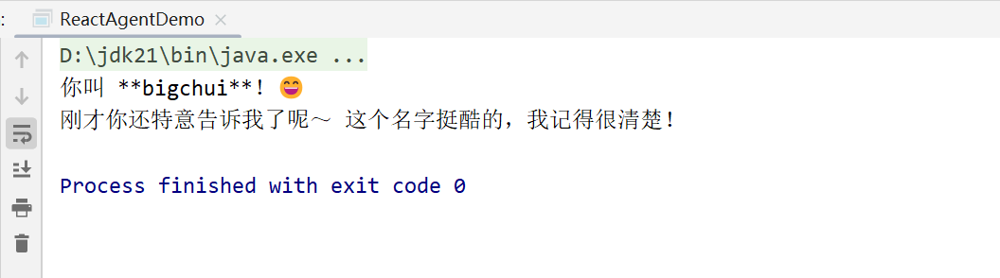
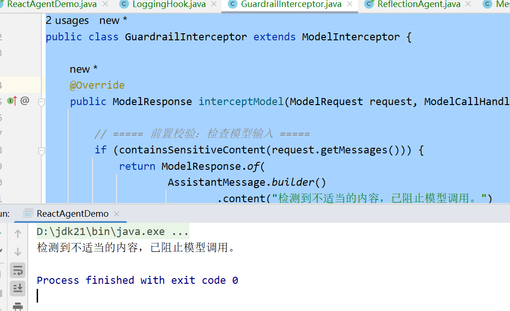
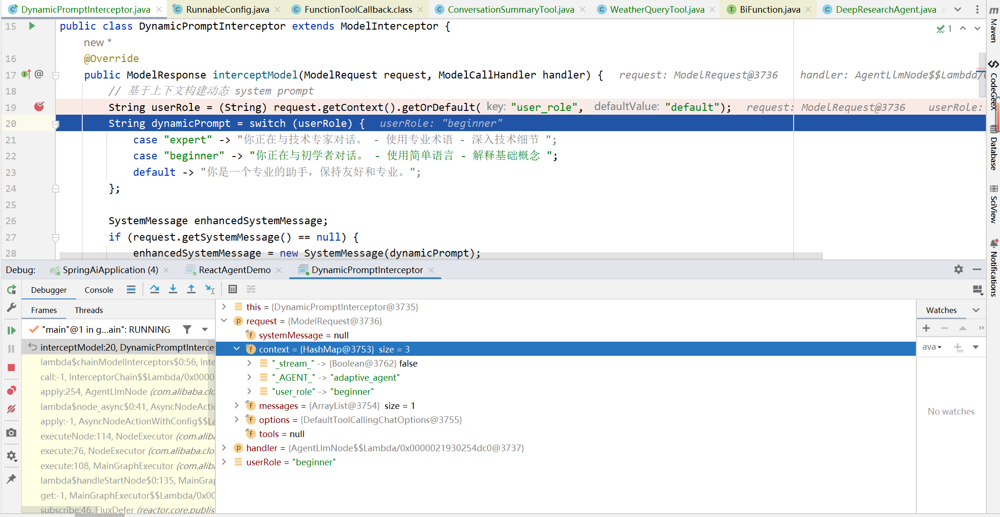

# ✅Alibaba-React Agent 核心组件

基础组件

**Model**

Model 就是大模型，作为 Agent 的大脑，负责推理、生成文本、决定下一步行动 (是否调用工具／输出答案)。

Spring-AI-Alibaba 的底层核心实现就是基于 Spring AI Apache，可以理解为Alibaba是增强版的 Spring AI。和之前的做法一样，你只需实现了 **ChatModel** 接口的类来作为模型即可。同时也可以通过配置 ChatOptions 来控制 temperature、maxTokens、topP 等参数。

**使用示例**：

```text
DashScopeApi dashScopeApi = DashScopeApi.builder()
        .apiKey("sk-XXXXXXXXXXXXXXXXXXXX")
        .build();

// 创建 ChatModel
ChatModel chatModel = DashScopeChatModel.builder()
        .dashScopeApi(dashScopeApi)
        .defaultOptions(DashScopeChatOptions.builder()
                .withModel("qwen-plus")
                .withTemperature(0.7)    // 控制随机性
                .withMaxToken(2000)      // 最大输出长度
                .withTopP(0.9)           // 核采样参数
                .build())
        .build();

ReactAgent agent = ReactAgent.builder()
        .name("my_agent")
        .model(chatModel)
        .build();
```

**Tools**

工具就是给 Agent “行动 (Acting)” 的能力，即当模型决定它需要做某些外部操作 (比如搜索、调用 API、数据库操作、计算等) 时，工具能实际执行这些操作。

ReactAgent 同样支持多个工具，tools 参数传入多个即可，Agent 会根据 LLM 输出决定调用哪个工具。

**使用示例**：

```text
// 定义一个简单搜索工具
ToolCallback searchTool = FunctionToolCallback.builder("search", (query, toolContext) -> {
    // 假设这是一个搜索 API 调用
    return "搜索结果 for: " + query;
}).description("搜索信息工具").inputType(String.class).build();

ReactAgent agent = ReactAgent.builder()
    .name("search_agent")
    .model(chatModel)
    .tools(searchTool)
    .systemPrompt("你是一个有外部搜索能力的助手。")
    .build();

AssistantMessage resp = agent.call("帮我查一下今天南京的天气");  
System.out.println(resp.getText());
```

ToolContext的基本用法

在Spring AI Alibaba中，ToolContext 是工具执行时的数据中心，统一管理参数、状态、memory、config 并封装返回值，是 ReActAgent 工具链的核心，这样工具能根据当前对话 / 状态做出合理操作。

**使用示例：**

```text
package cn.hollis.llm.mentor.tools;

import com.alibaba.cloud.ai.graph.OverAllState;
import com.alibaba.cloud.ai.graph.RunnableConfig;
import org.springframework.ai.chat.messages.Message;
import org.springframework.ai.chat.model.ToolContext;
import java.util.List;
import java.util.Map;
import java.util.Optional;

public class WeatherQueryTool implements java.util.function.BiFunction<String, ToolContext, String> {

    @Override
    public String apply(String city, ToolContext toolContext) {

        // -------- 1. 从 ToolContext 读取 graph 的上下文 --------
        OverAllState state = (OverAllState) toolContext.getContext().get("_AGENT_STATE_");
        RunnableConfig config = (RunnableConfig) toolContext.getContext().get("_AGENT_CONFIG_");
        Map<String,Object> extraState = (Map<String,Object>) toolContext.getContext().get("_AGENT_STATE_FOR_UPDATE_");

        // -------- 2. 获取消息（ReAct Agent 全部历史）--------
        Optional<Object> messageOpt = state.value("messages");
        List<Message> messages = messageOpt.map(obj -> (List<Message>) obj).orElse(List.of());

        long userCnt = messages.stream().filter(m -> m.getMessageType().getValue().equals("user")).count();
        long aiCnt   = messages.stream().filter(m -> m.getMessageType().getValue().equals("assistant")).count();
        long toolCnt = messages.stream().filter(m -> m.getMessageType().getValue().equals("tool")).count();


        // -------- 3. 实际逻辑：城市天气查询--------
        String weather;
        switch (city) {
            case "北京" -> weather = "北京天气：晴 3°C";
            case "上海" -> weather = "上海天气：多云 8°C";
            case "广州" -> weather = "广州天气：小雨 18°C";
            case "南京" -> weather = "南京天气：下雪 -5°C";
            default -> weather = city + " 的天气数据暂不可用";
        }

        // -------- 4. 返回包含上下文信息的结果 --------
        return String.format("""
                             查询城市：%s
                             当前天气：%s

                             ---- 调试信息（ToolContext）----
                             历史消息数：user=%d, assistant=%d, tool=%d

                             """,
                             city, weather,
                             userCnt, aiCnt, toolCnt
                            );
    }
}
```



**System Prompt**

这个前面的课程中已经详细的介绍过了，这边简单讲下，就是 ReactAgent 提供了一个入口参数，可以方便我们自定义系统提示词，Agent 的身份 / 行为规范 /风格 /角色设定。

支持2种配置方式：

**systemPrompt("...")**：简单字符串提示词。

**instruction("...多行指令...")**：适合更复杂或结构化的提示 (可以使用我们前面课程介绍的提示词框架来编写)。

**使用示例**：

```text
String instruction = """
    你是一个经验丰富的软件架构师。
    请在回答中：
    1. 先理解用户需求
    2. 分析可能的技术方案
    3. 提供清晰建议和理由
    4. 如果信息不够，主动询问
    用专业且友好的语气。
""";

ReactAgent agent = ReactAgent.builder()
    .name("architect_agent")
    .model(chatModel)
    // .systemPrompt("你是一个智能助手。")
    .instruction(instruction)
    .build();

AssistantMessage resp = agent.call("我想搭一个微服务系统，用 Java + Spring，怎么设计？");
System.out.println(resp.getText());
```

结构化输出

ReactAgent 同样也支持通过`Structured Output`，把文本进行结构化输出，要求模型严格按结构输出 JSON。**如果是集合类型，需要自己再次封装一层 record。**

**使用示例：**

```text
public static record Book(String name,String description){}

public record BookListResult(List<Book> books) {}

ReactAgent agent = ReactAgent.builder()
        .name("poem_agent")
        .model(chatModel)
        .outputType(BookListResult.class)
        .build();
String res = agent.call("推荐5本java相关的书籍").getText();
System.out.println(res);
```



Memory

ReactAgent 也支持会话记忆能力，支持将对话状态维护在 Agent 内部状态中，并可以持久化到存储层。开启记忆后，每次 Agent 调用时都会读取和写入这些状态，从而让多轮交互更连贯。

短期记忆是 **会话级别的历史追踪**，适合保存当前对话的上下文；在生产环境中，你也可以结合像 RedisSaver、MongoSaver 等持久化存储，实现长期记忆。

**使用示例：**

```text
// 短期记忆
ReactAgent agent = ReactAgent.builder()
            .name("chat_agent")
            .model(chatModel)
            .saver(new MemorySaver())
            .build();

    RunnableConfig config = RunnableConfig.builder()
            .threadId("user_123")
            .build();

    agent.call("你好！我叫 bigchui。", config);

    AssistantMessage resp = agent.call("我叫什么名字？", config);
    System.out.println(resp.getText());
```



Hooks

**Hooks 就是 ReactAgent 执行过程中的“生命周期钩子”。**当 ReactAgent 从接收输入、调用 LLM、执行工具，到最终返回结果时，框架在这些关键阶段预留了 Hooks，你可以在**不改变 Prompt、不干扰推理逻辑**的前提下，插入自己的自定义代码逻辑。

**在实践中，Hooks 主要解决的是可观测性与控制问题。**日志记录、执行链路追踪、上下文增强、结果二次加工、审计与限流，这些都不应该写进 Prompt，也不适合做成 Tool，而是天然属于 Hooks 的职责。可以理解为：**Tool 决定 Agent 能做什么，Hooks 决定你如何在每一步监督它怎么做。**

**Hook 执行位置**：

- **`BEFORE_AGENT`** / **`AFTER_AGENT`**：Agent 整体执行前后
- **`BEFORE_MODEL`** / **`AFTER_MODEL`**：Agent Loop 循环过程中，每次模型调用前后

**使用示例：**

```text
package cn.hollis.llm.menter.hooks;

import com.alibaba.cloud.ai.graph.OverAllState;
import com.alibaba.cloud.ai.graph.RunnableConfig;
import com.alibaba.cloud.ai.graph.agent.hook.*;

import java.util.List;
import java.util.Map;
import java.util.concurrent.CompletableFuture;

// AgentHook - 在 Agent 开始/结束时执行，每次Agent调用只会运行一次
@HookPositions({HookPosition.BEFORE_AGENT, HookPosition.AFTER_AGENT})
public class LoggingHook extends AgentHook {
    @Override
    public String getName() {
        return "logging";
    }

    @Override
    public HookType getHookType() {
        return null;
    }

    @Override
    public List<JumpTo> canJumpTo() {
        return null;
    }

    @Override
    public CompletableFuture<Map<String, Object>> beforeAgent(OverAllState state, RunnableConfig config) {
        System.out.println("Agent 开始执行");
        return CompletableFuture.completedFuture(Map.of());
    }

    @Override
    public CompletableFuture<Map<String, Object>> afterAgent(OverAllState state, RunnableConfig config) {
        System.out.println("Agent 执行完成");
        return CompletableFuture.completedFuture(Map.of());
    }
}
```

Interceptors

Interceptors 顾名思义就是**拦截器**，用于在 **模型调用（Model）和工具执行（Tool）** 这两个具体操作层面上进行拦截、修改和增强。它们的核心职责是：

- **拦截调用请求/响应**
- **修改请求参数或返回结果**

与 Hooks 的区别

Hooks 和 Interceptors 都是在 Agent 执行流程中“插脚”的扩展机制，但它们关注的层级完全不同。**Hooks 属于生命周期级别的插入点**，作用于 Agent 的整体执行阶段，例如开始与结束、每一轮模型调用前后等，更适合承担可观测性、执行流程控制、上下文增强、审计与限流等职责。Hooks 关注的是 Agent 作为一个整体是如何被执行的，通常不会直接改写模型调用或工具执行的具体行为。

**Interceptors 则是调用级别的拦截器**，只关注单次模型调用或单次工具执行本身，能够对请求和响应进行直接干预，例如参数改写、结果修改、重试、降级、缓存或工具选择等，就是一次调用的拦截器。

**Hooks 控制 Agent 的执行节奏和流程，Interceptors 控制具体的调用行为；Hooks 在生命周期节点插入，Interceptors 在调用边界拦截。**

敏感词防控

```text
package cn.hollis.llm.mentor.hooks;

import com.alibaba.cloud.ai.graph.agent.interceptor.ModelCallHandler;
import com.alibaba.cloud.ai.graph.agent.interceptor.ModelInterceptor;
import com.alibaba.cloud.ai.graph.agent.interceptor.ModelRequest;
import com.alibaba.cloud.ai.graph.agent.interceptor.ModelResponse;
import org.springframework.ai.chat.messages.AssistantMessage;
import org.springframework.ai.chat.messages.Message;

import java.util.List;

public class GuardrailInterceptor extends ModelInterceptor {

    @Override
    public ModelResponse interceptModel(ModelRequest request, ModelCallHandler handler) {

        // ===== 前置校验：检查模型输入 =====
        if (containsSensitiveContent(request.getMessages())) {
            return ModelResponse.of(
                    AssistantMessage.builder()
                            .content("检测到不适当的内容，已阻止模型调用。")
                            .build()
            );
        }

        ModelResponse response = handler.call(request);

        return response;
    }

    /**
     * 检查输入消息中是否包含敏感内容
     */
    private boolean containsSensitiveContent(List<Message> messages) {
        if (messages == null) {
            return false;
        }

        for (Message msg : messages) {
            String content = msg.getText();
            if (content == null) {
                continue;
            }

            if (content.contains("暴力")
                    || content.contains("违法")
                    || content.contains("敏感词")) {
                return true;
            }
        }
        return false;
    }

    @Override
    public String getName() {
        return "GuardrailInterceptor";
    }
}
```

```text
ReactAgent agent = ReactAgent.builder()
                .name("poem_agent")
                .model(chatModel)
                .interceptors(new GuardrailInterceptor())
                .outputType(BookListResult.class)
                .build();
        String res = agent.call("推荐5本暴力相关的书籍").getText();
        System.out.println(res);
```



动态提示词

ReactAgent 支持使用 **ModelInterceptor** 实现基于上下文的动态提示词：（**Interceptor你理解为就是我们前面介绍的Advisor机制，一种拦截器，可以在调用模型前做一些特殊处理**）

**使用示例：**

```text
package cn.hollis.llm.mentor.tools;

import com.alibaba.cloud.ai.dashscope.api.DashScopeApi;
import com.alibaba.cloud.ai.dashscope.chat.DashScopeChatModel;
import com.alibaba.cloud.ai.dashscope.chat.DashScopeChatOptions;
import com.alibaba.cloud.ai.graph.RunnableConfig;
import com.alibaba.cloud.ai.graph.agent.ReactAgent;
import com.alibaba.cloud.ai.graph.agent.interceptor.ModelInterceptor;
import com.alibaba.cloud.ai.graph.agent.interceptor.ModelRequest;
import com.alibaba.cloud.ai.graph.agent.interceptor.ModelResponse;
import com.alibaba.cloud.ai.graph.agent.interceptor.ModelCallHandler;
import org.springframework.ai.chat.messages.SystemMessage;
import org.springframework.ai.chat.model.ChatModel;

public class DynamicPromptInterceptor extends ModelInterceptor {
    @Override
    public ModelResponse interceptModel(ModelRequest request, ModelCallHandler handler) {
        // 基于上下文构建动态 system prompt
        String userRole = (String) request.getContext().getOrDefault("user_role", "default");
        String dynamicPrompt = switch (userRole) {
            case "expert" -> "你正在与技术专家对话。 - 使用专业术语 - 深入技术细节 ";
            case "beginner" -> "你正在与初学者对话。 - 使用简单语言 - 解释基础概念 ";
            default -> "你是一个专业的助手，保持友好和专业。";
        };

        SystemMessage enhancedSystemMessage;
        if (request.getSystemMessage() == null) {
            enhancedSystemMessage = new SystemMessage(dynamicPrompt);
        } else {
            enhancedSystemMessage = new SystemMessage(request.getSystemMessage().getText() + " " + dynamicPrompt);
        }

        ModelRequest modified = ModelRequest.builder(request)
                .systemMessage(enhancedSystemMessage)
                .build();
        return handler.call(modified);
    }

    @Override
    public String getName() {
        return "DynamicPromptInterceptor";
    }


    public static void main(String[] args) throws Exception {

        // 初始化 DashScopeApi
        DashScopeApi dashScopeApi = DashScopeApi.builder()
                .apiKey("sk-XXXXXXXXXXXXXXXXXXXXXXXXXX")
                .build();

        // 创建 ChatModel
        ChatModel chatModel = DashScopeChatModel.builder()
                .dashScopeApi(dashScopeApi)
                .defaultOptions(DashScopeChatOptions.builder()
                        .withModel("qwen-plus")
                        .withTemperature(0.7)    // 控制随机性
                        .withMaxToken(2000)      // 最大输出长度
                        .withTopP(0.9)           // 核采样参数
                        .build())
                .build();

        ReactAgent agent = ReactAgent.builder()
                .name("adaptive_agent")
                .model(chatModel)
                .interceptors(new DynamicPromptInterceptor())
                .build();
        RunnableConfig runnableConfig = RunnableConfig.builder()
                .addMetadata("user_role", "beginner")
                .build();
        System.out.println(agent.call("你好，你是谁", runnableConfig).getText());
    }

}
```



---

来源: https://thoughts.aliyun.com/workspaces/6963289eb0fc2e001bb052eb/docs/697f230cc71a890001bbe42a
