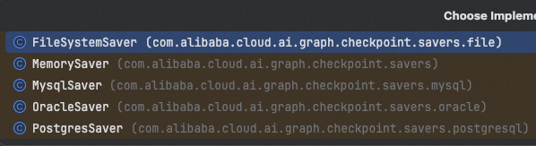
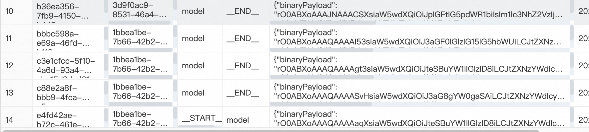

# ✅如何给Agent增加持久化记忆

Spring AI Alibaba中，如果你要直接用chatClient对话的话，就和spring ai用法一样就行了。

如果你要直接用他里面的agent的话，那么持久化记忆的实现方式可以这样用。

我们都知道，想要定义一个ReactAgent，需要传入一个saver用来做记忆：

```text
ReactAgent reactAgent = ReactAgent.builder()
        .name("memoryAgent")
        .model(chatModel)
        .saver(new new MemorySaver()).build();
```

之前我们都是直接用的MemorySaver()，这是一个基于内存的记忆，那么Spring ai alibaba中内置了一些实现：



也就是说，我们可以用文件系统、mysql、oracle和postgesql来实现长期记忆。

演示一下如何用mysql做长期记忆：

```text
@Autowired
private DataSource dataSource;

@Autowired
private ChatModel chatModel;

@RequestMapping("/chat/alibaba")
public String chatAlibaba(String message, String chatId) throws GraphRunnerException {
    ReactAgent reactAgent = ReactAgent.builder()
            .name("memoryAgent")
            .model(chatModel)
            .saver(new MysqlSaver.Builder()
                    .dataSource(dataSource).build()).build();

    return reactAgent.call(message, RunnableConfig.builder().threadId(chatId).build()).getText();
}
```

先通过MysqlSaver定义一个saver，他需要传入一个datasource。接着，在对话的时候，我们需要传一个threadId，用来区分具体是哪一个对话。

这样，在第一次访问这个接口的时候，数据库创建2张表：

graph_checkpoint和graph_thread这两张表。graph_thread用于保存线程信息，graph_checkpoint用来保存对话信息。

http://localhost:8010/ai/long_term_memory/chat/alibaba?message=my%20name%20is%20Hollis&chatId=456

http://localhost:8010/ai/long_term_memory/chat/alibaba?message=my%20name%20is%20&chatId=456

两次对话以后，数据库中会保存下来对话信息：



同样把应用停掉，重启之后，继续用456这个id来对话，他还是认识我的，说明他是做了长期记忆的。

---

来源: https://thoughts.aliyun.com/workspaces/6963289eb0fc2e001bb052eb/docs/697f236a3fb91800010d8975
