# ✅深入理解 Alibaba-React Agent 原理

前面的课程中，我们学习了 Spring-AI-Alibaba 中的 ReactAgent，知道它能做什么、怎么用。本章节，我会带着大家一起阅读源码，看看 ReactAgent 在 Spring-AI-Alibaba 里到底是怎么实现的，它是如何驱动推理循环迭代的。

流程分析

同样我们还是通过一个简单的例子，作为 debug 的入口：

```text
ToolCallback weatherTool = FunctionToolCallback
                .builder("weather", new WeatherQueryTool())
                .description("查询天气")
                .inputType(String.class)
                .build();
// 创建 Agent
ReactAgent agent = ReactAgent.builder()
        .name("demo_agent")
        .model(chatModel)
        .tools(weatherTool)
        .hooks(new LoggingHook())
        .systemPrompt("你是一个助手。")
        .build();

System.out.println(agent.call("查询南京天气").getText());
```

我们跟进到call方法中：

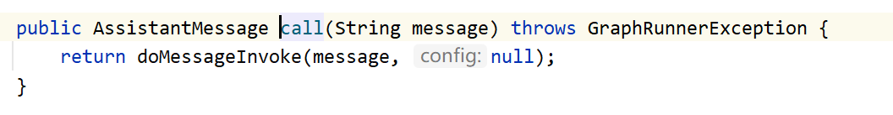

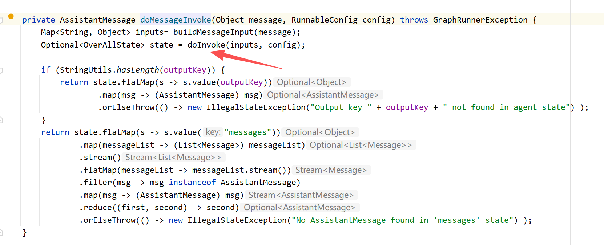

我们继续跟进到doInvoke之中，发现他其实就是基于 Graph 来实现的，这点 Alibaba 的实现应该是借鉴了 LangGraph 的设计。

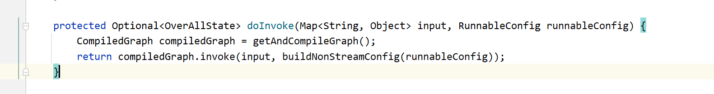

继续跟进进入它的 invoke 方法，发现了runner.run，也就是直接运行构建的流程图，其中 overAllState 我们在前面已经介绍了，他就是一个全局状态，存储运行的各个环节。

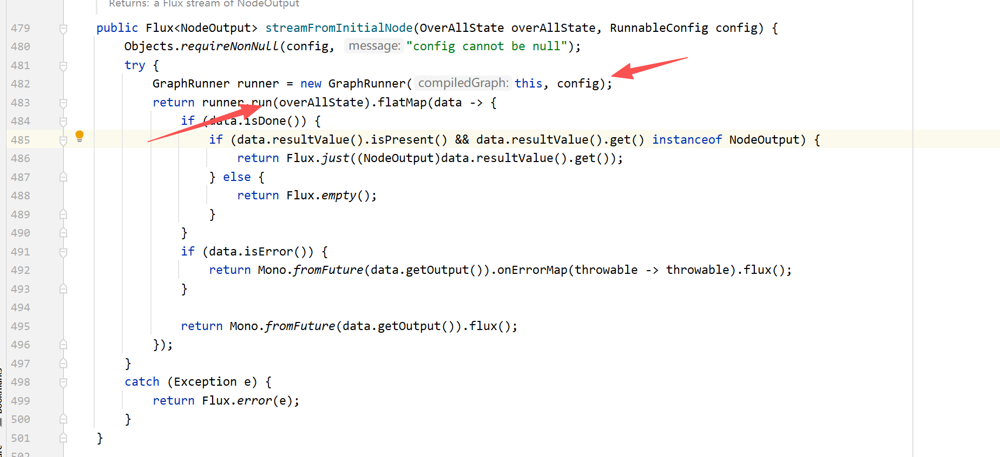

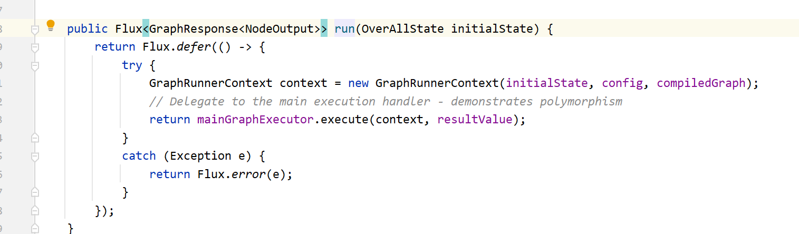

继续跟进：mainGraphExecutor.execute，我们可以看到他的执行核心逻辑就是：nodeExecutor.execute，就是节点执行器。

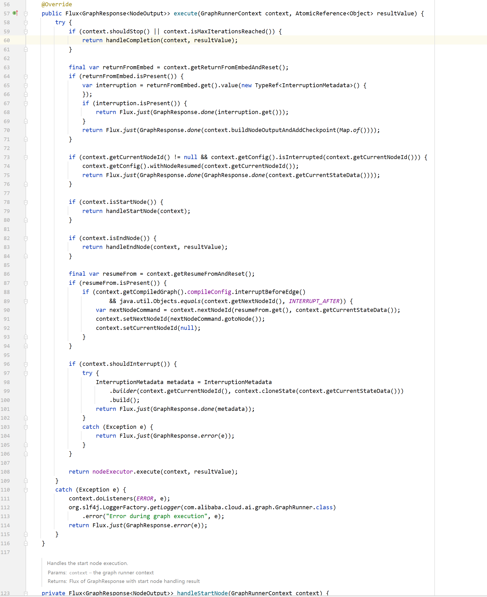

节点的具体执行逻辑在下面这块，它先从GraphRunnerContext 中取出当前要执行的节点和对应的 Action，如果是可中断节点则优先处理外部反馈并判断是否需要直接中断流程；真正的执行逻辑就是 **action.apply**，执行完成后，会将结果统一转换成GraphResponse。

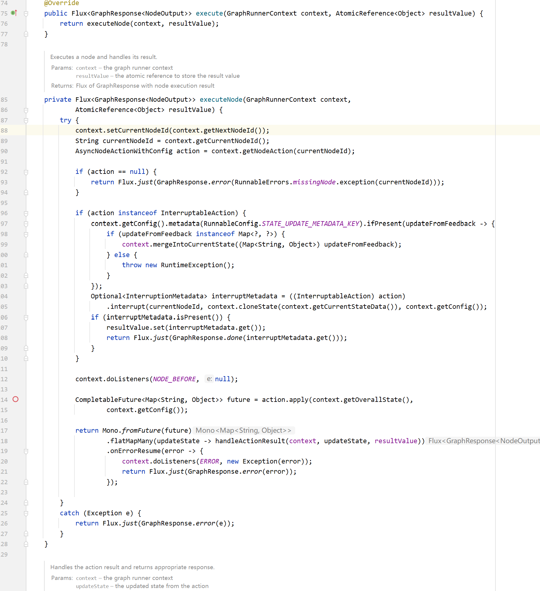

**这个action.aply的代码比较特别，他没有直接的实现类（编译器打开的默认实现都不是正确的），好像我们的 debug 到这就中断了？没关系，我们继续往下看。**

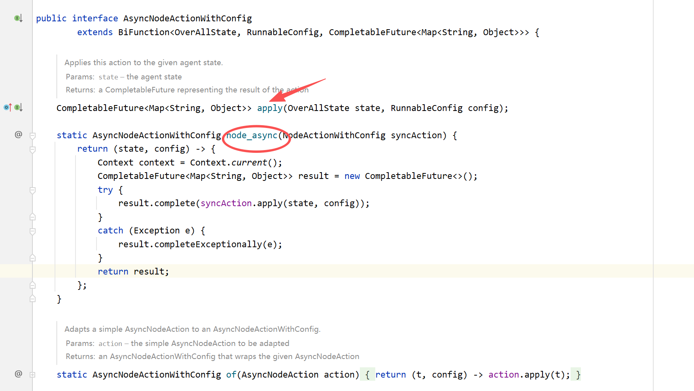

**AsyncNodeActionWithConfig ****本身不是一个具体实现类，而是一个函数型接口 ，因为他继承了 BiFunction，也就是说任何一个符合这个函数签名的 Lambda / 实现类，都可以作为一个节点的执行逻辑，所以它并不是在找某个固定的类实现，而是在执行当初构建 Graph 时注册进去的那段逻辑。**

**node_async()：就是把同步节点逻辑包一层，直接丢进 CompletableFuture，统一成异步模型，方便整个执行引擎用一套逻辑处理。**

**我们查看node_async的调用的地方，发现就有几处是在ReactAgent中的，所以也验证了我们前面的推理。**

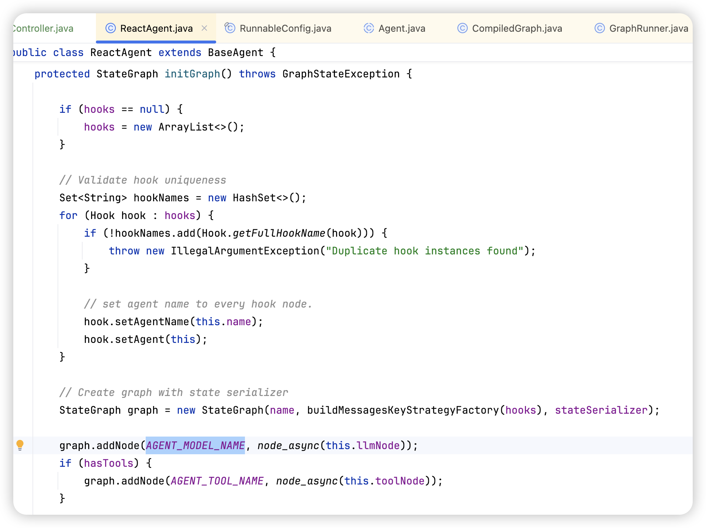

我们可以看到在 ReactAgent 初始化 initGraph 的时候，给 graph 增加了两个节点，分别是model和tool，然后用**node_async **封装节点逻辑。那我们就先看下这个llmNode和toolNode里面到底是什么逻辑。

其中 llmNode 的类是 **AgentLlmNode**，我们直接看他的 apply 方法，这个也就是我们在前面讲的，这个apply 方法就是节点在 action.apply 的时候，真实执行的逻辑。它的代码逻辑比较长，这边就以非流式的为例，可以看到他其实就是去执行了一次大模型调用，输出ChatResponse，并更新状态。

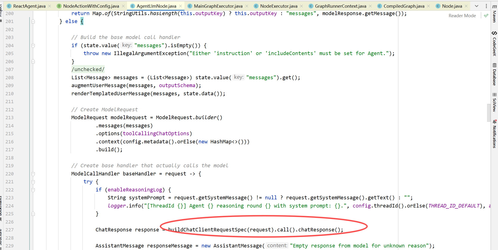

再看下 toolNode，它的类是 **AgentToolNode，直接看他的apply方法**

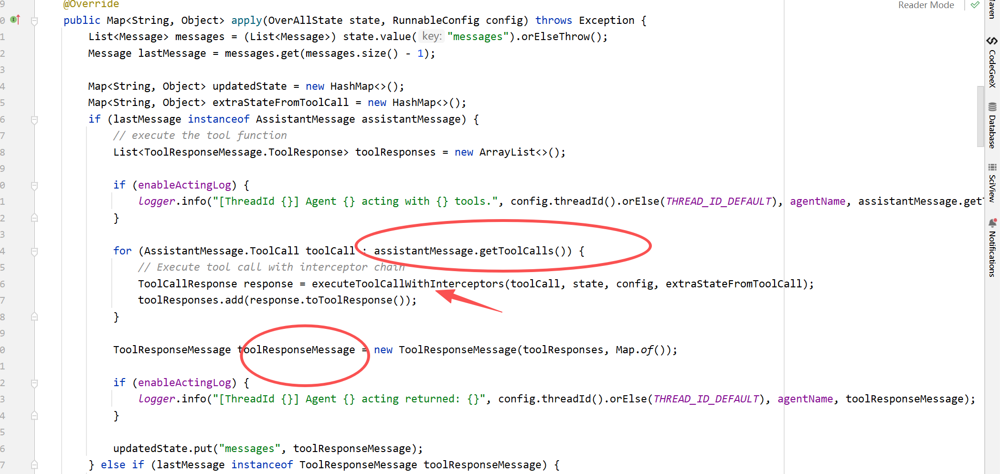

可以看到他的逻辑就是判断大模型 **AssistantMessage** 的输出是否包含 **tool_calls**，如果包含则执行工具调用，然后将结果封装成 **toolResponseMessage**，并更新到上下文之中。

到这里我们应该就清晰了，ReactAgent 的大模型节点和工具执行节点的实现逻辑了，那现在还有个问题，就是他是如何实现循环迭代的。

我们再回到 ReactAgent 的 initGraph方法中，他是构建了图，所以我们只需要理清楚图的结构，应该就能搞清楚如何实现的迭代循环了。

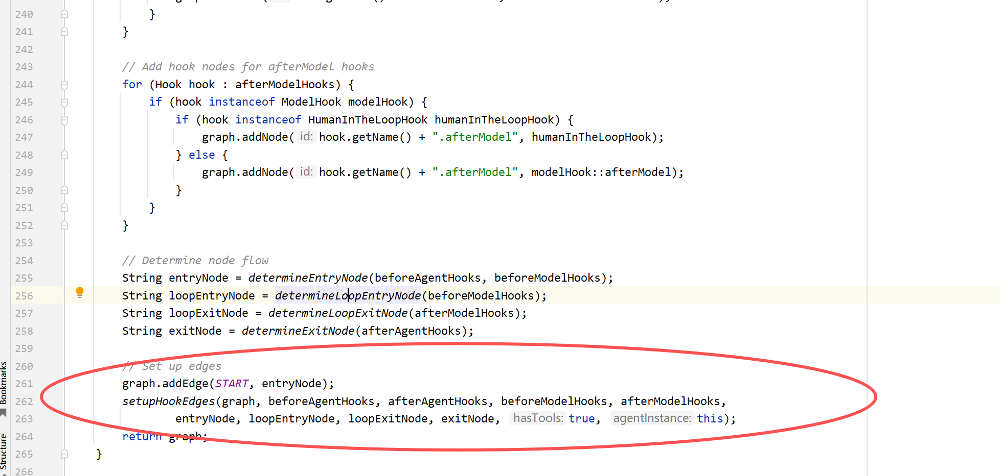

在initGraph的逻辑中，hooks和interceptor，其实也是通过图来注入的，这边不多做介绍，直接讲画圈的主流程部分。核心就在于：setupHookEdges。

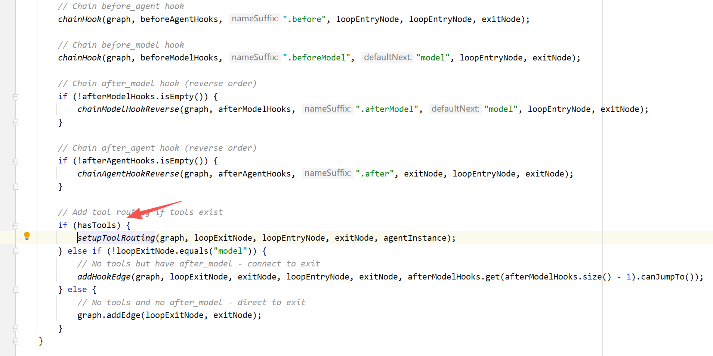

同样，在这个方法的后面，我们看到这段逻辑，hasTools表示我当前的使用是包含工具的，那么我们就走setupToolRouting分支逻辑。

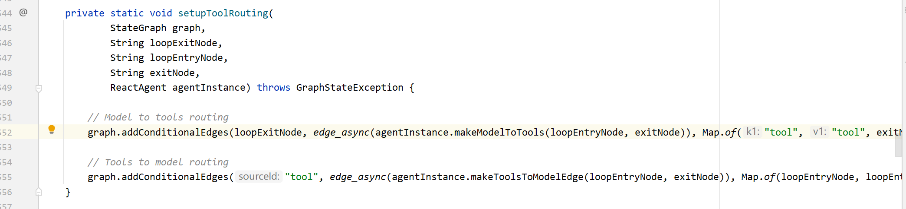

这是**路由规则的集中配置入口**：

- 第一条 addConditionalEdges 定义的是 **Model → Tools / Loop / Exit**模型节点执行完后，根据 makeModelToTools(...) 的判断结果，决定：
- 要不要去执行工具（走到 tool 节点）
- 还是直接结束（exitNode）
- 或者继续下一轮模型推理（回到 loopEntryNode）

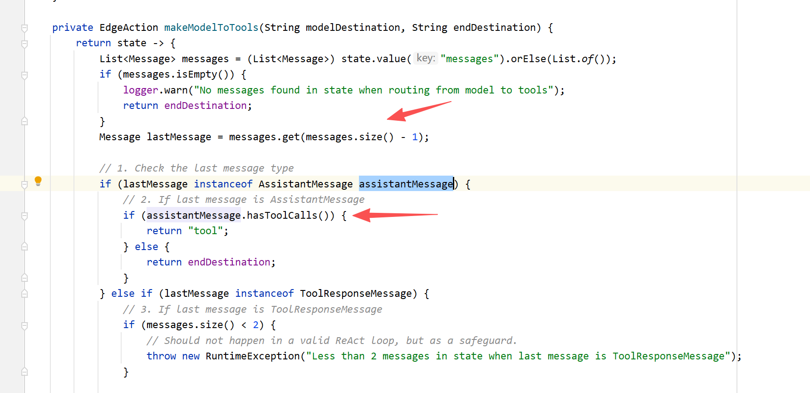

- 第二条 addConditionalEdges 定义的是 **Tools → Model / Exit**工具节点执行完后，不是直接结束，而是交给 makeToolsToModelEdge(...) 决定：
- 是回到模型节点，让模型获取工具结果再思考一轮
- 还是满足条件，直接退出整个 ReAct 循环

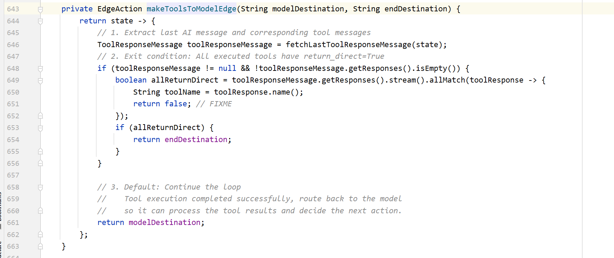

意思就是从当前 state 中取出**最近一次工具执行的返回结果。**判断一个**退出条件**：如果本轮执行的所有工具都标记为 return_direct=true 就直接跳到结束节点。如果不满足退出条件，默认行为就是**回到模型节点**，让 LLM 基于工具返回继续推理、决定下一步动作。

总结

Alibaba 的 ReactAgent 是先将 ReAct 的推理与执行流程编译成一张 Graph，再由 Graph 引擎驱动节点在图中不断流转，直到满足退出条件为止。本质上，它把 ReAct 的思考流程变成了一套可运行的状态机。

在初始化阶段，ReactAgent 会把 model、tool以及不同位置的 hooks、interceptors 都注册到 Graph 中，并通过条件边描述节点间的跳转规则，比如是否产生 tool call、是否需要继续循环或直接结束。执行时，Graph 从 model 开始运行，模型触发工具则进入 tool，工具执行完成后再回到 model，这个“模型 → 工具”的循环会不断重复，直到路由逻辑判定流程结束。

---

来源: https://thoughts.aliyun.com/workspaces/6963289eb0fc2e001bb052eb/docs/697f231f51b14400012c3d0a
