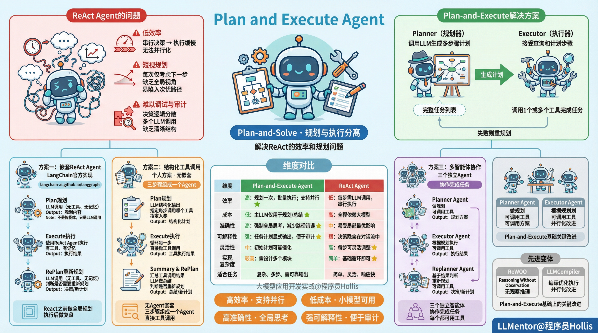

# ✅Agent常用架构：Plan and Execute Agent

ReAct 智能体采用“思考 → 行动 → 观察”的循环模式，这利用了思维链提示，每一步只做出一个行动选择。虽然这对于简单任务有效，但是存在以下问题：

- **低效率**：串行决策导致任务执行缓慢，无法并行化。
- **短视规划**：每次仅考虑下一步，缺乏全局视角，容易陷入次优路径。
- **难以调试与审计**：决策逻辑分散在多个 LLM 调用中，缺乏清晰的任务结构。

那为了解决这些问题，有人提出一种新的Agent架构——Plan and Execute Agent，或者叫Plan And Solve。

基于 Plan-and-Solve （https://arxiv.org/abs/2305.04091 ）的论文，以及 Yohei Nakajima 的 BabyAGI 项目，Plan And Execute Agent由两个基本组件组成：

Planner：规划器，调用LLM 生成一个多步骤计划来完成一个大型任务。

Executor：执行器，接受用户查询和计划中的一个步骤，并调用 1 个或多个工具来完成该任务。

（图源：https://blog.langchain.com/planning-agents/ ）

整体流程就是Planner 生成完整任务列表，Executor 逐个执行，若失败则触发重规划。

和ReAct Agent对比

|  |  |  |
| --- | --- | --- |
| **维度** | **Plan-and-Execute Agent** | **ReAct Agent** |
| **效率** | **高：规划一次，批量执行；支持并行** | 低：每步需 LLM 调用，串行执行 |
| **成本** | **低：主 LLM 仅用于规划/总结，子任务可用小模型** | 高：全程依赖大模型 |
| **准确性** | **高：强制全局思考，减少路径错误** | 中：易受局部最优影响 |
| **可解释性** | **强：任务计划显式输出，便于审计** | 弱：决策隐含在对话流中 |
| **灵活性** | 中：初始计划可能僵化，需动态重规划机制 | **高：每步可灵活调整** |
| **实现复杂度** | 较高：需设计规划器、执行器、记忆、重规划等模块 | **简单：基础循环即可实现** |
| **适合任务** | 简单、灵活、响应快，适合目标明确、步骤少、动态性强的任务 | 结构化、可扩展、成本可控，适合复杂、多步、需可靠输出的任务 |

Plan And Execute的实现

方案一

plan and execute的实现，主要是可以参考langchain官方给的一个实现：https://langchain-ai.github.io/langgraph/tutorials/plan-and-execute/plan-and-execute/

在这种典型的实现中，Plan And Execute其实是会嵌套React Agent的，大致的思路如下：

**1、借助LLM来做Plan规划，这一步不需要工具调用，也不需要记忆，其实严格来说并不是一个智能体，只是个LLM调用。**

**2、根据上一步规划的内容，通过React Agent来做执行。**

**3、根据执行的结果，在借助LLM判断是否需要RePlan重新规划，这一步也不需要记忆和工具调用，也只是一个LLM调用。**

所以，其实就是在React之前先做了一个全局规划，然后再react执行后再做一次复盘。

方案二

个人认为（这是我自己想出来的方案，如有雷同，纯属巧合），还可以有一种实现，是这样的：

**1、借助LLM来做Plan规划，LLM结构化的输出具体每一步要调用哪个工具，以及入参是什么**

**2、根据上一步规划的内容，循环每一步做工具调用**

**3、把工具调用的结果进行汇总，给到LLM做总结以及重新规划**

在这个方案中，就也没有agent的嵌套，它三个步骤加在一起组成了一个agent。

**（后来偶然听过一次某做AI头部大厂的Agent架构，他们用的就是这种方式，在Plan的过程就规划好要调用什么工具，然后把工具调用过程用wolkflow做编排，只不过他们实际落地的时候，在后续工具运行时，还会针对一些异常情况（如工具调用失败），再叠加react做重新规划。他们发现这么做可以大大的减少一次agent执行的耗时。）**

方案三

另外，还有第三种方案，那就是多智能体的方案，三个角色，planner，executor以及replanner，都可以单独作为一个智能体，三个智能体直接协作完成任务。

**1、planner做规划，如果需要用到工具则直接调用**

**2、executor根据上一步规划的内容，做每一个步骤的执行，如果需要用到工具，则直接调用**

**3、replaner基于上一步的记过做判断及重新规划，如果需要用到工具，则直接调用**

除了标准的Plan And Execute外，还有ReWOO（Reasoning Without Observation）和 LLMCompiler ，这是 **Plan-and-Execute 范式下的两种先进智能体架构**，它们在原始“Plan-and-Execute”基础上做了关键改进

---

来源: https://thoughts.aliyun.com/workspaces/6963289eb0fc2e001bb052eb/docs/697f1107a7c8ff00014e0f63
