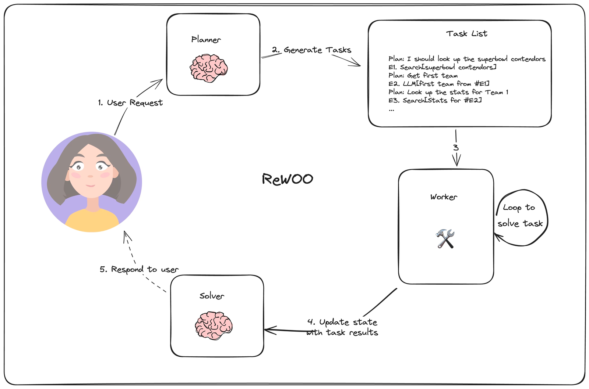
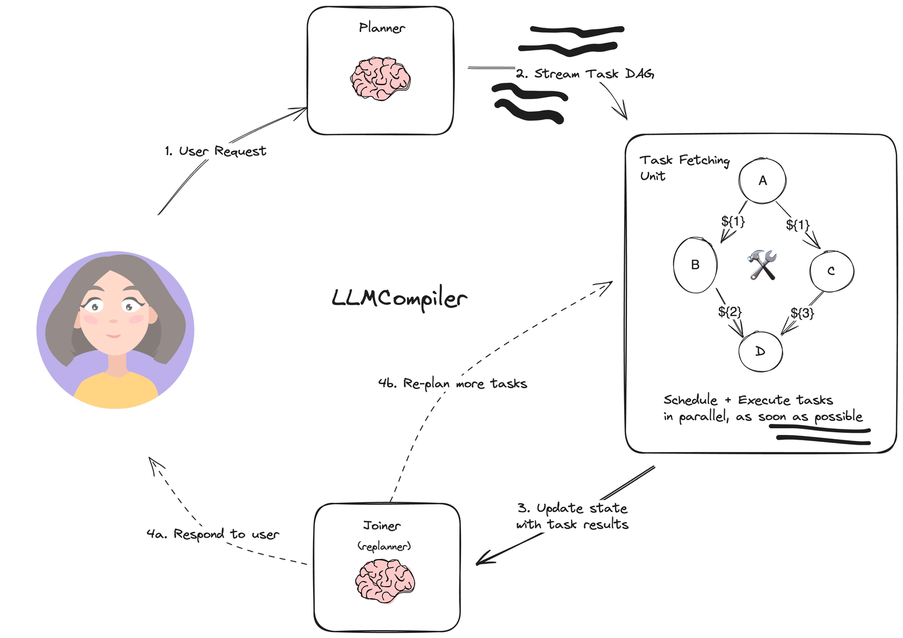

# ✅Agent常用架构：ReWOO&LLMCompiler（选学）

ReWOO

在Plan And Execute中，Planner 输出的任务列表是**彼此独立的**（如 `[“查天气”, “发邮件”]`），无法表达“第二步依赖第一步结果”的关系。这就会导致Executor 无法知道“发邮件”该用哪个天气数据；若强行拼接上下文，又会陷入 ReAct 式的高成本循环。

ReWOO（Reasoning Without Observation） 允许 Planner 在生成计划时**定义可引用的中间变量**（E#），实现任务间的数据传递，**无需在每步调用 LLM 观察结果**。

**LLMCompiler**

有了ReWOO 之后，还有个问题并没有解决，那么就是即使任务无依赖（如同时查 5 家公司股价），也必须**串行执行**，浪费时间。

为了解决这个问题，有人提出了LLMCompiler，将计划表示为有向无环图（DAG），并流式解析+动态调度，实现最大并行度。

---

来源: https://thoughts.aliyun.com/workspaces/6963289eb0fc2e001bb052eb/docs/697f111ac71a890001bbe1e9
