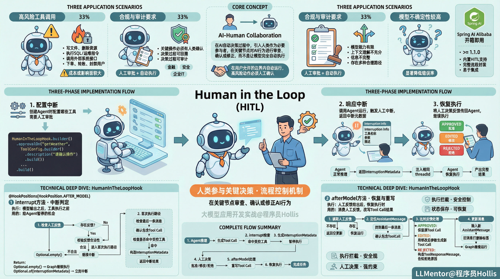
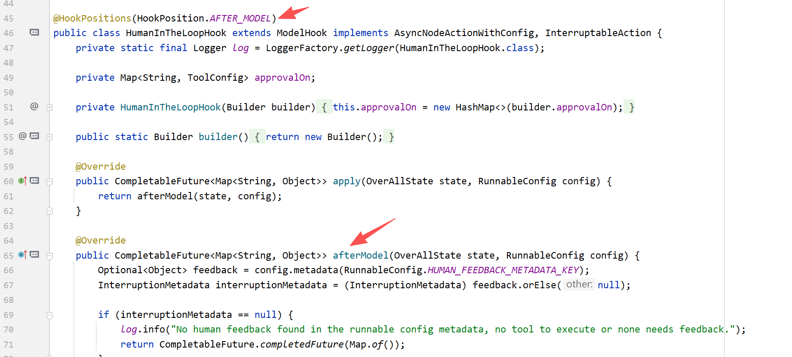
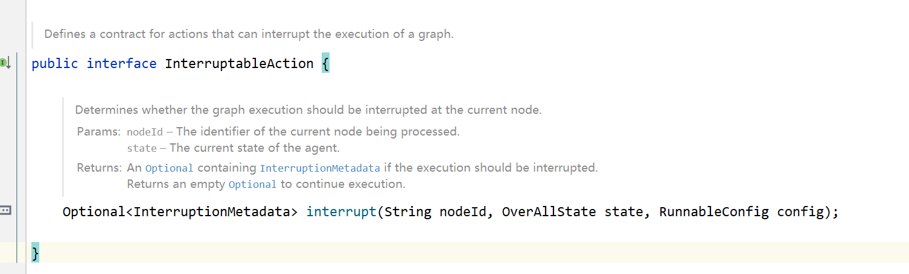
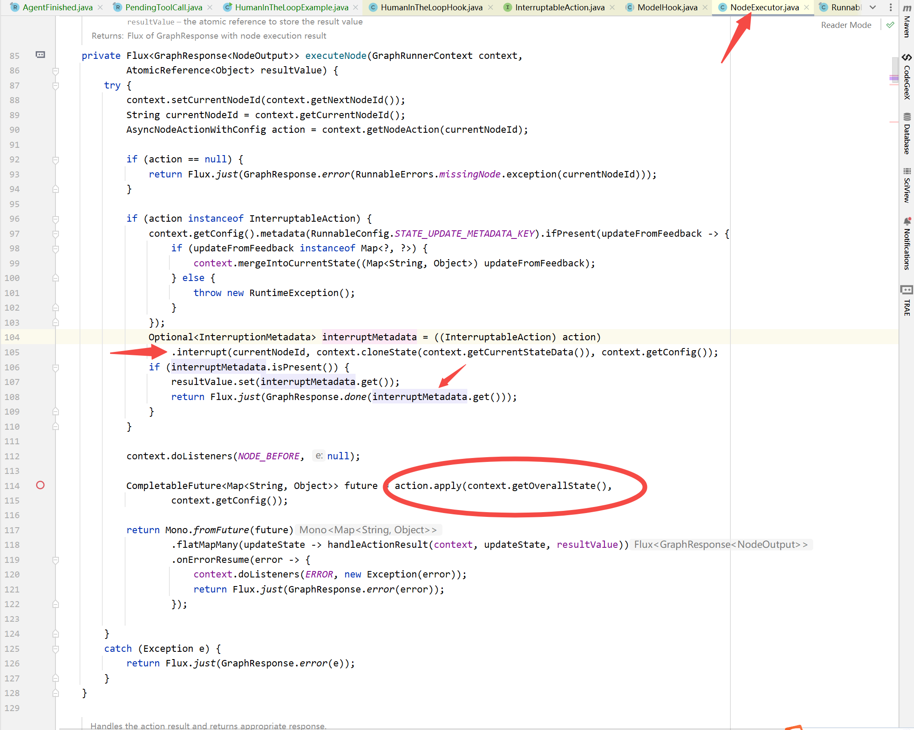
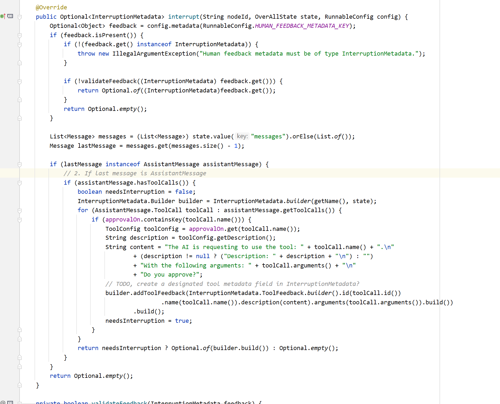
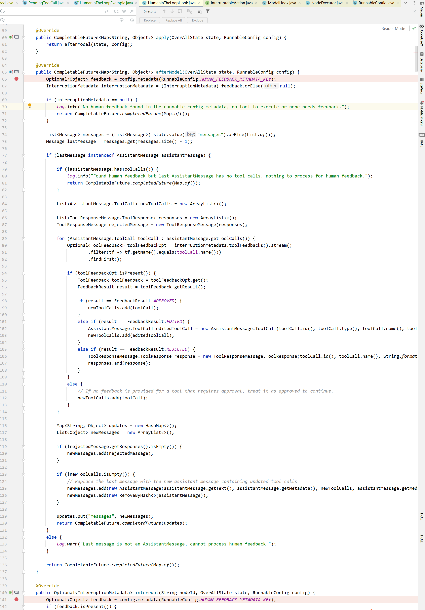

# ✅Agent常用架构：Human in the Loop



**Human-in-the-Loop（简称 HITL）** 指的是在 AI 系统中的自动决策或执行过程中，引入人类用户作为“必要参与者”，在关键节点对 AI 的行为和结果进行**审查、确认或修正**，而不是让模型完全自动完成端到端的执行。

在 Agent 场景下，HITL 的核心并不是用户参与推理，而是：

**在用户允许的边界内，让 Agent 自动运行；一旦即将执行高风险或高不确定性的动作，必须经过人工确认。**

HITL 本质上是一种 **流程控制机制**。

HITL 的应用场景

高风险工具调用

当 Agent 需要调用具备**一些重要或敏感的**工具时，例如：

- 写文件、删除资源
- 执行 SQL / 运维指令
- 调用外部系统接口（下单、转账、封禁用户等）

这类操作一旦执行，往往成本或者影响面较大，因此不适合完全由模型自动决定。

合规与审计要求

在金融、安全、企业 IT 等场景中，系统通常要求：

- 关键操作必须有人类确认
- 决策过程可回溯、可审计

HITL 可以天然满足“人工审批 + 自动执行”的合规要求。

模型不确定性较高的场景

当模型能力比较有限，对上下文理解不充分、信息不完整，或者输出存在多种合理路径时，通过人工介入可以显著降低错误率。

开箱即用 HITL

Spring AI Alibaba  已经提供了对 Agent HITL 的支持，通过HumanInTheLoopHook实现，这其实是一种我们前面介绍过的Hook机制。

整体流程大致可以分为三个阶段。

- **配置中断**：在创建 Agent 时，配置哪些工具需要人工审批；
- **响应中断**：调用 Agent 运行逻辑，若触发人工中断，返回中断元数据；
- **恢复执行**：将人工决策反馈传回给 Agent，并继续执行 React 逻辑。

在 **配置阶段**，通过 `HumanInTheLoopHook` 明确声明 `getWeather` 工具需要人工审批，从而将“是否允许执行该工具”的决策权从模型侧上移到框架层，避免模型直接调用的行为。

```
import com.alibaba.cloud.ai.graph.agent.ReactAgent;
import com.alibaba.cloud.ai.graph.agent.hook.hip.HumanInTheLoopHook;
import com.alibaba.cloud.ai.graph.agent.hook.hip.ToolConfig;
import com.alibaba.cloud.ai.graph.checkpoint.savers.MemorySaver;

// 配置检查点保存器（人工介入需要检查点来处理中断）
MemorySaver memorySaver = new MemorySaver();

// 创建人工介入Hook
HumanInTheLoopHook humanInTheLoopHook = HumanInTheLoopHook.builder() 
  .approvalOn("write_file", ToolConfig.builder() 
      .description("文件写入操作需要审批") 
      .build()) 
  .approvalOn("execute_sql", ToolConfig.builder() 
      .description("SQL执行操作需要审批") 
      .build()) 
  .build(); 

// 创建Agent
ReactAgent agent = ReactAgent.builder()
  .name("approval_agent")
  .model(chatModel)
  .tools(writeFileTool, executeSqlTool, readDataTool)
  .hooks(List.of(humanInTheLoopHook)) 
  .saver(memorySaver) 
  .build();
```

在 **响应中断阶段**，Agent 正常进行推理，当模型生成了对受控工具的调用请求后，框架在工具真正执行之前触发中断，返回 `InterruptionMetadata`。此时 Agent 并未失败，而是以一种“可恢复的中断状态”安全退出，将待执行的工具调用信息完整暴露给外部系统。

```
import com.alibaba.cloud.ai.graph.RunnableConfig;
import com.alibaba.cloud.ai.graph.NodeOutput;
import com.alibaba.cloud.ai.graph.action.InterruptionMetadata;

// 人工介入利用检查点机制。
// 你必须提供线程ID以将执行与会话线程关联，
// 以便可以暂停和恢复对话（人工审查所需）。
String threadId = "user-session-123"; 
RunnableConfig config = RunnableConfig.builder() 
  .threadId(threadId) 
  .build(); 

// 运行图直到触发中断
Optional<NodeOutput> result = agent.invokeAndGetOutput( 
  "删除数据库中的旧记录",
  config
);

// 检查是否返回了中断
if (result.isPresent() && result.get() instanceof InterruptionMetadata) { 
  InterruptionMetadata interruptionMetadata = (InterruptionMetadata) result.get(); 

  // 中断包含需要审查的工具反馈
  List<InterruptionMetadata.ToolFeedback> toolFeedbacks = 
      interruptionMetadata.toolFeedbacks(); 

  for (InterruptionMetadata.ToolFeedback feedback : toolFeedbacks) {
      System.out.println("工具: " + feedback.getName());
      System.out.println("参数: " + feedback.getArguments());
      System.out.println("描述: " + feedback.getDescription());
  }

  // 示例输出:
  // 工具: execute_sql
  // 参数: {"query": "DELETE FROM records WHERE created_at < NOW() - INTERVAL '30 days';"}
  // 描述: SQL执行操作需要审批
}
```

在 **恢复执行阶段**，外部系统基于中断信息构造人工反馈（批准、修改或拒绝），并通过相同的 `threadId` 将反馈重新注入 Agent。Agent 利用之前保存的执行状态继续运行，在人工决策的约束下完成后续工具调用和推理流程，最终产出完整结果。

```
List<InterruptionMetadata.ToolFeedback> toolFeedbacks =
              interruptionMetadata.toolFeedbacks();


InterruptionMetadata.Builder feedbackBuilder = InterruptionMetadata.builder()
              .nodeId(interruptionMetadata.node())
              .state(interruptionMetadata.state());

toolFeedbacks.forEach(toolFeedback -> {
              InterruptionMetadata.ToolFeedback approvedFeedback =
                  InterruptionMetadata.ToolFeedback.builder(toolFeedback)
                      .result(InterruptionMetadata.ToolFeedback.FeedbackResult.APPROVED)
                      .build();
              feedbackBuilder.addToolFeedback(approvedFeedback);
          });

InterruptionMetadata approvalMetadata = feedbackBuilder.build();


RunnableConfig resumeConfig = RunnableConfig.builder()
              .threadId(threadId)
              .addMetadata(RunnableConfig.HUMAN_FEEDBACK_METADATA_KEY, approvalMetadata)
              .build();

Optional<NodeOutput> finalResult = agent.invokeAndGetOutput("", resumeConfig);

if (finalResult.isPresent()) {
              System.out.println("执行完成");
              System.out.println("最终结果: " + finalResult.get());
}
```

整个过程中，HITL 并未改变模型推理方式，而是通过 **执行拦截、状态保存与恢复机制** 实现对 Agent 行为的强控制。

**完整示例：**

```text
public static void main(String[] args) throws Exception {
        // 初始化 DashScopeApi
        DashScopeApi dashScopeApi = DashScopeApi.builder()
                .apiKey("sk-XXXXXXXXXXXXXXXXXXXXXXXXX")
                .build();

        // 创建 ChatModel
        ChatModel chatModel = DashScopeChatModel.builder()
                .dashScopeApi(dashScopeApi)
                .defaultOptions(DashScopeChatOptions.builder()
                        .withModel("qwen-plus")
                        .withTemperature(0.7)
                        .withMaxToken(2000)
                        .withTopP(0.9)
                        .build())
                .build();
        MemorySaver memorySaver = new MemorySaver();

        // 1. 配置中断
        HumanInTheLoopHook humanInTheLoopHook = HumanInTheLoopHook.builder()
                .approvalOn("getWeather", ToolConfig.builder()
                        .description("请确认操作")
                        .build())
                .build();

        ToolCallback[] toolCallbacks = ToolCallbacks.from(new WeatherService());
        ReactAgent agent = ReactAgent.builder()
                .name("agent")
                .model(chatModel)
                .tools(toolCallbacks)
                .saver(memorySaver)
                .hooks(List.of(humanInTheLoopHook))
                .build();

        String threadId = "user-001";
        RunnableConfig config = RunnableConfig.builder()
                .threadId(threadId)
                .build();

        System.out.println("=== 第一次调用：期望中断 ===");
        Optional<NodeOutput> result = agent.invokeAndGetOutput(
                "帮我查询南京的天气",
                config
        );

        // 2. 响应中断
        if (result.isPresent() && result.get() instanceof InterruptionMetadata) {
            InterruptionMetadata interruptionMetadata = (InterruptionMetadata) result.get();

            System.out.println("检测到中断，需要人工审批");
            List<InterruptionMetadata.ToolFeedback> toolFeedbacks =
                    interruptionMetadata.toolFeedbacks();

            for (InterruptionMetadata.ToolFeedback feedback : toolFeedbacks) {
                System.out.println("工具: " + feedback.getName());
                System.out.println("参数: " + feedback.getArguments());
                System.out.println("描述: " + feedback.getDescription());
            }

            // 模拟人工决策（这里选择批准）实际工程中可以和前端交互
            InterruptionMetadata.Builder feedbackBuilder = InterruptionMetadata.builder()
                    .nodeId(interruptionMetadata.node())
                    .state(interruptionMetadata.state());

            toolFeedbacks.forEach(toolFeedback -> {
                InterruptionMetadata.ToolFeedback approvedFeedback =
                        InterruptionMetadata.ToolFeedback.builder(toolFeedback)
                                .result(InterruptionMetadata.ToolFeedback.FeedbackResult.APPROVED)
                                .build();
                feedbackBuilder.addToolFeedback(approvedFeedback);
            });

            InterruptionMetadata approvalMetadata = feedbackBuilder.build();

            // 3. 恢复执行
            System.out.println("== 第二次调用：使用批准决策恢复 == = ");
                    RunnableConfig resumeConfig = RunnableConfig.builder()
                            .threadId(threadId)
                            .addMetadata(RunnableConfig.HUMAN_FEEDBACK_METADATA_KEY, approvalMetadata)
                            .build();

            Optional<NodeOutput> finalResult = agent.invokeAndGetOutput("", resumeConfig);

            if (finalResult.isPresent()) {
                System.out.println("执行完成");
                System.out.println("最终结果: " + finalResult.get());
            }
        }
    }
```

HumanInTheLoopHook

执行时机

了解了整体用法和流程后，那我们来具体看下 HITL 的核心类，这个`HumanInTheLoopHook`里面到底做了哪些工作。



首先我们可以看到`@HookPositions(HookPosition.AFTER_MODEL)`和`afterModel`，也就是说它是执行在：**模型输出之后，工具执行之前。这时候模型已经完成推理，Tool Call 已经生成。**

**interrupt**

`interrupt`方法来自于`InterruptableAction`接口



**`interrupt`**的含义就是** Agent 执行引擎继续往下跑之前，给你一次暂停的机会。**它的实际调用是在`NodeExecutor`类中执行的。



我们可以看到**interrupt 是在“节点 action.apply() 之前”执行的。**也就是说：

- interrupt = **要不要执行这个节点**
- apply = **真正执行这个节点**

也就是说，每次执行节点的时候，都会判断一下，是否要暂停执行，`interrupt`就是对这个判断的回答，它的返回值有两种：

- `Optional.empty()`→ **什么都不做，Graph 继续执行**
- `Optional.of(InterruptionMetadata)`→ **立刻中断执行**

接着我们看下`HumanInTheLoopHook`中 `interrupt` 的具体实现：



先检查 `RunnableConfig` 中是否已携带人工反馈（`HUMAN_FEEDBACK_METADATA_KEY`），如果存在，说明当前不是第一次执行，而是在“人工审批之后的恢复阶段”。

接着会校验反馈是否合法，若反馈不完整或不符合审批规则，则继续返回该 `InterruptionMetadata`，强制 Graph 再次中断；若反馈合法，则返回 `Optional.empty()`，明确放行当前节点，允许执行继续向下推进。

若不存在人工反馈，则进入首次执行路径：从当前状态中取出最后一条消息，确认其为包含 Tool Call 的 `AssistantMessage`，并逐一检查这些 Tool Call 是否命中 `approvalOn` 中声明的受控工具。一旦发现任意一个受控工具调用，就构造对应的 `InterruptionMetadata`，将工具名称、参数和用于人工审批的描述信息封装为 `ToolFeedback`，并返回该中断结果。Graph 执行引擎在收到这个返回值后会立即暂停执行，将控制权交还给调用方，从而完成 HITL 中断。

afterModel

`afterModel`方法则是在**人工反馈已给出、Graph 从中断状态恢复执行时**才真正发挥作用。

它的核心职责就是**消费人工反馈、改写模型上一次的 Tool Call 结果**。方法首先从 `RunnableConfig` 中读取 `HUMAN_FEEDBACK_METADATA_KEY`，如果不存在，说明这是正常的非 HITL 路径，直接返回空更新；如果存在，则表明当前执行是一次人工决策的恢复运行。随后它定位状态中最后一条 `AssistantMessage`，因为这正是上一次被中断时模型生成、但尚未真正执行工具的那条消息。



在确认最后一条消息包含 ToolCall 后，`afterModel`会逐个比对 ToolCall 与人工反馈中的`ToolFeedback`：

- **APPROVED**：保留原 Tool Call，允许后续节点执行工具；
- **EDITED**：用人工修改后的参数生成新的 Tool Call；
- **REJECTED**：不再执行该工具，而是构造一条 `ToolResponseMessage`，显式告诉模型该工具被人工拒绝，并给出原因或建议。

最后插入包含更新后 Tool Call 的新 AssistantMessage，并给旧的消息打上删除标签，Graph 在下一步继续运行时，看到的将是**已经被人工裁决过的工具调用结果**。

流程总结

`HumanInTheLoopHook`整体流程：

1. **interrupt（中断判定）**在节点执行前检查模型输出，若发现命中受控工具且尚未有人工反馈，则生成 `InterruptionMetadata`，强制 Graph 暂停。
2. **人工反馈（外部）**人类基于 `InterruptionMetadata` 决定批准、修改或拒绝工具调用，并将结果通过 `RunnableConfig` 回传。
3. **afterModel（恢复与重写）**在恢复执行时消费人工反馈，重写 AssistantMessage 中的 Tool Call 或生成拒绝响应，使后续执行基于人已确认的决策继续推进。

---

来源: https://thoughts.aliyun.com/workspaces/6963289eb0fc2e001bb052eb/docs/697f112b51b14400012c3888
