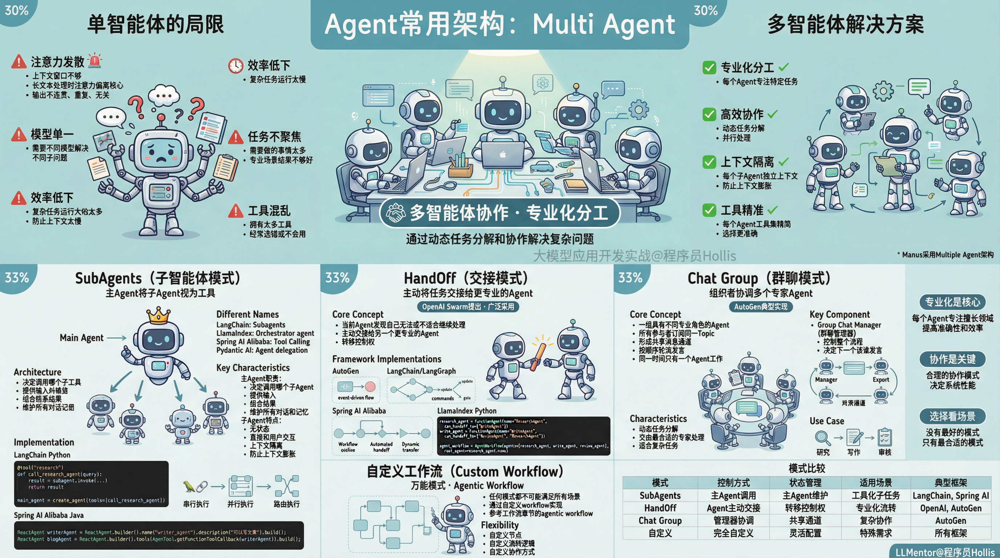
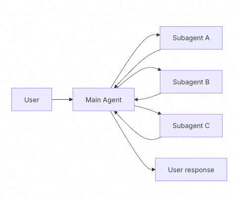
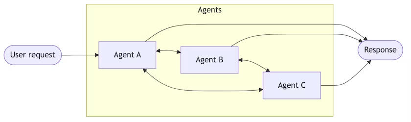
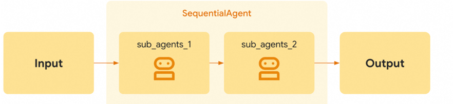
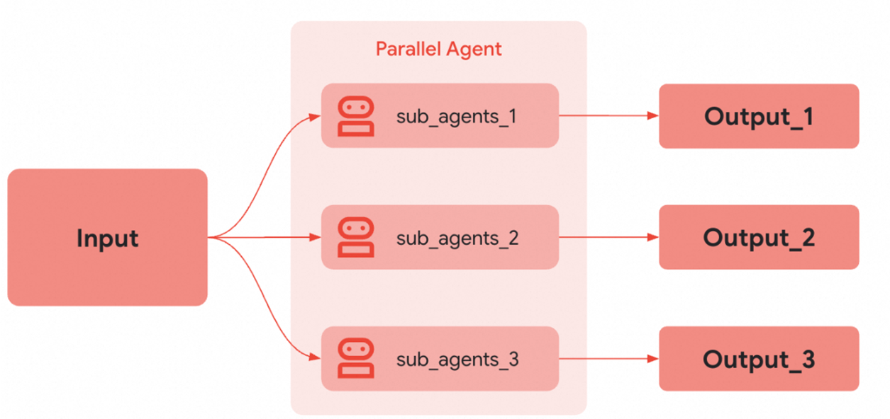

# ✅Agent常用架构：Multi Agent



多智能体（Multi-Agent）是指由多个Agent组成的系统，这些智能体能够**感知环境、做出决策、与其他智能体交互**，并协同或竞争以完成特定任务。

前面我们介绍了很多种智能体架构，但是都是单智能体架构，这些单智能体基本能够帮我们解决一些复杂的问题了。但是在实践过程中，仍然会有一些局限：

1、随着任务的复杂度的增加，单智能体会面临上下文窗口不够的问题，会存在经典的"注意力发散"问题，导致效果和性能下降。

注意力发散：在生成长文本或处理复杂输入时，大模型的注意力机制逐渐“偏离”核心主题或关键信息，导致输出内容变得不连贯、重复、无关甚至荒谬。

2、某些场景下，我们需要通过使用不同的模型来解决不同的单一子问题

3、复杂的任务，单智能体运行的效率太慢。

4、因为一个单智能体需要做的事情太多，会存在具体任务不够聚焦，尤其是一些特定专业场景，得到的结果不够好。

5、单个智能体拥有太多工具了，经常会选错工具或者不会用工具

以上这些问题，于是有了多智能体的方案，多智能体通过动态任务分解、专业化分工和协作来解决一个复杂的问题。这样的多智能体方案可以做专业化分工、高效的解决复杂问题。

其实，我们了解过了很多单智能体的方案之后，多智能体其实就在在单智能体的基础上做了任务的分工以及协作。（我们熟知的Manus 就是采用的 Multiple Agent 架构）

常见的协作模式

关于多智能体的常见的协作模式，网上有很多说法，不同的AI相关的公司都在尝试着定义概念。这个问题大家可以试着去google搜索下，或者通过AI问一下，你会发现得到的答案只会让你更懵逼。

为了把这个讲清楚，一方面结合我们做过的一些经验，另外我也几乎翻遍了主流的智能体框架的官方文档，总结出了几个我觉得我看了之后比较认可的一些模式吧。

SubAgents（最常见）

这个模式叫做子智能体模式，他也有不同的叫法：

LangChain：**Subagents**

LlamaIndex：**Orchestrator agent**

Spring AI Alibaba：**Tool Calling**

Pydantic AI：**Agent delegation **

总之核心思想就是，一个主Agent将其他子Agent视为工具（Tool），在需要时调用。控制器管理编排，而作为工具的子Agent执行特定任务并返回结果。



主Agent负责决定调用哪个子Agent，提供什么输入，以及如何组合结果。子Agent是无状态的——它们直接和用户交互，所有的对话和记忆都由主代理维护。这提供了上下文隔离：每个子代理的调用都在一个干净的上下文窗口中工作，防止主对话中的上下文膨胀。

因为在LangChain、LlamaIndex以及spring ai alibaba中都定义了这种模式，所以他们都提供了实现的方案。

如LangChain中实现的简单流程如下（官方示例）：

```
from langchain.tools import tool
from langchain.agents import create_agent

# Create a subagent
subagent = create_agent(model="anthropic:claude-sonnet-4-20250514", tools=[...])

# Wrap it as a tool
@tool("research", description="Research a topic and return findings")
def call_research_agent(query: str):
    result = subagent.invoke({"messages": [{"role": "user", "content": query}]})
    return result["messages"][-1].content

# Main agent with subagent as a tool
main_agent = create_agent(model="anthropic:claude-sonnet-4-20250514", tools=[call_research_agent])
```

在Spring AI Alibaba中，可用以下方式实现（官方示例）：

```
import com.alibaba.cloud.ai.graph.agent.ReactAgent;
import com.alibaba.cloud.ai.graph.agent.AgentTool;
import org.springframework.ai.chat.model.ChatModel;

// 创建子Agent
ReactAgent writerAgent = ReactAgent.builder()
.name("writer_agent")
.model(chatModel)
.description("可以写文章")
.tolls(...)
.instruction("你是一个知名的作家，擅长写作和创作。请根据用户的提问进行回答。")
.build();

// 创建主Agent，将子Agent作为工具
ReactAgent blogAgent = ReactAgent.builder()
.name("blog_agent")
.model(chatModel)
.instruction("根据用户给定的主题写一篇文章。使用写作工具来完成任务。")
.tools(AgentTool.getFunctionToolCallback(writerAgent))
.build();

// 使用
Optional<OverAllState> result = blogAgent.invoke("帮我写一个100字左右的散文");
```

HandOff

HandOff翻译成接管/交接，这种模式在很多框架中也有定义，比如Langchain、Spring AI Alibaba、Pydantic AI、OpenAI、Autogen等。几乎都叫做Hand off，最多有的加个前缀，有的在后面加个s啥的。（有的也叫swarm，但是比较少）

其核心思想是：**一个“当前”智能体在处理用户请求时，如果发现自己无法或不适合继续处理，它会主动将任务“交接”（hand off）给另一个更专业的智能体，并将控制权转移过去。**

这个概念最初由 OpenAI 在其 [Swarm](https://github.com/openai/swarm) 项目中提出和推广，现在已成为构建复杂、模块化 AI 应用的关键模式之一。



不同的框架提供了不同的实现思路，

- **AutoGen**: 使用**事件驱动**和**发布-订阅**（Pub/Sub）模型。每个智能体订阅一个特定的“主题”（Topic）。当一个智能体调用“交接工具”时，它会向目标智能体的主题发布一个包含完整上下文的新消息（`UserTask`），从而激活目标智能体。（<br>[https://microsoft.github.io/autogen/stable//user-guide/core-user-guide/design-patterns/handoffs.html](https://microsoft.github.io/autogen/stable//user-guide/core-user-guide/design-patterns/handoffs.html)<br>）
- **LangChain/LangGraph**: 将交接视为**图**（Graph）。交接工具会返回一个 `Command` 对象，该对象可以：
- **更新状态**（`update`）：改变 `current_step` 变量，让同一个智能体在下一轮使用不同的提示词和工具（单智能体动态配置）。
- **跳转节点**（`goto`）：直接指定下一个要执行的智能体节点（多智能体子图）。（<br>[https://docs.langchain.com/oss/python/langchain/multi-agent/handoffs](https://docs.langchain.com/oss/python/langchain/multi-agent/handoffs)<br>）
- **Spring AI Alibaba：**底层是参考了LangGraph的。
- **LlamaIndex：**LlamaIndex内置了一个AgentWorkflow，它本质上是一个预设了理解智能体、状态和工具调用的工作流。实现了自动化的智能体 Handoff。开发者只需定义多个专业化智能体并指定入口，框架即可在它们之间动态转移控制权，形成端到端的多智能体协作流水线。（<br>[https://developers.llamaindex.ai/python/framework/understanding/agent/multi_agent/#pattern-1--agentworkflow-ie-linear-swarm-pattern](https://developers.llamaindex.ai/python/framework/understanding/agent/multi_agent/#pattern-1--agentworkflow-ie-linear-swarm-pattern)<br>）

LlamaIndex中的简单实现（官网示例）

```
from llama_index.core.agent.workflow import AgentWorkflow, FunctionAgent

# --- create our specialist agents ------------------------------------------------
research_agent = FunctionAgent(
    name="ResearchAgent",
    description="Search the web and record notes.",
    system_prompt="You are a researcher… hand off to WriteAgent when ready.",
    llm=llm,
    tools=[search_web, record_notes],
    can_handoff_to=["WriteAgent"],
)

write_agent = FunctionAgent(
    name="WriteAgent",
    description="Writes a markdown report from the notes.",
    system_prompt="You are a writer… ask ReviewAgent for feedback when done.",
    llm=llm,
    tools=[write_report],
    can_handoff_to=["ReviewAgent", "ResearchAgent"],
)

review_agent = FunctionAgent(
    name="ReviewAgent",
    description="Reviews a report and gives feedback.",
    system_prompt="You are a reviewer…",  # etc.
    llm=llm,
    tools=[review_report],
    can_handoff_to=["WriteAgent"],
)

# --- wire them together ----------------------------------------------------------
agent_workflow = AgentWorkflow(
    agents=[research_agent, write_agent, review_agent],
    root_agent=research_agent.name,
    initial_state={
        "research_notes": {},
        "report_content": "Not written yet.",
        "review": "Review required.",
    },
)

resp = await agent_workflow.run(
    user_msg="Write me a report on the history of the web …"
)
print(resp)
```

在多个智能体的流转上，不一定非要串行执行，也可以支持并行、路由等方案。





Chat Group

上面的hand off这种模式中，是由当前agent主动移交给下一个agent的，那还有一种可以引入一个组织者的方案。

这种模式比较典型的就是autogen中的chat group（群聊）模式。

群聊模式是指：一组具有不同专业角色的智能体（Agents）

- 所有参与者都**订阅同一个“话题”**（Topic），形成一个共享的消息通道。
- 智能体**按顺序轮流发言**，同一时间只有一个智能体在工作（sequential execution）。
- 整个流程由一个特殊的 **“群聊管理器”**（Group Chat Manager） 控制，负责决定**下一个该谁发言**。

这种模式特别适合将**复杂任务动态分解**为多个子任务，并交由最合适的专家智能体处理。

自定义工作流

除了上面的一些模式外，其实还有很多其他的模式，不同的框架都会定义一些自己的模式。就不一一介绍了。

不过，任何一种模式都不可能满足所有场景，所以，还有一种万能模式，那就是自定义，通过自定义workflow也算是一个比较典型的模式，其实就是哦我们在工作流章节介绍的agentic workflow。

---

来源: https://thoughts.aliyun.com/workspaces/6963289eb0fc2e001bb052eb/docs/6983480bc71a890001c07485
