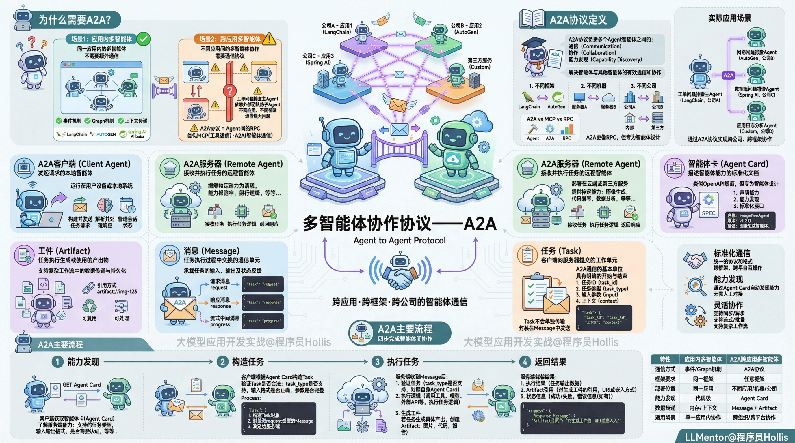
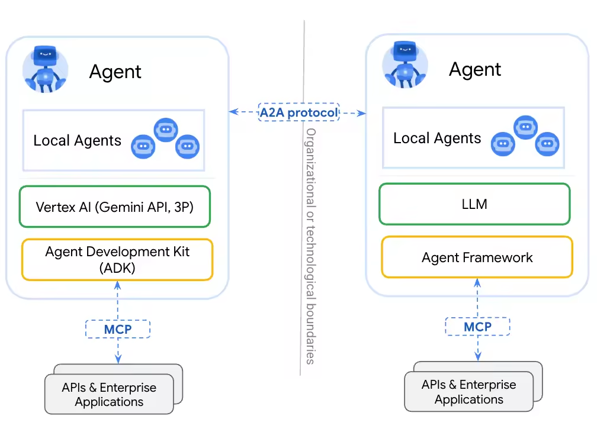
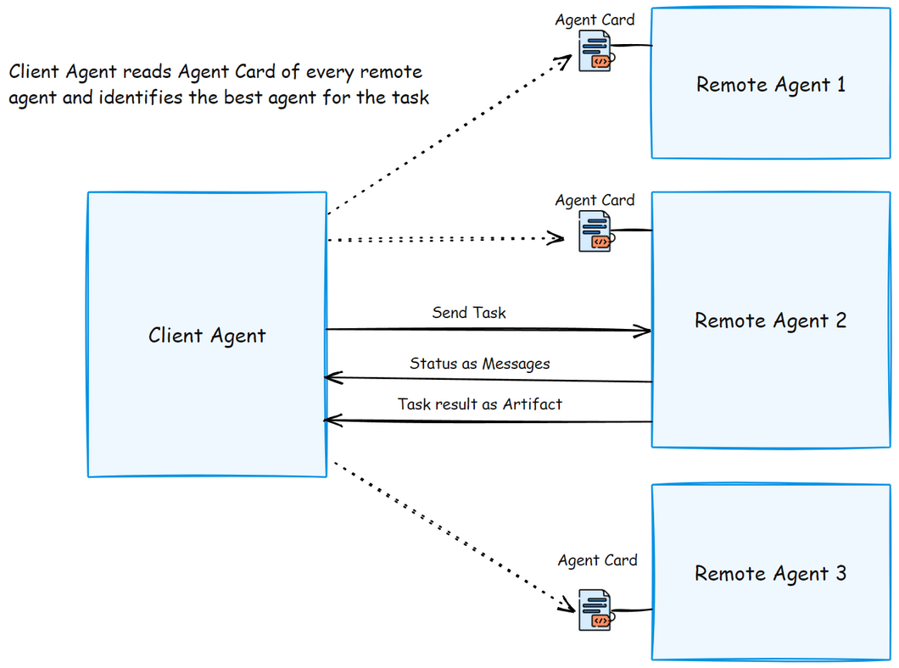
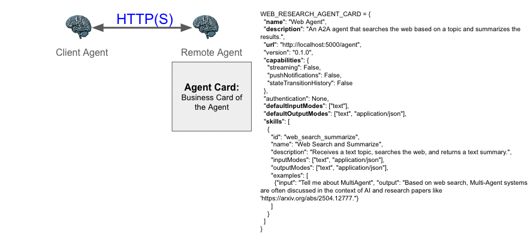
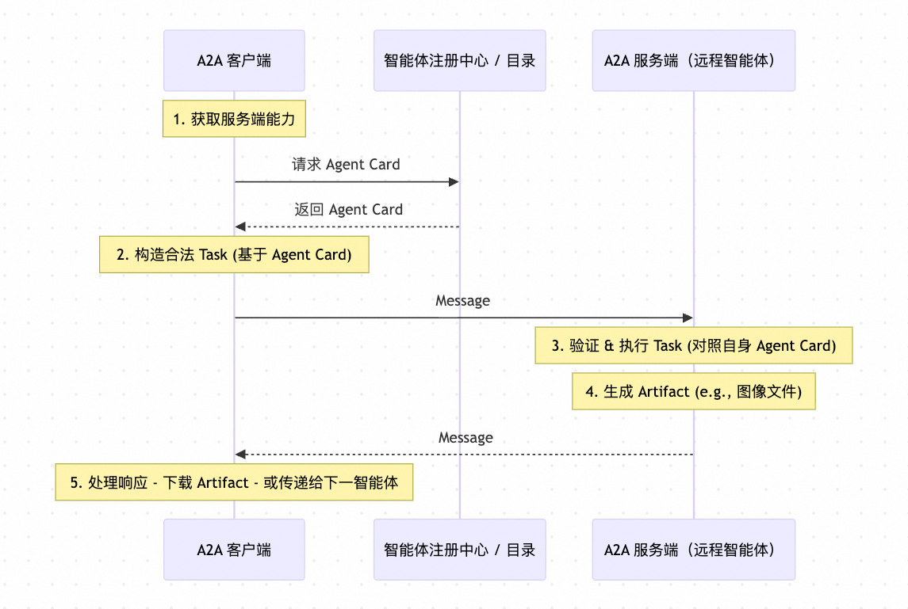

# ✅多智能体协议——A2A



前面我们介绍了多智能体，也介绍了几种实现多智能体的方案，包括SubAgent、HandOff以及ChatGrpoup等等。使用langchain/langgraph、autogen、包括spring ai alibaba，我们都可以在一个应用内实现一个multi agent。

如果实在一个应用内部的多智能体，其实是不需要额外的通信的，我们完全可以借助框架给我们提供的比如事件机制、Graph机制等等实现上下文的传递和通信。

但是，有一种多智能体，是多个不同应用间协作，整体组成一个多agent的话，那么就需要有一个通信方式，比如我开发了一个工单问题排查的主Agent，但是需要依赖几个外部团队提供的多个子问题排查的Agent。但是我们不是同一个应用中的，我们之间的通信就是个大问题。

我们之前介绍过，Agent如果想要和工具通信，可以通过MCP协议，那其实google也提出过一个可以让多个agent之间通信的协议，那就是A2A协议——Agent to Agent Protocol



**A2A 也是个协议，他是负责多个 Agent 智能体之间的通信、协作和能力发现的。****解决了智能体与其他使用不同框架、部署在不同机器、不同公司的智能体进行有效通信和协作的问题。**

与其说A2A和MCP很像，倒不如说A2A和RPC有点像。

A2A关键组件

以下是 A2A 协议的关键组件及其作用：



**A2A 客户端（Client Agent）**

发起请求或任务的本地智能体。通常运行在用户设备或本地系统中，代表用户或其他系统发起协作，作用：

- 构建并发送任务请求给远程智能体（A2A 服务器）。
- 解析并处理来自远程智能体的响应。
- 管理与远程智能体的会话状态和上下文。

**A2A 服务器（Remote Agent）**

接收并执行任务请求的远程智能体。可部署在云端或第三方服务中，提供特定能力（如图像生成、代码编写、数据分析等）。作用：

- 接收来自 A2A 客户端的任务。
- 执行任务逻辑（可能涉及推理、调用工具、生成内容等）。
- 返回结构化的响应（包括消息、工件等）。

**智能体卡（Agent Card）**

描述智能体能力、接口和元数据的标准化文档。作用：

- 声明智能体支持的任务类型、输入/输出格式、依赖项、权限要求等。
- 供客户端发现和理解远程智能体的功能。
- 类似于 OpenAPI 规范，但专为智能体设计。



**内容示例**：

- 名称、版本、描述
- 支持的任务列表
- 输入/输出 schema
- 认证方式、速率限制等

**任务（Task）**

客户端向服务器提交的一个具体工作单元。任务是 A2A 通信的基本单位，具有明确的开始与结束。结构：

- 任务 ID（唯一标识）
- 任务类型（对应智能体卡中声明的能力）
- 输入参数（结构化数据）
- 上下文（可选，用于多轮对话或状态传递）

```
{
  "task_id": "t-789",
  "task_type": "code_interpretation",
  "input": { "code": "print('Hello A2A')" }
}
```

**消息（Message）**

任务执行过程中交换的通信单元。承载任务的输入、输出及状态反馈。

- **类型**：
- 请求消息（客户端 → 服务器）
- 响应消息（服务器 → 客户端）
- 流式中间消息（用于长任务的进度更新）
- **内容**：
- 文本、结构化数据、错误信息等
- 可包含对工件的引用

Task不会单独在网络上传输，而是封装在一条 Message 中（通常是第一条请求消息）从客户端发送给服务端。

```
{
  "message_id": "m-001",
  "task_id": "t-789",
  "role": "request",
  "content": {
    "task": { /* 上面的 task 结构 */ }
  }
}

{
  "message_id": "m-002",
  "task_id": "t-789",
  "role": "response",
  "content": { "output": "Hello A2A" }
}
```

**工件（Artifact）**

任务执行过程中生成或使用的具体产出物或资源。支持复杂工作流中的数据传递与持久化。

- **示例**：
- 生成的图像、代码文件、报告
- 中间计算结果、日志、缓存数据
- **特点**：
- 通常以 URI 或嵌入方式在消息中引用。
- 可被其他智能体复用或进一步处理。

A2A主要流程



1、客户端首先需要知道远程智能体能做什么。它通过获取 智能体卡（Agent Card） 来了解服务端支持的任务类型、输入输出格式、是否需要认证等信息。

2、客户端根据 Agent Card 中声明的能力，构造一个合法的 Task。将该 Task 封装进一条 request 类型的 Message，发送给服务端。

3、服务端收到 Message 后，验证 task_type 是否支持（对照自身 Agent Card），执行任务逻辑（可能调用工具、模型、外部 API 等），若任务生成具体产出（如图片、代码文件、报告等），则创建 Artifact。

4、服务端将结果（包括对 Artifact 的引用）封装进 response Message。

---

来源: https://thoughts.aliyun.com/workspaces/6963289eb0fc2e001bb052eb/docs/6983481c51b144000130ed06
