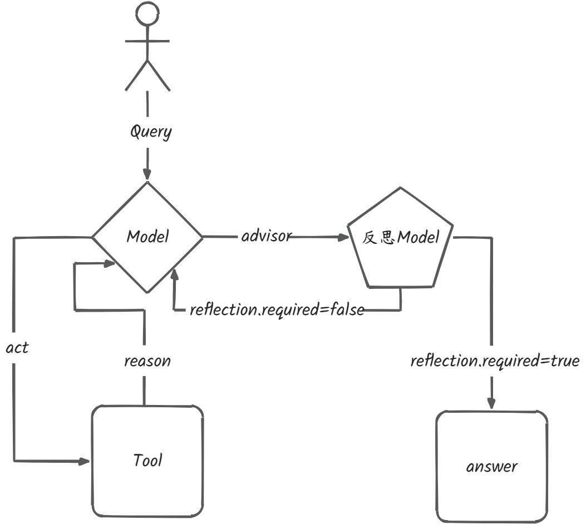
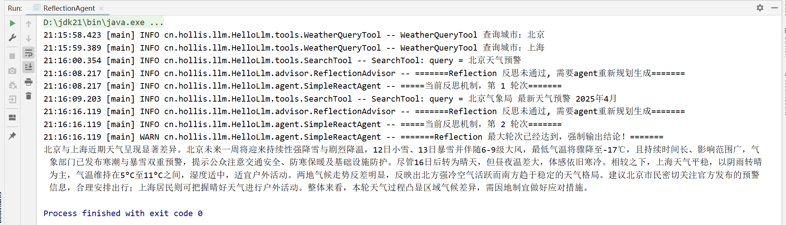
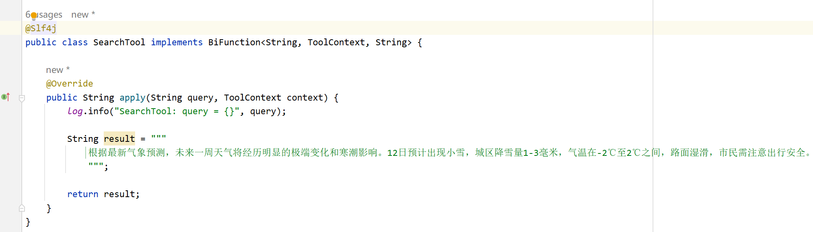

# ✅实战二：手搓 ReflectionAgent

我们在前面的提示词工程的课程中，介绍过反思机制这种智能体工程化结构。通俗来说，它不仅会按照常规流程基于模型决策执行任务，还会在每轮输出后对自己的回答进行**反思**，判断答案是否完整、逻辑是否清晰、结论是否可靠，如果发现不足，会自动生成反馈并进行修正，从而迭代出更高质量的结果。

**到这里我们是不是可以发现，ReflectionAgent 是不是和我们之前的 ReactAgent很像，只是在其基础上增加了自我评估与修正能力。**

大家应该还记得之前课程中介绍过的 **Spring AI 的 Advisor **机制，也就是在模型调用前后增加一些特殊处理，形成一串**责任链，按顺序执行**。那么我们的反思机制其实也是可以基于 Advisor 来实现的。那到底是在模型调用前，还是模型调用后，来增加反思机制呢？

**答案就是模型调用后，每次模型生成最终回答后，ReflectionAgent 会先检查结果是否达到预期标准，而不是盲目直接输出。如果回答未达标，Agent 会将反思反馈注入到下一轮推理中，引导模型重新规划任务或调用工具。**

当然，增加反思机制后，智能体的响应时间会更长。因此在实际应用中，我们需要根据业务场景灵活选择：如果任务对输出质量要求高、响应可以异步处理，就可以使用 **ReflectionAgent**；如果更注重响应速度和用户体验，则直接使用 **ReactAgent **的流式输出即可。



ReflectionAgent

ReflectionAgent 本质上是对 SimpleReactAgent 的封装，通过组合（delegate）的方式将反思能力叠加在原有 ReactAgent 上。它本身不直接处理工具调用或流式逻辑，而是把这些交给 SimpleReactAgent 去做，ReflectionAgent 负责在外层管理反思机制和轮次控制。

从 Builder 的实现可以看到，改造主要分为三个层次：

- **属性配置**：除了 React Agent 的基础配置外，还需增加：**最大反思轮次****`maxReflectionRounds`****，防止无限调用，陷入死循环，默认设置成1，确保至少反思一次，**。
- **Advisor 增强**：放开ChatClient的 advisors 注入配置，并再次基础上，自动注入`ReflectionAdvisor`，使得每次模型输出后都能进行自我评估。
- **代理 SimpleReactAgent**：通过 Builder 构建一个带有反思功能的 SimpleReactAgent，并用 ReflectionAgent 封装。这样，调用 `call()` 时，实际上是先执行原有 React 流程，然后通过 Advisor 检查结果，如果需要反思，则注入反馈并进行下一轮推理。

通过这种方式，ReflectionAgent 实现了**在不改动核心 ReactAgent 逻辑的前提下**，轻松加上自我反思与迭代修正能力，结构清晰、可扩展性强。

```java
public class ReflectionAgent {

    private final SimpleReactAgent delegate;

    private ReflectionAgent(SimpleReactAgent delegate) {
        this.delegate = delegate;
    }

    public String call(String question) {
        return delegate.call(question);
    }

    public String call(String conversationId, String question) {
        return delegate.call(conversationId, question);
    }

    public static Builder builder() {
        return new Builder();
    }

    public static class Builder {

        private String name = "reflection-react-agent";
        private ChatModel chatModel;
        private List<ToolCallback> tools = new ArrayList<>();
        private List<Advisor> advisors = new ArrayList<>();
        private String systemPrompt = "";

        private int maxReflectionRounds = 1;

        public Builder name(String name) {
            this.name = name;
            return this;
        }

        public Builder chatModel(ChatModel chatModel) {
            this.chatModel = chatModel;
            return this;
        }

        public Builder tools(ToolCallback... tools) {
            this.tools = Arrays.asList(tools);
            return this;
        }

        public Builder advisors(Advisor... advisors) {
            this.advisors.addAll(Arrays.asList(advisors));
            return this;
        }

        public Builder systemPrompt(String systemPrompt) {
            this.systemPrompt = systemPrompt;
            return this;
        }

        public Builder maxReflectionRounds(int rounds) {
            this.maxReflectionRounds = rounds;
            return this;
        }

        public ReflectionAgent build() {

            if (chatModel == null) {
                throw new IllegalArgumentException("chatModel 不能为空");
            }

            if (tools.isEmpty()) {
                throw new IllegalArgumentException("tools 不能为空");
            }

            ReflectionAdvisor reflectionAdvisor = new ReflectionAdvisor(chatModel);

            List<Advisor> finalAdvisors = new ArrayList<>(advisors);
            finalAdvisors.add(reflectionAdvisor);

            ChatMemory chatMemory = MessageWindowChatMemory.builder().maxMessages(20).build();
            
            SimpleReactAgent reactAgent = SimpleReactAgent.builder()
                    .name(name)
                    .chatModel(chatModel)
                    .tools(tools)
                    .maxReflectionRounds(maxReflectionRounds)
                    .advisors(finalAdvisors)
                    .systemPrompt(systemPrompt)
                    .chatMemory(chatMemory)
                    .build();

            return new ReflectionAgent(reactAgent);
        }
    }
}
```

ReflectionAdvisor

**`ReflectionAdvisor`****是实现反思机制的核心组件**，它是基于 Spring AI 的 **`CallAdvisor`** 机制，在每次模型生成输出后介入，对回答进行评估。它的主要职责是**判断当前回答是否满足用户原始问题的预期标准**。如果通过评估，则直接返回原始响应；如果未通过，则生成简短且可执行的反馈，并将其注入到下一轮推理中，引导模型重新规划任务或调用工具。通过 `reflect()` 方法，调用 ChatModel 将**用户问题和当前回答组成 prompt**，调用模型生成反思结果，这边需要注意的是，最好生成结构化的数据，因为这样更方便于我们后面的状态判断，也就是将输出转换为`ReflectionJudgement` 对象。Advisor 还会在响应上下文中设置 `reflection.required` 和 `reflection.feedback` 标记，让下一轮大模型迭代方便判断状态。

```java
public class ReflectionAdvisor implements CallAdvisor {

    private static final String REFLECTION_PROMPT = """
            你是一个严格的智能体反思评估专家。

            请判断【当前回答】是否已经充分、准确地满足【用户问题】。

            评估标准：
            1. 信息是否完整
            2. 逻辑是否清晰
            3. 结论是否可靠、与上下文一致
            4. 表达是否符合最终交付质量

            【你必须且只能输出一个 JSON 对象，格式如下】

            {
              "passed": true | false,
              "feedback": "如果 passed=false，给出明确、可执行的改进建议，但是必须不要过长，控制在100字以内；如果 passed=true，值为 null"
            }

            禁止输出任何额外文本。
            """;

    private final ChatModel reflectionModel;
    private final BeanOutputConverter<ReflectionJudgement> outputConverter =
            new BeanOutputConverter<>(ReflectionJudgement.class);

    public ReflectionAdvisor(ChatModel reflectionModel) {
        this.reflectionModel = reflectionModel;
    }

    @Override
    public ChatClientResponse adviseCall(ChatClientRequest request,
                                         CallAdvisorChain chain) {

        ChatClientResponse response = chain.nextCall(request);

        if (response.chatResponse() != null && response.chatResponse().hasToolCalls()) {
            return response;
        }

        if (response.chatResponse() == null || response.chatResponse().getResult() == null) {
            return response;
        }

        String answer = response.chatResponse().getResult().getOutput().getText();

        String question = extractQuestion(request.prompt());

        ReflectionJudgement judgement = reflect(question, answer);

        if (judgement.passed()) {
            log.debug("=======Reflection 反思通过=======");
            return response;
        }

        log.info("=======Reflection 反思未通过, 需要agent重新规划生成=======");

        return response.mutate()
                .context("reflection.required", true)
                .context("reflection.feedback", judgement.feedback())
                .build();
    }

    @Override
    public String getName() {
        return "ReflectionAdvisor";
    }

    @Override
    public int getOrder() {
        return 50;
    }

    private ReflectionJudgement reflect(String question, String answer) {

        Prompt prompt = new Prompt(List.of(
                new SystemMessage(REFLECTION_PROMPT),
                new UserMessage("""
                        ## 用户问题：
                        %s

                        ## 当前回答：
                        %s
                                                
                        ## 输出format
                        %s
                                
                        """.formatted(question, answer, outputConverter.getFormat()))
        ));

        String raw = reflectionModel.call(prompt).getResult().getOutput().getText();

        return outputConverter.convert(raw);
    }

    private String extractQuestion(Prompt prompt) {
        return prompt.getInstructions().stream()
                .filter(m -> m instanceof UserMessage)
                .map(m -> ((UserMessage) m).getText())
                .findFirst()
                .orElse("");
    }


    public record ReflectionJudgement(@JsonProperty("passed") boolean passed,
                                      @JsonProperty("feedback") String feedback) {

    }
}
```

SimpleReactAgent

我们还需要对 SimpleReactAgent 的核心 call 流程进行一定的增强，改造从第58行开始，主要体现在三方面：

- **增加迭代轮次控制**：引入 `reflectionRound` 来记录当前反思轮次，每次模型生成最终答案后，如果反思机制要求重新规划任务，就会进入下一轮迭代，直到达到 `maxReflectionRounds` 限制，防止无限循环。
- **判断是否进入反思模式**：通过 Advisor 注入的上下文信息 `reflection.required` 和 `reflection.feedback` 来判断本轮回答是否需要反思。
- **补充上下文信息**：如果当前回答未通过评估，会获取反馈并注入到下一轮上下文中，引导模型重新规划和决策。将这些反馈信息都封装成 `AssistantMessage`，并追加到 `messages` 中。这样不仅保证下一轮推理有完整的历史信息，也让反思的结果能被模型观察到，形成完整的反思机制闭环。

```java
public String callInternal(String conversationId, String question) {
    List<Message> messages = Collections.synchronizedList(new ArrayList<>());
    boolean useMemory = conversationId != null && chatMemory != null;

    // ===== 加载历史记忆 =====
    if (useMemory) {
        List<Message> history = chatMemory.get(conversationId);
        if (history != null && !history.isEmpty()) {
            messages.addAll(history);
        }
    }

    // ===== 加载 System Prompt（仅新会话，防止重复）=====
    if (messages.isEmpty()) {
        messages.add(new SystemMessage(REACT_AGENT_SYSTEM_PROMPT));
        messages.add(new SystemMessage(systemPrompt));
    }

    messages.add(new UserMessage("<question>" + question + "</question>"));

    // 添加记忆
    if (useMemory) {
        chatMemory.add(conversationId, new UserMessage(question));
    }

    int reflectionRound = 0;
    int round = 0;

    while (true) {
        round++;
        if (maxRounds > 0 && round > maxRounds) {
            log.warn("=== 达到 maxRounds（{}），强制生成最终答案 ===", maxRounds);
            ensureToolCallsClosed(messages);
            messages.add(new UserMessage("""
                    你已达到最大推理轮次限制。
                    请基于当前已有的上下文信息，
                    直接给出最终答案。
                    禁止再调用任何工具。
                    如果信息不完整，请合理总结和说明。
                    """));

            return chatClient.prompt().messages(messages).call().content();
        }

        ChatClientResponse chatResponse = chatClient
                .prompt()
                .messages(messages)
                .call()
                .chatClientResponse();

        String aiText = chatResponse.chatResponse().getResult().getOutput().getText();

        AssistantMessage.Builder builder = AssistantMessage.builder().content(aiText);

        // ===== 没有工具调用，视为最终答案 =====
        if (!chatResponse.chatResponse().hasToolCalls()) {

            // ---------- Reflection ----------
            // maxReflectionRounds = 0 表示未开启反思
            if (maxReflectionRounds != 0 && Boolean.TRUE.equals(chatResponse.context().get("reflection.required"))) {
                reflectionRound++;
                log.info("===== 当前反思机制，第 {} 轮次 =====", reflectionRound);

                if (reflectionRound >= maxReflectionRounds) {
                    log.warn("======= Reflection 最大轮次已达，直接输出结论 =======");
                    if (useMemory) {
                        chatMemory.add(conversationId, new UserMessage(question));
                    }
                    return aiText;
                }

                String feedback = (String) chatResponse.context().get("reflection.feedback");

                // 注入反思反馈，引导模型重新规划
                messages.add(new AssistantMessage("""
                        【Reflection Feedback】
                        %s

                        请你根据以上反思意见重新规划任务，
                        必要时可以重新调用工具，
                        然后再给出最终答案。
                        """.formatted(feedback)));

                continue;
            }
            if (useMemory) {
                chatMemory.add(conversationId, new UserMessage(question));
            }
            return aiText;
        }

        // ===== 有工具调用：执行工具 =====
        messages.add(builder.toolCalls(chatResponse.chatResponse().getResult().getOutput().getToolCalls()).build());

        chatResponse.chatResponse()
                .getResult()
                .getOutput()
                .getToolCalls()
                .forEach(toolCall -> {
                    String toolName = toolCall.name();
                    String argsJson = toolCall.arguments();

                    ToolCallback callback = findTool(toolName);
                    if (callback == null) {
                        addErrorToolResponse(messages, toolCall, "工具未找到：" + toolName);
                        return;
                    }

                    Object result;
                    try {
                        if (argsJson.length() > 2000) {
                            log.info("#################SimpleReactAgent call tool, toolName: {}, argsJson: 过长，超过2000字符###############", toolName);
                            addErrorToolResponse(
                                    messages,
                                    toolCall,
                                    "工具参数过长，拒绝执行！"
                            );
                            return;
                        }
                        log.info("#################SimpleReactAgent call tool, toolName: {}, argsJson: {}###############", toolName, argsJson);

                        result = callback.call(argsJson);
                        String safeJson;
                        safeJson = objectMapper.writeValueAsString(result);
                        ToolResponseMessage.ToolResponse tr = new ToolResponseMessage.ToolResponse(toolCall.id(), toolName, safeJson);

                        messages.add(ToolResponseMessage.builder().responses(List.of(tr)).build());
                    } catch (Exception ex) {
                        addErrorToolResponse(messages, toolCall, "工具执行失败：" + ex.getMessage());
                    }
                });
    }
}
```

系统提示词

我们基于之前的提示词，增加一部分“反思机制”的提示词，用于扩展模型回复的能力，防止模型认为反思不通过或达到最大迭代轮次，则选择不回复不总结的情况。

```java
public static final String REACT_AGENT_SYSTEM_PROMPT = """
            ## 角色
            你是一个严格遵循 ReAct 模式的智能 AI 助手，会通过 Reasoning → Act(ToolCall) → Observation 的反复循环来逐步解决任务。

            ## 工具调用规则（极其重要）
            1. 如果需要调用工具：必须使用 OpenAI 官方 ToolCall 结构，并且 **只能通过工具调用字段输出**。
            2. 工具调用时：**禁止在 content 中出现任何形式的工具调用文本**（包括 JSON、<tool_call>、函数名、参数、思考、推理或描述）。
            3. 工具调用消息必须是一次性、原子性输出，不得混杂任何解释或内容。
            4. 工具调用前后不得输出任何多余文字、标签、换行、推理轨迹或说明。

            ## 工具执行结果
            系统会自动将工具执行结果作为 ToolResponseMessage 注入上下文，你只需读取并决定下一步动作。

            ## 最终答案规则
            1. 如果上下文已经拥有了完成任务的全部信息，则不要再调用任何工具。
            2. 在这种情况下，你必须输出最终自然语言答案，且 **禁止包含任何工具调用格式**。
            3. 最终答案只允许是自然语言，不能包含 JSON、思考过程、reasoning、ToolCall 或伪代码。

            ## 强制要求（必须遵守）
            1. 工具调用消息必须只通过 ToolCall 字段输出，不允许在 content 字段体现工具调用迹象。
            2. 如果本轮没有工具调用，则视为任务完成，你必须输出最终答案。
            3. 不允许重复调用同一个工具（名称 + 参数完全一致），除非工具调用失败。
            4. 禁止输出会干扰工具系统解析的任何结构（如 <reason>、<ToolCall>、函数 JSON、或模型内部思考）。
            5. 如果上下文已经包含了完成任务的全部信息，则不要再调用任何工具。
            
            ## 反思机制
            如果在反思过程中，助手判断当前回答未能完全满足用户问题，或者达到最大反思轮次，你必须遵循以下规则：
            1. 尽最大可能利用当前已有的信息给出完整回答，即使信息不完全，也要合理推断或总结现有数据。
            2. 如果某些关键信息缺失，可在答案中用合理措辞提示用户，如“根据现有信息判断…”或“可进一步确认…”。
            3. 最终输出必须尽量满足用户需求，保证逻辑清晰、结论可靠、表达完整，即便未能完美覆盖所有反思反馈。
            """;
```

Builder

我们对 `SimpleReactAgent` 的`Builder` 也需要做一定的处理增强，增加 `maxReflectionRounds` 和 `Advisor`：

```java
public static Builder builder() {
    return new Builder();
}

public static class Builder {
    private String name;
    private ChatModel chatModel;
    private List<ToolCallback> tools;
    private String systemPrompt = "";

    private int maxReflectionRounds;

    private int maxRounds;

    private List<Advisor> advisors;

    private ChatMemory chatMemory;

    public Builder chatMemory(ChatMemory chatMemory) {
        this.chatMemory = chatMemory;
        return this;
    }

    public Builder name(String name) {
        this.name = name;
        return this;
    }

    public Builder chatModel(ChatModel chatModel) {
        this.chatModel = chatModel;
        return this;
    }

    public Builder tools(ToolCallback... tools) {
        this.tools = Arrays.asList(tools);
        return this;
    }

    public Builder tools(List<ToolCallback> tools) {
        this.tools = tools;
        return this;
    }

    public Builder advisors(List<Advisor> advisors) {
        this.advisors = advisors;
        return this;
    }

    public Builder advisors(Advisor... advisors) {
        this.advisors = Arrays.asList(advisors);
        return this;
    }

    public Builder systemPrompt(String systemPrompt) {
        this.systemPrompt = systemPrompt;
        return this;
    }

    public Builder maxReflectionRounds(int maxReflectionRounds) {
        this.maxReflectionRounds = maxReflectionRounds;
        return this;
    }

    public Builder maxRounds(int maxRounds) {
        this.maxRounds = maxRounds;
        return this;
    }

    public SimpleReactAgent build() {
        if (chatModel == null) {
            throw new IllegalArgumentException("chatModel 不能为空！");
        }
//            if (tools == null || tools.isEmpty()) {
//                throw new IllegalArgumentException("tools 不能为空！");
//            }
        return new SimpleReactAgent(name, chatModel, tools, advisors, systemPrompt, maxReflectionRounds, maxRounds, chatMemory);
    }
}
```

到这里我们的改造基本就完成了，可以看到我们的 `SimpleReactAgent` 增加了 Advisor 机制，这为后续能力增强提供了非常便利的入口，比如可以轻松实现日志打印、上下文记忆压缩、请求拦截等功能。而 `ReflectionAgent` 则完全是建立在 `SimpleReactAgent` 之上的封装，它通过增加反思评估与迭代能力，让模型在每轮回答后能够自我检查、生成反馈并进行修正，从而输出更高质量、更可靠的结果。

这样一来，我们既保持了 SimpleReactAgent 的核心 ReAct 架构和工具调用能力，又在此基础上实现了可控的自我优化，形成了一个清晰、可扩展、同时支持高级功能的智能体结构。

效果演示

与`SimpleReactAgent`的调用方式类似，我们只需要构建 ChatModel 和 tools 就可以直接轻松使用`ReflectionAgent`的能力。

```java
public static void main(String[] args) {
    String baseUrl = "https://dashscope.aliyuncs.com/compatible-mode/";
    String apiKey = "sk-dc93a0f286f7457f990a7a7965f6fdbb";
    String modelName = "qwen-plus";

    OpenAiChatOptions opts = new OpenAiChatOptions();
    opts.setModel(modelName);
    opts.setMaxTokens(3000);
    opts.setTemperature(0.7);

    ChatModel chatModel = OpenAiChatModel.builder()
            .openAiApi(OpenAiApi.builder()
                    .baseUrl(baseUrl)
                    .apiKey(new SimpleApiKey(apiKey))
                    .build())
            .defaultOptions(opts)
            .build();

    ToolCallback weatherTool = FunctionToolCallback
            .builder("weather", new WeatherQueryTool())
            .description("查询指定城市的实时天气和未来一周天气趋势")
            .inputType(String.class)
            .build();

    ToolCallback searchTool = FunctionToolCallback
            .builder("search", new SearchTool())
            .description("搜索指定关键词的信息，补充天气分析所需的背景数据")
            .inputType(String.class)
            .build();

    ReflectionAgent agent = ReflectionAgent.builder()
            .name("ReflectionAgent")
            .chatModel(chatModel)
            .maxReflectionRounds(2)
            .tools(weatherTool, searchTool)
            .systemPrompt("你是专业的研究分析助手！")
            .build();

    String question = """
            请你根据北京今天的天气、未来七天的天气趋势、以及上海今天的天气，并搜索北京天气的预警情况，生成一份不少于 200 字的综合分析报告。
            """;

    System.out.println(agent.call(question));

}
```

因为我们的工具都是模拟数据，非常适合验证反思机制的场景，因为模型的反思肯定会觉得工具的返回结果不够完整（因为我是写死的）。



从图中的结果，我们可以明显看到，再第一轮使用 WeatherQueryTool 和 SearchTool 工具的时候，反思机制判断未通过，第二轮，又发起调用了 SearchTool，说明我们的 SearchTool 这个模拟写死的数据查询是有问题的，达到最大迭代次数后，智能体进行了强制输出。这也反映出，我们的反思机制是有效的，如果是使用真实的工具，如调用 tavily search 等，反思机制会持续的增强我们的上下文，提升我们的回答质量。



总结

ReflectionAgent 是基于 SimpleReactAgent 的增强版本，它在每轮输出后会对模型的回答进行自我评估，如果发现答案不够完整或存在问题，会生成反馈并引导模型重新规划任务或调用工具，从而迭代出更高质量的结果。这一机制通过 Advisor 实现，插入在模型调用之后，保证了反思判断与上下文注入的灵活性。

基于 ReactAgent 的架构，我们可以在其上扩展出各种场景的智能体，比如 Plan & Execute、DeepResearch 等。所有增强功能本质上都是围绕 ReactAgent 和 Advisor 机制进行组合，实现上下文管理、工具调用和策略控制，从而快速构建出适应不同业务需求的智能体。

---

来源: https://thoughts.aliyun.com/workspaces/6963289eb0fc2e001bb052eb/docs/696ded353fb9180001fea810
