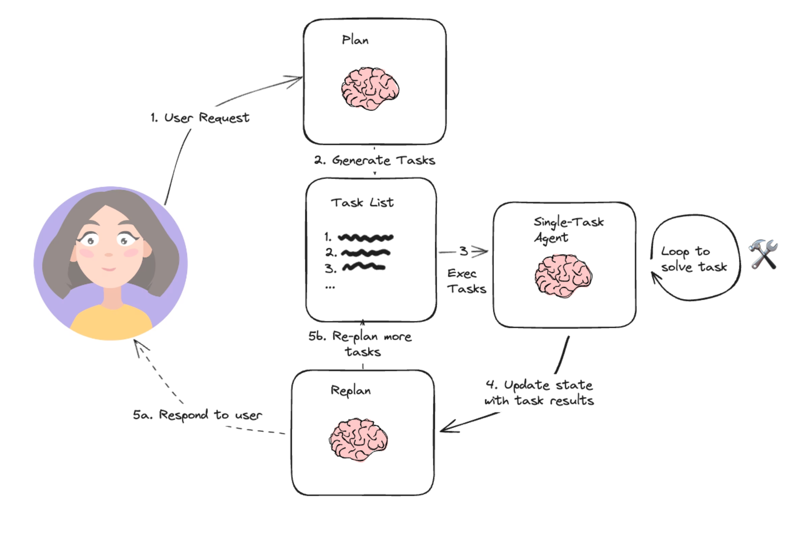

# ✅实战三：手搓 PlanExecuteAgent（上）

什么是Plan & Execute ?

在前面的 **ReactAgent**、**ReflectionAgent** 中，我们已经看到了非常典型的 **「一步一决策」** 的智能体模式：

- 模型 → 判断要不要用工具
- 执行工具 → 观察结果
- 再判断下一步

这种模式非常适合**短链路、即时决策**的问题，但一旦任务具备以下特征，就会开始显得吃力：

- 目标复杂，需要全局观察，**执行多步才能完成**
- 中间步骤存在明显的**阶段性成果**
- 部分步骤**可以并行**，部分步骤**必须串行**
- 最终结果不是简单的几段话，而是**完整的分析报告**

这类问题，本质上不是一步步想，而是**先想清楚要做哪些事，再一件一件把事做完。**这正是 **Plan & Execute** 架构要解决的问题。

**Plan & Execute** 是一种将智能体决策过程显式拆分为主要两个阶段的架构模式：

**Plan（规划）阶段**

模型不做任何实际执行，只负责：

- 判断是否需要使用工具
- 拆解任务
- 明确每一步要调用什么工具
- 定义步骤之间的依赖关系

**Execute（执行）阶段**

系统按照执行计划：

- 串行 / 并行调用工具
- 收集结果
- 将结果反馈给模型用于后续判断

这和 React 最大的区别在于：**React 是“边想边做”，Plan & Execute 是“先想清楚，再做”。**

**主要流程**



上图是 LangChain 官网的 Plan & Execute 流程图，可以清晰的看到。它并不是一次性完成任务的流程，而是一个**围绕全局状态反复的迭代执行**。它的核心目标不是尽快给出答案，而是**在复杂、多步骤任务中，保证每一步的决策、执行和结果都可控、可追踪、可修正**。

这里我将整个流程，抽象拆分为：**规划、执行、批判、压缩、迭代与总结这6个阶段。**

**全局状态**

我们从 Plan & Execute 的整体流程中可以感受到，这种 Agent 的核心并不是某一次模型调用，而是**围绕一个全局状态持续进行的多轮迭代与收敛过程**。因此，在设计 PlanExecuteAgent 时，第一件事情并不是编排执行逻辑，而是构建一个统一的全局状态实体：`OverAllState`，它可以用于承载用户的原始问题、当前可见的上下文消息，以及每一轮规划、执行与评估所产生的结构化结果。这个状态对象贯穿整个 Agent 的生命周期，是后续所有决策、判断与状态演进的唯一事实来源。

之所以在一开始就显式引入全局状态，而不是简单依赖 message 列表，是因为 Plan & Execute 天生就是一个**多轮、非线性**的执行过程。在这样的流程中，如果仅依靠对话消息堆叠，很容易出现上下文漂移、关键信息丢失，或者执行结果被后续推理无意覆盖的问题。只有将“用户目标”“执行计划”“工具调用结果”“批判结论”等关键信息统一收敛到结构化状态中，才能在多轮迭代过程中保证上下文的稳定性和一致性，同时也为后续的批判判断、上下文压缩以及最终总结提供可靠的事实基础。

基于这一设计思想，我们首先需要定义一组核心状态实体：**`OverAllState`**** 用于描述 Agent 的全局执行状态；****`PlanRoundState`**** 用于记录某一轮 Plan & Execute 的完整结果；****`PlanTask`**** 表示当前轮次下生成的执行计划，会随着迭代动态调整；而 ****`CritiqueResult`**** 则用于刻画每一轮执行完成后的评估结论**。这些实体共同构成了 PlanExecuteAgent 的状态结构，也是后续流程设计的基础。

```java
public static class OverAllState {
    //会话id
    private final String conversationId;
    // 用户目标，原始问题
    private final String question;
    // 执行历史上下文
    private final List<Message> messages = new ArrayList<>();
    // 当前轮次的执行结果
    private final List<PlanRoundState> rounds = new ArrayList<>();
    // 当前轮次
    private int round = 0;
}

public record PlanRoundState(
            // 第几轮次
            int round,
            // 当前轮次的计划
            List<PlanTask> plan,
            // 当前轮次的结果
            Map<String, TaskResult> results,
            // 当前轮次的批判结果
            CritiqueResult critique
    ) {}

public record PlanTask(
    // 任务id
    String id,
    // 任务指令
    String instruction,
    // 排序（越小越先执行，相同则表示可以并发）
    int order) {}

public record CritiqueResult(
    // 是否批判通过
    boolean passed, 
    // 不通过的理由和建议
    String feedback) {}
```

规划阶段

在每一轮 Plan & Execute 循环开始时，Agent 都会首先进入规划阶段。此阶段并不负责执行任务，也不产出最终结论，而是基于当前全局状态判断：**是否仍然需要通过工具调用来推进用户目标**，**每一轮的执行计划都是依赖上一轮的执行结果和批判建议来生成。**如果模型认为现有上下文已经具备作答条件，则会显式返回“无需执行”的规划结果，从而跳过后续执行流程，直接进入总结阶段；否则，模型会将接下来需要完成的工具调用拆解为一组明确的执行任务。

规划阶段生成的结果不是自然语言描述，而是结构化的执行计划。每一个计划项都会明确对应一个具体工具，并通过顺序信息描述任务之间是否存在依赖关系，从而**支持并行或串行执行**。通过这种方式，模型原本隐式的思考过程被前移并固化为系统可调度的执行结构，使得后续的执行、评估和多轮迭代都能够在一个稳定、可控的框架内展开。

```java
private List<PlanTask> generatePlan(OverAllState state) {
    // 渲染工具描述信息
    String toolDesc = renderToolDescriptions();
    BeanOutputConverter<List<PlanTask>> converter = new BeanOutputConverter<>(new ParameterizedTypeReference<>() {
    });

    Prompt prompt = new Prompt(List.of(
            new SystemMessage("""
                    你是【执行计划生成器】。

                    当前是迭代的第 %s 轮次。

                    你的职责：
                    - 判断是否需要【调用工具】来推进问题解决；
                    - 如果不需要任何工具调用，返回“无需执行计划”；
                    - 如果需要，生成【仅包含工具调用的执行计划】。

                    ## 重要规则（必须严格遵守）

                    1. 你只能规划【工具调用型任务】；
                       - 每一个 task 都必须明确对应一个具体工具；
                       - instruction 中必须显式包含工具名称。

                    2. 严禁规划以下内容：
                       - 总结、分析、对比、写报告、生成结论；
                       - 整合信息、输出答案、给出建议；
                       - 任何不直接调用工具的纯文本任务。

                    3. 如果问题已经具备作答条件，或后续由其他智能体负责总结：
                       - 返回一个对象，且 id = null；
                       - 表示“无需生成工具执行计划”。

                    4. 支持并行与串行：
                       - order 相同表示可并行执行；
                       - 如果没有明确依赖关系，尽量并行（order 相同）；
                       - 如果是有先后关系，order数字小的先执行，并在后续指令中也尽可能的指明依赖前序的工具结果信息。

                    5. 输出必须是严格的 JSON 数组：
                       - 不要任何额外文字、解释或注释；
                       - 不要输出 tool_call 或函数调用。

                    6. instruction 只能是自然语言的【工具调用指令】，
                       用于指导后续执行模块解析并调用工具。

                    ## 可用工具说明（仅用于规划参考）
                    %s

                    ## 输出格式（严格 JSON）

                    示例1：无需工具执行计划
                    [
                      {
                        "id": null,
                        "instruction": "无需调用任何工具",
                        "order": 0
                      }
                    ]

                    示例2：需要工具执行计划（并行）
                    [
                      {
                        "id": "task-1",
                        "instruction": "调用 <工具名> 工具，执行 <明确查询或操作>",
                        "order": 1
                      },
                      {
                        "id": "task-2",
                        "instruction": "调用 <工具名> 工具，执行 <明确查询或操作>",
                        "order": 1
                      }
                    ]
                    
                    示例3：具有先后关系的执行计划（串行）
                    [
                      {
                        "id": "task-1",
                        "instruction": "调用 <工具名> 工具，执行 <明确查询或操作>，获取XX结果",
                        "order": 1
                      },
                      {
                        "id": "task-2",
                        "instruction": "根据task-1的执行结果，调用 <工具名> 工具，执行 <明确查询或操作>",
                        "order": 2
                      }
                    ]
                    
                    示例4：具有先后关系的执行计划（并行+串行）
                    [
                       {"id":"task-1","instruction":"调用 XXX 工具，执行<明确查询或操作>","order":1},
                       {"id":"task-2","instruction":"调用 XXX 工具，执行<明确查询或操作>","order":1},
                       {"id":"task-3","instruction":"根据 task1 和 task-2 的结果，调用 XXX 工具，执行<明确查询或操作>","order":2}
                     ]

                    ## 输出format
                    %s
                    
                    """.formatted(state.round, toolDesc,converter.getFormat())),
            new UserMessage(renderMessages(state.getMessages()))
    ));

    String json = chatModel.call(prompt).getResult().getOutput().getText();

    List<PlanTask> planTasks = converter.convert(json);
    return planTasks;
}
```

执行阶段

在规划阶段生成执行计划之后，就直接进入到了执行阶段。执行计划会首先根据顺序信息进行分组：**顺序相同的任务被视为彼此独立，可以并行执行；顺序不同的任务则按阶段串行推进，从而确保前置任务的执行结果在后续任务中始终可见，并能够被安全地依赖**。这种设计将规划阶段中隐含的任务依赖关系，转化为明确、可控的执行顺序。

在每一步执行过程中，**无论任务成功还是失败，执行结果都会被统一记录下来**。一方面，这些结果会作为后续任务的依赖输入参与下一阶段执行；另一方面，它们也会被同步写入全局状态，成为后续批判判断与最终总结的事实依据。同时，为了避免工具调用失控，**执行阶段引入了 ****`toolSemaphore`**** 机制，用于限制并发工具调用的数量**。**具体的工具执行则交由我们之前实现的 ****`SimpleReactAgent`**** 完成，通过复用其工具调用能力并叠加重试机制，在保证执行语义一致性的同时，尽可能提升整体执行的稳定性**。

```java
private Map<String, TaskResult> executePlan(List<PlanTask> plan,
                                                OverAllState state) {

    Map<String, TaskResult> results = new ConcurrentHashMap<>();

    // 按 order 分组：order 相同的 task 可并行
    Map<Integer, List<PlanTask>> grouped =
            plan.stream().collect(Collectors.groupingBy(PlanTask::order));

    Map<String, String> accumulatedResults = new ConcurrentHashMap<>();

    // 按 order 顺序执行（不同 order 串行）
    for (Integer order : new TreeSet<>(grouped.keySet())) {

        // 保存当前工具执行快照
        String dependencySnapshot = renderDependencySnapshot(accumulatedResults);

        List<PlanTask> tasks = grouped.get(order);

        List<CompletableFuture<Void>> futures = tasks.stream()
                .map(task -> CompletableFuture.runAsync(() -> {

                    try {
                        // 获取执行许可
                        toolSemaphore.acquire();
                        if(task == null || StringUtils.isBlank(task.id())){
                            return;
                        }
                        TaskResult result = executeWithRetry(task, dependencySnapshot);
                        results.put(task.id(), result);

                        if (result.success() && result.output() != null) {
                            accumulatedResults.put(task.id(), result.output());
                        }

                        state.add(new AssistantMessage("""
                                【Completed Task Result】
                                taskId: %s
                                success: %s
                                result:
                                %s
                                error:
                                %s
                                【End Task Result】
                                """.formatted(
                                task.id(),
                                result.success(),
                                result.output(),
                                result.error()
                        )));

                    } catch (InterruptedException e) {
                        Thread.currentThread().interrupt();

                        results.put(task.id(),
                                new TaskResult(
                                        task.id(),
                                        false,
                                        null,
                                        "Task execution interrupted"
                                ));
                    } finally {
                        // 释放许可
                        toolSemaphore.release();
                    }

                }))
                .toList();

        // 等待当前order组全部完成
        CompletableFuture.allOf(
                futures.toArray(new CompletableFuture[0])
        ).join();
    }

    return results;
}


private TaskResult executeWithRetry(PlanTask task, String dependencySnapshot) {

    int attempt = 0;
    Throwable lastError = null;

    while (attempt < maxToolRetries) {
        attempt++;
        try {
            SimpleReactAgent agent = SimpleReactAgent.builder()
                    .chatModel(chatModel)
                    .tools(tools)
                    .maxRounds(5)
                    .systemPrompt("""
                            你是一个专业的工具执行助手。
                            你只能基于提供的依赖结果和当前任务指令执行任务，
                            禁止假设任何未明确给出的信息。
                            """)
                    .build();

            String result = agent.call("""
                    【Available Results】
                    %s

                    【Current Task】
                    %s
                    """.formatted(
                    dependencySnapshot.isBlank() ? "NONE" : dependencySnapshot,
                    task.instruction
            ));

            return new TaskResult(task.id(), true, result, null);
        } catch (Exception e) {
            lastError = e;
            log.warn("Task {} failed attempt {}/{}", task.id(), attempt, maxToolRetries, e);
        }
    }

    return new TaskResult(
            task.id(),
            false,
            null,
            lastError == null ? "unknown error" : lastError.getMessage()
    );
}

private String renderDependencySnapshot(Map<String, String> results) {

    if (results.isEmpty()) {
        return "";
    }

    StringBuilder sb = new StringBuilder();

    results.forEach((taskId, output) -> {
        sb.append("- taskId: ")
                .append(taskId)
                .append("\n")
                .append("  output:\n")
                .append(output)
                .append("\n\n");
    });

    return sb.toString();
}
```

批判阶段

在一轮任务执行完成之后，Agent 就会进入批判阶段。该阶段的核心职责，**是基于当前累积的完整上下文，判断用户最初的目标是否已经被真正满足**。这里的判断标准并不局限于“工具是否成功调用”，而是从整体目标出发，评估现有信息是否已经足以支撑一个可靠、完整的最终回答。

如果批判结果为通过，说明当前状态已经收敛，Agent 可以安全地结束多轮迭代并进入总结阶段；**如果未通过，则需要给出明确、可执行的改进反馈。这些反馈会被写入全局状态，作为下一轮规划的重要输入，引导模型在后续迭代中补齐缺失信息或修正执行路径**。正是通过引入这一批判环节，PlanExecuteAgent 才能够在多轮执行中**实现基于事实状态的自我校验与自我修复**，而不是依赖预设流程或固定轮次结束整个任务。

```java
private CritiqueResult critique(OverAllState state) {
    BeanOutputConverter<CritiqueResult> converter = new BeanOutputConverter<>(new ParameterizedTypeReference<>() {
    });

    Prompt prompt = new Prompt(List.of(
            new SystemMessage("""
                    你是【任务批判评估专家】。
                    基于完整上下文判断是否已满足用户目标。

                    只允许输出 JSON：
                    {
                      "passed": true | false,
                      "feedback": "如果未通过，给出明确改进建议，建议不要过长，描述清楚问题即可。"
                    }
                    """),
            new UserMessage(renderMessages(state.getMessages()))
    ));
    String raw = chatModel.call(prompt).getResult().getOutput().getText();

    return converter.convert(raw);
}
```

压缩阶段

在 Plan & Execute 的多轮迭代中，上下文并不是一次性消费的，而是会随着规划、执行和批判不断累积。如果不对上下文进行控制，消息长度会持续膨胀，最终要么触发模型上下文上限，要么因为大量无关历史信息干扰，导致决策质量明显下降。因此，引入压缩阶段的目的并不是单纯的“节省 token”，而是**维持一个对当前决策最有价值的工作记忆**，确保 Agent 在长链路执行中依然能够基于稳定、准确的事实做判断。

压缩并不是在每一轮都强制发生，而是只在上下文即将接近或超过安全阈值时触发。这种“按需压缩”的策略，可以避免过早丢失信息，同时又能在必要时及时回收上下文空间。在压缩过程中，Agent 关注的不是语言是否优美，而是**信息是否可继续被正确使用**：用户最终目标必须完整保留，已经执行过的关键任务和工具调用结果必须以事实级别存留，最近一次批判结论必须清晰可见，同时明确当前仍未解决的问题。

**需要强调的是，这里的压缩不是摘要，也不是重写，而是一种严格受控的状态裁剪。所有冗余对话、重复推理和中间思考都会被移除，但任何会影响后续规划、执行和判断的关键信息都不能丢失。**通过这种方式，压缩阶段将不断膨胀的对话历史收敛为一个“最小但充分”的全局状态，使 PlanExecuteAgent 能够在多轮循环中持续推进，不断思考优化，而不会因为上下文失真或溢出而失控。

```java
private void compressIfNeeded(OverAllState state) {

    // 小于设定的阈值则直接放过
    if (state.currentChars() < contextCharLimit) {
        return;
    }

    log.warn("===== Context too large, compressing ,size is {} =====", state.currentChars());

    Prompt prompt = new Prompt(List.of(
            new SystemMessage("""
                         你是【上下文内容压缩器】。
                         
                         你的输出将直接作为 Agent 的下一轮上下文输入，
                         用于继续规划、判断和工具调用。
                         这是工作记忆压缩，不是给人类阅读的摘要。
                         
                         ## 压缩目标
                         将当前上下文压缩为：
                         在不丢失关键信息的前提下，支持 Agent 下一轮正确决策的最小状态。
                         
                         ## 最大压缩限制（必须遵守）
                         - 你输出的最终内容【总字符数（包含所有标签、空格、换行）】
                            不得超过：%s
                         - 这是硬性上限，不是建议
                         - 如超过该限制，视为压缩失败
                         
                         ## 必须保留的信息（不可丢失）
                         ### 1. 用户最终目标
                         - 保留用户的原始问题或最终确认的目标
                         - 不得改变语义，不得抽象或泛化
                         
                         ### 2. 已完成的关键任务（任务级别）
                         - 只保留已经实际执行的任务
                         - 每个任务必须包含明确结论或结果
                         - 不得保留计划、假设或未执行内容
                         
                         ### 3. 工具执行结果（必须完整）
                         - 每一次工具调用都必须保留：
                           - 工具名称
                           - 关键输入参数
                           - 输出中的关键事实、数据或结论
                         - 不得仅保留总结而丢失工具来源
                         - 不得合并多个工具结果为模糊描述
                         
                         ### 4. 最近一次 Critique / Reflection（如存在）
                         - 是否通过（Passed: true / false）
                         - 如果未通过，明确失败原因和改进要求
                         
                         ### 5. 当前未解决的问题
                         - 明确缺失的信息或未完成的条件
                         - 不得引入新的任务或推理
                         
                         ## 压缩规则
                         - 删除冗余对话、重复解释和思考过程
                         - 保留事实、结论、判断、约束和失败原因
                         - 不得使用模糊指代（如“之前提到的”“上一步”）
                         - 不得引入任何新信息、新结论或新推理
                         - 不得生成计划、建议或下一步行动
                         
                         ## 超限时的压缩优先级（仅在接近或超过上限时使用）
                         - 优先压缩或删除：
                            1) 较早且对当前决策影响较小的已完成任务
                            2) 工具输出中的描述性或重复性文本，仅保留关键事实
                            3) Critique / Reflection 中的细节描述（但 Passed 字段必须保留）
                         - 禁止删除或改写用户最终目标
                         
                         ## 输出格式（严格遵守）
                         【User Goal】
                         <用户原始问题或最终目标>
                         
                         【Completed Work】
                         - Task: <已执行的任务> 
                           Conclusion: <结论或结果>
                         - ...
                         
                         【Key Tool Results】 
                         - Tool: <tool_name> 
                           Input: <关键输入参数> 
                           Result: <关键事实、数据或结论>
                         - ...
                         
                         【Last Critique】 
                         - Passed: true / false 
                         - Feedback: <失败原因或通过结论；如不存在填写 NONE>
                         
                         【Open Issues】 
                         - <尚未解决的问题或缺失信息>
                    """.formatted(contextCharLimit)),

            new UserMessage(renderMessages(state.getMessages()))
    ));

    String snapshot = chatModel.call(prompt)
            .getResult()
            .getOutput()
            .getText();

    state.clearMessages();
    state.add(new SystemMessage("【Compressed Agent State】\n" + snapshot));
    log.warn("===== Context compress has completed, size is {} =====", state.currentChars());
}
```

总结阶段

当批判阶段判定当前状态已经通过校验之后，Agent 才会进入总结阶段。总结阶段就比较简单了，它不再参与任何规划、执行或纠错逻辑，它的职责只有一个：**基于已经收敛的完整执行上下文，生成直接面向用户的最终回答**。此时，全局状态中所包含的信息已经经过多轮执行、评估与压缩校验，可以被视为稳定可信的事实集合。

```java
private String summarize(OverAllState state) {
    Prompt prompt = new Prompt(List.of(
            new SystemMessage("""
                    你是【结果总结专家】。

                    你的任务：
                    - 基于【完整执行上下文】生成最终回答
                    - 直接回应用户最初的问题
                    - 工具执行结果是事实依据，应充分利用
                    - 不要提及执行计划、轮次、批判、上下文等中间过程
                    - 不要解释你是如何得到答案的
                    - 输出应专业、完整、结构清晰

                    如果用户要求报告 / 分析 / 总结：
                    - 使用清晰的段落或小标题
                    - 保证内容完整而不是简单汇总
                    - 语言与用户提问保持一致
                    """),

            new UserMessage("""
                    【用户原始问题】
                    %s

                    【执行上下文（含工具结果）】
                    %s
                    """.formatted(
                    state.getQuestion(),
                    renderMessages(state.getMessages())
            ))
    ));

    String answer = chatModel.call(prompt).getResult().getOutput().getText();
    // 追加记忆
    if (state.conversationId != null && chatMemory != null) {
        chatMemory.add(state.conversationId, new AssistantMessage(answer));
    }
    return answer;
}
```

---

来源: https://thoughts.aliyun.com/workspaces/6963289eb0fc2e001bb052eb/docs/6970350374e403000117df0a
