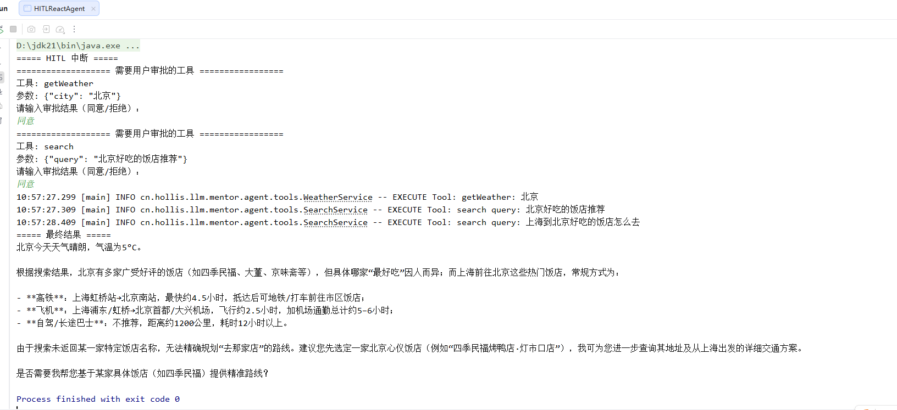

# ✅实战四：手搓 Human in the Loop

在前面的章节中，我们已经了解了 Spring AI Alibaba 官方提供的 Human-in-the-Loop（HITL）能力，以及它实现 HITL 的整体流程。本章将通过**完整手写一个 支持 HITL 的 ReactAgent**，带你从工程实现的角度，真正理解 HITL **需要解决哪些问题、关键机制如何设计，以及它是如何落地的**。

在动手之前，我们先从整体视角回顾一下 **Spring AI Alibaba 中 HITL 的完整执行流程**：

1. Agent 启动并进入推理流程
2. 大模型在推理过程中生成 Tool Call
3. 框架识别到 Tool Call，并判断该工具是否被配置为需要人工审批
4. 若需要审批，Agent 执行被中断，返回 `InterruptionMetadata`
5. 人类用户基于 `InterruptionMetadata` 做出审批决策（通过 / 修改 / 拒绝）
6. Agent 在同一个 `threadId` 下携带人工反馈恢复执行
7. 框架根据审批结果决定是否、以及如何真正执行工具调用
8. Agent 继续后续的推理与执行循环，直至任务完成

流程清晰了之后，我们可以参考他的实现流程，来改造我们之前的 `SimpleReactAgent`，看能否复刻 HITL。

配置中断

在 Spring AI Alibaba 中，**配置中断**是通过 `HumanInTheLoopHook` 实现的。`Hook`本质上就是一种拦截器，它拦截的并不是用户输入，而是**模型推理完成之后产生的 Tool Call**，并在工具真正执行之前，判断这些调用是否需要经过人类审批。同样的思想也可以迁移到我们的 `SimpleReactAgent` 中。虽然没有内置 Hook 机制，但我们可以利用 **Spring AI 原生的 Advisor 体系** 实现等价能力。具体来说，我们直接实现 `CallAdvisor` 接口，并重写 `adviseCall` 方法。那第一个问题就是，这个拦截点在什么位置？

**拦截点必须发生在：模型生成 Tool Call 之后、工具真正执行之前**。所以在 `adviseCall` 中，我们首先让模型正常执行一次 `nextCall`，拿到完整的 `response`。如果响应中不包含 `tool_calls`，说明当前轮次不涉及工具调用，直接返回结果即可；只有在响应中检测到 `tool_calls` 时，才进入 HITL 处理逻辑。当检测到 Tool Call 后，我们会构造一个 `List<PendingToolCall>`，用于描述**所有待人工确认的工具调用**。每个 `PendingToolCall` 至少包含以下信息：工具的 `id`、`name`、调用参数、工具描述，以及后续由用户给出的审批结果。后续的中断、恢复与执行，都会围绕这一结构展开。

最后将 HITL_REQUIRED（是否需要 HITL）、HITL_PENDING_TOOLS（待人工确认工具列表）放置在context上下文之中，方便后续流程使用。

此外，我们还需要一个 `HITLState` 类来记录会话中的 HITL 状态。它包含两组信息：

- **consumedToolCallIds**：记录已处理的工具调用 ID，防止同一个 Tool Call 被重复处理；
- **approvedToolNames**：记录已被人工审批通过的工具名称，实现**同一会话中，同一工具只需审批一次**，后续同名工具调用自动放行。

```java
public class HITLState {

    private final Set<String> consumedToolCallIds = ConcurrentHashMap.newKeySet();
    private final Set<String> approvedToolNames = ConcurrentHashMap.newKeySet();

    public HITLState() {
    }

    public boolean isConsumed(String toolCallId) {
        return consumedToolCallIds.contains(toolCallId);
    }

    public void markConsumed(String toolCallId) {
        consumedToolCallIds.add(toolCallId);
    }

    /
     * 判断该工具名称是否已被人工审批过（一次会话内只需审批一次）
     */
    public boolean isToolNameApproved(String toolName) {
        return approvedToolNames.contains(toolName);
    }

    /
     * 标记该工具名称已通过人工审批
     */
    public void markToolNameApproved(String toolName) {
        approvedToolNames.add(toolName);
    }
}
```

```java
public record PendingToolCall(String id, String name, String arguments, FeedbackResult result, String description) {

    public enum FeedbackResult {
        APPROVED,
        REJECTED,
        EDIT
    }

    public PendingToolCall approve() {
        return new PendingToolCall(id, name, arguments, FeedbackResult.APPROVED, description);
    }

    public PendingToolCall reject(String reason) {
        return new PendingToolCall(id, name, arguments, FeedbackResult.REJECTED, reason);
    }
}
```

```java
public class HITLAdvisor implements CallAdvisor {

    public static final String HITL_REQUIRED = "hitl.required";
    public static final String HITL_PENDING_TOOLS = "hitl.pending.tools";
    public static final String HITL_STATE_KEY = "hitl.state";
    public static final String HITL_NON_INTERCEPT_TOOLS = "hitl.non.intercept.tools";

    private final Set<String> interceptToolNames;

    public HITLAdvisor(Set<String> interceptToolNames) {
        this.interceptToolNames = interceptToolNames;
    }

    @Override
    public ChatClientResponse adviseCall(ChatClientRequest chatClientRequest, CallAdvisorChain callAdvisorChain) {
        ChatClientResponse response = callAdvisorChain.nextCall(chatClientRequest);
        if (!response.chatResponse().hasToolCalls()) {
            return response;
        }

        // 从上下文中获取 HITLState，用于判断工具名称是否已被审批
        HITLState hitlState = (HITLState) chatClientRequest.context().get(HITL_STATE_KEY);

        List<PendingToolCall> pending = new ArrayList<>();
        List<AssistantMessage.ToolCall> nonInterceptTools = new ArrayList<>();

        for (AssistantMessage.ToolCall tc : response.chatResponse().getResult().getOutput().getToolCalls()) {

            if (!interceptToolNames.contains(tc.name())) {
                nonInterceptTools.add(tc);
                continue;
            }

            // 如果该工具名称在本次会话中已被人工审批过，则不再拦截，直接放行
            if (hitlState != null && hitlState.isToolNameApproved(tc.name())) {
                nonInterceptTools.add(tc);
                continue;
            }

            pending.add(new PendingToolCall(tc.id(), tc.name(), tc.arguments(), null, "该工具需要用户手动确认"));
        }

        if (pending.isEmpty()) {
            return response;
        }

        response.context().put(HITL_REQUIRED, true);
        response.context().put(HITL_PENDING_TOOLS, pending);
        // 传递非拦截工具，立即执行
        if (!nonInterceptTools.isEmpty()) {
            response.context().put(HITL_NON_INTERCEPT_TOOLS, nonInterceptTools);
        }

        return response;
    }

    @Override
    public String getName() {
        return "HITLAdvisor";
    }

    @Override
    public int getOrder() {
        return 0;
    }
}
```

主调用

为了清晰区分首次调用和 HITL 恢复调用，我将它们设计为两个接口：

- **主调用**：用户第一次调用智能体时触发，用于生成初始响应并可能触发 HITL 中断；
- **恢复调用**：在 HITL 中断后，获取用户反馈并再次调用智能体，用于继续执行剩余流程。

我们对 [✅手搓 ReactAgent（非流式）](https://www.yuque.com/hollis666/wibick/ahx7bmxmw4qgfgor)中介绍的 `SimpleReactAgent`的call 方法进行改造，首先将核心执行逻辑抽取到一个独立的 `run` 方法，以便 **恢复调用流程** 可以直接复用。这块的主要流程和原来的是一致的，都是 React 架构模式。

在主调用中，需要完成以下初始化工作：

- 初始化用户问题；
- 创建 **context** 状态，用于存储会话级信息和 HITL 状态。

与之前的 SimpleReactAgent 不同的还有几个关键改造点：

- **返回值类型**
- 之前 SimpleReactAgent 的 `call` 方法直接返回 **String** 类型，表示最终结果；
- 改造后，为了同时支持任务完成和 HITL 中断，返回值改为 **AgentResult**。
- **AgentResult 的实现**
- **AgentFinished**：表示任务已经完成，包含最终结果；
- **AgentInterrupted**：表示 HITL 中断，包含以下信息：
- 待确认的工具列表（List）；
- 快照上下文 messages；
- context 上下文状态。
- **中断判断**
- 在`run`方法的迭代循环中增加`HITL_REQUIRED`判断，满足则直接返回`AgentInterrupted`中断元数据。
- 这个地方其实就是我们在`Advisor`中返回的状态和工具列表，我们直接从`response.context`中获取即可。

```java
// 限定只有2个实现类
public sealed interface AgentResult permits AgentFinished, AgentInterrupted {
}

public record AgentFinished(String content) implements AgentResult {
}
public record AgentInterrupted(List<PendingToolCall> pendingToolCalls,
                               List<Message> checkpointMessages,
                               Map<String, Object> context) implements AgentResult {
}
```

```java
public AgentResult call(String question) {

    List<Message> messages = new ArrayList<>();
    messages.add(new SystemMessage(REACT_AGENT_SYSTEM_PROMPT));
    messages.add(new UserMessage(question));

    Map<String, Object> context = new ConcurrentHashMap<>();
    context.put(HITLAdvisor.HITL_STATE_KEY, new HITLState());

    return run(messages, context);
}

private AgentResult run(List<Message> messages, Map<String, Object> context) {

    int round = 0;

    while (true) {
        round++;
        if (maxRounds > 0 && round > maxRounds) {
            return new AgentFinished(chatClient.prompt()
                    .messages(messages)
                    .advisors(a -> context.forEach(a::param))
                    .call()
                    .content());
        }

        ChatClientResponse response = chatClient.prompt()
                .messages(messages)
                .advisors(a -> context.forEach(a::param))
                .call()
                .chatClientResponse();

        // 增加判断HITL_REQUIRED，说明需要人工介入，返回中断元数据
        if (Boolean.TRUE.equals(response.context().get(HITLAdvisor.HITL_REQUIRED))) {
            // 先执行不需要 HITL 的工具调用，避免它们等待人工审批
            List<AssistantMessage.ToolCall> nonInterceptTools = (List<AssistantMessage.ToolCall>) response.context().get(HITLAdvisor.HITL_NON_INTERCEPT_TOOLS);
            if (nonInterceptTools != null && !nonInterceptTools.isEmpty()) {
                messages.add(AssistantMessage.builder()
                        .toolCalls(response.chatResponse().getResult().getOutput().getToolCalls())
                        .build());

                // 执行非拦截工具，把结果加入 messages
                for (AssistantMessage.ToolCall tc : nonInterceptTools) {
                    ToolCallback tool = findTool(tc.name());
                    String result = tool.call(tc.arguments());
                    messages.add(ToolResponseMessage.builder().responses(
                            List.of(new ToolResponseMessage.ToolResponse(tc.id(), tc.name(), result))).build());
                }
            }

            return new AgentInterrupted(
                    (List<PendingToolCall>) response.context().get(HITLAdvisor.HITL_PENDING_TOOLS),
                    List.copyOf(messages),
                    context
            );
        }

        if (!response.chatResponse().hasToolCalls()) {
            return new AgentFinished(response.chatResponse().getResult().getOutput().getText());
        }

        AssistantMessage assistant = AssistantMessage.builder()
                .toolCalls(response.chatResponse()
                        .getResult()
                        .getOutput()
                        .getToolCalls()).build();

        messages.add(assistant);

        for (AssistantMessage.ToolCall tc : assistant.getToolCalls()) {

            ToolCallback tool = findTool(tc.name());
            String result = tool.call(tc.arguments());

            messages.add(ToolResponseMessage.builder().responses(
                    List.of(new ToolResponseMessage.ToolResponse(tc.id(), tc.name(), result))).build());
        }
    }
}
```

恢复调用

当主调用因 HITL 中断返回 `AgentInterrupted` 后，恢复流程由 `resume` 方法负责。它的核心目标：**在同一个context上下文中，把人工反馈转化为模型可以继续理解和执行的消息，然后重新进入推理循环**。恢复流程的第一步，是从 `AgentInterrupted` 中取回中断时的快照信息，包括：当时的 `messages`、`context` 。其中 `context`中保存的 `HITLState` 用于记录哪些 Tool Call 已经被人工处理，避免在多次恢复调用中重复触发 HITL。接下来，`resume` 会根据用户反馈构造新的工具调用和工具执行结果。对于每一个 `PendingToolCall`，先判断是否已被消费；未消费的才会被标记为已处理，并转换为 `AssistantMessage.ToolCall` 补充进消息列表。如果用户审批通过，还会调用 `hitlState.markToolNameApproved()` 将该工具名称记录下来，这样同一会话中后续再次调用同名工具时，`HITLAdvisor` 会自动放行，不再需要人工审批。随后，再根据用户的审批结果，决定是拒绝执行工具，还是实际调用对应的 `ToolCallback`，并将执行结果封装成 `ToolResponseMessage` 追加到消息流中。完成这些消息补全后，恢复流程并不会单独实现一套执行逻辑，而是**直接复用 **`run`** 方法**，在原有上下文和线程下继续执行主推理循环。这样就保证了主调用与恢复调用在执行路径上的一致性，而不是一套割裂的逻辑。需要注意的是，在 `run` 方法中调用 `chatClient.prompt()` 时，需要通过 `.advisors(a -> context.forEach(a::param))` 将 context（包含 HITLState）传入 Advisor 请求参数中。这样 `HITLAdvisor` 就能从 `chatClientRequest.context()` 中获取到 `HITLState`，从而判断哪些工具已经被审批过。如果不加这行，`HITLAdvisor` 拿到的 `HITLState` 会是 null，已审批工具的自动放行逻辑将无法生效。

```java
public AgentResult resume(AgentInterrupted interrupted, List<PendingToolCall> feedbacks) {

    List<Message> messages = new ArrayList<>(interrupted.checkpointMessages());
    Map<String, Object> context = interrupted.context();

    HITLState hitlState = (HITLState) context.get(HITLAdvisor.HITL_STATE_KEY);

    // 检查是否有非拦截工具已执行（通过判断最后一个消息是否是 ToolResponseMessage）
    boolean hasNonInterceptExecuted = !messages.isEmpty() &&
            messages.get(messages.size() - 1) instanceof ToolResponseMessage;

    List<AssistantMessage.ToolCall> toolCalls = new ArrayList<>();

    for (PendingToolCall fb : feedbacks) {
        // 过滤已处理的工具调用，避免重复 HITL
        if (hitlState.isConsumed(fb.id())) {
            continue;
        }
        // 标记为已处理
        hitlState.markConsumed(fb.id());

        // 如果用户同意执行，标记该工具名称为已审批，后续同名工具调用自动通过
        if (fb.result() == PendingToolCall.FeedbackResult.APPROVED) {
            hitlState.markToolNameApproved(fb.name());
        }

        toolCalls.add(new AssistantMessage.ToolCall(fb.id(), "function", fb.name(), fb.arguments()));
    }

    // 只有在没有非拦截工具执行的情况下，才需要补全 tool_call 消息
    if (!toolCalls.isEmpty() && !hasNonInterceptExecuted) {
        messages.add(AssistantMessage.builder().toolCalls(toolCalls).build());
    }

    for (PendingToolCall fb : feedbacks) {
        // 将消费过的工具调用结果添加到消息中
        if (hitlState.isConsumed(fb.id())) {
            String result;
            if (fb.result() == PendingToolCall.FeedbackResult.REJECTED) {
                result = "用户不同意执行此工具，工具名称：" + fb.name() + "，工具描述：" + fb.description();
            } else {
                // 这边同意和编辑简单处理，实际可以让用户重新编辑arguments
                ToolCallback tool = findTool(fb.name());
                result = tool.call(fb.arguments());
            }

            messages.add(ToolResponseMessage.builder().responses(List.of(new ToolResponseMessage.ToolResponse(fb.id(), fb.name(), result))).build());
        }
    }

    // 继续执行主循环
    return run(messages, context);
}
```

使用 HITL

下面是一个完整示例，展示了 **HITLReactAgent 的使用方式和整体运行思路**。

首先初始化底层大模型 `ChatModel`，同时注册 Agent 可用的工具（还是之前的 weather 和 search ），随后通过 `HITLAdvisor` 明确指定哪些工具调用需要人工审批，从而为 Agent 注入 HITL 能力。在调用 `agent.call()` 发起任务后，Agent 会按照 ReAct 模式自动推理并尝试调用工具；当执行过程中触发被拦截的工具时，流程会被中断并返回 `AgentInterrupted`，其中包含待审批的工具调用列表以及当前的消息快照和内部上下文状态。外部系统或人工用户对这些工具调用给出“同意”或“拒绝”的反馈后，这边使用了控制台输入的方式，来体现这一流程，实际项目中可以通过前后端的交互来实现。接着就通过 `agent.resume()` 将审批结果重新注入，Agent 会在保留历史消息和内部状态的前提下继续执行推理与工具调用。上述过程可能会重复多次，直到不再需要人工介入，最终 Agent 返回 `AgentFinished` 并输出完整的结果。

```java
public static void main(String[] args) {

    String baseUrl = "https://dashscope.aliyuncs.com/compatible-mode/";
    String apiKey = "sk-XXXXXXXXXXXXXX";
    String modelName = "qwen-plus";

    OpenAiChatOptions opts = new OpenAiChatOptions();
    opts.setModel(modelName);
    opts.setMaxTokens(3000);
    opts.setTemperature(0.7);

    ChatModel chatModel = OpenAiChatModel.builder()
            .openAiApi(OpenAiApi.builder()
                    .baseUrl(baseUrl)
                    .apiKey(new SimpleApiKey(apiKey))
                    .build())
            .defaultOptions(opts)
            .build();

    ToolCallback[] toolCallbacks =
            ToolCallbacks.from(new WeatherService(), new SearchService());

    // 拦截 getWeather和search
    HITLAdvisor hitlAdvisor = new HITLAdvisor(Set.of("getWeather", "search"));

    HITLReactAgent agent = HITLReactAgent.builder()
            .name("HITLReactAgent")
            .chatModel(chatModel)
            .advisors(List.of(hitlAdvisor))
            .tools(Arrays.stream(toolCallbacks).toList())
            .build();

    // 第一次 call
    AgentResult result = agent.call("北京今天的天气如何？并搜索下北京有什么好吃的饭店？基于以上的结果，搜索下，上海如何去这个好吃的饭店，上海");

    // 多次 HITL 处理
    while (result instanceof AgentInterrupted interrupted) {

        System.out.println("===== HITL 中断 =====");

        for (PendingToolCall tc : interrupted.pendingToolCalls()) {
            System.out.println("=================== 需要用户审批的工具： =================");
            System.out.println("工具: " + tc.name());
            System.out.println("参数: " + tc.arguments());
        }
        System.out.println("=================== 以上工具需要用户审批 ===================");

        // 模拟人工审批
        List<PendingToolCall> feedbacks = new ArrayList<>();
        List<PendingToolCall> pendingToolCalls = interrupted.pendingToolCalls();
        for (PendingToolCall tc : pendingToolCalls) {
            System.out.println("请输入审批结果（同意/拒绝）：");
            Scanner scanner = new Scanner(System.in);
            String approval = scanner.nextLine();
            if (approval.equalsIgnoreCase("同意")) {
                feedbacks.add(tc.approve());
            } else {
                feedbacks.add(tc.reject("用户拒绝使用"));
            }
        }
//            List<PendingToolCall> feedbacks = interrupted.pendingToolCalls().stream()
//                    .map(tc -> new PendingToolCall(tc.id(), tc.name(), tc.arguments(), PendingToolCall.FeedbackResult.REJECTED, "拒绝使用"))
//                    .toList();

        // 再次发起调用
        result = agent.resume(interrupted, feedbacks);
    }

    if (result instanceof AgentFinished finished) {
        System.out.println("===== 最终结果 =====");
        System.out.println(finished.content());
    }
}
```



---

来源: https://thoughts.aliyun.com/workspaces/6963289eb0fc2e001bb052eb/docs/6972016f74e40300011aa5b9
