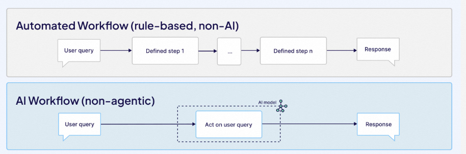
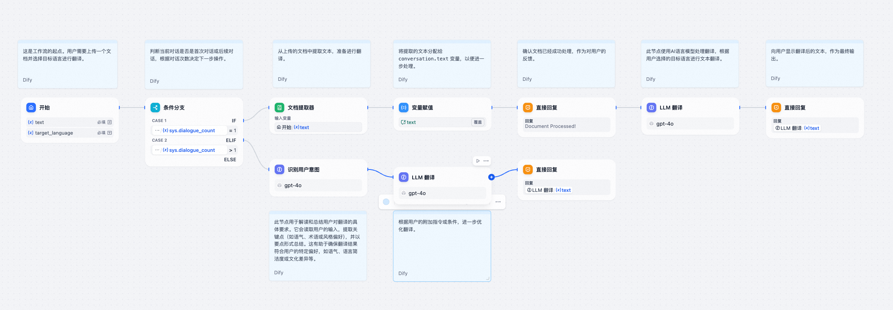

# ✅初识Ai Workflow

工作流（workflow）这个概念并不新鲜，也不是AI专有的，这玩意由来已久了，很多开发中也会用到工作流的技术，比如我们常见的审批，就是一个典型的工作流。

以前一提到工作流，大家首先想到的是BPMN，activiti等技术和框架，他们都是是一系列预定义的、结构化的任务或步骤，用于完成某个业务目标。这些步骤通常按特定顺序执行，可能包含条件分支、并行处理、人工审批等逻辑。

他的特点是针对一些相对固定的流程做预定义，然后按照我们规定的步骤来做执行。好处就是流程比较固定，再结合一些可视化的工具，可以做到可视化编排。缺点的话就是因为提前预设好的，灵活性较低、更更没啥自主性。

在AI时代，工作流的概念又火了一把。主要是因为很多时候，我们想要用AI实现一些智能体的话，有一个典型的构建方式就是用工作流。

因为很多时候我们想要完成一个工作的时候，大模型的调用只是其中的一个步骤，而在这个步骤前后还有一些其他的事情要做，那么如果这些步骤的流程是固定的，就可以用工作流实现了。

所以，**所谓的AI工作流，无非就是在传统的工作流引入了LLM的能力，把LLM当做其中的一个节点编排到流程中。**

比如下面这个就是一个典型的工作流，可以看到，他在里面有很多节点。

这里面包括了很多节点，有不同的类型，包括了开始、条件分支、文档提取器、变量赋值、意图识别、LLM、回复等。如果移除其中的LLM节点，你会发现他其实就是个普通的工作流而已。

---

来源: https://thoughts.aliyun.com/workspaces/6963289eb0fc2e001bb052eb/docs/69882c20d31fed00010e23e9
