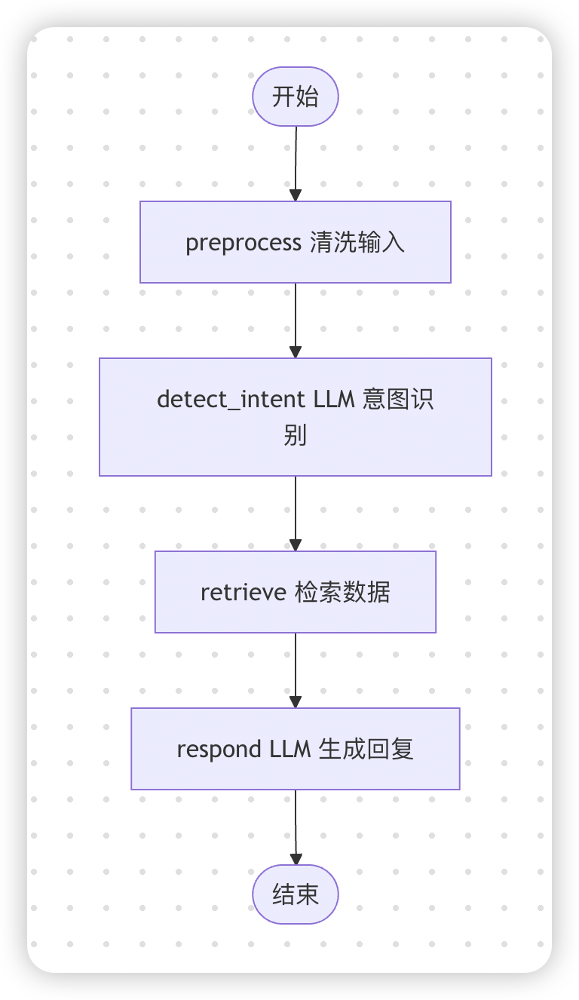

# ✅使用 LangGraph 构建一个Ai Workflow

LangGraph 是由 LangChain 团队开发的一个用于构建状态驱动、多智能体（multi-agent）或循环式工作流的框架。它基于图（Graph）的概念，将复杂的工作流程建模为状态机，特别适合处理需要记忆、迭代、协作或多轮交互的 AI 应用。

LangGraph是实现工作流，尤其是agentic workflow的最典型的一个框架了。（什么是workflow，后续有单独章节介绍）

以下是 LangGraph 中的核心概念（其实这些概念，在Spring AI Alibaba 1.1版本发布后，其中的graph也沿用了类似的概念）：

LangGraph的核心思想

**一切皆状态**

LangGraph的整个工作流的状态被封装在一个 共享的、不可变的 State 对象 中。所有节点（Node）只能读取当前 State，并返回对 State 的增量更新。框架负责将更新合并，生成新 State，推动流程前进。

**图即程序**

在LangGraph中，`工作流 = 有向图（Directed Graph）`、`节点（Node） = 函数（计算单元）`、`边（Edge） = 控制转移逻辑`，同时支持 循环边（cyclic edges） ，可以实现迭代、反思、重试等行为。

**可中断、可恢复**

在LangGraph中，可以通过 `checkpointer` 组件，可将每一步的 State 持久化。同时还支持人工介入后继续执行（Human-in-the-loop）。

核心概念详解

State（状态）

State表示整个工作流当前的数据上下文，是共享的数据结构。使用 `Annotated` + 操作符（如 `operator.add`）定义如何合并更新。

```text
from typing import Annotated, TypedDict
from operator import add

class State(TypedDict): # 通常定义为 TypedDict 或 Pydantic 模型。
    messages: Annotated[list, add]  # 消息列表自动追加
    current_plan: str
    approved: bool
```

特别需要注意的是，State是不可变的，就像Java中的String一样，每次修改都生成新 State，便于追踪和回滚。

Node（节点）

Node就是图中的一个计算单元，一般对应一个函数。接收当前 State 作为输入，执行一些计算和操作后，返回更新后的State。（不直接修改 State，只“建议”如何更新）

Node其实就是一个纯函数，它接收一个 State，返回一个“如何更新 State”的建议字典（dict）。

```text
def planner_node(state: State):
    # 读取当前状态
    user_input = state["messages"][-1].content
    
    # 调用 LLM 生成计划
    plan = llm.invoke(f"Plan for: {user_input}")
    
    # 返回“建议”：只更新 current_plan
    return {"current_plan": plan.content}
```

Edge（边）

Edge用来控制从一个节点到下一个节点的跳转逻辑。分为两类：

- 普通边（regular edge）：从一个节点固定跳转到另一个节点。
- `add_edge("A", "B")` → A 执行完一定去 B。
- 条件边（conditional edge）：根据当前 State 动态决定下一个节点（类似 if-else 或路由逻辑）。
- `router_func(state)` 返回一个 key，决定下一步去哪。

```text
def route_plan(state: State):
    if "urgent" in state["plan"]:
        return "fast_executor"
    else:
        return "standard_executor"

workflow.add_conditional_edges("planner", route_plan, {
    "fast_executor": "fast_executor",
    "standard_executor": "standard_executor"
})
```

Graph（图）

Graph是由多个 Node 和 Edge 组成的有向图。使用 `StateGraph(StateClass)` 构建。可以向图添加节点、边、入口点。Graph最终要`.compile()` 为可执行的 `CompiledGraph`。

LangGraph 支持循环图（cyclic graph），即允许回到之前的节点，实现迭代（如反思、修正、多轮对话等）。

```text
from langgraph.graph import StateGraph, START, END

workflow = StateGraph(State)
workflow.add_node("planner", planner_node)
workflow.add_node("executor", executor_node)
workflow.add_edge(START, "planner")
workflow.add_edge("planner", "executor")
workflow.add_edge("executor", END)

app = workflow.compile()
```

Checkpointer（检查点器）

Checkpointer是一个可选组件，checkpointers 通过允许人类检查、中断和批准步骤来促进人机协作工作流。允许在交互之间保持"记忆"。可以使用 checkpointers 记录每一步的 State 和元数据

```text
from langgraph.checkpoint.memory import MemorySaver

checkpointer = MemorySaver()
app = workflow.compile(checkpointer=checkpointer)

# 后续可通过 config={"configurable": {"thread_id": "123"}} 追踪会话
result = app.invoke({"messages": [...]}, config={"configurable": {"thread_id": "123"}})
```

CompiledGraph（编译后的图）

通过`.compile()` 方法将定义好的图编译为可执行对象。编译过程中会对图结构的一些基本检查（没有孤立节点等）。

提供多种执行方式：

- `.invoke(input)`：同步执行完整流程。
- `.stream(input)`：流式输出每一步结果（适合前端实时展示）。
- `.update_state(config, values)`：手动注入状态（用于人工干预）。

简单示例结构

```text
from langgraph.graph import StateGraph, END

# 定义状态结构
class State(TypedDict):
    messages: Annotated[list, operator.add]

# 创建图
workflow = StateGraph(State)

# 添加节点
workflow.add_node("agent", agent_node)
workflow.add_node("tool", tool_node)

# 设置入口和边
workflow.set_entry_point("agent")
workflow.add_edge("agent", "tool")
workflow.add_edge("tool", END)

# 编译并运行
app = workflow.compile()
result = app.invoke({"messages": ["Hello!"]}
```

**LangGraph使用**

前面介绍过ai workflow了，我们尝试着用python的langgraph框架实现一个ai workflow，关于langgraph 的重要组件和用法，前面介绍过了，这里不再赘述。

实现一个这样的工作流：根据用户输出的内容，识别他的意图做数据检索，然后用自然语言返回给用户



使用langgraph来实现，初始化环境：

```text
uv init langgraph_test
cd langgraph_test
uv venv
source .venv/bin/activate
```

编写main.py中的代码：

```text
import os
from typing import TypedDict
from langgraph.graph import StateGraph, END
from langchain_openai import ChatOpenAI
from langchain_core.prompts import ChatPromptTemplate

# 注意：StateGraph 拼写修正（原代码拼错为 StateGragh）
from langgraph.graph import StateGraph  # 正确导入

OPENAI_API_KEY = "<你的 api key>"
OPENAI_API_BASE = "https://dashscope.aliyuncs.com/compatible-mode/v1"

# ---- Step 1: 定义状态（State） ----
class WorkflowState(TypedDict):
    user_input: str
    processed_input: str
    intent: str
    retrieved_data: str
    final_response: str

# ---- Step 2: 初始化 LLM ----
llm = ChatOpenAI(
    model="deepseek-v3",
    api_key=OPENAI_API_KEY,
    base_url=OPENAI_API_BASE,
    temperature=0.1,
)

# ---- Step 3: 定义各个节点函数（增加 print 输出）----

def preprocess_input(state: WorkflowState) -> dict:
    raw = state["user_input"]
    processed = raw.strip().lower()
    print(f"🔍 [preprocess] 输入: '{raw}' → 输出: '{processed}'")
    return {"processed_input": processed}

def detect_intent(state: WorkflowState) -> dict:
    from langchain_core.messages import HumanMessage
    prompt = ChatPromptTemplate.from_messages([
        ("system", "你是一个意图分类器。请根据用户输入判断其意图，只输出一个词：'weather'、'news' 或 'other'。"),
        ("human", "{input}")
    ])
    chain = prompt | llm
    response = chain.invoke({"input": state["processed_input"]})
    intent = response.content.strip().lower()
    if intent not in ["weather", "news"]:
        intent = "other"
    print(f"🧠 [detect_intent] 输入: '{state['processed_input']}' → 意图: '{intent}'")
    return {"intent": intent}

def retrieve_data(state: WorkflowState) -> dict:
    intent = state["intent"]
    if intent == "weather":
        data = "今天北京晴，气温5°C。"
    elif intent == "news":
        data = "今日头条：AI技术取得新突破。"
    else:
        data = "无法提供相关信息。"
    print(f"📦 [retrieve] 意图: '{intent}' → 检索数据: '{data}'")
    return {"retrieved_data": data}

def generate_response(state: WorkflowState) -> dict:
    prompt = ChatPromptTemplate.from_messages([
        ("system", "你是一个有帮助的助手，请根据提供的信息生成简洁友好的回答。"),
        ("human", "用户问题：{question}\n相关信息：{info}")
    ])
    chain = prompt | llm
    response = chain.invoke({
        "question": state["user_input"],
        "info": state["retrieved_data"]
    })
    print(f"💬 [respond] 生成最终回复: '{response.content}'")
    return {"final_response": response.content}

# ---- Step 4: 构建图 ----
workflow = StateGraph(WorkflowState)

workflow.add_node("preprocess", preprocess_input)
workflow.add_node("detect_intent", detect_intent)
workflow.add_node("retrieve", retrieve_data)
workflow.add_node("respond", generate_response)

workflow.set_entry_point("preprocess")
workflow.add_edge("preprocess", "detect_intent")
workflow.add_edge("detect_intent", "retrieve")
workflow.add_edge("retrieve", "respond")
workflow.add_edge("respond", END)

app = workflow.compile()

# ---- Step 5: 运行并观察流程 ----
if __name__ == "__main__":
    inputs = {"user_input": "今天天气怎么样？"}
    
    print("🚀 开始执行工作流...\n")

    # 方法1：使用 stream() 查看每一步的输出（推荐！）
    for step in app.stream(inputs):
        print("\n📌 当前步骤状态更新:")
        for k, v in step.items():
            print(f"  {k}: {v}")
        print("-" * 50)

    # 如果你只想看最终结果（可选）
    # result = app.invoke(inputs)
    # print("\n✅ 最终结果:", result["final_response"])
```

添加依赖：`uv add langgraph langchain-openai`

运行代码：`uv run main.py`

最终输出结果如下：

```text
🚀 开始执行工作流...

🔍 [preprocess] 输入: '今天天气怎么样？' → 输出: '今天天气怎么样？'

📌 当前步骤状态更新:
  preprocess: {'processed_input': '今天天气怎么样？'}
--------------------------------------------------
🧠 [detect_intent] 输入: '今天天气怎么样？' → 意图: 'weather'

📌 当前步骤状态更新:
  detect_intent: {'intent': 'weather'}
--------------------------------------------------
📦 [retrieve] 意图: 'weather' → 检索数据: '今天北京晴，气温5°C。'

📌 当前步骤状态更新:
  retrieve: {'retrieved_data': '今天北京晴，气温5°C。'}
--------------------------------------------------
💬 [respond] 生成最终回复: '今天北京天气晴朗，气温5°C，适合外出但要注意保暖哦~'

📌 当前步骤状态更新:
  respond: {'final_response': '今天北京天气晴朗，气温5°C，适合外出但要注意保暖哦~'}
```

这个工作流比较简单，实现了我们的要求，那么他还有没有优化空间呢？肯定是有的，以下这几个是我们可以考虑的，涉及到的内容本章节也都会讲到：

**1、可视化的流程编排页面**

**2、丰富的流程节点类型**

**3、集成众多第三方工具和平台**

**4、更加智能的工作流**

---

来源: https://thoughts.aliyun.com/workspaces/6963289eb0fc2e001bb052eb/docs/69882c2e51b1440001341e35
