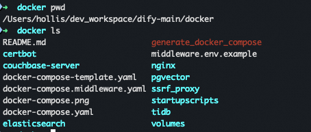
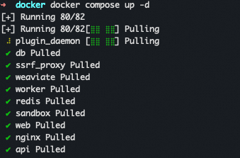
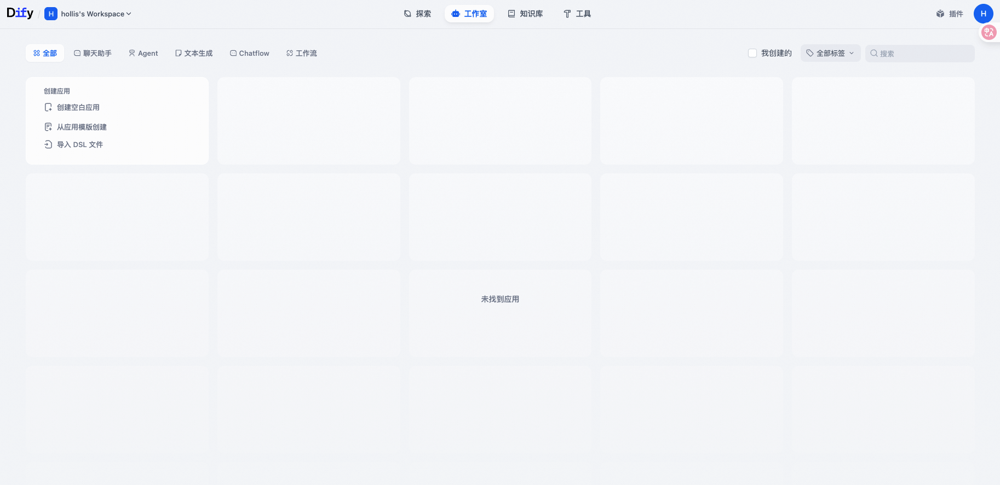
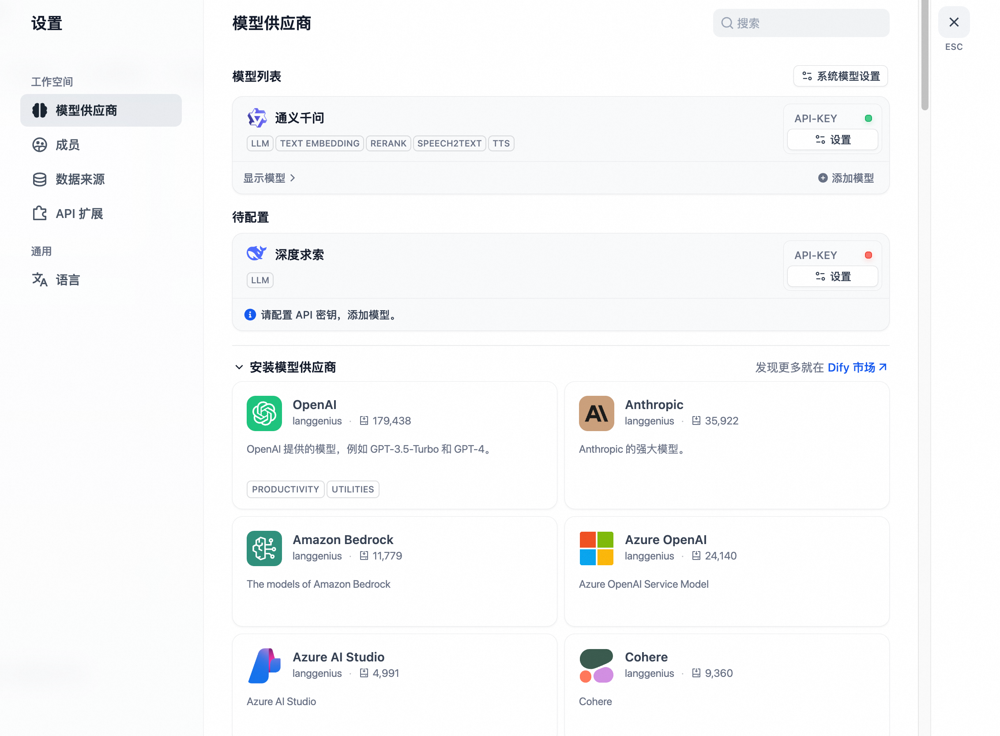
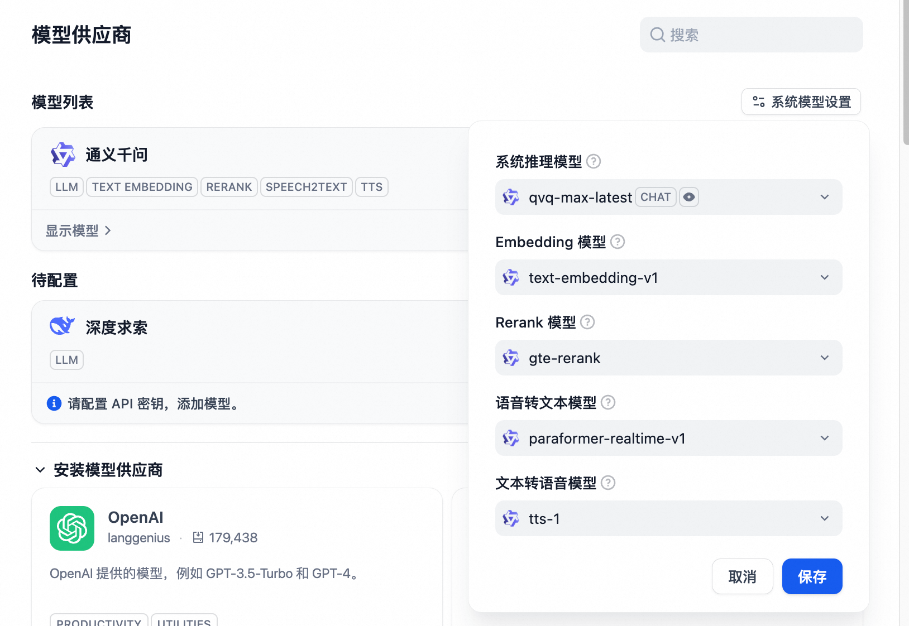
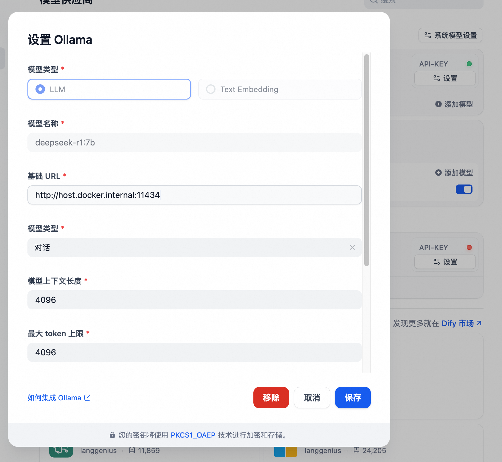
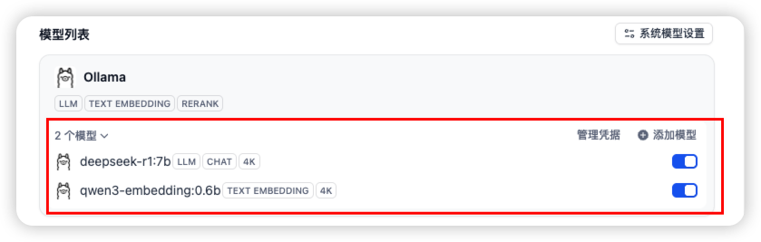
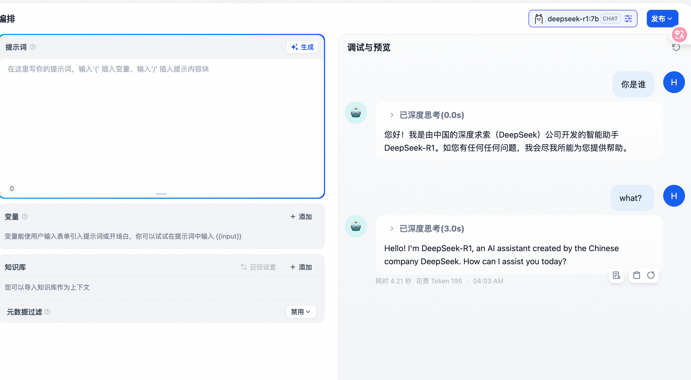

# ✅本地部署Dify做工作流搭建

前面介绍过了Workflow，想要搭建工作流其实有很多工具，比较常见的就是Dify。

什么是Dify

Dify 是一款开源的大语言模型(LLM) 应用开发平台。使开发者可以快速搭建生产级的生成式 AI 应用。

Dify 内置了构建 LLM 应用所需的关键技术栈，包括对数百个模型的支持、 Prompt 编排界面、RAG 引擎、Agent 框架、灵活的流程编排，并同时提供了一套易用的界面和 API。这为开发者节省了许多重复造轮子的时间，使其可以专注在创新和业务需求上。

Dify官网：https://dify.ai/

Dify项目地址：https://github.com/langgenius/dify

官网教程：https://docs.dify.ai/zh-hans/introduction

在线Dify：cloud.dify.ai/apps

本地部署Dify

配置要求：

- CPU >= 2 Core
- RAM >= 4 GiB

1、https://github.com/langgenius/dify 下载dify项目

2、/dify/docker 目录

3、执行 cp .env.example .env

4、docker compose up -d

然后通过：http://localhost/install 即可访问。

模型配置

在设置中安装并配置大模型。

系统模型设置

Dify+Ollama

使用本地模型，ollma及本地模型安装：

启动ollama之后，在dify后台配置ollama，注意因为dify是用docker部署的，localhost需要使用host.docker.internal代替。

配置成功后可以看到模型：

然后选择对应的模型，就可以对话了。

Dify能力

- 工具
- 工具可以扩展 LLM 的能力，比如联网搜索、科学计算或绘制图片
- 知识库
- 支持多种数据源，包括文本、Notion以及一些站点
- 聊天助手
- 提示词+大模型+知识库
- Agent
- 聊天助手 + 工具 + 记忆
- 工作流
- ChatFlow：**面向对话类情景**，包括客户服务、语义搜索、以及其他需要在构建响应时进行多步逻辑的对话式应用程序。
- 对话历史（Memory）、标注回复
- Workflow：**面向自动化和批处理情景**，适合高质量翻译、数据分析、内容生成、电子邮件自动化等应用程序。
- 代码节点、IF/ELSE 节点、模板转换、迭代节点等，提供定时和事件触发的能力

附录

dify dsl：https://github.com/svcvit/Awesome-Dify-Workflow

常见问题

dify runtime error: invalid memory address or nil pointer dereference

在配置ollama本地模型后，在dify的页面上不显示模型列表。通过查看docker日志，发现有以上报错。

解决方案：

[https://blog.csdn.net/haosu123/article/details/149121351](https://blog.csdn.net/haosu123/article/details/149121351)

---

来源: https://thoughts.aliyun.com/workspaces/6963289eb0fc2e001bb052eb/docs/69882c8ac71a890001c3d9eb
