# ✅工作流平台（Dify为例）中的常用组件

本文拿 Dify举例，他支持通过可视化工作流（Workflow）来编排复杂的 AI 应用逻辑。在 Dify 的工作流编辑器中，用户可以通过拖拽组件节点的方式，快速构建从用户输入到最终输出的完整流程。

以下是 Dify 工作流中常用的组件及其功能说明。

1. 开始

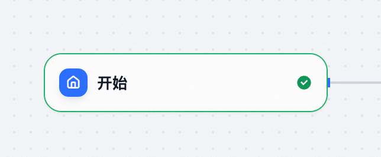

工作流的入口节点，接收用户输入（如文本、变量等）。他是自动创建的，必须要有的。

可以在输入节点中定义变量，如 `query`, `user_id` 等。

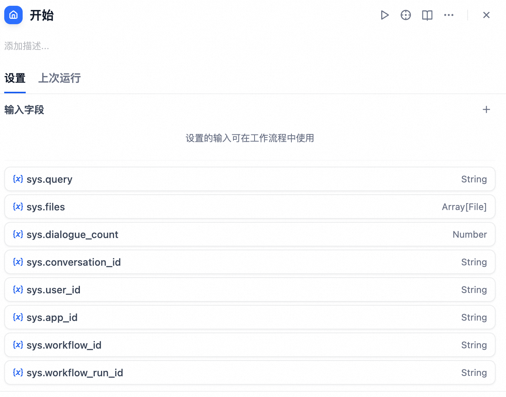

2. LLM

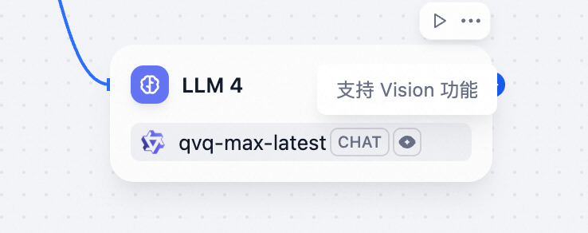

调用大模型生成文本，可配置提示词（Prompt）、模型类型（如 qwen、Claude、本地模型等）、可以设置温度、开启记忆等参数。并且支持配置失败重试、异常处理等。

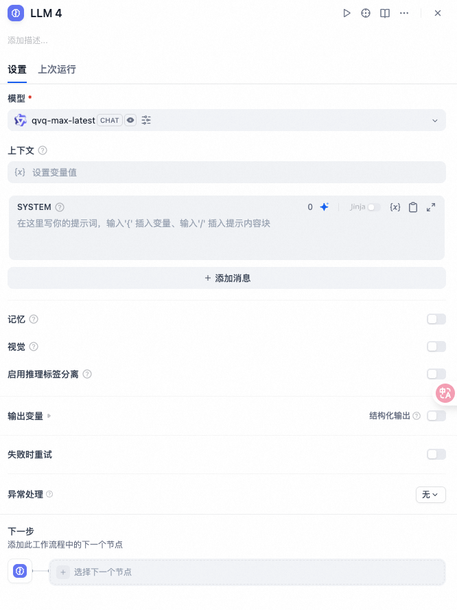

3. 条件分支

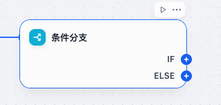

类似编程中的 if-else，根据条件判断执行不同路径。

支持分别为if和else配置条件，条件支持很多，包括字符串比较、数值比较、包含判断、为空判断等。

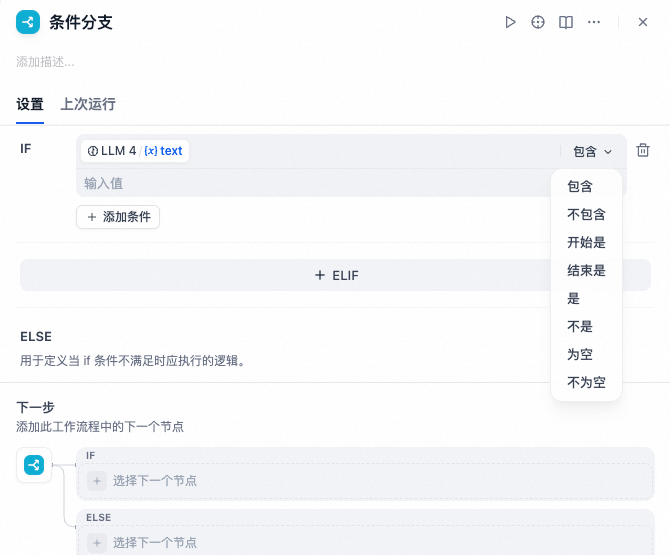

4. 代码执行

可以在这里运行自定义 Python 代码，处理数据或调用外部服务。

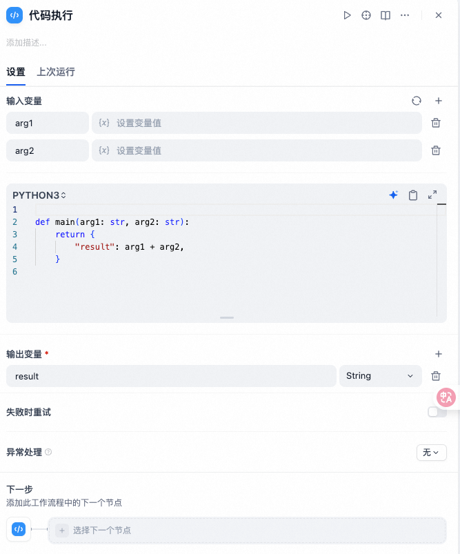

输入/输出变量可配置。支持标准库及部分第三方库（如 requests, json）。

5. HTTP请求

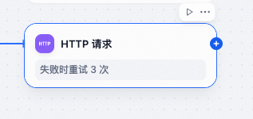

可以用来发送 HTTP 请求（GET/POST）。

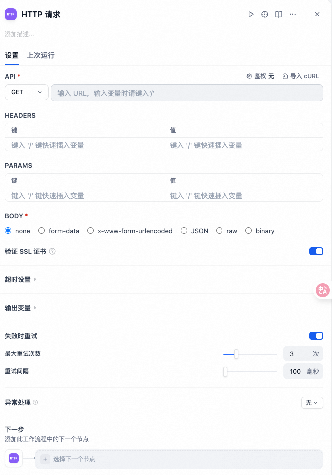

6. 问题分类器

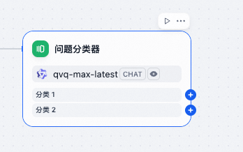

其实也是个LLM节点+条件分支的组合，只不过他专门用作意图识别的，可以配置多个不同的问题分类（意图），以及每个意图可以单独配置后续流程

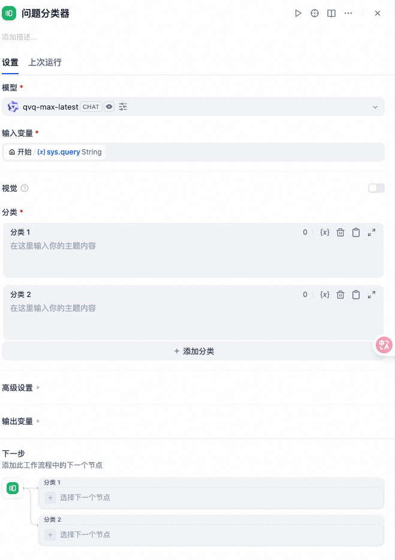

7. 直接回复

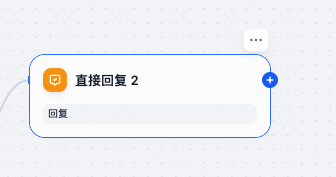

一般跟在LLM节点后面，把上一个节点的内容输出

8. 变量赋值

创建或更新中间变量，用于后续节点引用。

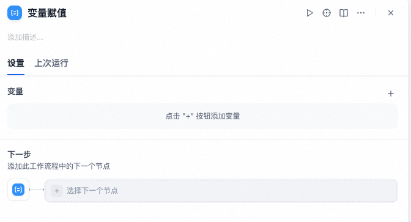

9. 循环

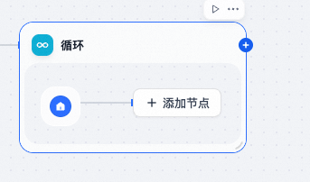

对列表或数组进行迭代处理，里面可以配子工作流，循环也可以配置退出条件及循环内的变量。

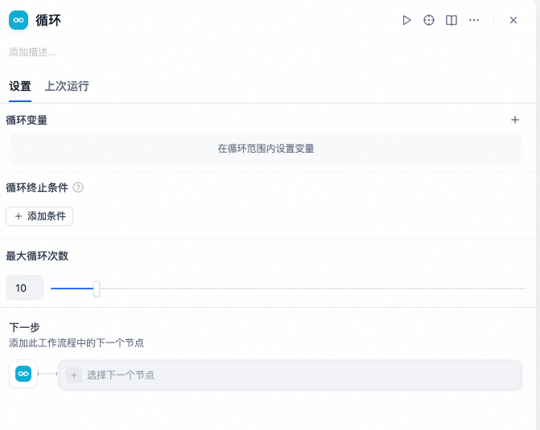

10.知识检索

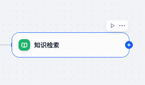

基于向量相似度从已上传的知识库中检索相关文档片段，可以在这个节点中配置指定知识库。

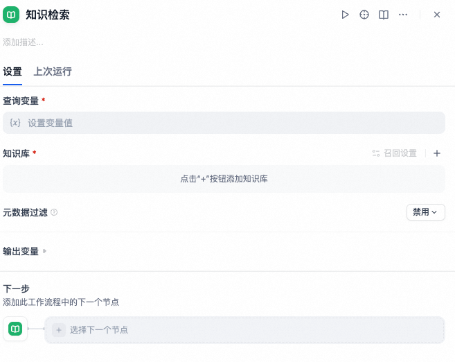

11.工具

在工作流中，除了节点外，还可以单独配置工具，工具可以是插件、MCP、甚至是另外一个工作流都可以。

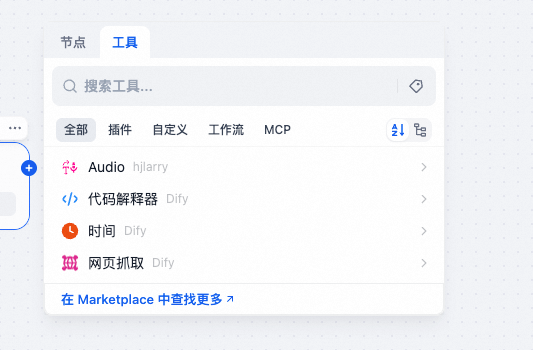

---

来源: https://thoughts.aliyun.com/workspaces/6963289eb0fc2e001bb052eb/docs/69882c9dc71a890001c3d9ee
