# ✅Dify进阶：RAG的使用

前面我们介绍过RAG，也提到过很多AI的工作流平台也支持RAG，比如Dify。Dify中有一个[知识库]，他就是个RAG，能实现从知识库中做向量检索。

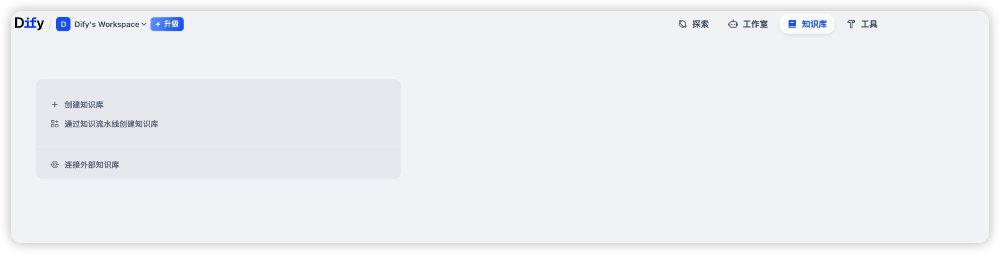

知识库创建

知识库的创建一共有三个步骤，选择数据源，文本分段与清洗，处理并完成。

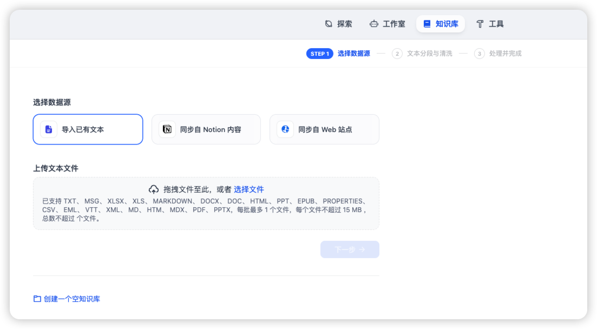

数据源的选择有三种，分别是导入文件、从Notion同步，以及从web站点同步。

前两个比较好理解，第三个很多人不知道是啥，从页面上看，支持两种工具，一个是Jina Reader，另一个是Firecrawl。

Jina Reader和Firecrawl都能能将网页信息转换成LLM 友好的格式，如Markdown，去除冗余HTML 标签和代码，保留核心文本内容，方便LLM 解析和理解。

关于firecrawl，他是个爬虫工具，后面我们再介绍工作流的实战的时候还会用到他。

在知识库导入中，最常用的其实还是导入文本。在这里上传一个文件之后，就会进入第二步，分段与清洗了。

知识库的文档有大小限制，默认是15M，如果想要突破这个限制，需要自己修改配置，如果是自己部署的dify，可以参考：[https://zhuanlan.zhihu.com/p/21951165020](https://zhuanlan.zhihu.com/p/21951165020)

这两个概念我们之前介绍RAG的时候也都介绍过。

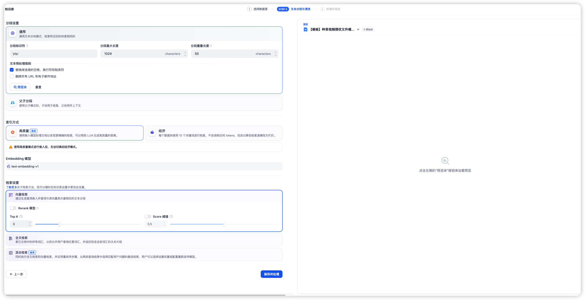

目前分段支持两种：

- **通用模式**：系统按照用户自定义的规则将内容拆分为独立的分段。
- **父子模式**：与通用模式相比，父子模式采用双层分段结构来平衡检索的精确度和上下文信息,让精准匹配与全面的上下文信息二者兼得。
- 父块（Parent Chunk）：保持较大的文本单元（如整节、整段），保留完整上下文。
- 子块（Child Chunk）：将父块进一步切分为更小的语义单元（如句子或短段落），用于向量化和检索。

父子分段的执行过程：系统首先通过子区块进行精确检索以确保相关性，然后获取对应的父区块来补充上下文信息，从而在生成响应时既保证准确性又能提供完整的背景信息。你可以通过设置分隔符和最大长度来自定义父子区块的分段方式。

**例如在 AI 智能客服场景下，用户输入的问题将定位至解决方案文档内某个具体的句子，随后将该句子所在的段落或章节，联同发送至 LLM，补全该问题的完整背景信息，给出更加精准的回答。**

配置的内容，详见：[https://docs.dify.ai/zh/use-dify/knowledge/create-knowledge/chunking-and-cleaning-text](https://docs.dify.ai/zh/use-dify/knowledge/create-knowledge/chunking-and-cleaning-text)

**建议使用父子分段。**

除了分段方式以外，Dify还支持索引方式、Embedding模型，以及检索设置。

**索引方式**支持两种：

- 高质量：使用 **Embedding** 嵌入模型将已分段的文本块转换为数字向量，帮助更加有效地压缩与存储大量文本信息；使得用户问题与文本之间的匹配能够更加精准。
- 经济：每个区块内使用 10 个关键词进行检索，降低了准确度但无需产生费用。对于检索到的区块，仅提供**倒排索引**方式选择最相关的区块。

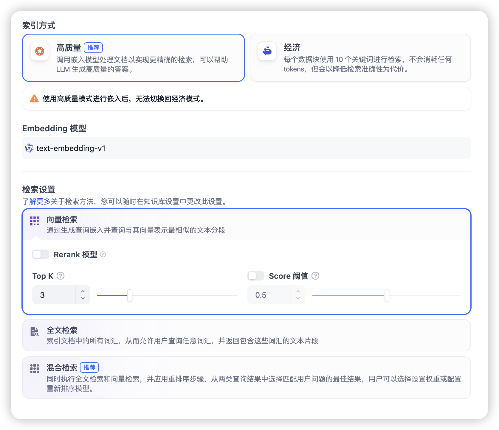

检索设置也支持三种，在高质量索引方式下，Dify 提供向量检索、全文检索与混合检索设置。在经济索引方式下，仅提供倒排索引方式。这是一种用于快速检索文档中关键词的索引结构，常用于在线搜索引擎。倒排索引仅支持 TopK 设置项。

一般推荐大家使用高质量+向量检索，或者，高质量+混合检索。（关于什么是混合检索，我们前面介绍过了）

按照以上方式操作下来，知识库就建立好了，就可以基于这个知识库做知识检索了。

实验文档：[https://nfturbo-file.oss-cn-hangzhou.aliyuncs.com/llm/Mavic_Air_2_User_Manual_v1.0_cn_%20%281%29.pdf](https://nfturbo-file.oss-cn-hangzhou.aliyuncs.com/llm/Mavic_Air_2_User_Manual_v1.0_cn_%20%281%29.pdf)

知识库使用

操作完知识库的创建之后，等他处理完就可以使用了。如果是用了embedding方式嵌入的话，这个过程会比较慢，需要耐心等待。

我们创建一个聊天助手应用，给他指定一个LLM模型，一段提示词和我们想要测试的知识库。

提示词：

你是一个智能客服，可以基于知识库回答用户的问题，请注意：1、你只能基于知识库回答，如果用户的问题无法通过知识库，回答，请告知用户无法回答。2、你不能编造任何内容和回答，只能基于知识库回答。

以下2个，是我分别基于『通用分段+经济索引』和『父子分段+高质量索引』的问答效果

父子分段+高质量索引：

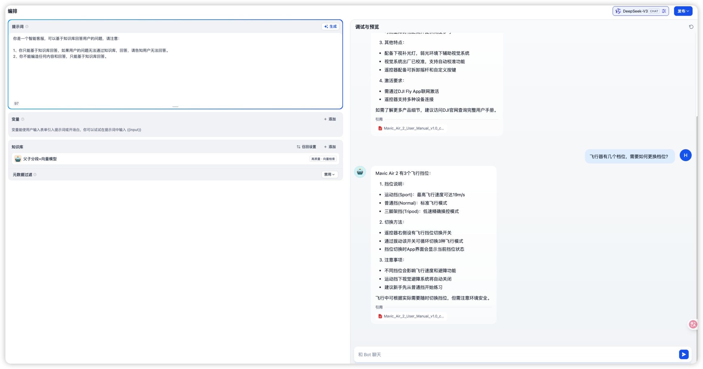

通用分段+经济索引：

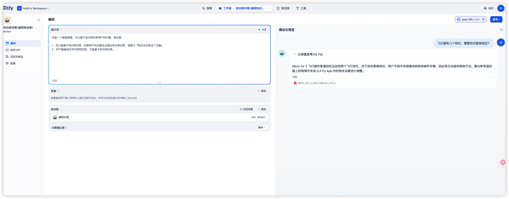

对比下文档内容：

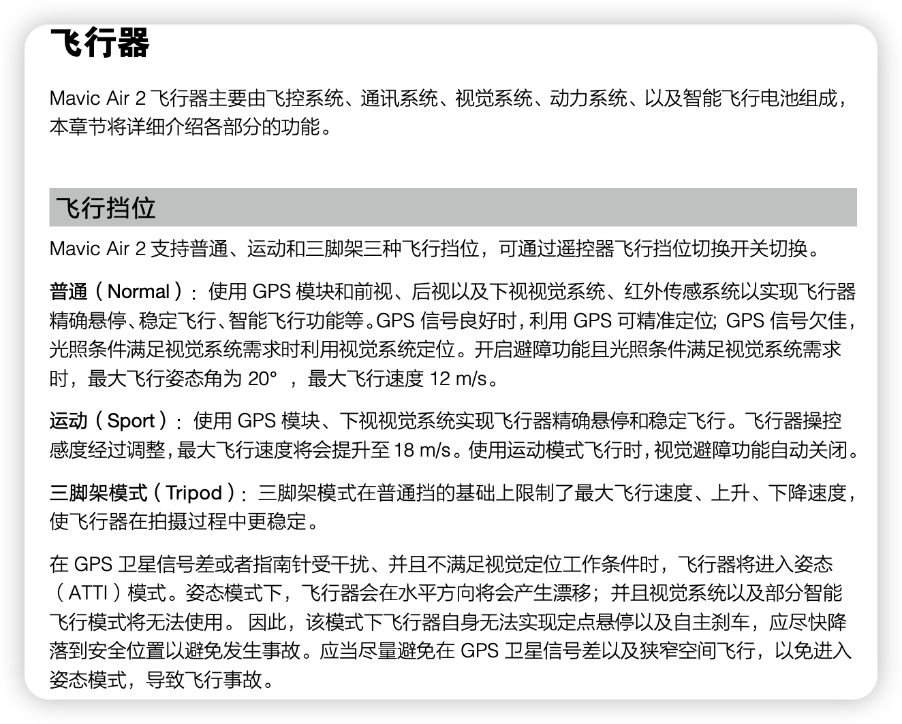

可以看到，父子分段+高质量索引的效果还是很好的，而通用分段+经济索引的效果差很多。

再基于父子分段+高质量索引做几个对话，咨询一些新的问题：

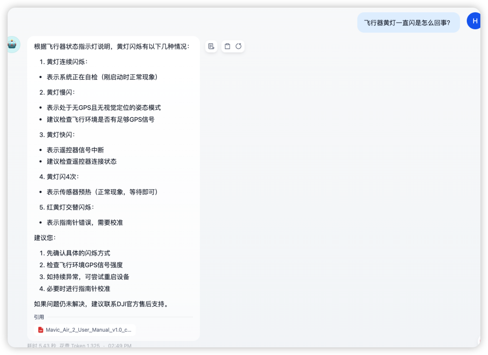

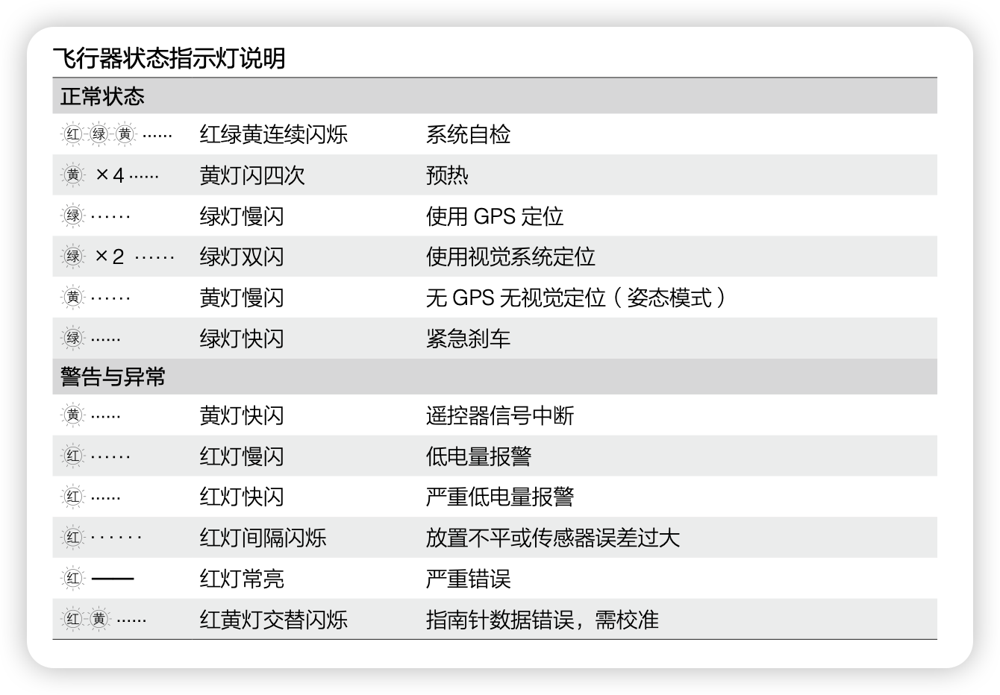

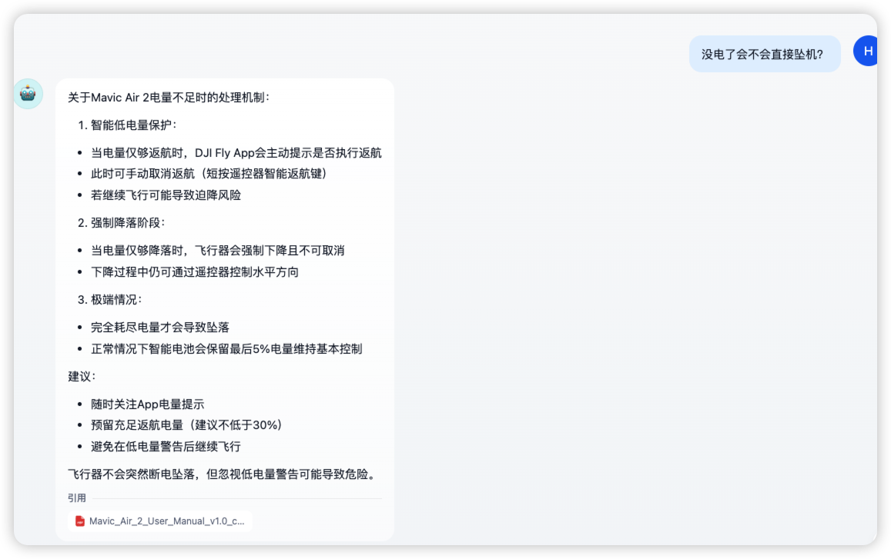

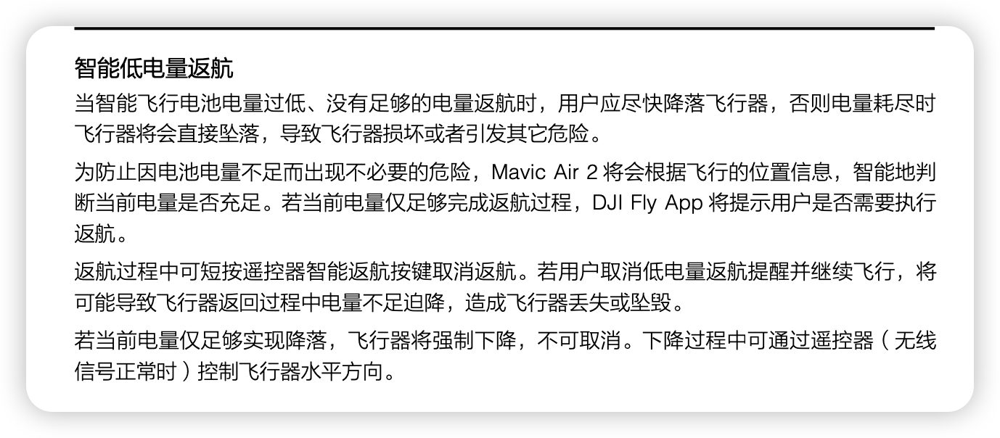

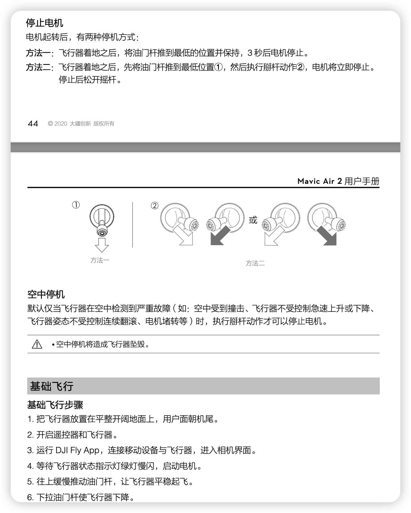

Dify知识库的局限性

虽然 Dify 提供了便捷的知识库集成能力，但在实际生产或高要求场景中，它仍存在一些局限性。这也是为什么很多团队选择自己基于代码 + 向量数据库从头构建 RAG 系统的原因。

1. **灵活性受限**

- Dify 的知识库功能是封装好的模块，对分块策略（chunking）、嵌入模型（embedding model）、检索逻辑等的定制能力有限。

2. **检索精度与召回率难以优化**

- 默认使用固定向量数据库（如 Weaviate 或内置向量存储），缺乏对索引类型（HNSW、IVF_FLAT 等）、相似度度量（cosine、L2、IP）的调优能力。
- 在之前的版本中，他是无法实现多路召回、混合检索、重排序（re-ranking）等高级 RAG 技术的，虽然后面也支持了，但是有些功能只有付费才能使用。

3. **数据规模和性能瓶颈**

- Dify自身存在一定的限制，比如文档只支持15M，虽然我们可以通过一些手段绕过限制，但是很多人也发现当知识库过大的时候，会出现无法检索等问题。所以对于大规模文档，Dify 内置的向量存储可能面临性能或扩展性问题。
- 自建系统可横向扩展向量数据库集群，而 Dify 更适合中小规模场景。

4. **更新与同步机制较弱**

- 文档更新后，重新嵌入和索引的流程不够灵活，难以支持增量更新或实时同步。而自建系统可设计 CDC+ 流式处理管道，实现近实时知识更新。

5. **安全与合规限制**

- 企业级应用常需私有化部署、细粒度权限控制、审计日志等，Dify 的知识库模块在这些方面支持有限。
- 自建系统可完全掌控数据生命周期，满足 GDPR、等保等合规要求。

6. **调试与可观测性不足**

- Dify难以查看检索命中了哪些 chunk、相似度分数、上下文拼接效果等，不利于迭代优化。
- 自建系统可集成日志、监控、A/B 测试等工具，提升 RAG 质量。

所以，总结来说，**Dify更适合做快速原型验证、内部知识问答、中小规模非关键业务。而对于**准确性、性能、安全性、可维护性有高要求的生产场景，自建RAG可能才是终极方案。

---

来源: https://thoughts.aliyun.com/workspaces/6963289eb0fc2e001bb052eb/docs/69882e28d31fed00010e2463
