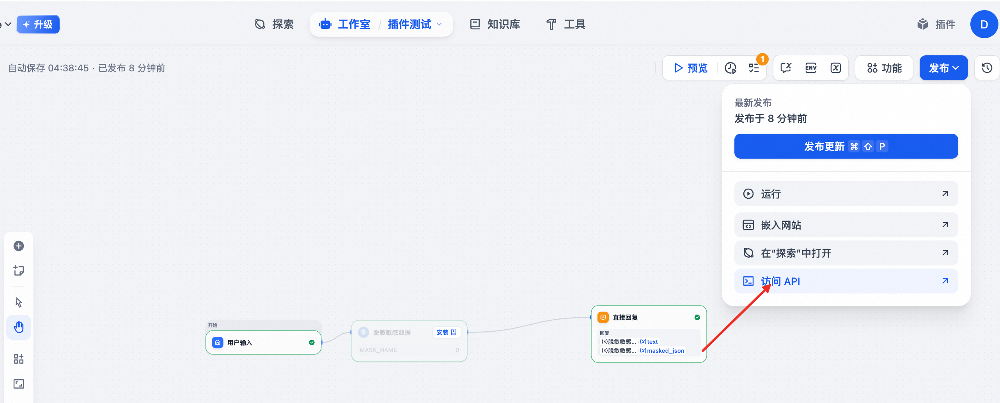
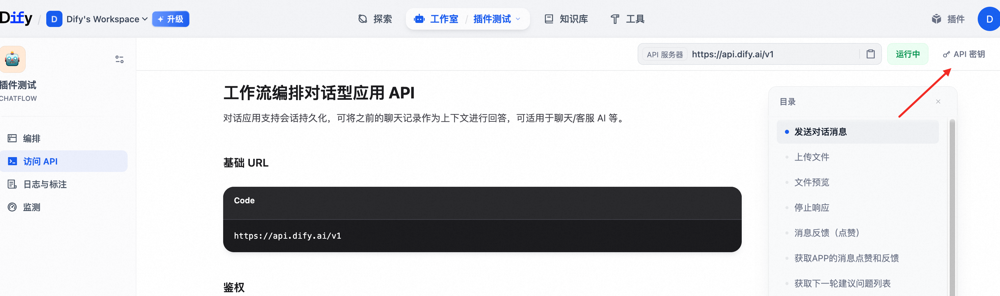
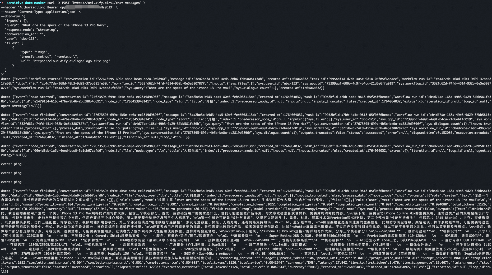

# ✅Dify进阶：API调用

Dify 不仅支持通过可视化界面。还支持通过 API 调用，Dify 提供了完善的 RESTful API 接口，方便开发者将 Dify 构建的应用集成到自己的系统中。

**获取 API Key**

在 Dify 控制台中：

- 进入你的应用页面（工作流或者agent等）
- 点击右上角「访问API」选项卡
- 获取 **API Key**

---

**API 调用**

有了api key了之后，只需要按照页面上给出的文档，替换key，发送http请求就行了。

不同的应用是不同的api key ，他就是通过这个key来路由到具体的应用做调用的。

更多的文档大家可以官方看，不展开说了，很简单：

https://docs.dify.ai/api-reference/%E5%AF%B9%E8%AF%9D%E6%B6%88%E6%81%AF/%E5%8F%91%E9%80%81%E5%AF%B9%E8%AF%9D%E6%B6%88%E6%81%AF

---

来源: https://thoughts.aliyun.com/workspaces/6963289eb0fc2e001bb052eb/docs/69882eba3fb9180001155353
