# ✅什么是n8n？

n8n是一款**企业级的****开源、可视化、高度可扩展的工作流自动化平台**，相比于Dify来说，N8N算是历史悠久了，在没有AI 工作流这个概念的时候，他们就已经在做工作流自动化的事情了，在AI出来之后，就顺理成章的转变成基于AI的工作流的搭建。

所以， 在工作流本身的能力上，N8N要更强一些。尤其是一些第三方的集成上面，N8N甩Dify几条街，毕竟这都是长时间积累下来的（官方支持数百种服务集成）。**所以，在N8N中，AI只是他的能力之一，但是不仅仅局限于AI，所以，他也是很多企业级工作流搭建的首选。**

n8n 内置超过 300+ 官方节点，支持与主流 SaaS 工具（如 Slack、Google Sheets、Notion、Airtable、Shopify、Discord、Telegram、Zapier Webhooks 等）以及数据库（PostgreSQL、MySQL、MongoDB）、消息队列（RabbitMQ、Kafka）和自定义 HTTP 接口无缝集成。

github：https://github.com/n8n-io/n8n

官网： https://n8n.io/ (可以用云服务，新用户免费使用14天）

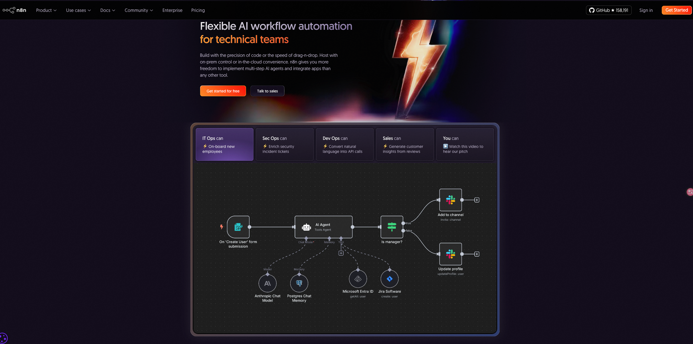

部署

n8n支持以下2种方式部署：

使用npx：

```text
npx n8n
```

使用docker：

```text
docker volume create n8n_data
docker run -it --rm --name n8n -p 5678:5678 -v n8n_data:/home/node/.n8n docker.n8n.io/n8nio/n8n
```

部署成功后，可以通过localhost:5678访问。

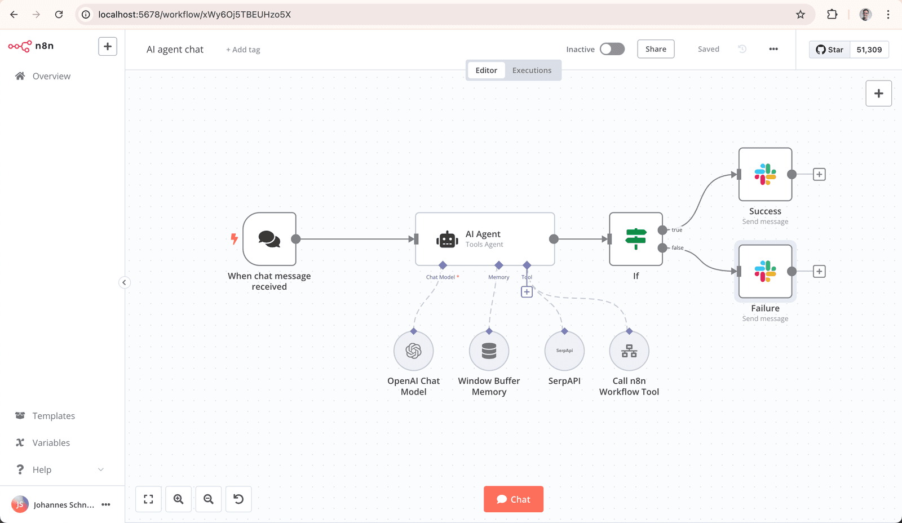

（N8N的功能介绍和使用，在后面的实战中展开讲解，这部分建议大家看视频）

工作流触发方式

在n8n中，需要配置一个任务的触发方式，n8n比dify多了很多触发方式：

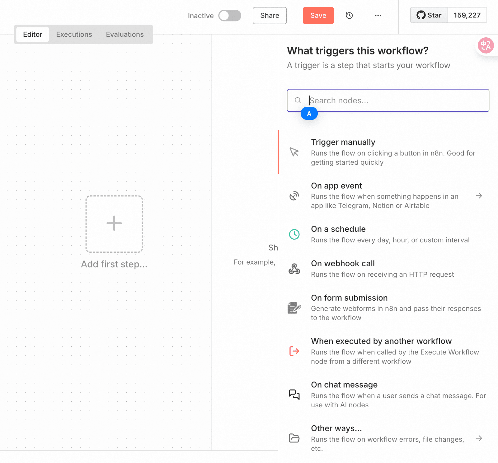

---

**Trigger manually（手动触发）**：通过点击 n8n 界面中的“运行”按钮来启动流程。最简单直接的方式，适合开发阶段做调试、测试以及临时执行。

**On app event（应用事件触发）：**当某个外部应用（如 Telegram、Notion、Airtable、Google Sheets 等）发生特定事件时自动触发。

比如当收到 Telegram 消息时；当 Airtable 表格有新行插入时。

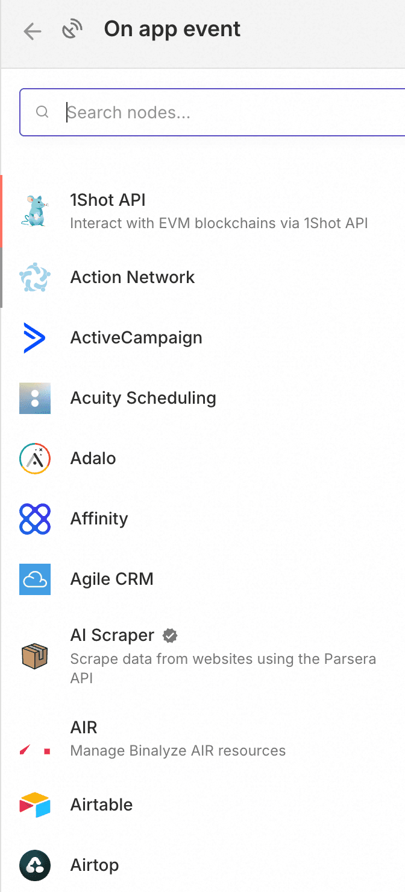

---

**On a schedule（定时触发）：**按照设定的时间间隔自动运行流程。支持 cron 表达式，可灵活设置周期性任务。比如每天凌晨 2 点运行。

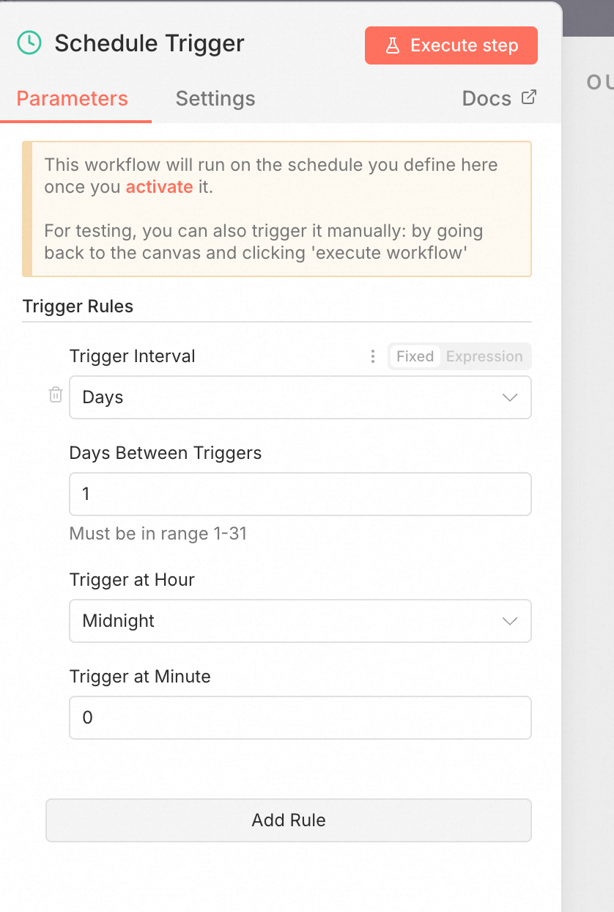

**On webhook call（Webhook 触发）：**当接收到 HTTP 请求（POST/GET）时触发流程。可以暴露一个 URL，让外部系统“推送”数据进来。也就是可以通过这种方式让把工作流集成到我们的系统中做调用。

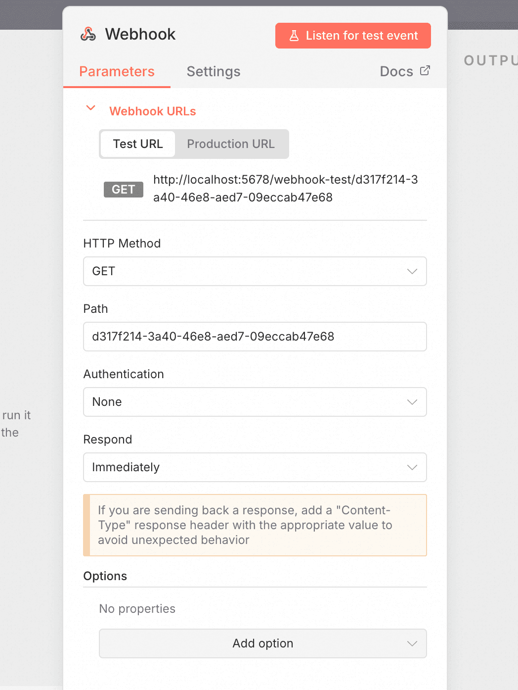

**On form submission（表单提交触发）：**在 n8n 内创建 Web 表单，用户填写并提交后触发流程。这种方式，无需额外前端，快速构建交互式流程。

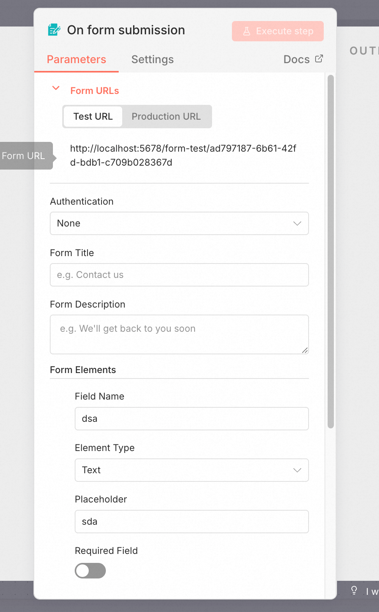

**When executed by another workflow（由其他工作流调用）：**在一个工作流中使用 `Execute Workflow` 节点来调用另一个工作流。可以用这种方式实现流程嵌套。

**On chat message（聊天消息触发）：**当用户在聊天工具（如 Slack、Telegram、Discord）中发送消息时触发。常用于构建 AI 助手或客服机器人，类似dify的chatflow

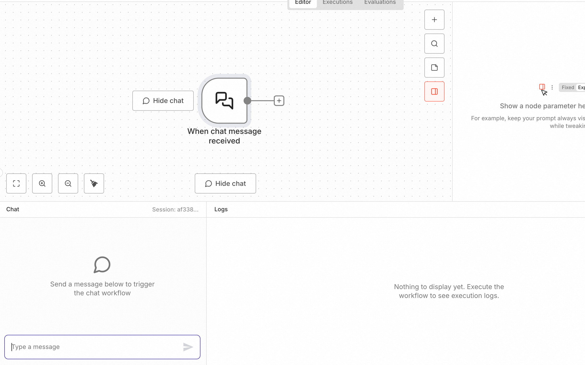

**Other ways...（其他方式）：**更多高级触发条件，可通过插件扩展支持更多触发源，比如：

- 文件变更（如 Google Drive 新文件上传）；
- 工作流错误时自动重试；
- 数据库变化监听等。

**触发方式对比**

|  |  |  |  |
| --- | --- | --- | --- |
| 触发方式 | 是否需要外部输入 | 是否适合自动化 | 适用场景 |
| 手动触发 | 否 | ❌ | 测试、调试 |
| 应用事件 | 是 | ✅ | 集成 Notion/Airtable 等 |
| 定时 | 否 | ✅ | 日报、备份、监控 |
| Webhook | 是 | ✅ | API 对接、事件驱动 |
| 表单提交 | 是 | ✅ | 用户输入收集 |
| 其他工作流调用 | 是 | ✅ | 模块化流程 |
| 聊天消息 | 是 | ✅ | AI 机器人、客服 |

节点类型

有了触发节点之后，就可以配置后续流程了， n8n 把节点分成了几个分类。

**AI 节点**

这就是AI相关的节点，就是做模型调用的。

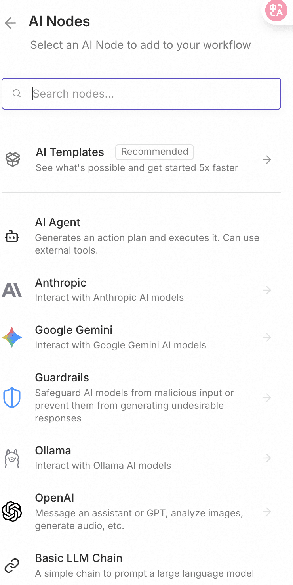

- 支持与主流大模型（如 OpenAI、Claude、Anthropic、Google Gemini 等）集成；
- 可以直接构建一个Ai Agent

不同的AI模型都提供了不同的能力，可以在对应的节点中选择

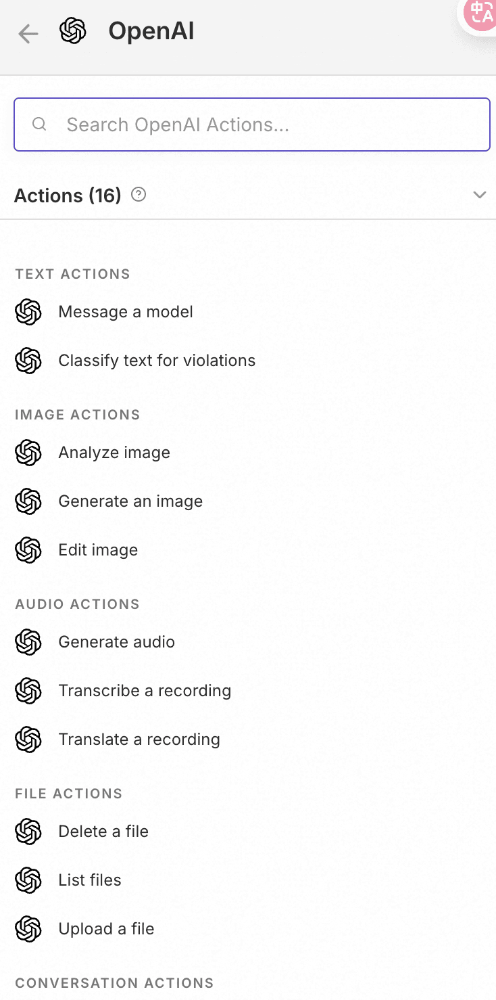

AI Agent是一个构建Agent的节点，他把一个agent需要的llm、memory和tool都集成在一起了，可以分别做配置。

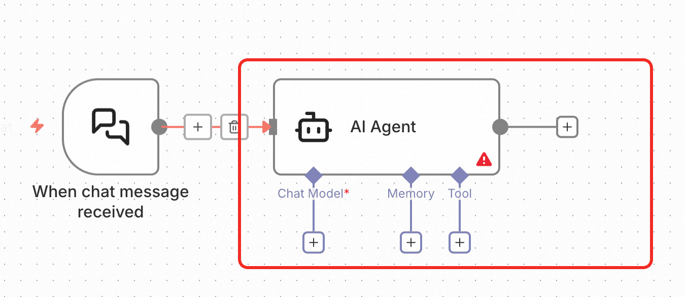

**Action in an app（应用操作节点）**

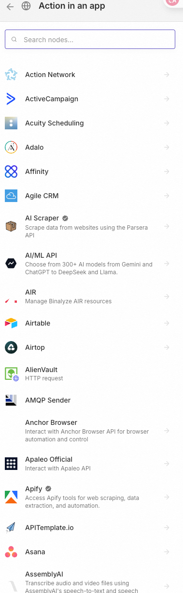

- 连接第三方服务，执行具体操作；
- 涵盖数百种应用（如 Google Drive、Slack、Zapier、Airtable、GitHub、Zoom 等）；
- 每个应用通常包含多个子节点，例如：
- `Google Sheets`: 创建行、读取数据、更新单元格
- `Telegram`: 发送消息、回复用户
- `Notion`: 添加页面、查询数据库

**Data transformation（数据转换节点）**

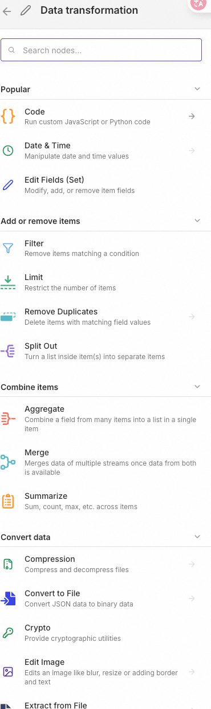

- 对数据进行清洗、格式化和处理；
- 常见节点包括：
- `Set`: 设置变量或字段值
- `Filter`: 根据条件筛选数据项
- `Map`: 遍历数组并转换每一项
- `JSON`: 解析/生成 JSON 数据
- `Function`: 执行 JavaScript 代码处理数据
- `Split / Merge`: 分割或合并数据流

**Flow（流程控制节点）**

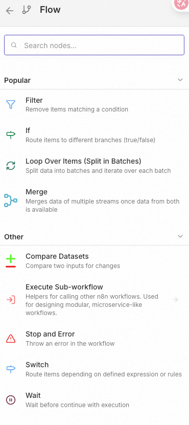

- 控制工作流的执行逻辑路径；
- 实现条件判断、循环、分支合并等复杂逻辑；
- 常见节点：
- `If`: 条件判断（类似 if-else）
- `Loop`: 循环遍历数组（如对每条记录做操作）
- `Wait`: 暂停一段时间再继续
- `Merge`: 多个分支合并为一条路径
- `Switch`: 多条件选择（类似 switch-case）

**Core（核心功能节点）**

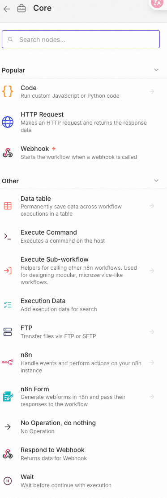

- 提供底层通用能力；
- 包含最基础但强大的工具；
- 常见节点：
- `HTTP Request`: 发起任意 HTTP 请求（GET/POST/PUT 等）
- `Code`: 执行自定义 JavaScript/TypeScript 代码
- `Webhook`: 接收外部 HTTP 请求（常作为触发器）
- `Set`: 设置变量（也可在 Data Transformation 中使用）
- `Delay`: 延迟执行

**Human in the loop（人工介入节点）**

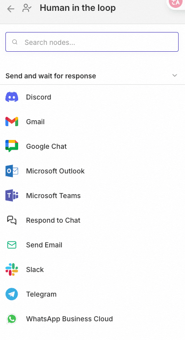

- 引入人类参与决策过程；
- 在自动化*流程中暂停，等待*人工确认；
- 常见节点：
- `Human Review`: 显示任务给指定人员审核
- `Approval`: 通过邮件或通知请求批准
- `Form`: 创建表单让用户填写输入

| 类别 | 主要作用 | 典型节点示例 |
| --- | --- | --- |
| **AI** | AI 能力调用 | OpenAI Chat, LangChain |
| **Action in an app** | 第三方应用操作 | Google Sheets, Telegram, Notion |
| **Data transformation** | 数据处理 | Filter, Map, Set, Function |
| **Flow** | 流程控制 | If, Loop, Wait, Merge |
| **Core** | 通用功能 | HTTP Request, Code, Webhook |
| **Human in the loop** | 人工干预 | Human Review, Approval, Form |
| **Trigger** | 启动流程 | Webhook, Schedule, Manual |

N8N中使用本地模型

n8n目前只支持一些国外的模型，国内模型只支持deepseek，其他的模型，比如qwen他是不支持的，所以，我们想要使用开源模型的话，需要自己本地部署，通过ollama的方式支持。

1、选择ollama节点

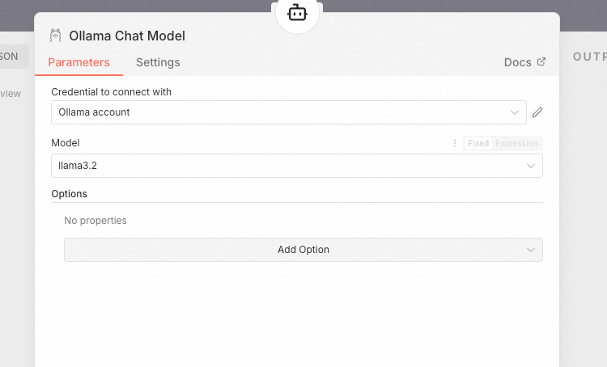

2、配置一个ollama账号：

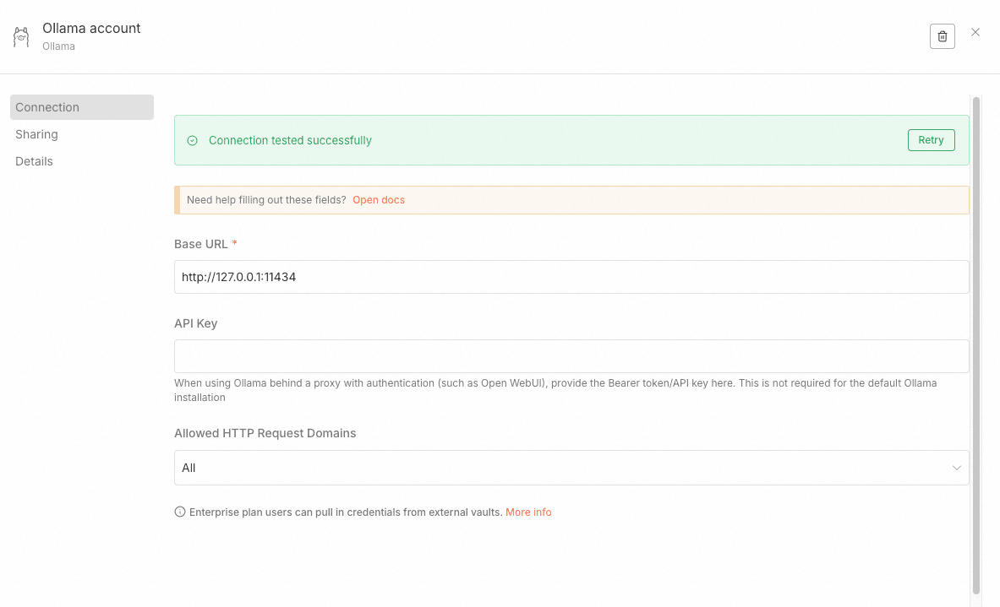

3、选择本地已部署的模型

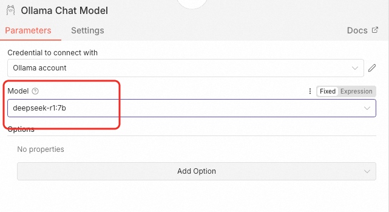

之后就可以用这个本地部署的模型做调用了。

GitHub 上的n8n 模板： https://github.com/Zie619/n8n-workflows

踩坑记录

如果是使用服务器部署的n8n，在使用的时候会发现，n8n打开的组件的默认域名依然是localhost，这个会非常影响我们的测试和使用。

比如我们使用表单触发方式的时候，点击测试，他打开的无头浏览器是localhost的，虽然你可以另打开一个页面修改ip访问，但是你没法调试节点了啊，你也没法在后续流程中引用表单的数据，所以在这个场景下，这问题是一定要解决的。

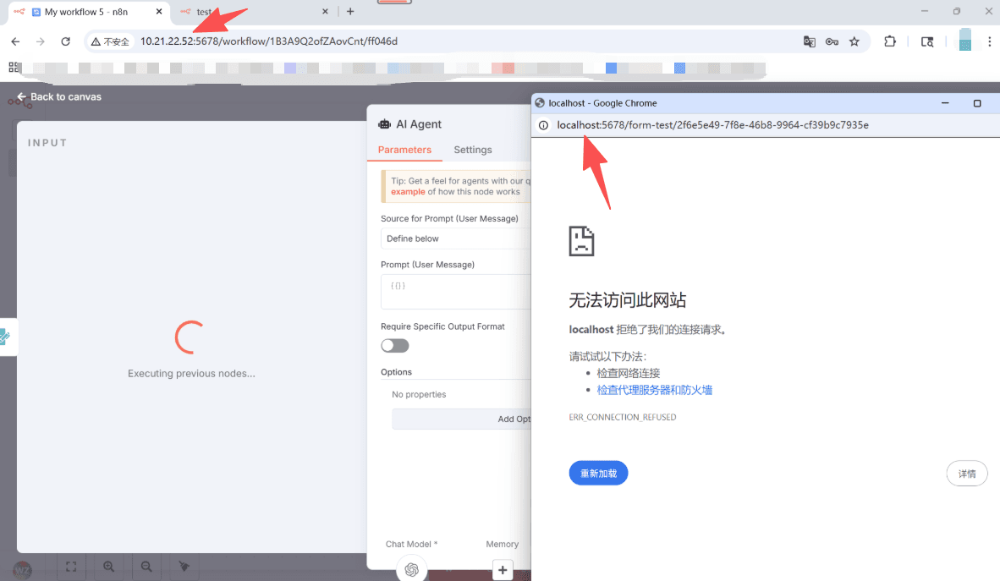

解决方式就是修改启动命令：核心就是增加 N8N_HOST，指定 n8n 前端页面识别**公开主机地址**，用于前端生成请求链接。

```text
docker run -d \
  -e N8N_SECURE_COOKIE=false \
  -e N8N_PUBLIC_URL="http://10.21.22.52:5678" \
  -e N8N_LISTEN_ADDRESS="0.0.0.0" \
  -e N8N_HOST="10.21.22.52" \
  --name n8n-node \
  -p 5678:5678 \
  -v n8n_data:/home/node/.n8n \
  n8nio/n8n
```

启动成功后，我们再次使用表单触发组件，点击 Test step 可以发现，他自动打开的url已经是我们的ip地址，而不是localhost了。

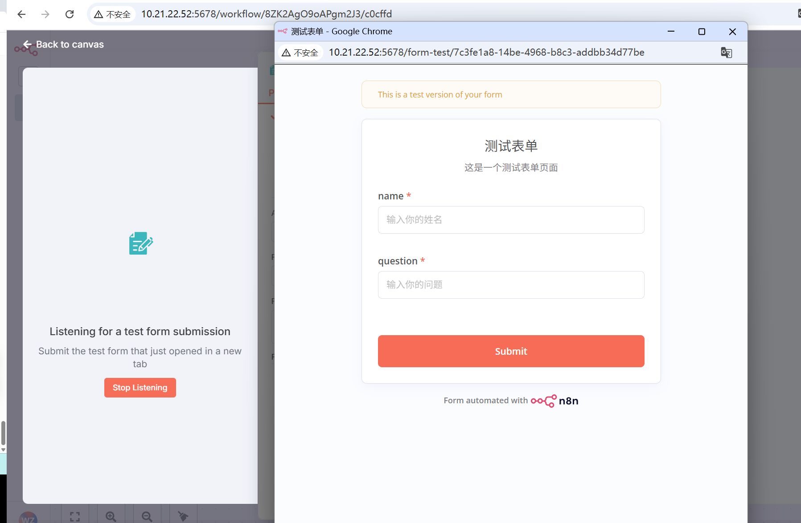

我们填写一下表单信息，可以看到我们的节点就成功获取到了 Output。

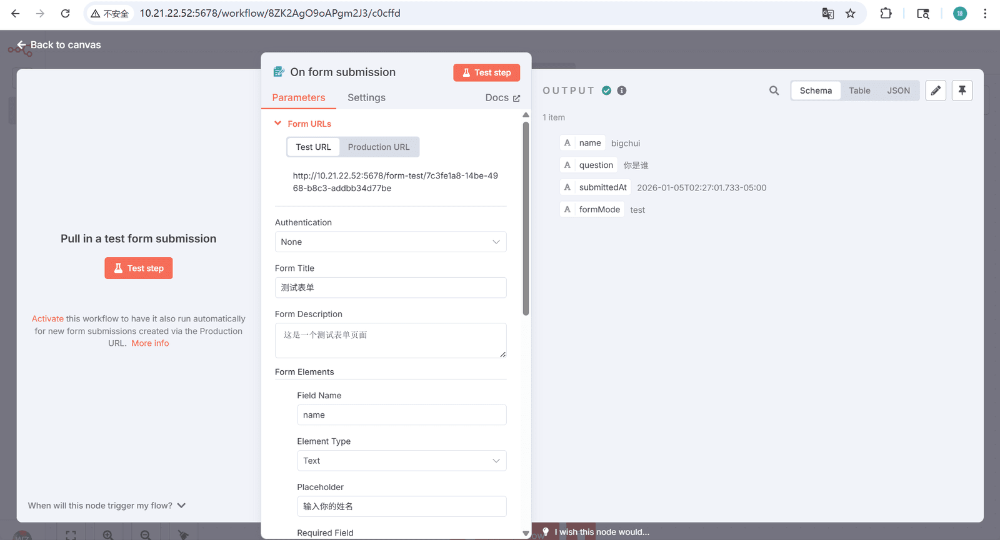

这样你才能再后续的节点中，拖拽前序节点的输出。

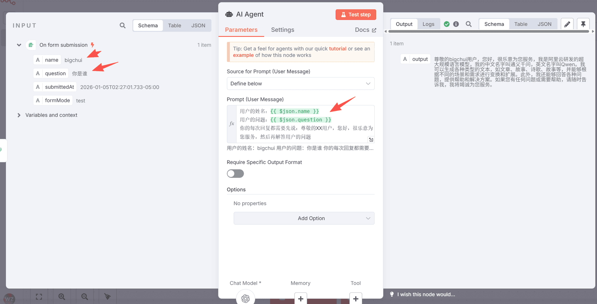

---

来源: https://thoughts.aliyun.com/workspaces/6963289eb0fc2e001bb052eb/docs/69882ed674e40300012cd342
