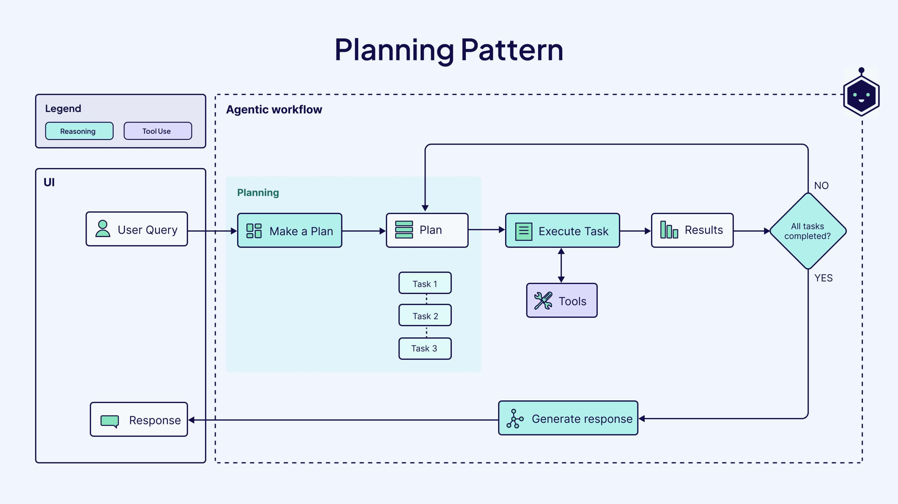
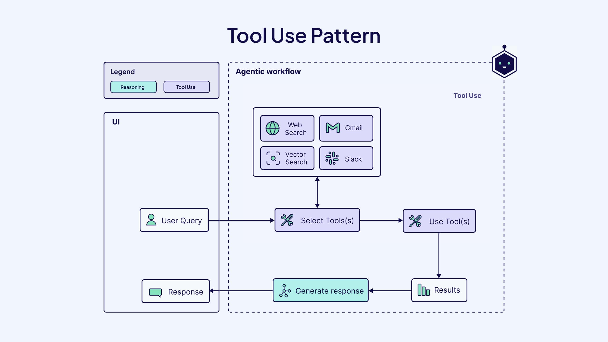
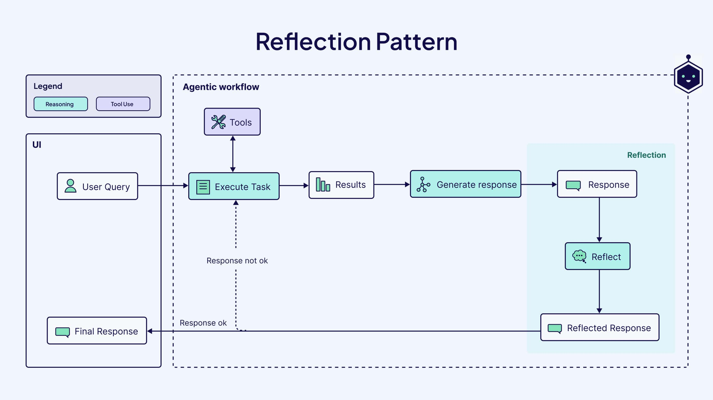
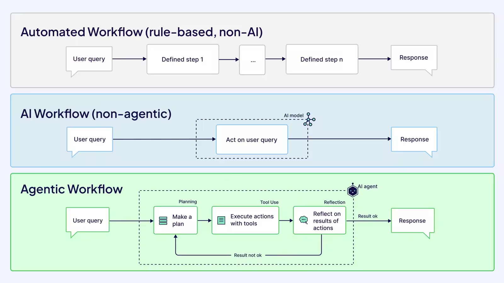
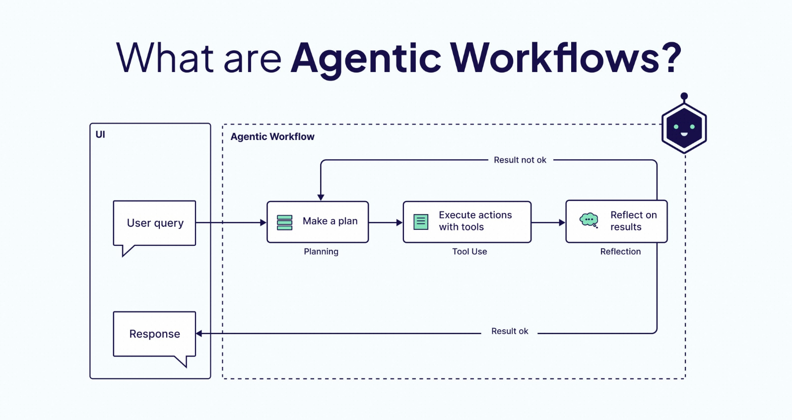

# ✅Agentic Workflow

前面介绍过了传统的Workflow和AI Workflow了，其实现在还有个概念挺火的，那就是Agentic Workflow（智能化工作流），这个概念挺新的，目前没有特别精确的解释，可以参考吴恩达在一次演讲中描述的Agentic Workflow有以下四种模式（范式）：

- Planning（规划）： 让 Agent 分解复杂任务并按计划执行。

- Tool Use（工具）： LLM 生成代码、调用 API 等工具进行操作。

- Reflection（反思）： 让 Agent 审视和修正自己生成的输出。

- Multiagent Collaboration（多智能体协同）： 多个 Agent 扮演不同角色合作完成任务。

也就是说，相比人工提前定义好的一个流程来说，Agentic更加看重的是AI的规划能力，流程是由LLM实时生成的，这样才能实现动态决策和自主优化的效果。

对比一下三种工作流：

- Automated Workflow
- 无LLM节点
- 通常用传统工作流进行编排，如activiti等。
- Ai Workflow
- 预设的、线性的或简单分支的自动化流程，通常由 LLM 调用、工具执行、数据转换等步骤组成。
- 仅调用 LLM 生成输出，无"动态决策"行为。
- 可以使用Dify、Coze等AI 工作流平台构建这类工作流。
- Agentic Workflow
- 由具有目标导向、记忆、规划、反思、协作等能力的智能体（Agent） 驱动的动态流程。具有适应性和自我演化能力。
- 可以使用LangGraph这类框架支持。

Agent VS Agentic Workflow

提到规划、反思、记忆等这些，估计很多人会发现，ReAct Agent好像也有类似的概念。

但是其实他俩不算是一个层面的东西，ReAct Agent只能算是Agentic Workflow的一个子集，或者说其中的某一个节点可以用ReAct Agent来实现而已。

对比下他们的差别：

| 维度 | Agent | ReAct Agent | Agentic Workflow |
| --- | --- | --- | --- |
| 范围 | 基础单元 | Agent 的一种实现范式 | 多 Agent 或复杂 Agent 的编排框架 |
| 结构 | 单一实体 | Thought-Action-Observation 循环 | DAG/状态机/任务图等 |
| 复杂度 | 低~中 | 中 | 高 |
| 目标 | 完成单一任务 | 提升推理+行动协同效果 | 解决复杂、多步骤、多角色任务 |
| 例子 | 能查天气的聊天机器人 | 使用 ReAct 模板调用工具的 Agent | AutoGen 中的团队协作、LangGraph 中的状态图 |

---

来源: https://thoughts.aliyun.com/workspaces/6963289eb0fc2e001bb052eb/docs/69882f2dc71a890001c3da5f
