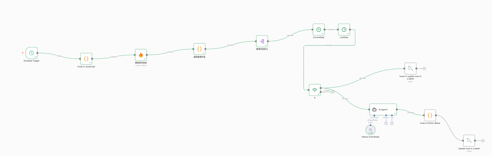

# ✅工作流实战：舆情分析助手——整体流程

我们需要实现一个舆情监控和分析的助手，可以从社交媒体，如微博、小红书等自动爬取帖子，然后分析其中的舆情信息，比如是否有大量的吐槽，或者反馈产品不可用等问题。

主要用到以下技术：

工作流：n8n

网页爬取：firecrawl

舆情分析：LLM

数据持久化：MySQL

数据格式转换：Python/Javascript代码

整个流程如下：

完整流程的json文件：

[https://nfturbo-file.oss-cn-hangzhou.aliyuncs.com/llm/%E8%88%86%E6%83%85%E5%88%86%E6%9E%90.json](https://nfturbo-file.oss-cn-hangzhou.aliyuncs.com/llm/%E8%88%86%E6%83%85%E5%88%86%E6%9E%90.json)

---

来源: https://thoughts.aliyun.com/workspaces/6963289eb0fc2e001bb052eb/docs/69882f99c71a890001c3da74
