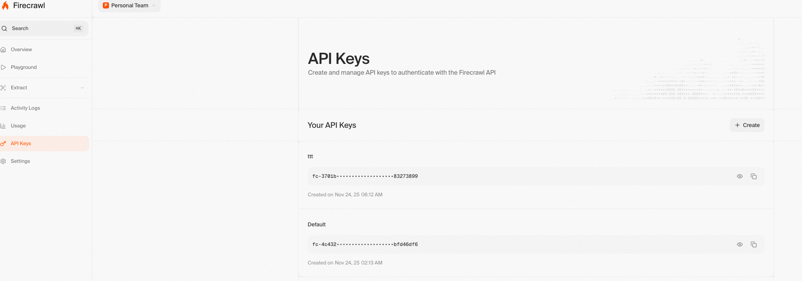
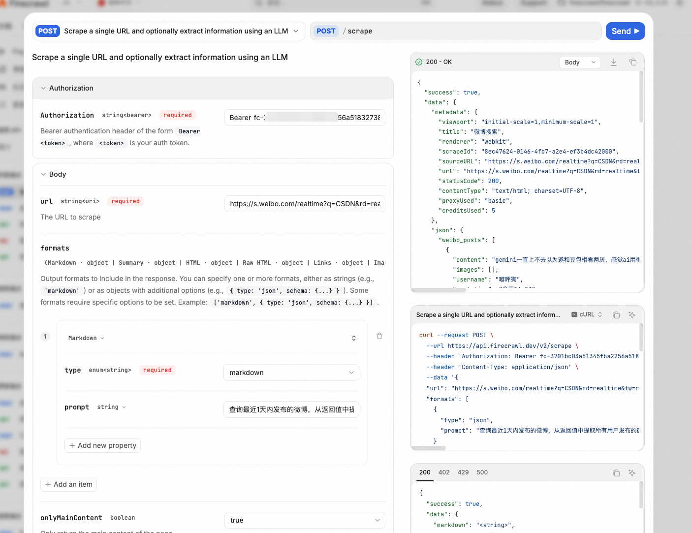
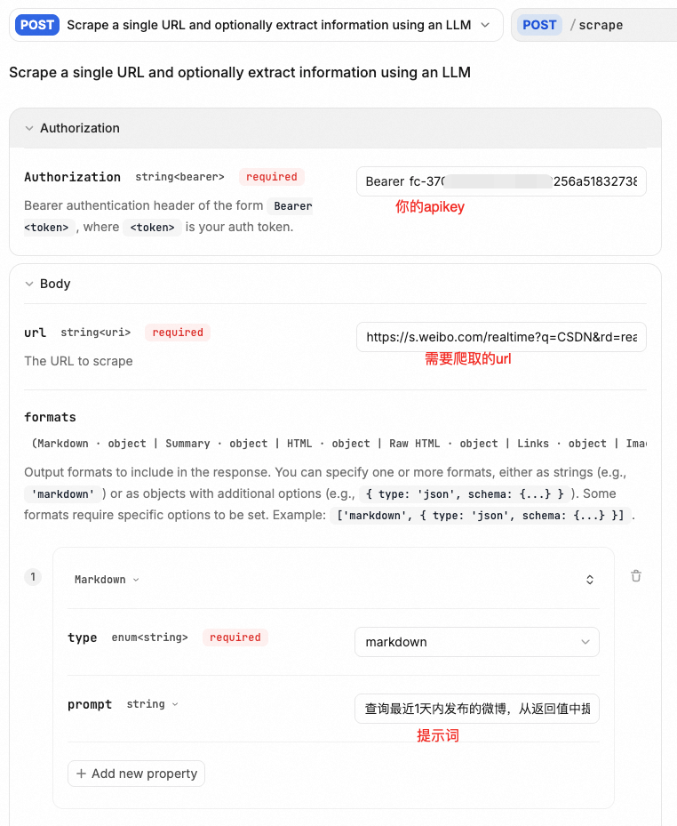
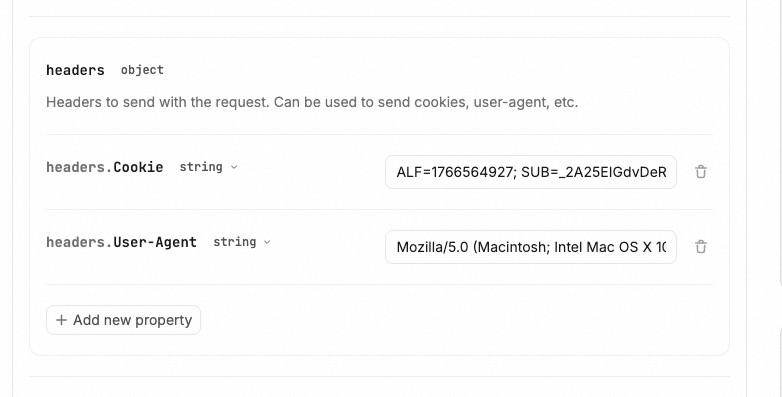

# ✅工作流实战：舆情分析助手——爬虫工具firecrawl介绍

Firecrawl 是一个开源的网页爬取和数据提取工具，专为将网页内容转化为结构化、可编程使用的格式而设计。它结合了现代浏览器自动化（如 Puppeteer 或 Playwright）与大语言模型（LLM）的能力，能够智能地解析网页内容、提取关键信息，并支持将整个网站“爬取+总结”成适合 AI 应用使用的格式。

- 智能内容提取：Firecrawl 不只是抓取 HTML，还能利用 LLM 理解页面语义，自动识别正文、标题、元数据等，过滤广告、导航栏等噪声内容。
- 批量爬取与网站地图支持：可以从 sitemap.xml 自动发现页面，或按 URL 列表进行递归爬取，适用于大规模数据采集任务。
- 输出结构化数据：提取结果通常为 JSON 格式，包含 clean_content（清洗后的正文）、metadata（标题、描述、URL 等）、以及可选的 LLM 总结。
- API 优先设计：Firecrawl 提供 RESTful API，便于集成到 AI 应用、RAG（检索增强生成）系统、知识库构建流程中。
- 开源 & 可自托管：项目在 GitHub 上开源，允许用户本地部署，保障数据隐私和定制化需

GitHub: https://github.com/mendableai/firecrawl

官方文档：https://docs.firecrawl.dev/

firecrawl key获取

注册一个账号，然后进入dashboard（https://www.firecrawl.dev/app ），在左侧api keys页面中创建一个新的key



这个key用于后续通过api调用。新用户会有500的免费额度。

firecrawl api介绍

Firecrawl 提供了一套简洁而强大的 RESTful API，专为网页抓取、内容提取和智能解析设计。以下是其**常用 API 接口及使用方式**的详细介绍：

1. `POST /v1/scrape` — 单页面抓取与解析

适用于抓取单个 URL 并返回结构化内容。

请求参数：

```text
{
  "url": "https://example.com/article",
  "formats": ["markdown", "html", "raw", "extract"], // 可选格式
  "onlyMainContent": true, // 是否只保留正文（默认 true）
  "includeRawHtml": false, // 是否包含原始 HTML
  "waitFor": 2000,         // 等待页面加载毫秒数（用于动态内容）
  "extract": {
    "schema": {
      "type": "object",
      "properties": {
        "title": { "type": "string" },
        "author": { "type": "string" },
        "publishDate": { "type": "string", "format": "date" }
      }
    }
  } // 使用 LLM 按指定 schema 提取结构化字段（高级功能）
}
```

返回示例：

```text
{
  "success": true,
  "data": {
    "content": "清洗后的正文文本...",
    "markdown": "# 标题\n正文内容...",
    "metadata": {
      "title": "文章标题",
      "description": "...",
      "language": "zh",
      "url": "https://example.com/article"
    },
    "extract": {
      "title": "文章标题",
      "author": "张三",
      "publishDate": "2025-11-01"
    }
  }
}
```

✅ 适合：新闻抓取、博客解析、产品页信息提取。

2. `POST /v1/crawl` — 批量爬取整个网站

递归爬取站点，支持按 sitemap 或链接深度遍历。

请求参数：

```text
{
  "url": "https://example.com",
  "limit": 100,               // 最大爬取页面数
  "maxDepth": 3,              // 最大链接深度
  "excludePaths": ["/admin", "/login"],
  "includePaths": ["/blog/*"],
  "scrapeOptions": {
    "formats": ["markdown"],
    "onlyMainContent": true
  },
  "webhook": "https://your-server.com/webhook" // 异步结果回调（可选）
}
```

响应（同步模式）：

```text
{
  "success": true,
  "data": [
    { "url": "...", "markdown": "...", "metadata": { ... } },
    // ... 多个页面结果
  ]
}
```

3. `POST /v1/map` — 获取网站所有可爬链接（sitemap 发现）

不抓取内容，仅发现 URL 列表，类似“站点地图生成器”。

请求：

```text
{
  "url": "https://example.com",
  "limit": 500
}
```

返回：

```text
{
  "success": true,
  "links": [
    "https://example.com/",
    "https://example.com/about",
    "https://example.com/blog/post1",
    ...
  ]
}
```

用途：预分析站点结构、生成爬取清单。

4. `POST /v1/search` — 联网搜索 + 抓取（需启用 Search 插件）

结合搜索引擎（如 SerpAPI）自动搜索关键词并抓取结果页内容。

示例：

```text
{
  "query": "最新 AI 开源项目 2025",
  "limit": 5
}
```

此功能通常需额外配置搜索 API 密钥，适合构建“联网 AI”应用。

使用建议：

- 小规模任务：用 `/scrape` 直接获取内容。
- 构建知识库：先用 `/map` 获取链接，再批量调用 `/scrape`。
- 大型站点：使用 `/crawl` + `webhook` 异步处理。
- RAG 应用：优先选择 `markdown` + `onlyMainContent: true`，便于分块嵌入。

认证方式

所有 API 需在 Header 中携带 Bearer Token：

```text
Authorization: Bearer YOUR_API_KEY
Content-Type: application/json
```

API调试

可以在以下页面中查看api的介绍和在线调试：

https://docs.firecrawl.dev/zh/api-reference/v2-introduction

这样就能直接发送请求了：



数据抓取案例

我们通过一个case演示一下firecrawl的功能，我们尝试用他爬取微博上的帖子，用于分析是否有网络舆情。需要做几件事：

1、知道去哪个url查看微博最近发布的帖子

经过我们去微博上查看，发现这个url是查看最新的微博的地址：https://s.weibo.com/realtime?q=CSDN&rd=realtime&tw=realtime&Refer=weibo_realtime ，其中的CSDN就是我们需要查询的内容，即舆情关注的内容，可以替换成任意需要做舆情监控的关键词。

2、需要构造登录授权

这个我们需要提前在网页上登录微博，然后从请求中获取到cookie（详见视频演示）

3、从爬取页面中获取到想要的内容

firecrawl是支持LLM的，我们可以通过LLM提取抓取结果中我们想要的内容。

我们演示通过scrape来获取内容，配置如下：



提示词内容：查询最近1天内发布的微博，从返回值中提取所有用户发布的微博内容、图片、用户名、发布时间、唯一id等。

以上提示词，就会实现自动帮我们筛选最近一天的微博内容，并且把我们想要的信息提取出来。

并且在header中配置上cookie和user-agent即可，这些信息都可以用浏览器的开发者工具从网页中获取。（详见视频）



然后就可以发送请求，会得到以下结果：

```text
{
  "success": true,
  "data": {
    "metadata": {
      "viewport": "initial-scale=1,minimum-scale=1",
      "renderer": "webkit",
      "title": "微博搜索",
      "scrapeId": "54a7f3cd-5426-4f6d-948e-5e2a1ecc07d3",
      "sourceURL": "https://s.weibo.com/realtime?q=CSDN&rd=realtime&tw=realtime&Refer=weibo_realtime",
      "url": "https://s.weibo.com/realtime?q=CSDN&rd=realtime&tw=realtime&Refer=weibo_realtime",
      "statusCode": 200,
      "contentType": "text/html; charset=UTF-8",
      "proxyUsed": "basic",
      "creditsUsed": 5
    },
    "json": {
      "weibo_posts": [
        {
          "content": "gemini一直上不去以为遂和豆包相看两厌，感觉ai用得人快退化了，以前我是怎么只靠csdn活过来的",
          "images": [],
          "username": "噼呯狗",
          "post_time": "11月25日 16:53",
          "unique_id": "QfugQ5rh4"
        },
        {
          "content": "推荐CSDN作者：今日（20251125）【领军人物榜】榜首青云交 (@青云交) 的【第一篇 综合热榜】文章 《Java 大视界 -- 基于 Java 的大数据可视化在企业生产全流程监控与质量追溯中的应用》",
          "images": [],
          "username": "青云交",
          "post_time": "11月25日 14:26",
          "unique_id": "QftjglQqu"
        },
        {
          "content": "为了写这个论文，我学习了布迪厄社会学、康德哲学，在CSDN、GitHub、阿里云开发者社区、百度开发者中心、azure技术文档来回穿梭，现在是我硕士三年知识储备最强的时刻!",
          "images": [],
          "username": "东府在逃石狮子",
          "post_time": "11月24日 23:28",
          "unique_id": "QfnqUegoX"
        },
        {
          "content": "我的一点工作吐槽\n\nai之所以能发展迅速，并且运用于人类生活，除了他自身的优越性，也缺少不了当下所有搜索引擎的傻逼，其中重中之重包括 百度，edge，safari，csdn，谷歌也时而傻逼。",
          "images": [],
          "username": "YL兔斯基",
          "post_time": "11月24日 18:35",
          "unique_id": "QflvYyVvd"
        },
        {
          "content": "CSDN本身已经很垃圾了，现在更垃圾了，CSDN爬了很多git项目，然后用别人readme生成一个AI说明冒充网页，关键CSDN很多时候搜索权重还高得离谱",
          "images": [
            "https://wx2.sinaimg.cn/thumb150/008bIA8Ngy1i7n1lqax01j30gf039dg4.jpg",
            "https://wx3.sinaimg.cn/orj360/008bIA8Ngy1i7n1lqnzgyj310i0p9ngg.jpg"
          ],
          "username": "潮水里的小电机",
          "post_time": "11月24日 09:25",
          "unique_id": "QfhUvtLu8"
        },
        {
          "content": "服了，今天被这个人工智障浪费了好多时间，再也不会让ai出题了，还不如去CSDN找案例😡",
          "images": [
            "https://wx2.sinaimg.cn/thumb150/008z0mW4gy1i7mkz12mbcj30m807yt92.jpg",
            "https://wx2.sinaimg.cn/thumb150/008z0mW4gy1i7mkz1d9ghj30m807p3yt.jpg",
            "https://wx4.sinaimg.cn/thumb150/008z0mW4gy1i7mkz1niw7j30lr05g3yp.jpg",
            "https://wx4.sinaimg.cn/thumb150/008z0mW4gy1i7mkz1xghoj30m2044jre.jpg"
          ],
          "username": "小小无尾鱼w",
          "post_time": "11月23日 23:48",
          "unique_id": "Qfe8tDbiF"
        }
      ]
    }
  }
}
```

可以看到，结果已经是我们想要的格式内容了。

另外，在实际调试过程中，我发现有的时候，json的返回值的内容回比markdown的内容上，比如说一页中有10条微博，最终在json中只保留4-5条，我试过调整提示词，发现该丢还是丢，所以后面放弃了用json的格式，直接取markdown，然后在从markdown中自己解析出想要的东西。

---

来源: https://thoughts.aliyun.com/workspaces/6963289eb0fc2e001bb052eb/docs/69882faa51b1440001341fc7
