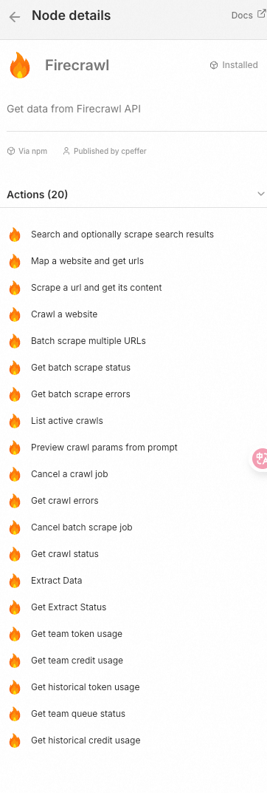
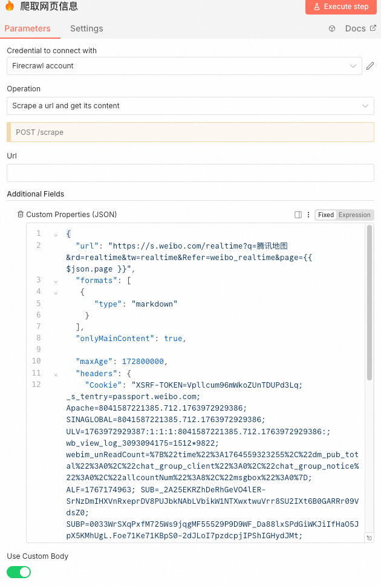
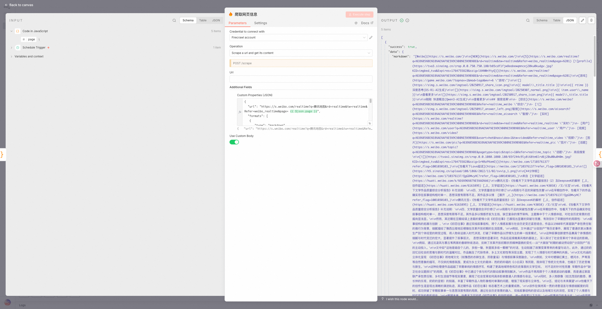
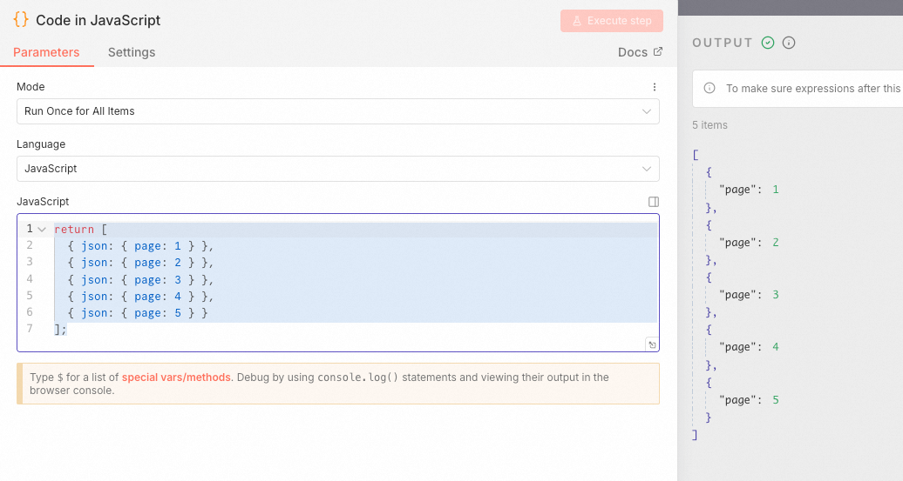
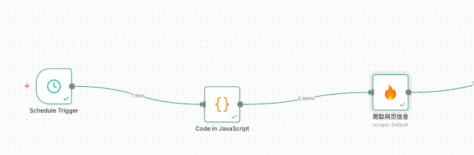
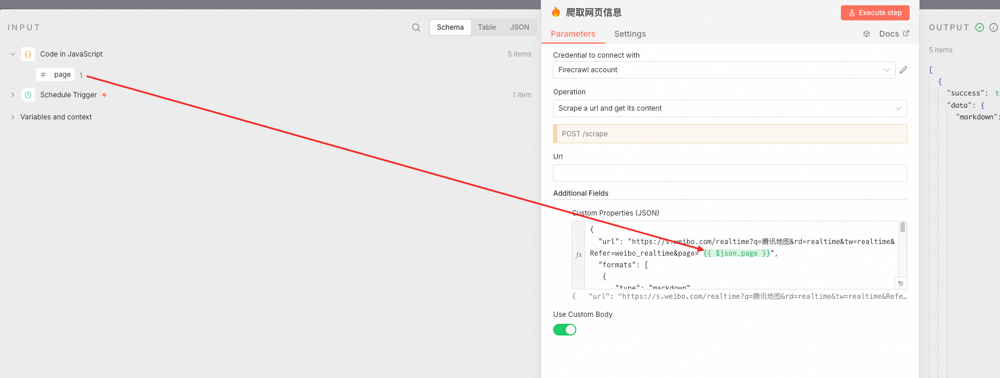

# ✅工作流实战：舆情分析助手——N8N配置firecrawl实现分页爬取

n8n中内置了firecrawl的插件，提供了前面我们介绍的常用的api：



我们可以借助这个插件做网页的爬取，我们使用"scrape a url and get its content"这个操作，然后这个操作有两种配置方式，一种是基于他的配置填写参数，另外一种是我们自定义Body做调用。

这里我试了之后，发现想要跑通的话，只能用custom body的方式，因为使用基于配置的方式的话，header没办法设置。（我试了很多办法，都设置不成功）

使用custom配置的方式的话，就把整个请求体，都放到这个custom properties中就行了：



这里面需要注意的是，如果直接从firecrawl中复制过来的参数直接用的话，会报错，提示：

&#123; "success": false, "code": "BAD_REQUEST", "error": "Either 'milliseconds' or 'selector' must be provided, but not both.", "details": [ &#123; "code": "custom", "message": "Either 'milliseconds' or 'selector' must be provided, but not both.", "path": [ "actions", 0 ] &#125; ] &#125;

这是因为从调试工具那里复制过来的参数中，默认带了：

```text
"actions": [
    {
      "type": "wait",
      "milliseconds": 2,
      "selector": "#my-element"
    }
  ]
```

这里说明milliseconds和selector不能同时存在，所以删除其中一个或者干脆都干掉即可，我们这里暂时没用上这个action。

配置好了之后，就可以运行这个节点了。运行后就可以在返回中中看到从网页上爬取到的内容。



这里我们会遇到一个问题，这里的爬取他只会爬取第一页，那么我们需要让他能爬取多页的数据，但是因为 **n8n 的节点是“数据驱动”的**，不是“命令式执行”的。

它不会“先执行 A，再执行 B，再回到 A”。它是：**输入一批数据 → 每条数据独立流过所有节点**。所以**没有“循环回去”的概念**，也没有跨 item 的“共享变量”。

所以，想要让这个爬虫节点执行多页的爬虫，我想到这样的办法，我们先创建一个代码节点，在里面返回一个json数组：



然后他其实会把每一个&#123;"page":xx&#125;当做一次循环，调用一次后续的节点，那么就可以在这个节点后节firecrawl的爬虫节点，并且指定page的解析方式:





这样就能实现循环执行前5页了。

---

来源: https://thoughts.aliyun.com/workspaces/6963289eb0fc2e001bb052eb/docs/69882fcda7c8ff000156266c
