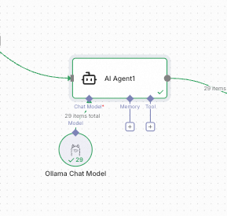
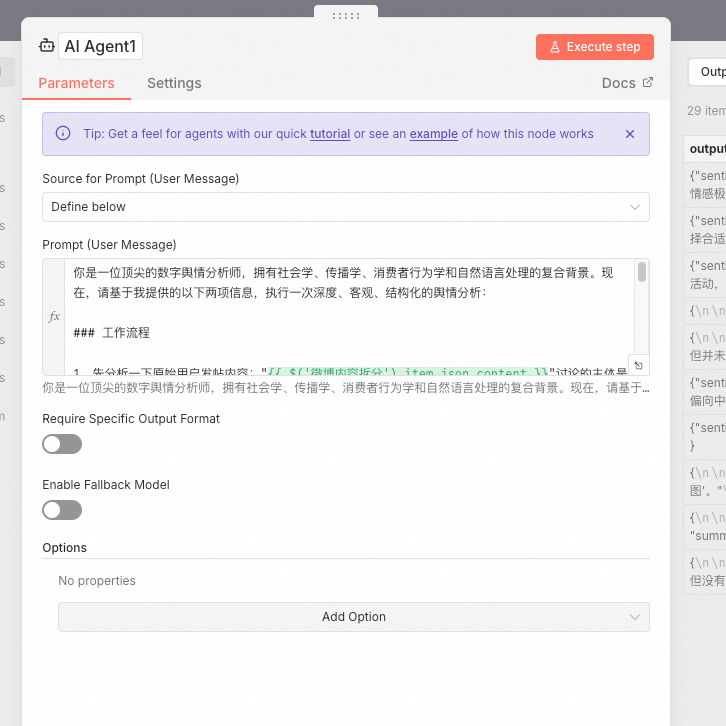
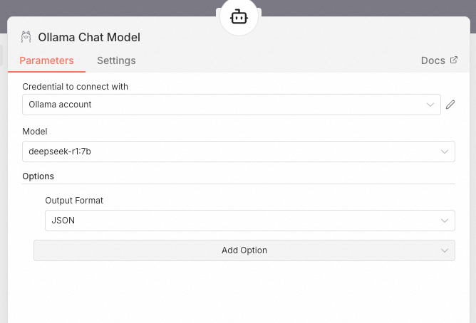
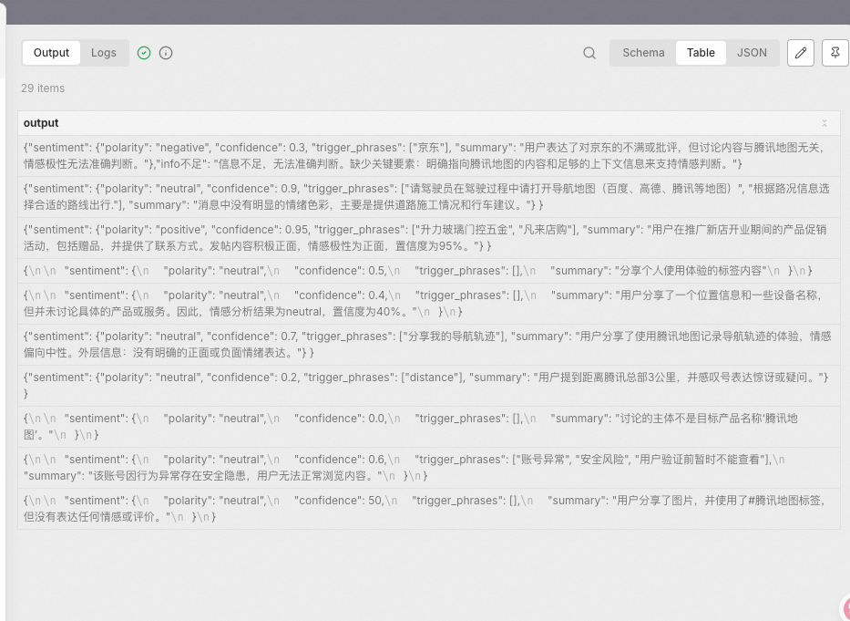

# ✅工作流实战：舆情分析助手——LLM节点做舆情分析



提取到了微博内容之后，我们就需要通过大语言模型对他进行语义分析，判断是否有舆情了。

在这个AI Agent节点中，我们首先需要配置prompt：

```text
你是一位顶尖的数字舆情分析师，拥有社会学、传播学、消费者行为学和自然语言处理的复合背景。现在，请基于我提供的以下两项信息，执行一次深度、客观、结构化的舆情分析：

### 工作流程

1、先分析一下原始用户发帖内容："{{ $('微博内容拆分').item.json.content }}"讨论的主体是不是目标产品名称："腾讯地图"，如果是则继续执行下一步，如果不是，则本条情感分析结果直接标记为neutral
2、判定整体情感极性（正面 / 中性 / 负面）、给出置信度（0–100%）、指出关键情感触发词或语句


⚠️ 注意事项：

不臆测未在文本中体现的信息
避免主观情绪化语言，保持专业中立
若发帖内容模糊或信息不足，请明确说明“信息不足，无法准确判断”，并指出缺失的关键要素

请严格按照以下 JSON Schema 输出结果，不得包含任何额外文本、解释、Markdown 或注释。

  "sentiment": {
    "polarity": "positive|neutral|negative",
    "confidence": 0.0,
    "trigger_phrases": ["string"],
    "summary":["string"]
  }
```

以上是我设计的prompt，主要有几个地方需要注意：

1、要求LLM只针对指定的微博内容做分析

2、要求他先判断发微博内容是否针对指定的主体做讨论

3、给出具体的情感指向（正面、中立、负面）

4、要求做结构化输出



接着要给这个agent配置一个llm，我们选择的是本地的OLLAMA配置的deepseek



需要开启output format，否则输出结果不稳定。

按照以上配置后，就实现了舆情分析了。输出结果如下：



---

来源: https://thoughts.aliyun.com/workspaces/6963289eb0fc2e001bb052eb/docs/69882ffd74e40300012cd4a4
