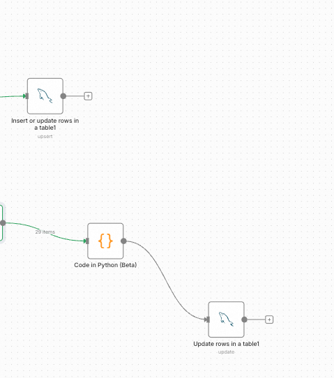
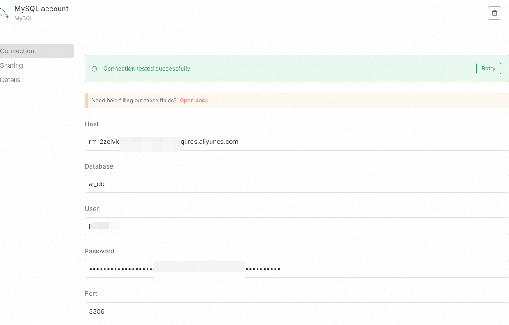
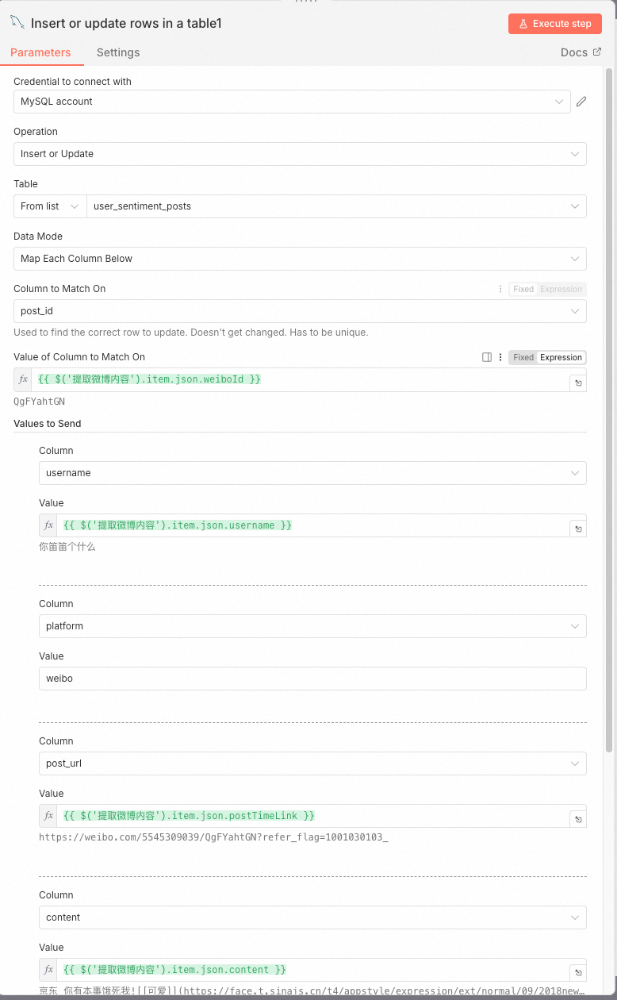
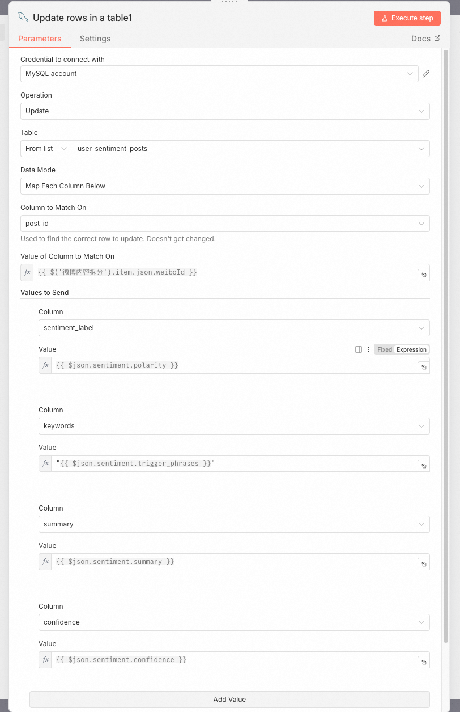
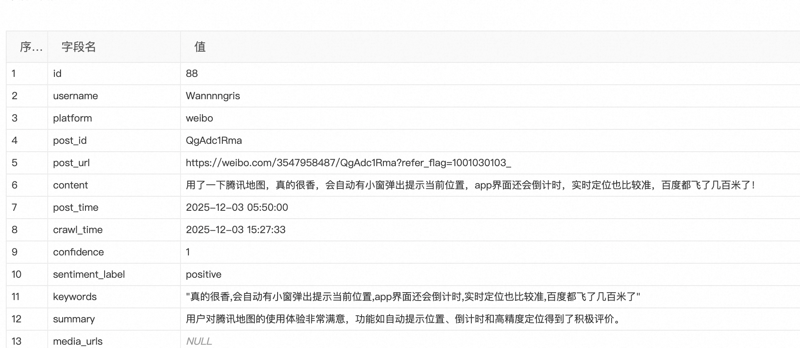

# ✅工作流实战：舆情分析助手——数据保存与更新

我们从微博上提取到用户发帖内容后，要对他做舆情分析，分析之后我们需要把数据持久化下来，这样方面我们做报表展示，以及跟进。

这里我们用n8n支持的mysql



他提供了很多操作，包括增删改查都支持的。我们有两个节点，一个是负责插入微博原文内容信息的，一个是负责把LLM分析出的舆情结果信息更新到mysql中的，所以一个是insert一个是update。

先在你自己的mysql中建表一张：

```text
/******************************************/
/*   DatabaseName = ai_db   */
/*   TableName = user_sentiment_posts   */
/******************************************/
CREATE TABLE `user_sentiment_posts` (
  `id` bigint unsigned NOT NULL AUTO_INCREMENT COMMENT '主键ID',
  `username` varchar(128) COLLATE utf8mb4_unicode_ci DEFAULT NULL COMMENT '用户名/昵称',
  `platform` enum('weibo','douyin','zhihu','bilibili','xiaohongshu','tieba','wechat','other') COLLATE utf8mb4_unicode_ci NOT NULL COMMENT '来源平台',
  `post_id` varchar(128) COLLATE utf8mb4_unicode_ci NOT NULL COMMENT '帖子在平台上的唯一ID',
  `post_url` varchar(512) COLLATE utf8mb4_unicode_ci DEFAULT NULL COMMENT '帖子链接',
  `content` text COLLATE utf8mb4_unicode_ci NOT NULL COMMENT '原始发帖内容',
  `post_time` datetime NOT NULL COMMENT '发帖时间（原始时间）',
  `crawl_time` datetime NOT NULL DEFAULT CURRENT_TIMESTAMP COMMENT '爬取入库时间',
  `confidence` decimal(10,0) DEFAULT NULL COMMENT '置信分数',
  `sentiment_label` enum('positive','neutral','negative') COLLATE utf8mb4_unicode_ci DEFAULT NULL COMMENT '情感标签',
  `keywords` varchar(1024) COLLATE utf8mb4_unicode_ci DEFAULT NULL COMMENT '提取的关键词列表，JSON格式：["关键词1", "关键词2"]',
  `summary` varchar(2048) CHARACTER SET utf8mb4 COLLATE utf8mb4_unicode_ci DEFAULT NULL COMMENT '内容概要总结',
  `media_urls` json DEFAULT NULL COMMENT '附带的媒体链接（图片/视频），JSON数组',
  `repost_count` int unsigned DEFAULT '0' COMMENT '转发数',
  `like_count` int unsigned DEFAULT '0' COMMENT '点赞数',
  `comment_count` int unsigned DEFAULT '0' COMMENT '评论数',
  PRIMARY KEY (`id`),
  UNIQUE KEY `uk_platform_postid` (`platform`,`post_id`),
  KEY `idx_post_time` (`post_time`),
  KEY `idx_crawl_time` (`crawl_time`),
  KEY `idx_sentiment_label` (`sentiment_label`),
  KEY `idx_platform_postid` (`platform`,`post_id`)
) ENGINE=InnoDB AUTO_INCREMENT=76 DEFAULT CHARSET=utf8mb4 COLLATE=utf8mb4_unicode_ci COMMENT='用户舆情发帖记录表'
;
```

然后需要在n8n创建mysql的账号，指定你的host，db，username，password就行。



然后配置insert节点，其实这里主要就是做字段映射，把流程上下文的字段映射到数据库中。



update节点也一样，我们是按照postId做更新：



最终在数据库中可以看到数据：



---

来源: https://thoughts.aliyun.com/workspaces/6963289eb0fc2e001bb052eb/docs/6988300f3fb91800011553b5
