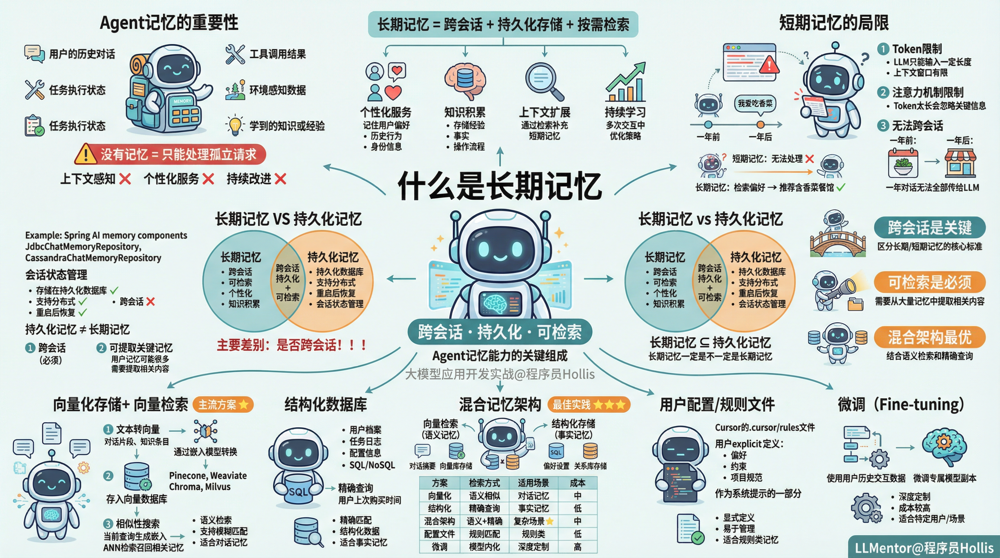

# ✅什么是长期记忆

前面我们讲过，Agent的记忆能力必不可少。Agent 的“记忆”是指其在与环境或用户交互过程中，用于**存储、检索和利用信息**的机制。这些信息可以包括：

- 用户的历史对话
- 工具调用结果
- 任务执行状态
- 环境感知数据
- 学到的知识或经验

没有记忆的 Agent 只能处理孤立的请求，无法实现上下文感知、个性化服务或持续改进。

之前我们在介绍Memory的时候，讲的都是短期记忆，短期记忆是指 Agent 在**当前会话或任务周期内**临时保存的信息，通常以**上下文窗口**（context window）的形式存在。

而且，前面我们也介绍过原理，不管是spring ai还是langchain4j等框架，他们都是自己在内存维护（或者做了持久化）的记忆，然后把这些记忆当做上下文的方式直接传给LLM的。

但是不管怎么样维护记忆内容，最终大模型想要实现记忆，都需要通过messages把历史的所有对话传过去。而由于LLM的token限制，他只能输入一定长度的对话记录，又因为大模型其实本身的注意力机制的限制，token太长也会导致他会忽略掉某些关键信息。

所以，短期记忆做会话记忆是可以的，但是如果跨会话，比如一年前我说我爱吃香菜，一年后让LLM给我推荐餐馆，如果把这一年的对话都带给LLM根本不可能。

所以，我们需要引入一种**长期记忆**的方式，帮助Agent更好的**记住并提取**到用户偏好。我们一般称之为用户画像。

长期记忆

长期记忆是指 Agent 能够**跨会话、持久化存储并按需检索**的信息，用于**跨会话**的知识积累、个性化、用户画像等，具有长期价值，通常经过提炼、结构化，并可能用于检索增强（RAG）等机制。他的主要作用是：

1. **个性化服务**：记住用户偏好、历史行为、身份信息等。
2. **知识积累**：存储学到的经验、事实、操作流程等。
3. **上下文扩展**：通过检索补充短期记忆的不足。
4. **持续学习**：支持 Agent 在多次交互中不断优化策略。

长期记忆 VS 持久化记忆

**长期记忆和短期记忆的主要差别在于是否跨会话！！！**

如果记忆没有跨会话，比如Spring AI 提供的记忆组件（如 JdbcChatMemoryRepository、CassandraChatMemoryRepository）主要是为了支持会话状态管理，虽然他们存储在持久化数据库中，也只是为了支持分布式或重启后的上下文恢复。所以，虽然这种是持久化记忆，但是也只能是短期记忆。

**也就是说，长期记忆一定是持久化记忆，但是持久化记忆不一定是长期记忆。**

另外，**长期记忆需要具备可以提取关键记忆的能力。**因为一个用户有关的记忆可能会很多，那这次对话，我该提取哪些内容呢？

综上，**长期记忆**的主流实现方式包括：

**向量化存储 + 向量检索**

- 将文本（如对话片段、知识条目）通过嵌入模型转换为向量。
- 存入向量数据库（如 Pinecone、Weaviate、Chroma、Milvus）。
- 在需要时，用当前查询生成嵌入，进行相似性搜索（ANN 检索）召回相关记忆。

**结构化数据库**

- 存储用户档案、任务日志、配置信息等结构化数据（如 SQL/NoSQL）。
- 适用于精确查询（如“用户上次购买时间”）。

**图数据的存储**

- 用户画像、关联关系通过图数据库维护

**混合记忆架构**

- 结合向量检索（语义记忆）与结构化存储（事实记忆）、图数据库。
- 例如：用向量库存对话摘要，用关系库存用户 ID 和偏好设置。

**用户配置/规则文件**

- 如 Cursor 的 `.cursor/rules`文件，用户显式定义偏好、约束、项目规范等，作为系统提示的一部分。

**微调**

- 微调也是一种长期记忆方案，就是使用用户的历史交互数据微调一个专属模型副本。

---

来源: https://thoughts.aliyun.com/workspaces/6963289eb0fc2e001bb052eb/docs/697f235f51b14400012c3d20
