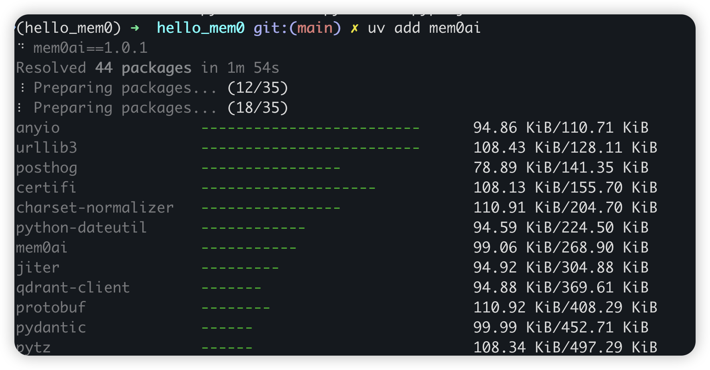

# ✅长期记忆实现方案——Mem0

提到**长期记忆**，不得不提的一个框架就是——Mem0([https://github.com/mem0ai/mem0](https://github.com/mem0ai/mem0) )，这是一个开源项目，旨在为 AI Agent提供个性化、可持久化的长期记忆能力。它通过将用户与 AI 的交互历史进行结构化存储、向量化，并结合检索增强生成（RAG）机制，使 AI 能够“记住”过去与特定用户的对话内容、偏好、上下文等信息，从而在后续交互中提供更连贯、个性化的响应。

Mem0 的实现主要基于以下几个关键技术模块：

**记忆提取**

- 在每次用户与 AI 交互后，Mem0 使用一个记忆提取器分析对话内容。
- 提取关键事实、偏好、意图等，例如：“用户喜欢喝无糖咖啡”、“用户住在杭州”。
- 这些信息被转化为简洁、结构化的记忆条目。

**向量化与存储**

- 每条记忆被嵌入成向量
- 向量存储在向量数据库中，并关联到特定用户 ID。
- 支持元数据（如时间戳、来源对话 ID）以便后续过滤或排序。

**记忆检索**

- 在新对话开始时，Mem0 根据当前用户输入查询向量数据库。
- 通过相似度搜索召回最相关的过往记忆。
- 可结合时间衰减、相关性评分等策略对记忆进行重排序。

**上下文注入与生成**

- 检索到的记忆被格式化后，作为上下文注入到 LLM 的 prompt 中。

例如：

```text
以下是关于用户的一些记忆：
- 用户不喜欢吃香菜。
- 用户最近在准备考研。

当前问题：推荐一道晚餐食谱。
```

LLM 利用这些记忆生成更贴合用户背景的回答。

**记忆去重与演化**

- Mem0 会检测新提取的记忆是否与已有记忆重复或冲突。
- 通过 LLM 判断是否需要合并、更新或废弃旧记忆，避免冗余或矛盾。
- 例如：旧记忆是“用户住在北京”，新对话说“刚搬到上海”，系统会更新位置信息。

Mem0使用教程

介绍下，在python中如何使用mem0做长期记忆。

**1、安装pgvector（之前讲过）**

- 安装后创建数据库名字为mem0_memory
- 用户名和密码统一为pgvector

**2、安装ollama（之前讲过）**

- 安装 qwen2.5:0.5b
- 安装 nomic-embed-text:v1.5

我本地电脑（Apple M1 Pro的芯片 ）尝试过其他的模型，包括deepseek-r1:7b、qwen3-embedding:4b等，都跑不动，可以根据自己的情况选择其他模型。我实践下来以上组合是可以的。

**3、安装uv（之前讲过）**

以前我们讲过，不装也可以，直接用pip也行。

**4、编写py脚本**

创建虚拟环境并激活

```text
uv init hello_mem0
cd hello_mem0 
uv venv
source .venv/bin/activate
```

这里需要修改mem0的默认配置，包括向量数据库、语言模型和嵌入模型，改用我们之前安装过的pgvector、模型也用ollama本地部署的。

创建文件hello.py，并编写以下脚本：

```text
from mem0 import Memory

config = {
     "vector_store": {
        "provider": "pgvector",
        "config": {
            "user": "pgvector",
            "password": "pgvector",
            "host": "127.0.0.1",
            "port": "5433",
            "embedding_model_dims":768,
            "dbname":"mem0_memory"
        }
    },
    "llm": {
        "provider": "ollama",
        "config": {
            "model": "qwen3:1.7b",
            "temperature": 0,
            "max_tokens": 2000,
            "ollama_base_url": "http://localhost:11434",  # Ensure this URL is correct
        },
    },
    "embedder": {
        "provider": "ollama",
        "config": {
            "model": "nomic-embed-text:v1.5",
            "ollama_base_url": "http://localhost:11434",
            "embedding_dims":768    
    },
    },
}

print("初始化 Memory...")
m = Memory.from_config(config)

print("添加 Memory...")
messages = [
    {"role": "user", "content": "Hi, I'm Hollis. I love Coding and Gaming."},
    {"role": "assistant", "content": "Hey Hollis! I'll remember your interests."}
]

# 检查 add 是否返回结果或报错
result = m.add(messages, user_id="Hollis666")
print("Add result:", result)

print("查询 Memory...")
results = m.search("What do you know about me?", user_id="Hollis666")
print(results)
```

**注意1：不要用官网中的results = m.search("What do you know about me?", filters=&#123;"user_id": "alex"&#125;)这种语法查询记忆，会报错提示：At least one of 'user_id', 'agent_id', or 'run_id' must be provided.**

**注意2：需要指定"embedding_model_dims":768、"embedding_dims":768 等配置，否则会报错：expected 1536 dimensions, not 768**

5、添加相关依赖

```text
uv add mem0ai
uv add ollama
uv add psycopg2-binary
```



6、运行代码

```text
uv run hello.py

或者 

pip hello.py
```

输出结果如下：

```text
初始化 Memory...
添加 Memory...
Add result: {'results': [{'id': '0f2e08e2-1aa1-40e5-93e9-e1e207c641ae', 'memory': 'Name is Hollis', 'event': 'ADD'}, {'id': '36b4f2fc-7b79-4467-9658-c43c6123de9e', 'memory': 'Loves Coding and Gaming', 'event': 'ADD'}]}


查询 Memory...
{'results': [{'id': '0f2e08e2-1aa1-40e5-93e9-e1e207c641ae', 'memory': 'Name is Hollis', 'hash': '5edda5964e4b435d379f95eb3476b90e', 'metadata': None, 'score': 0.5794673702831845, 'created_at': '2025-12-24T04:31:35.604207-08:00', 'updated_at': None, 'user_id': 'Hollis666'}, {'id': '36b4f2fc-7b79-4467-9658-c43c6123de9e', 'memory': 'Loves Coding and Gaming', 'hash': 'c1c4a6510be2c1417c419bf05b79f05f', 'metadata': None, 'score': 0.6695897223526462, 'created_at': '2025-12-24T04:31:35.662664-08:00', 'updated_at': None, 'user_id': 'Hollis666'}]}
```

---

来源: https://thoughts.aliyun.com/workspaces/6963289eb0fc2e001bb052eb/docs/697f2382d31fed00010643d6
