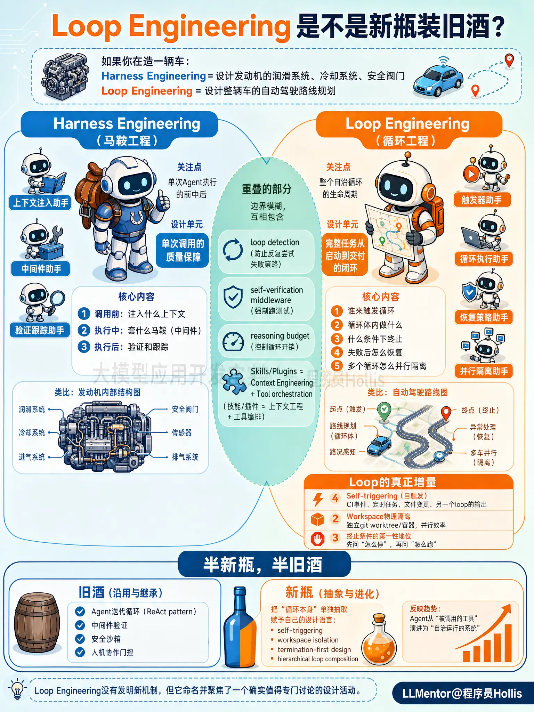

# ✅Loop Engineering是不是新瓶装旧酒？

我们介绍过Harness Engineering ，他关注的是**一次Agent执行的前中后**——调用之前注入什么上下文、执行过程中套什么马鞍、执行之后怎么验证和跟踪。它的设计单元是"**单次调用的质量保障**"。

Loop Engineering 关注的是**整个自治循环的生命周期**——谁来触发这个循环、循环体内做什么、什么条件下终止、失败后怎么恢复、多个循环之间怎么并行隔离。它的设计单元是"**一个完整任务从启动到交付的闭环**"。

如果你在造一辆车，Harness Engineering 是在设计发动机的润滑系统、冷却系统、安全阀门；Loop Engineering 是在设计整辆车的自动驾驶路线规划——什么时候启动、遇到红灯怎么办、到目的地怎么停、乘客没上车怎么等。

重叠的部分

说实话，Harness和Loop中的重叠非常大。

LangChain 自己发布的 Harness Engineering 实践文章里，做的事情就包括 loop detection（防止Agent反复尝试同一个失败策略）、self-verification middleware（强制Agent跑测试而非自评）、reasoning budget（控制循环的计算开销）。这些在今天的话术体系里完全可以归类为 Loop Engineering 的范畴。

反过来，Addy Osmani 定义的 Loop 五要素——Automations、Worktrees、Skills、Plugins、Sub-agents——里面的 Skills 和 Plugins 本质上就是 Harness Engineering 里 Context Engineering 和 Tool orchestration 的换皮说法。

所以两个阵营互相包含对方的内容，边界是模糊的。

真正的增量在哪

Loop Engineering 确实引入了一些 Harness Engineering 原本没有重点覆盖的关注点：

**Self-triggering（自触发）。**Harness框架默认假设有人或有程序在显式调用Agent。Loop Engineering 把"谁来启动这个循环"本身作为设计对象——可以是 CI 事件、定时任务、文件系统变更、甚至另一个 loop 的输出。Agent不再是被调用的函数，而是一个持续监听、自主激活的守护进程。

**Worktrees 物理隔离。** Harness 谈 Sandbox 主要是安全视角（别让Agent搞坏宿主机）。Loop Engineering 把隔离提升为并行效率问题——每个 loop 跑在独立的 git worktree 或容器里，多个 loop 可以同时修改同一个仓库的不同部分而互不冲突。这是 Claude Code 和 Codex 的实际工程模式。

**终止条件的第一性地位。** 设计一个 loop 时，**第一个问题就是"它怎么停下来"**，而不是"它怎么跑起来"。

总结

其实，从Harness到Loop，技术上没有任何突破。火起来纯粹是因为使用场景到了临界点。

2025下半年到2026年初，Claude Code 和 Codex 让普通开发者第一次体验到"把一个 GitHub Issue 扔给 Agent，它自己跑二十分钟，开一个 PR 回来"。当这变成日常操作后，大家发现优化的杠杆点既不在 prompt 怎么写，也不仅在 context 怎么喂，而在于**这个自动循环本身怎么设计**——触发条件、重试策略、并行隔离、终止逻辑。

一个新场景需要一个新名字来方便讨论。Peter Steinberger 恰好在这个时间点说了那句朗朗上口的话，Addy Osmani 做了系统化，于是 Loop Engineering 就成了2026年6月的流行词。

所以，Loop Engineering本质上是**半新瓶，半旧酒。**

旧酒的部分：Agent 迭代循环（ReAct pattern）、中间件验证、安全沙箱、人机协作门控——这些在 Harness Engineering 甚至更早的 Agent 框架里都有完整实现。

新瓶的部分：把"循环本身"从 Harness 的众多关注点中单独抽取出来，赋予它自己的设计语言和最佳实践体系（self-triggering、workspace isolation、termination-first design、hierarchical loop composition），反映了 Agent 从"被调用的工具"演进为"自治运行的系统"这个真实趋势。

**Loop Engineering 没有发明新机制，但它命名并聚焦了一个确实值得专门讨论的设计活动。**

---

来源: https://thoughts.aliyun.com/workspaces/6963289eb0fc2e001bb052eb/docs/6a338e3ec71a89000157d417
