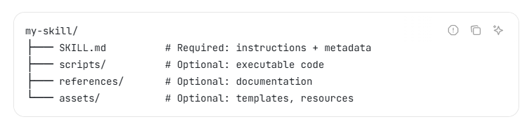

# ✅什么是Agent Skills，为什么需要他？

前面我们讲上下文工程的时候，提到过上下文太长会带来各种各样的问题，所以对于很多Agent来说，上下文工程都是至关重要的。而我们今天要介绍的Skill，其实也是上下文工程的一种，他主要解决的也是Agent上下文太长的问题。

最近** Agent Skills** 这个概念非常的火热，和 MCP 一样，同样是由 **Anthropic** 这个公司推出的，都是为了提升智能体的工程化水平。

Agent Skill是**Anthropic** 这个公司推出的一种新的范式，解决的是Agent上下文太长的问题，其实也是上下文工程的一种典型实现。

我们来做个比喻，Agent就像一个酒店的大厨，而MCP、Function Call这些就像是后厨的锅碗瓢盆、葱姜蒜等这些工具和食材，随着我们对厨师的要求越来越多，需要让他会做各种菜，我么就给他堆满了工具和食材。但是，厨师有了工具和食材就能做出好菜了么？未必，因为随着工具越来越多，食材越来越多，反而会让厨师更难以做出美味的菜肴，因为他可能不知道什么时候该用哪口锅，该用哪种酱油了。这时候，就需要一个菜谱，来指导厨师做菜，而这个菜谱，就是Skill！

在 Agent Skills 出现之前，智能体的能力通常通过以下方式实现：

- 把工作经验写在 Prompt 中
- 封装成工具调用逻辑
- 固化在 workflow 流程里

这些方式在简单场景下可行，但当任务复杂度提升时会暴露明显问题：

- 能力难以复用，重复开发严重
- prompt 持续膨胀，上下文成本越来越高
- 执行逻辑分散，难维护
- 模型稳定性下降，结果不可控

本质上，这些方案都缺少一种统一的能力抽象方式。

而且，正是由于MCP大行其道之后，使得上下文暴涨，每次集成几个MCP的时候，会同时引入一堆工具，尤其是当你引入多个MCP的时候，他们之间如果再有相似工具，那么就更加剧了Agent不知道该选择哪个工具。

Agent Skills **不是新的模型能力，也不是新的算法，而是一种让大模型能力可复用、可管理的工程化机制。**Agent Skills 的做法，是把一些已经被验证有效的做事方式，抽象出来，封装成一个独立的能力模块，让 Agent 在需要的时候直接使用。

它解决的也是一个非常现实的问题：

如何把“做某件事的经验”稳定交给大模型，并能够长期复用。

Agent Skills 的核心思想

Agent Skills 的思路很直接：

把已经验证有效的做事方式抽象成独立能力模块，让 Agent **在需要时自动加载和执行**。

这些能力模块可以被：

- 重复使用
- 自由组合
- 按需加载
- 持续维护

从系统角度看，Agent Skills 本质上是一种通用能力标准，它定义了：

```text
Agent 能做什么
如何执行任务
需要使用哪些资源
执行结果如何返回
```

也就是说**Agent Skills把零散的 Prompt、工具调用和执行流程，组织成结构化的能力单元。**

那他到底是怎么做到的呢？我们接着往下看。

Agent Skills 到底是什么样的？

**Agent Skill 本质上就是一个标准化的目录结构**。你可以先把它理解为：**一个给 Agent 用的能力文件夹目录**。对，没有错，他其实就是一个文件夹目录，后续所有的内容都是围绕在这个文件夹目录中新增文件和内容来展开的。

一个完整的 Skill，至少包含一个核心文件Skill.md，其余内容都是围绕这个核心文件展开的。

**下图是官网的 Skill 结构图：**



```text
my-skill/           # 技能名称
├── SKILL.md        # 必选：技能的介绍说明与指令约束
├── scripts/        # 可选：可执行的脚本
├── references/     # 可选：可参考的示例文件
└── assets/         # 可选：图片等资源文件
```

这个结构就是 Agent Skills 的核心，就是为了让 Agent 在运行时，**可以分层、有选择地加载信息**，而不是一次性把所有内容塞进上下文。

**SKILL.md**

我们可以看到上面的结构中，唯一必选的文件就是 SKILL.md 文件，它也是整个 Agent Skill 体系中的核心。Agent 能不能正确理解并使用一个 Skill，完全取决于 SKILL.md 写得怎么样。

SKILL.md 是 **Skill 的入口定义 + 指令规范**，由两个部分组成：**Frontmatter（元数据）** + **Instruction（指令正文）**。这是官方规范要求的结构。

如下所示：

```text
---
name: pdf-processing
description: Extract text and tables from PDF files, fill forms, merge documents.
---

# PDF Processing

## When to use this skill
Use this skill when the user needs to work with PDF files...

## How to extract text
1. Use pdfplumber for text extraction...

## How to fill forms
...  
```

**Frontmatter（元数据）**

这一段必须写在文件顶部，而且有明确语义限制：

- **name**：技能唯一标识（agent 用它来识别技能）
- **description**：简要说明技能做什么、在什么情况应该被激活

```text
---
name: pdf-processing
description: Extract text and tables from PDF files, fill forms, merge documents.
---
```

这块必须使用六个减号`---`包裹起来，客户端（如 Claude Code）在启动或加载技能时，并不会直接把整个 SKILL.md 塞进模型上下文，而是会：

1. 自动扫描指定的 Skill 目录
2. 只读取被 `---` 包裹的 Frontmatter 元数据
3. 基于 `name` 和 `description` 完成技能发现与能力匹配

**只有当 Agent 判断当前任务确实需要该 Skill 时，才会进一步加载 SKILL.md 中的指令正文内容。**

这一步设计的核心目的只有一个：

**在技能发现阶段，最大限度地减少上下文 token 的消耗。**正因如此，元数据可以说是 **Agent Skills 能够真正工程化运作的最核心机制**。

它把能力识别和实际执行这两件事情解耦拆开，使 Skill 不再是一次性 Prompt，而是一个可检索、可匹配、可延迟加载的能力单元。

**Instruction（指令正文）**

在六个减号`---`之后的部分，就是完整的指令正文。如果说元数据解决的是 **要不要用这个 Skill** 的问题，那么 Instruction 解决的就是 **具体该怎么用** 的问题。Instruction 说白了就是写在 **执行阶段**使用的 Prompt。

```text
# PDF Processing

## When to use this skill
Use this skill when the user needs to work with PDF files...

## How to extract text
1. Use pdfplumber for text extraction...

## How to fill forms
...  
```

当 Agent 已经通过元数据判断当前任务需要该 Skill 之后，才会把这一部分内容加载进上下文，并按照这里的指令来执行。从实践和官方规范来看，Instruction 主要承担以下几类职责：

- 明确 **使用时机和适用边界**，防止 Skill 被误用
- 将复杂任务拆解成 **稳定、可复现的执行步骤**
- 显式约束 Agent 的行为方式，减少自由发挥和幻觉
- 为后续的 **Script、Reference** 提供清晰的使用说明和调用指引

因此，Instruction 本质上就是一份 **面向专业领域、特定功能的高质量 Prompt**。只要遵循我们在提示词章节中介绍的编写原则，就可以输出出一份效果不错的 Skill 指令。

需要注意的一点是：诸如 **详细示例、字段定义、复杂规则** 等长上下文的内容，官方并不推荐全部堆在SKILL.md 中，而是更适合通过 **reference** 进行按需补充、按需加载，再配合通过 **Script** 来承载可执行的逻辑。只有这样，Skill 才不再是一次性 Prompt，而是真正具备工程能力的 Agent 功能模块。

Reference

Reference 是 Agent Skills 中一个**可选但非常重要**的组成部分，它解决的问题是：

当 Skill 本身比较复杂时，如何在**不增加执行阶段上下文负担**的前提下，为 Agent 提供必要的补充信息。

在设计上，Reference **不会参与 Skill 的发现阶段**。客户端在扫描 Skill 目录时，只会读取 SKILL.md 的元数据，而不会读取 reference 目录下的任何内容。

Reference 的按需加载：

- Reference 中的内容**不会自动进入上下文**
- 只有当 Instruction 中明确指示，或 Agent 在执行过程中需要查阅某些细节时，才会主动读取对应的 Reference 文件

因此，Reference 更适合存放：

- 详细示例
- 字段和结构定义
- 复杂规则说明

可以这样理解：

**Instruction 负责告诉 Agent 怎么做，Reference 负责在需要时补充细节。**

这种拆分方式，使 Skill 在执行时具备了**渐进式加载上下文**的能力，既保证了执行的准确性，又避免了无关信息反复占用 token。

Script

Script 同样也是一个可选组件，用来承载 **不适合交给模型自由生成的确定性逻辑**。里面一般来说放的都是python脚本。

在执行流程上，Agent 会先依据 SKILL.md 中的指令进行决策，再在合适的步骤中调用 Script 来完成具体操作。它本质上就是一个 **工具执行脚本**，用来处理一些特定的任务，主要的目的就是让大模型不需要考虑具体的实现细节，而只需要调用执行、获取结果即可。

从这个角度看，Script 和 MCP 很像，但根本上来说，两者解决的问题并不是一个维度。

MCP 关注的是 **Agent 如何连接外部世界、外部工具**，它定义的是工具如何被暴露给大模型使用；而 Script 关注的是**在某一个具体 Skill内，哪些步骤必须用确定性代码来完成**。

还有一种非常典型的场景：当 Reference 中的文件很大时，并不适合直接让大模型去读取和理解。这时通常会通过 Script 来完成查找、过滤和裁剪，只把最终结果返回给 Agent，而不是让模型直接读取原始内容。

因此可以这样理解三者的分工关系：

- MCP 提供连接外部的工具能力
- Skill 定义做事的流程和规范
- Script 把流程中的关键步骤用稳定的代码兜底执行

---

来源: https://thoughts.aliyun.com/workspaces/6963289eb0fc2e001bb052eb/docs/69ac06dc74e403000141a78c
