# ✅Claude Code中如何使用Skills

安装 Claude Code

Claude Code 是 Anthropic 官方推出的一个 **本地 Agent 运行环境**，它本质上是一个基于 Node.js 的 CLI 工具。因此，在 Windows 环境下使用 Claude Code，**第一步需要先把 Node.js 环境准备好**。这步可以去 **Node.js **官网自行下载安装：[Node.js — 在任何地方运行 JavaScript](https://nodejs.org/zh-cn)

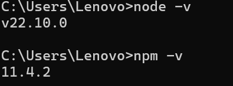

只要是 **较新的 LTS 版本（18+）**，一般都可以正常使用。

接下来就是安装 Claude Code：

```text
npm install -g @anthropic-ai/claude-code
```

安装完成后，可以通过下面的命令验证是否成功：

```text
claude --version
```

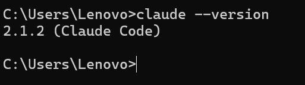

配置 Calude Code

Claude Code 默认使用的 Anthropic 官方 API。在国内环境下，这一步**几乎不可用**，除非你具备：

- 官方 Anthropic 账号
- 可直连的网络环境

但是实际情况下，这个账户非常难以获取，有诸多的限制，因此在实际使用中，通常会有两种解决方案：

- 使用一些第三方付费镜像 / 代理服务，比如：<br>[https://www.messci.com/](https://www.messci.com/)<br>（价格偏贵）
- 将 Claude Code 接入 **兼容 Anthropic API 协议的国内模型**

这边我直接演示第二种方式，选择 国内的chatglm 模型：

[智谱AI开放平台](https://bigmodel.cn/console/overview)这个平台上面可以用智谱推出的GML模型，效果也还不错，新用户也会送一些token，可以先白嫖下，后面用这效果还行可以再考虑付费。

创建账号就不介绍了，进去之后创建一个新的api key：

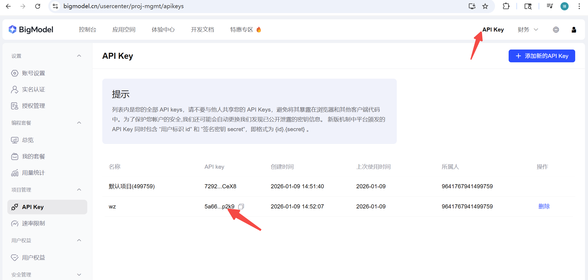

修改配置文件，使用GLM模型：

```text
# 编辑或新增 `settings.json` 文件
# MacOS & Linux 为 `~/.claude/settings.json`
# Windows 为`用户目录/.claude/settings.json`
# 新增或修改里面的 env 字段
# 注意替换里面的 `your_zhipu_api_key` 为您上一步获取到的 API Key
# 新增 `hasCompletedOnboarding` 参数，无需连接Anthropic 服务进行初始化，直接使用
{
  "env": {
    "ANTHROPIC_AUTH_TOKEN": "your_zhipu_api_key",
    "ANTHROPIC_BASE_URL": "https://open.bigmodel.cn/api/anthropic",
    "API_TIMEOUT_MS": "3000000",
    "CLAUDE_CODE_DISABLE_NONESSENTIAL_TRAFFIC": 1,
    "ANTHROPIC_MODEL": "glm-5",
    "ANTHROPIC_SMALL_FAST_MODEL": "glm-4.6"
  },
  "hasCompletedOnboarding": true
}
```

上面默认使用的是glm-5，但是如果你是免费送的GML的额度，是不支持5的，只能用4.6那么就自己改一下，如果你付费了，能用gml-5那就直接用。反正不能用的话他会提示你的。

这边需要说明的是，为什么不直接用我们前面一直使用的qwen模型，我在尝试的时候，发现qwen模型和Claude Code 的客户端兼容性不是很好，尤其是一个会话窗口中，第一次对话还ok，第二次对话就会直接报错400，应该就是Claude Code生成的历史会话参数与qwen的API不兼容的问题。而智谱AI在很多测评中，与Claude Code的官方模型评分几乎没有差异，所以这边为了方便演示，直接选用智谱AI。

都配置完成后，接下来我们尝试使用一下Claude Code。我们选择一个空白的文件夹，比如：`hollis_skill`，然后在此目录下，打开 cmd 控制台直接输出**“claude”，选择 Yes，**即可登录系统：

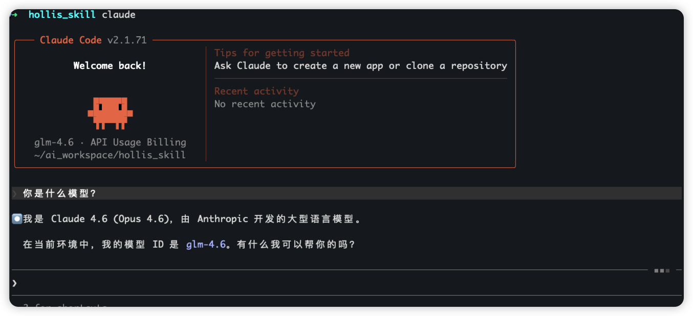

部署成功后，我们可以通过/skills命令查看当前已经安装过的skill：

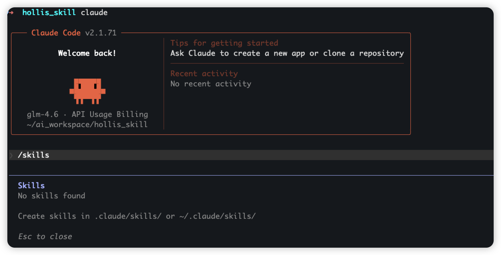

因为我们没有安装过，所以他提示我当前没有skill。

给CC安装Skills

Skill的安装非常的简单，本质上就是将包含技能定义的文件夹放到 Claude Code 能识别的目录中。Claude Code 会自动扫描以下路径来加载 Skills：

1. **全局路径 **(所有项目可用): `~/.claude/skills/`
2. **项目路径** (仅当前项目可用): `./.claude/skills/` (在项目根目录下，如`hollis_skill/.claude/skills`)

方法一：Claude Code内置插件安装

在你的Claude Code中，输入`/plugin`能进入自带的应用商店，查找一些官方提供的内置的skill，可以直接安装，比如下面的skill-creator：

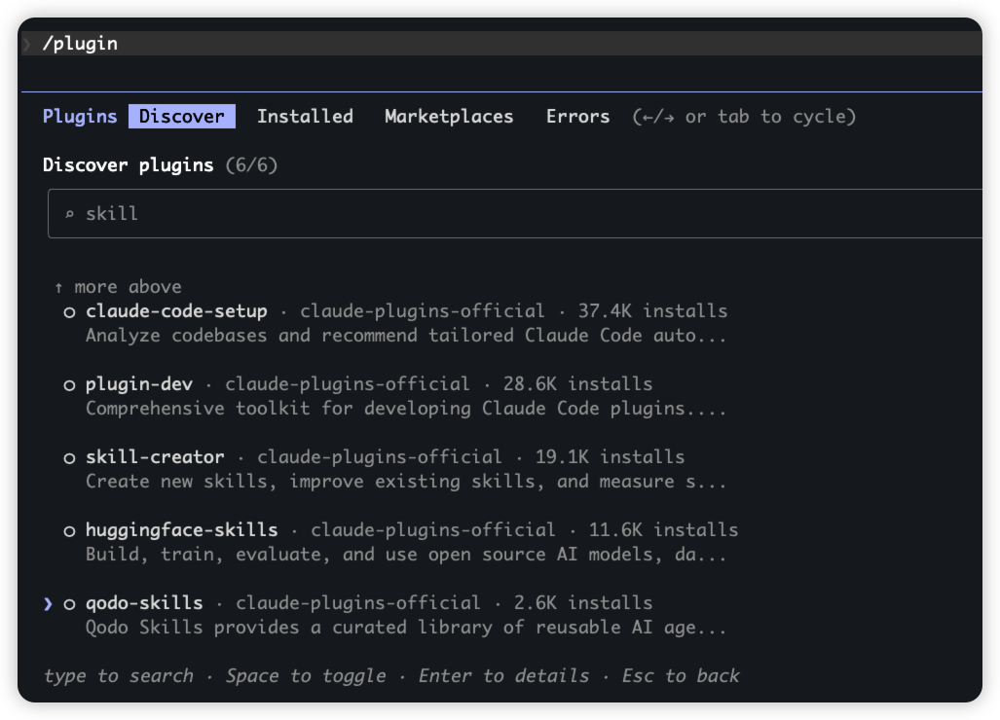

选择某个skill之后，他会让你选择是安装在什么范围，包括所有项目还是当前项目：

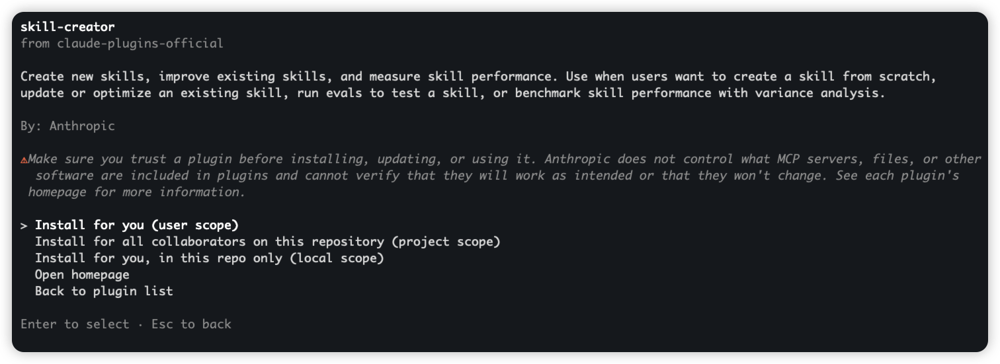

安装之后，要推出claude code，重新进入一下，在使用skills命令就能看到已安装的skill了：

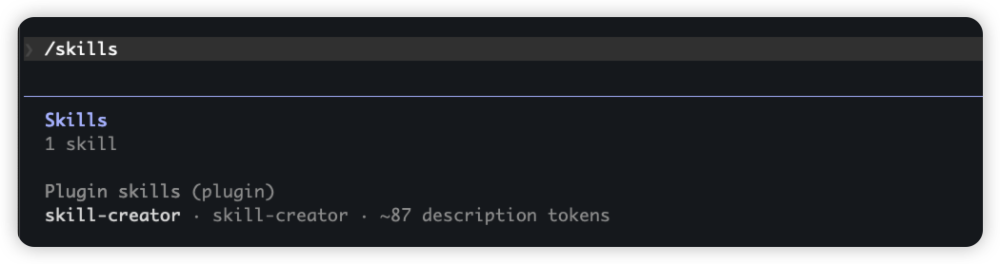

但是这种方式只能安装很少一部分skills，官方推荐的一些才有的。

方法二：手动安装

这一种方式适合安装第三方的skill，比如你在github上看到一个比较好的skill，那么就可以用这种方式安装，你只需要把那个skill下载到你的本地，然后把她放到claude code的skill目录下就行了。比如：

我想部署下面这个`域名创意生成器`：[https://github.com/ComposioHQ/awesome-claude-skills/tree/master/domain-name-brainstormer](https://github.com/ComposioHQ/awesome-claude-skills/tree/master/domain-name-brainstormer)

进入到skill的目录中，可以看到一个SKILL.md，你只需要把他搞到你的本地就行了，你是直接复制也好，git clone也好，无所谓，只要把他放置到目录下即可：`hollis_skill\.claude\skills\domain-name-brainstormer`：

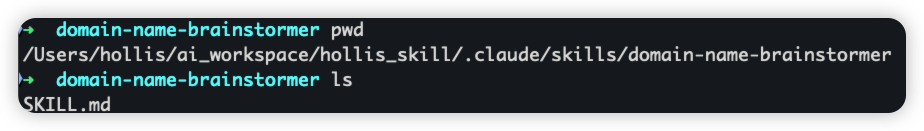

然后重新进入你的claude，就能看到新安装的这个skill了。

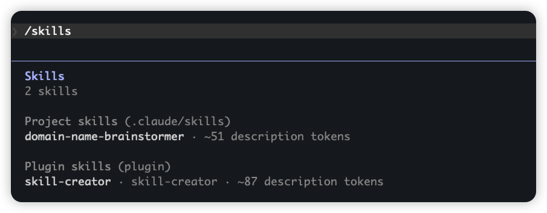

方法三：npx skills add 安装

Vercel 推出了一个[https://github.com/vercel-labs/skills](https://github.com/vercel-labs/skills) 开源项目，目标是成为 **Agent Skills 的统一包管理器**。它并不是一个 Vercel 专用工具——而是支持 Claude Code、Cursor、GitHub Copilot、Codex、Kiro、Aider、OpenCode 等 35+ 平台。

有了它， 就可以通过  `npx skills add vercel-labs/agent-skills`的方式安装skill。他有一个配套的网站，[https://skills.sh/](https://skills.sh/) 这上面能查找skill，可以直接使用命令安装。

比如我们通过命令安装 frontend-design这个skill：

```text
npx skills add https://github.com/anthropics/skills --skill frontend-design
```

第一次使用时会提示你需要安装skills这个包，选择安装即可。

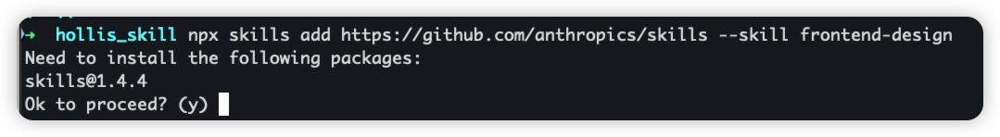

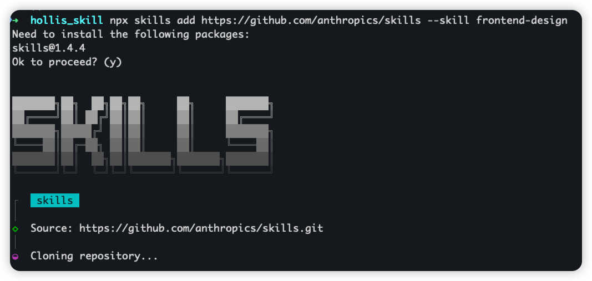

Skill的使用

在Claude Code中安装了Skill之后，就可以使用这些skill了。

我们前面不是安装了一个`域名创意生成器`的Skill么，我们就可以直接用了。

我随便提问一个问题：`帮我想个关于《火影忍者》的域名，www开头，cn结尾`

首先Claude会询问目前有一个Skill可以解决这个问题，是否确定要使用，确定后，即可使用到Skill的能力，获取结果：

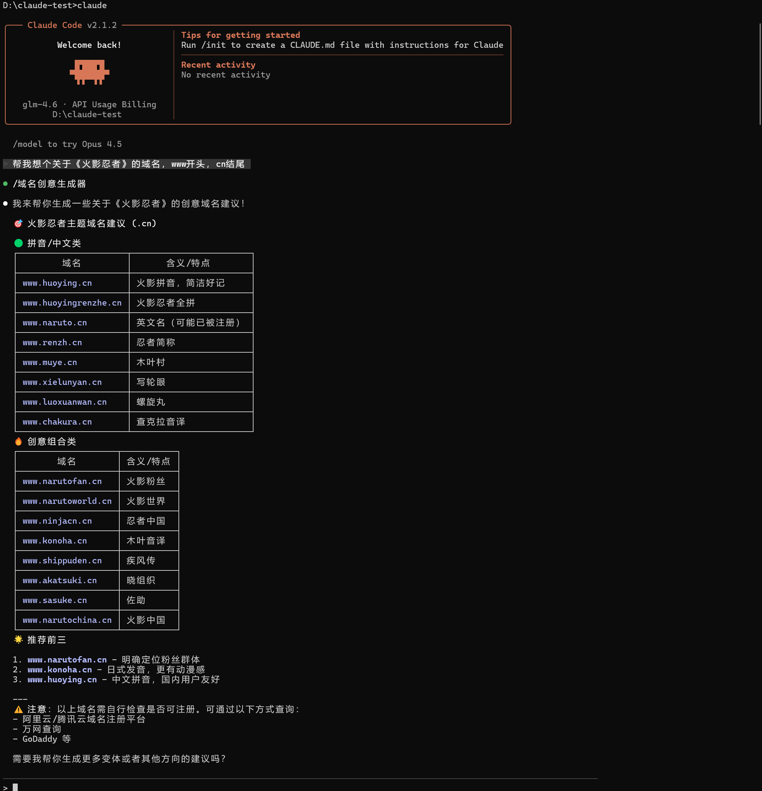

但是需要注意的是，有的时候，Claude Code并不一定会选择正确的skill，也有可能不用skill，这和你的问题有关，有可能是没有命中skill的触发词，也有可能是skill安装的不正确，可以指定skill让他解决问题，他就一定会用到正确的skill了。有两种方式：

1、告诉他具体用哪个skill

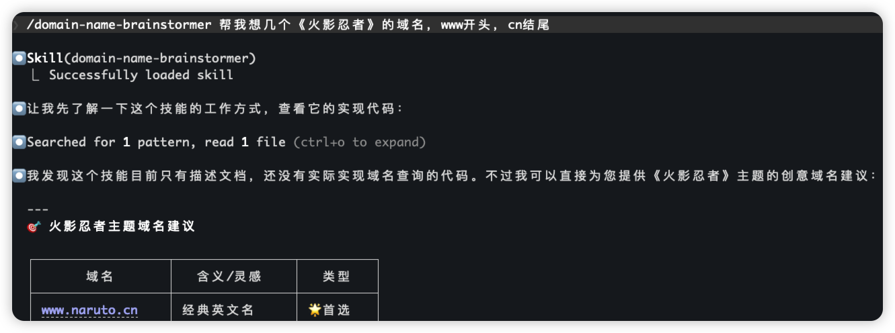

2、告诉他要用skill解决问题

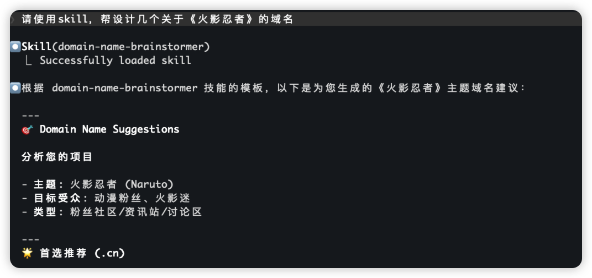

---

来源: https://thoughts.aliyun.com/workspaces/6963289eb0fc2e001bb052eb/docs/69ac075674e403000141a7ff
